<!-- page_001 -->

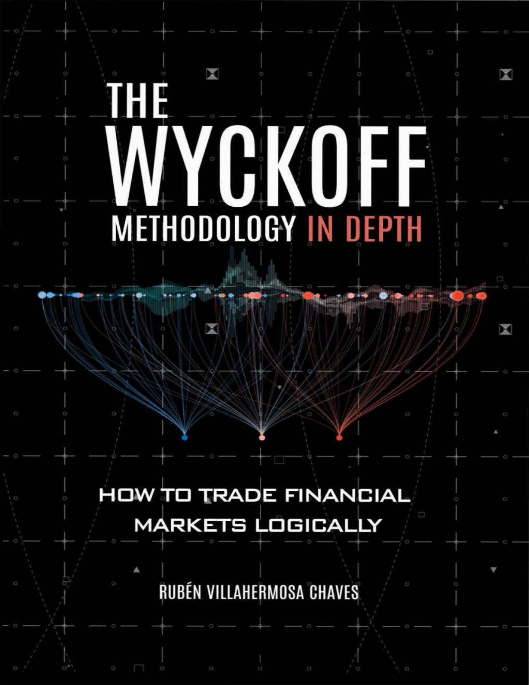

---

<!-- page_002 -->

THE WYCKOFF METHODOLOGY IN DEPTH

HOW TO TRADE FINANCIAL MARKETS
LOGICALLY

RUBÉN VILLAHERMOSA CHAVES

---

<!-- page_003 -->

All rights reserved. No part of this work may be reproduced, incorporated into a computer system or
transmitted in any form or by any means (electronic, mechanical, photocopying, recording or
otherwise) without the prior written permission of the copyright holders. Infringement of these rights
may constitute a crime against intellectual property.

© Rubén Villahermosa, 2019

Independently published

---

<!-- page_004 -->

CONTENTS

RICHARD WYCKOFF

PART 1 - HOW MARKETS MOVE

Chapter 1 - Waves

Chapter 2 - The price cycle

Chapter 3 - Trends

Types of trends

Chapter 4 - Assessing trends

Strength/weakness analysis

Lines

Chapter 5 – Trading Ranges

PART 2 - THE WYCKOFF METHOD

Chapter 6 - Wyckoff Methodology Structures

Basic accumulation Structure #1

Basic accumulation Structure #2

Basic distribution Structure #1

Basic distribution Structure #2

PART 3 - THE THREE FUNDAMENTAL LAWS

Chapter 7 - The law of supply and demand

Theory

Price shift

Chapter 8 - The Law of Cause and Effect

Elements to bear in mind

Point and Figure Graphics

---

<!-- page_005 -->

Technical analysis for projection of objectives

Chapter 9 - The Law of Effort and Result

The importance of volume

Harmony and divergence

Analysis table

Effort/Result in Trends

Lack of interest

PART 4 - THE PROCESSES OF ACCUMULATION AND DISTRIBUTION

Chapter 10 - Accumulation

Stock control

The law of cause and effect

Handling maneuvers

Counterparty, liquidity

The path of least resistance

Common characteristics of the accumulation ranges

Beginning of the bullish movement

Chapter 11 - Reaccumulation

Stock Absorption

Duration of the structure

Reaccumulation or Distribution

Chapter 12 - Distribution

The law of cause and effect

Handling maneuvers

Counterparty, liquidity

The path of least resistance

Common characteristics of the distribution ranges

Beginning of the Bearish Movement

Chapter 13 - Redistribution

---

<!-- page_006 -->

Redistribution or accumulation

Stock control

Duration of the structure

PART 5 - EVENTS

The list of events

Chapter 14 - Event #1: Preliminary Stop

Preliminary Support

Preliminary Supply

Chapter 15 - Event #2: Climax

Selling Climax

Buying Climax

Chapter 16 - Event #3: Reaction

Automatic Rally

Automatic Reaction

Chapter 17 - Event #4: Test

Secondary Test

The generic test

Where to look for tests

How the Test appears on the graph

The difference between the Secondary Test and the Generic Test

Chapter 18 - Event #5: Shaking

Spring/Shakeout

UpThrust After Distribution

Chapter 19 - Event #6: Breakout

Sign of Strength

Sign of Weakness

Chapter 20 - Event 7: Confirmation

Last Point of Support

---

<!-- page_007 -->

Last Point of Supply

PART 6 - PHASES

Chapter 21 - Phase A: Stopping the previous trend

Chapter 22 - Phase B: Building the Cause

Chapter 23 - Phase C: Test

Chapter 24 - Phase D: Trend within range

Chapter 25 - Phase E: Trend out of range

PART 7 - TRADING

1. The context

2. The structures

3. Trading areas

Chapter 26 - Primary positions

In Phase C

In Phase D

In Phase E

Summary table of trading opportunities

Chapter 27 - Decision-making

The concept of the significant bar

The concept of reversal of movement

Position Management

PART 8 - CASE STUDIES

S&P500 Index ($ES)

Pound/Dollar cross ($6B)

Euro/Dollar cross ($6E)

Bitcoin ($BTCUSDT)

Inditex ($ITX)

Google ($GOOGL)

---

<!-- page_008 -->

Australian Dollar/US Dollar cross ($6A)

BIBLIOGRAPHY

ACKNOWLEDGEMENTS

ABOUT THE AUTHOR

BOOKS OF THIS AUTOR

---

<!-- page_009 -->

RICHARD WYCKOFF

Richard Wyckoff (1873-1934) became a Wall Street celebrity.

He was a forerunner in the investment world as he started as a
stockbroker at the age of 15 and by the age of 25 already owned his own
brokerage firm.

The method he developed of technical analysis and speculation arose
from his observation and communication skills.

Working as a Broker, Wyckoff saw the game of the big traders and
began to observe through the tape and the graphics the manipulations they
carried out and which they obtained high profits with.

He stated that it was possible to judge the future course of the market
by its own actions since the price action reflects the plans and purposes of
those who dominated it.

---

<!-- page_010 -->

Wyckoff carried out its investment methods achieving a high return.
As time passed his altruism grew until he redirected his attention and passion
to education.

He wrote several books as well as the publication of a popular
magazine of the time "Magazine of Wall Street".

He felt compelled to compile the ideas he had gathered during his 40
years of Wall Street experience and bring them to the attention of the general
public. I wanted to offer a set of principles and procedures about what it takes
to win on Wall Street.

These rules were embodied in the 1931 course "The Richard D.
Wyckoff Method of Trading and Investing Stocks. A course of Instruction in
Stock Market Science and Technique" becoming the well-known Wyckoff
method.

---

<!-- page_011 -->

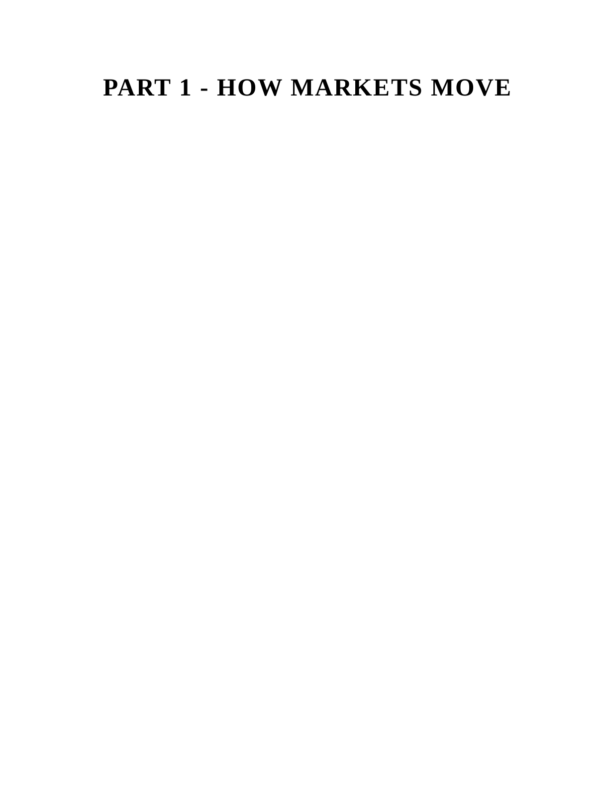

PART 1 - HOW MARKETS MOVE

---

<!-- page_012 -->

CHAPTER 1 - WAVES

Wyckoff and the first readers of the tape understood that the movements of
the price do not develop in periods of time of equal duration, but that they do
it in waves of different sizes, for this reason they studied the relation between
the upward and downward waves.

The price does not move between two points in a straight line; it does
so in a wave pattern. At first glance they seem to be random movements, but
this is not the case at all. The price is shifted up and down by fluctuations.

Waves have a fractal nature and interrelate with each other; lower
grade waves are part of intermediate grade waves, and these in turn are part
of higher grade waves.

Each uptrend and downtrend is made up of numerous minor uptrend
and downtrend waves. When one wave ends, another wave starts in the
opposite direction. By studying and comparing the relationship between
waves; their duration, speed and range, we will be able to determine the
nature of the trend.

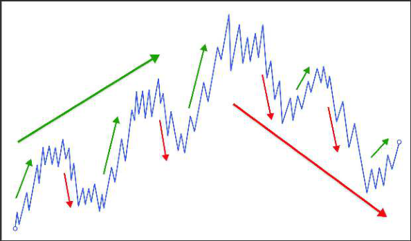

---

<!-- page_013 -->

Wave analysis provides a clear picture of the relative changes
between supply and demand and helps us judge the relative strength or
weakness of buyers and sellers as price movement progresses.

Through judicious wave analysis, the ability to determine the end of
waves in one direction and the beginning in the opposite direction will
gradually develop.

---

<!-- page_014 -->

CHAPTER 2 - THE PRICE CYCLE

In the basic structure of the market there are only two types of training:

▶ Trends. These can be bullish if they go up or bearish if they go
down.

▶ Trading ranges. They can be of accumulation if they are at the
beginning of the cycle, or of distribution if they are in the high part of the
cycle.

As we have already seen, the displacement of the price during these
Phases is done by means of waves.

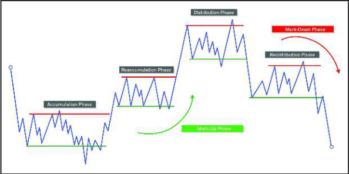

During the accumulation phase, professional traders buy all the stock
available for sale on the market. When they are assured by various
manoeuvres that there is no longer any floating bid, they begin the upward
trend phase. This trend Phase is about the path of least resistance.
Professionals have already verified that they will not encounter too much
resistance (supply) that would prevent the price from reaching higher levels.
This concept is very important because until they prove that the road is free
(absence of sellers), they will not initiate the upward movement; they will

---

<!-- page_015 -->

carry out test maneuvers again and again. In case the offer is overwhelming,
the path of least resistance will be down and the price at that point can only
fall.

During the uptrend, buyers' demand is more aggressive than sellers'
supply. At this stage there is the participation of large traders who are less
well-informed and the general public whose demand shifts the price upwards.
The movement will continue until buyers and sellers consider the price to
have reached an interesting level; buyers will see it as valuable to close their
positions; and sellers will see it as valuable to start taking short positions.

The market has entered the distribution phase. A market ceiling will
be formed and it is said that the big traders are finishing distributing (selling)
the stock they previously bought. There is the entry of the last greedy buyers
as well as the entry for sale of well-informed traders.

When they find that the path of least resistance is now down, they
begin the downtrend phase. If they see that demand is present and with no
intention of giving up, this resistance to lower prices will only leave a viable
path: upward. If you continue to climb after a pause, this structure will be
identified as a reaccumulation phase. The same is true for the bearish case: if
the price comes in a bearish trend and there is a pause before continuing the
fall, that lateral movement will be identified as a redistribution phase.

During the downtrend sellers' supply is more aggressive than buyers'
demand so only lower prices can be expected.

Being able to determine at what stage of the price cycle the market is
at is a significant advantage. Knowing the general context helps us avoid
entering the wrong side of the market. This means that if the market is in a
bullish phase after accumulation we will avoid trading short and if it is in a
bearish phase after distribution we will avoid trading long. You may not
know how to take advantage of the trend movement; but with this premise in
mind, you will surely avoid having a loss by not attempting to trade against
the trend.

---

<!-- page_016 -->

When the price is in phases of accumulation or uptrend it is said to be
in a buying position, and when it is in Phases of distribution or downtrend it
is said to be in a selling position. When there is no interest, that no campaign
has been carried out, it is said to be in neutral position.

A cycle is considered to be complete when all stages of the cycle are
observed: accumulation, uptrend, distribution, and downtrend. These
complete cycles occur in all time frames. This is why it is important to take
into account all the time frames; because each of them can be at different
stages. It is necessary to contextualize the market from this point of view in
order to carry out a correct analysis of it.

Once you learn to correctly identify the four price phases and assume
a totally impartial viewpoint, away from news, rumors, opinions and your
own prejudices, taking advantage of your operative will be relatively easier.

---

<!-- page_017 -->

CHAPTER 3 - TRENDS

Prices change and the waves resulting from those price changes generate
trends. The price is moved by a series of waves in the direction of the trend
(impulses), which are separated by a series of waves in the opposite direction
(reversals).

The trend is simply the line of least resistance as the price moves from
one point to another because it follows the path of least resistance; therefore,
the trader's job is to identify the trend and trade in harmony with it.

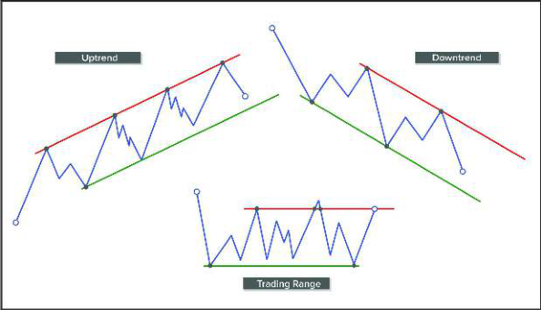

When a market is rising and encounters resistance (sales), either
exceeds that resistance or the price will turn; the same happens when the
price is falling and encounters resistance; either exceeds those purchases or
the price will turn. These pivot points are critical moments and provide
excellent locations to trade.

Depending on the direction of movement, we can differentiate three
types of trends: bullish, bearish and lateral. The most objective description of
an uptrend is when the price makes a series of rising impulses and falls,
where highs and lows are increasing all the time. Similarly, we identify a

---

<!-- page_018 -->

bearish trend when highs and lows are decreasing, leaving a series of
decreasing impulses and regressions. Finally, we determine a sideways
environment when highs and lows remain fluctuating within a price range.

Trends are divided by their duration into three different categories;
long, medium and short term. Since there are no strict rules for classifying
them according to the timeframe, they can be categorized according to how
they fit into the top. That is, the short term trend will be observed within the
medium term trend, which in turn will be within the long term trend.

TYPES OF TRENDS

Note that all three trends may not move in the same direction. This can
present potential problems for the trader. In order to be effective, doubts must
be eliminated as much as possible and the way to do this is to identify in
advance the type of trading to be carried out.

A very important condition to take into account when selecting the
type of trading is the Timing (entry calibration). Success in any kind of
operative mainly requires a good Timing; but success in short term trading
requires a perfect Timing. Because of this, a beginner should start with long-
term trading until he achieves consistent success.

Because trends may be different depending on the time frame, it is
possible but difficult to have buy and sell positions at the same time. If the
medium-term trend is bullish, you can take a buy position with the
expectation of holding it for a few weeks or months; and if in the meantime a
short term bearish trend appears, you can take a short sell position and hold
the buy trade at the same time.

---

<!-- page_019 -->

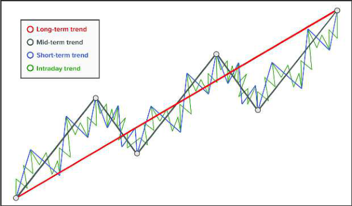

Although theoretically possible, it is extremely difficult to maintain
the discipline necessary to maintain both positions at the same time. Only
experienced traders should do this. For the initiate it is best to trade in
harmony with the trend and not to trade on both sides simultaneously until
consistently profitable.

You must learn and understand the reasons, behavior patterns, and
emotions that control the market. A bull market is driven by greed, while a
bear market is driven by fear. These are the main emotions that drive the
markets. Greed leads to paying higher prices until it leads to what is known
as an overbought condition. On the other hand, the panic caused by falls leads
to wanting to get rid of positions and sell, adding more momentum to the
collapse until over-selling conditions are reached.

Having these emotions is not a negative thing, as long as they know
how to move towards a positive aspect and it is very clear that what is really
important is the protection of capital.

---

<!-- page_020 -->

CHAPTER 4 - ASSESSING TRENDS

This interaction between supply and demand as a trend develops will leave
clues in the conformation of the price action. We have different tools to help
us assess trends.

Judiciously assessing the trend is key to determining your health. It
allows us to detect if any force gives signs of weakness or if the opposing
force is gaining strength. Our job is to go for strength and against weakness.

STRENGTH/WEAKNESS ANALYSIS

When the price is in trend, we expect greater strength from the pushing side.
We have to see it as a battle between buyers and sellers where we will try to
analyze the strength or weakness of both. The best way to assess current
strength/weakness is to compare it with previously developed movements.

A weakness in the price does not imply a change of trend, it is simply
a sign of loss of strength and tells us that we must be prepared for future
movements.

There are several ways to analyze market strength/weakness. The key
is comparison. Absolute values are not sought. It is a question of comparing
the current movements with the previous ones.

---

<!-- page_021 -->

SPEED

Speed refers to the angle at which the price moves; so if the price is moving
faster than in the past, there is strength. If on the other hand it is moving
slower than in the past, it suggests weakness.

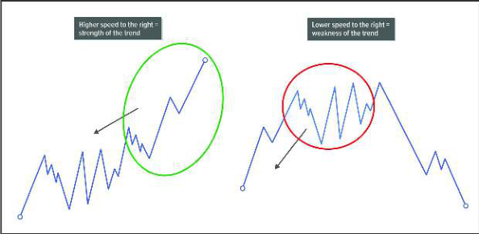

---

<!-- page_022 -->

PROJECTION

With this tool we evaluate the distance that the impulses travel and compare
them with the previous ones to determine whether the strength has increased
or decreased.

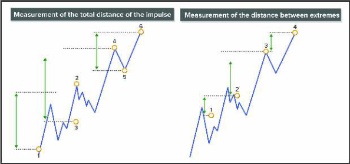

For a trend to remain alive, each impulse must surpass the previous
impulse. If an impulse is not able to make new progress in the direction of the
trend, it is an alert that the movement may be reaching its end.

Distance of the impulse:

The distance between 3 and 4 is greater than the distance
between 1 and 2 = trend strength.

The distance between 5 and 6 is less than the distance
between 3 and 4 = trend weakness.

Distance between ends:

The distance between 2 and 3 is greater than the distance

---

<!-- page_023 -->

between 1 and 2 = trend strength.

The distance between 3 and 4 is less than the distance
between 2 and 3 = trend weakness.

DEPTH

With depth analysis we evaluate the distance travelled by trend reversals to
determine whether weakness has increased or decreased.

As with projection analysis, we can evaluate depth using two
measurements: the total distance of the recoil from its origin to its end; and
the distance the price travels from the previous end to the new end.

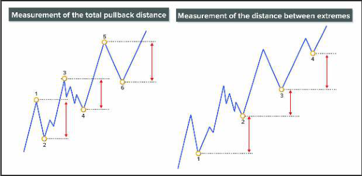

Pullback distance:

The distance between 3 and 4 is less than the distance
between 1 and 2 = trend strength.

The distance between 5 and 6 is greater than the distance
between 3 and 4 = trend weakness.

Distance between extremes:

---

<!-- page_024 -->

The distance between 2 and 3 is less than the distance
between 1 and 2 = trend weakness.

The distance between 3 and 4 is greater than the distance
between 2 and 3 = trend strength.

LINES

Lines defines the ranges and define the angle of advance of a trend. They are
of great visual aid for the analyses, being very useful to evaluate the health of
the movement; so much to identify when the price reaches a condition of
exhaustion, as to value a possible turn in the market.

In general they help us to foresee levels of support and resistance at
which to wait for the price. At the same time, an approach or touch of those
lines suggests the search for additional signs to look for a turn, offering
diverse operative opportunities.

The more touches a line has, the more validity the level for the
analysis will have. You must be careful not to draw lines indiscriminately,
especially on every minor movement. The correct handling of lines requires
good judgment; otherwise it will cause confusion in your reasoning.

When the price penetrates a line we must remain more alert and be
prepared to act. Depending on the position where the break occurs, as well as
the action itself, we can suggest different scenarios. A thorough
understanding of price and volume action is needed to determine the most
likely scenarios.

---

<!-- page_025 -->

HORIZONTAL LINES

A horizontal line identifies an old zone of imbalance between supply and
demand. When it connects at least two price lows it identifies a support. This
is an area where buyers appeared in the past to outdo sellers and stop the
price drop. On that area it is expected that buyers will appear again when it is
visited again.

A horizontal line connecting at least two highs identifies a resistance
and is an area where supply outpaced demand by stopping a price hike; that is
why sellers are expected to reappear on a new visit in the future.

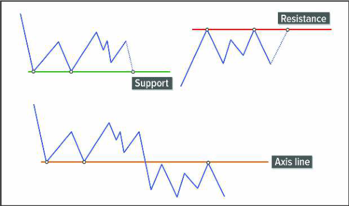

When a line serves both as support and resistance, it is known as a
shaft line. Prices tend to revolve around those axis lines. Those price levels
are constantly changing roles; a broken resistor becomes a support, and a
broken support becomes a resistor.

---

<!-- page_026 -->

TREND LINES

After identifying the nature of the trend, the next step is to build a guideline
in order to take advantage of the movement. It is the simple connection
between two or more price points.

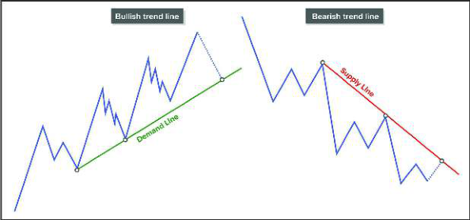

In a bearish trend, the trend line is drawn by connecting two
decreasing highs. This line is called the bid line because it is assumed that the
sellers will appear on it.

In an uptrend, the trendline is drawn by connecting two rising lows.
This line is called a demand line because it marks the point where buyers are
supposed to appear.

We can continuously readjust the trend lines in order to adjust the one
that best suits the price action and therefore generated the most touches. The
more times the line has been respected, the stronger we will be able to
interpret it when it is played again in the future.

Note that a line with too much slope will be broken too soon, so it will
not be drawn correctly.

As long as the price remains within the established levels, it is said
that the movement is healthy and it is appropriate to consider maintaining or
adding positions.

---

<!-- page_027 -->

When the price approaches a trend line there is a threat of breakout
and this may mean that the strength of the trend is being exhausted,
suggesting a change in the speed of the trend or a definite danger of reversal
of the trend.

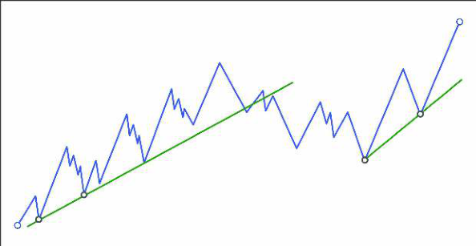

Breakout a trend line by itself is not a conclusive sign of anything, as
it may be a true or false break. What is significant is how the line is broken,
the conditions under which it happens, and the behavior that precedes it.

After a movement of a certain distance, the price may find resistance
to continue and this will cause the trend to change its speed and rest. During
the break (lateral movement or range) the force that originally drove the trend
may be renewed or even strengthened, resulting in a continuation of the trend
with greater momentum than before.

Under these conditions, it is necessary to reposition the trend lines to
conform to the new set angle. For this reason it should not be accepted that
the mere fact of breakout the trend line is a reversal of the same.

CHANNELS

The ideal channel will have several touch points and should capture most of

---

<!-- page_028 -->

the price within its limits.

When the bullish trend line or demand line is dragged towards the
opposite end and anchored parallel to the high that lies between the two lows
used to create it, the overbought line is created; and together they define an
upward trend channel. This channel identifies a rising price.

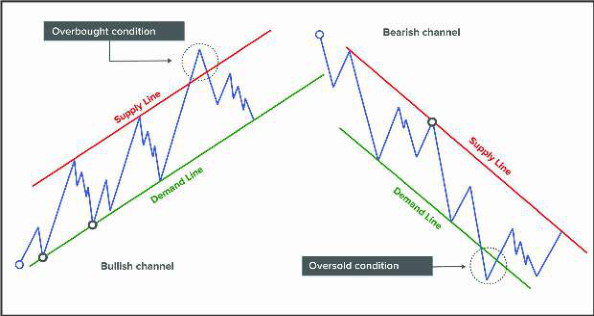

The trader should be aware of overbought conditions. These
conditions are created when the price exceeds the high end of the bullish
channel. Due to a too fast acceleration, the price reaches a point at which it is
highly sensitive to long coverage and generally to the withdrawal of more
experienced buyers, suggesting a weakening of the uptrend. They usually
guide the price to a downward corrective action.

Human beings seem to be sloped towards ends. In the financial
markets this trend is revealed in the form of greed. Prices are pushed higher
and higher until the public swells with stocks that are generally overvalued.
When this happens, an overbought condition is said to exist.

When the bearish trend line or supply line is dragged towards the
opposite end and anchored parallel to the low that is located between the two
highs used for its creation, the oversold line is created; and together they
define a bearish trend channel. This channel identifies a falling price.

The trader should be aware of overbooking conditions. These
conditions are created when the price exceeds the low end of the downstream

---

<!-- page_029 -->

channel. Due to too fast a bearish movement, the price reaches a point at
which it is highly sensitive to short coverage (profit taking) and a general
withdrawal of experienced traders who were sold; suggesting a weakening of
the bearish trend. They usually guide the price to an upward corrective action.

In a bear market there is another extreme that takes control; fear. As
the price falls, traders become alarmed. The lower they go, the more
frightened they get. Fear reaches a level that weak hands can't stand and sell
their shares. This selling panic generates an overselling condition.

Those periods of overbought or overbought that lead to the stop of the
movements can be seen in any temporality.

INVERTED LINES

In high-speed conditions where a clear trend has not yet been established,
inverted lines are a good way to try to set up at least initially the price
movement.

It is a question of first creating the line of supply in an upward trend
to generate from it the line of demand; and of first creating the line of
demand in a downward trend to generate from it the line of supply.

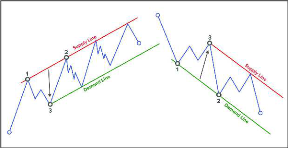

---

<!-- page_030 -->

At the beginning of a bullish advance, in case the price has made two
important upward thrusts without leaving any significant bearish retreat, one
can estimate at what point to expect the price to retreat by first creating the
supply line in order to drag it and create the bullish trend line; and in the
same way, first draw the demand line in order to create from it the bearish
trend line.

---

<!-- page_031 -->

CONVERGING LINES

There will be times when you will notice that overbought and oversold lines
created from their trendlines do not work effectively. The price may never
reach these lines as you will probably be following a different movement
dynamic.

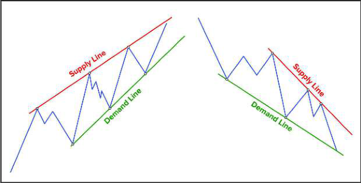

The way to solve this deficiency is to create these lines independently,
without taking into account the trend line.

In this way, an overbought line would be created by connecting two
highs and the overbought line by connecting two lows. The aim is to try to
find the structural logic to the movements in order to take advantage of them.

Note that in the case of an upward movement, not being able to even
reach the original overbought line denotes a sign of weakness and alerts us to
a possible downward turn. Similarly, the fact that the original overbooking
line cannot be reached in the case of the bear movement denotes a sign of
background strength and alerts us to a possible upward turn.

---

<!-- page_032 -->

Visually they are observed as exhaustion patterns.

---

<!-- page_033 -->

CHAPTER 5 – TRADING RANGES

The market spends most of its time in this type of condition, so they are
extremely important.

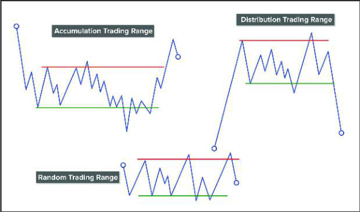

Trading ranges are places where previous movement has been stopped
and there is a relative balance between supply and demand. It is within the
range where accumulation or distribution campaigns are developed in
preparation for an upward or downward trend. It is this force of accumulation
or distribution that builds the cause that develops the subsequent movement.

The ranges within it present optimum trading opportunities with a
very favourable risk/reward potential; however, large operations are those in
which you correctly manage to position yourself within the range to take
advantage of the trend movement.

In the operative in trend, as the price is already in movement, part of
its path will have been lost. By taking advantage of opportunities within the
range, there is a chance to catch a bigger move.

To be correctly positioned at the beginning of the trend, you must be

---

<!-- page_034 -->

able to analyze price action and volume during range development.
Fortunately, the Wyckoff methodology offers unique guidelines with which
the trader can successfully perform this task. The identification of events and
the analysis of Phases become indispensable tools for the correct reading of
the range.

If you don't see a clearly defined trend, the price is most likely in a
range context. This neutral or lateral trend may have three main interests
behind it: it is accumulating, in preparation for an upward movement; it is
distributing, in preparation for a downward movement; or it is fluctuating up
and down without any defined interest.

Random fluctuations should be ignored as there is probably no
professional interest behind that market. It is important to understand that in
not all trading ranges there is professional interest; and that therefore, if these
interests are not involved in a security, the price simply fluctuates because it
is in balance and movements in one direction are neutralized with movements
in the opposite direction.

On the basis of the law of cause and effect, it is necessary for the price
to consume time within the range in preparation for the subsequent
movement. And that movement will be directly proportional to the time spent
in the range. This means that shorter ranges will generate shorter movements
and that longer ranges will generate movements that will travel longer
distances.

To define a range two points are required to build the channel. As
long as the price remains within the range, no major movement will occur.
The key is in the ends. When these are broken, they can offer excellent
trading opportunities.

Be clear that the decisive move to break the range and start the trend
Phase cannot occur until a clear imbalance between supply and demand has
been generated. At that point, the market must be in the control of the
professionals and they must have confirmed that the direction in which they
will direct the price movement is the path of least resistance.

---

<!-- page_035 -->

This means that if they have accumulated with the intention of
launching prices upwards, they will first verify that they will not find
resistance (sales) to stop that rise. When they see that the road is clear, they
will initiate movement. Similarly, if they have been distributing (selling) with
the intention of lowering prices, they need to make sure that the floating
demand (buyer interest) is relatively low.

---

<!-- page_036 -->

PART 2 - THE WYCKOFF METHOD

Many of Wyckoff's basic principles have become basic foundations of
technical analysis. The three fundamental laws: Supply and Demand, Cause
and Effect and Effort and Result; the concepts of Accumulation/Distribution
and the supremacy of Price and Volume when determining price movements
are some examples.

The Wyckoff method has passed the test of time. More than 100 years
of continuous development and use have proven the value of the method to
trade all kinds of financial instruments.

This achievement should not come as a surprise as it relies on the
analysis of price and volume action to judge how it reacts to the battle
between the real forces that govern all price changes: supply and demand.

---

<!-- page_037 -->

CHAPTER 6 - WYCKOFF METHODOLOGY
STRUCTURES

Financial markets are a living thing, they are constantly changing due to their
continuous interaction between buyers and sellers. This is why it would be a
mistake to use fixed patterns or schemes to try to read the context of the
market.

Aware that it is practically impossible for price to develop two
identical structures, the trading approach proposed by the Wyckoff
methodology is flexible when analyzing the market.

The price can develop different types of structures depending on the
conditions in which it is found. This is why we need an approach that gives
some flexibility to price movements but at the same time is governed by
certain fixed elements that provide as much objectivity as possible to the
reading.

These fixed aspects of the methodology are the events and Phases that
make up the development of the structures. Below we present two basic
schemes of accumulation and distribution to provide a very general idea of
the dynamics in which price moves under the premises of the Wyckoff
methodology.

As we have just said, these schemes can be considered as ideals. The
important thing to keep in mind is that the market will not always present
them this way.

---

<!-- page_038 -->

BASIC ACCUMULATION STRUCTURE #1

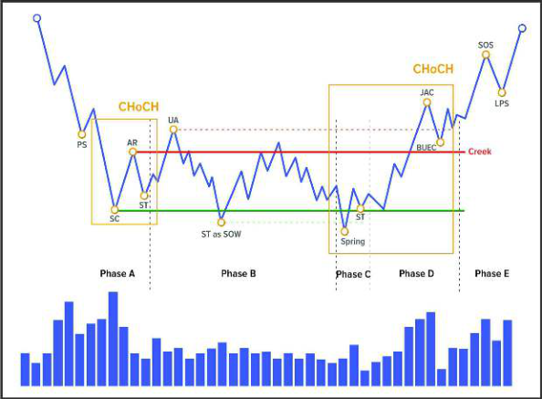

Accumulation. The process by which large traders absorb available stock
from the market. This is a transfer from retail traders or "weak hands" to
strong traders or "strong hands".

Creek. Resistance level for accumulation or reaccumulation
structures. It is established by the high generated by the Automatic Rally and
by the highs that can be developed during Phase B.

CHoCH. Change of Character. Change of character. It indicates the
environment in which the price will move soon. The first CHoCH is
established in Phase A where the price moves from a downward trend to a
consolidation environment. The second CHoCH is set from the low of Phase
C to the high of SOS in which the price moves from a consolidation
environment to an upward trend environment.

Phase A. Stopping the previous bearish trend.

PS. Preliminary Support. It's the first attempt to stop the
downward movement that will always fail.

---

<!-- page_039 -->

SC. Selling Climax. Climax action that stops the downward
movement.

AR. Automatic Rally. Bullish reaction. An upward
movement that sets the trading range high.

ST. Secondary Test. Test of the level of supply in relation
to climax action. Establishes the end of Phase A and the beginning
of Phase B.

Phase B. Construction of the cause.

UA. Upthrust Action. Temporary breakout of the resistance
and re-entry into the range. This is a test at the high generated by
the AR.

ST as SOW. Secondary Test as Sign Of Weakness. Sample
of weakness in test function. Temporary break of the support and
re-entry to the range. This is a test at the low generated by the SC.

Phase C. Test

Spring. It is a test in the form of breakout of the lows of
Phases A and B. There are three different types of Springs.

Test Spring. Downward movement towards lows of the
range in order to check the commitment of the sellers.

LPS. Last Point of Support. Test in the form of a bearish
movement that fails to reach the low range.

TSO. Terminal Shakeout or Shakeout. Abrupt movement
of low breakout that produce a deep penetration of the level of
support and a fast recovery.

Phase D. Bullish trend within the range.

SOS. Sign of Strength. Bullish movement generated after

---

<!-- page_040 -->

the Phase C Test event that manages to reach the top of the range.
Also called JAC. Jump Across the Creek. Creek jump.

LPS. Last Point of Support. These are the rising troughs we
find in the upward movement towards resistance.

BU. Back Up. This is the last big reaction before the bull
market starts. Also called BUEC. Back Up to the Edge of the
Creek. Back to the creek.

Phase E. Bullish trend out of range. Succession of SOS and LPS
generating a dynamic of rising highs and lows.

BASIC ACCUMULATION STRUCTURE #2

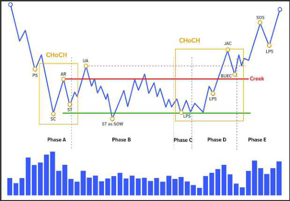

Second variant of the methodology in which the test event in Phase C fails to
reach the lows of the structure.

It usually occurs because current market conditions denote

---

<!-- page_041 -->

background strength.

The objective of the price is to visit this liquidity zone but the big
traders support the market entering aggressively in purchase. They don't let
the price go any lower so no one else can buy any lower.

This type of trading ranges are more complicated to identify because
by not being able to assess that Shake action, the bullish approach loses a
point of confidence.

The primary trading zone is in the Spring potential; then, when buying
in a possible LPS we will always be in doubt if, as is most likely, the price
will visit that low zone first to develop the Spring.

In addition to this, that first sign of bullish strength that produces
range breakout is usually lost.

Therefore, the only viable purchase opportunity in this type of
structure can be found in the BUEC. This is where we must pay more
attention to look for entry in lengths.

---

<!-- page_042 -->

BASIC DISTRIBUTION STRUCTURE #1

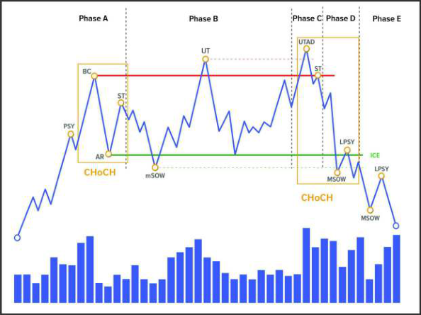

Distribution. The process by which large traders distribute (sell) stock. This
is a transfer from the strong traders or "strong hands" to the retail traders or
"weak hands".

ICE. Level of support for distribution or redistribution structures. It is
established by the low generated by the Automatic Reaction and by the lows
that can be developed during Phase B.

CHoCH. Change of Character. It indicates the environment in which
the price will move soon. The first CHoCH is established in Phase A where
the price moves from an upward trend environment to a consolidation
environment. The second CHoCH is set from the high of Phase C to the low
of the SOW in which the price moves from a consolidating environment to a
downward trend environment.

---

<!-- page_043 -->

Phase A. Stop the previous trend.

PSY. Preliminary Supply. It's the first attempt to stop the
climb that will always fail.

BC. Buying Climax. Climax action that stops the upward
movement.

AR. Automatic Reaction. Bearish reaction. Bearish
movement that sets the low range.

ST. Secondary Test. Test of the level of demand in relation
to climax action. Establishes the end of Phase A and the beginning
of Phase B.

Phase B. Construction of the cause.

UT. Upthrust. Same event as accumulation UA. Temporary
breakout of the resistance and re-entry into the range. This is a test
at the high generated by the BC.

mSOW. Minor Sign of Weakness. Same event as ST as
SOW of accumulation. Temporary break of the support and re-
entry to the range. This is a test at the low generated by the AR.

Phase C. Test

UTAD. Upthrust After Distribution. It is a test in the form
of breakout of the highs of Phases A and B.

UTAD test. An upward movement that goes up to check
the level of commitment of the buyers.

Phase D. Bearish Trend Within Range.

MSOW. Major Sign of Weakness. Bearish movement
originated after the Phase C Test event that manages to reach the
bottom of the range generating a character change.

---

<!-- page_044 -->

LPSY. Last Point of Supply. These are the decreasing
highs we find in the bearish movement towards support.

Phase E. Bearish trend out of range. Succession of SOW and LPSY
generating a dynamic of lower highs and lows.

BASIC DISTRIBUTION STRUCTURE #2

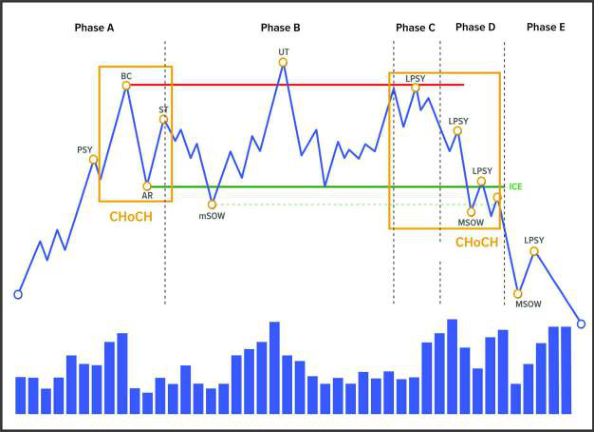

Second variant of the methodology in which the test event in Phase C fails to
reach the highs of the structure.

Inverse reasoning than for the example of accumulation structure #2.

Denotes a greater weakness in the background.

The price tries to reach the liquidity that there are in highs but the big
traders that are already short positioned prevent it,

Structures with a loss of confidence due to the absence of shaking.

---

<!-- page_045 -->

When going short on the possible LPSY we will always be in doubt as to
whether the price will shake to highs before falling.

The sign of weakness (SOW) that breaks the structure is lost. Unique
opportunity to the breakout test (LPSY).

---

<!-- page_046 -->

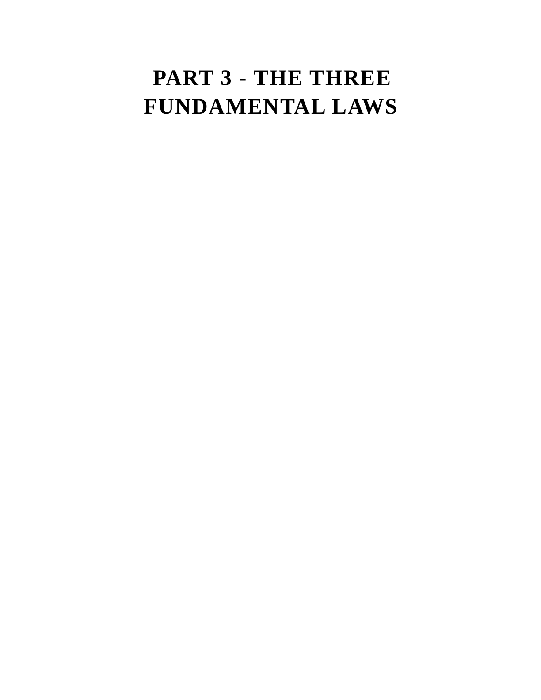

PART 3 - THE THREE
FUNDAMENTAL LAWS

---

<!-- page_047 -->

CHAPTER 7 - THE LAW OF SUPPLY AND
DEMAND

Richard Wyckoff applied this fundamental law of economics to financial
markets and presented a series of statements: if demand was greater than
supply, the price of the product would rise; that if supply was greater than
demand, the price of the product would fall; and that if supply and demand
were in balance, the price of the product would be maintained.

This idea is very general and should be nuanced because there is a
very common error in thinking that prices go up because there are more
buyers than sellers or that they go down because there are more sellers than
buyers.

In the market there is always the same number of buyers and sellers;
for someone to buy, there must be someone to sell to.

THEORY

In the market there are buyers and sellers who interrelate to match their
orders. According to auction theory, the market seeks to facilitate this
exchange between buyers and sellers; and this is why volume (liquidity)
attracts price.

The general accepted theory in economics tells us that supply is
created by sellers by placing sales (pending) limit orders in the ASK column

---

<!-- page_048 -->

and demand is created by buyers by placing purchase limit orders in the BID
column.

There is a very common error in calling everything to do with the
purchase demand and everything to do with the sale offer. Ideally, different
terms should be used to distinguish between aggressive traders and passive
traders.

The terms supply and demand correspond to taking a passive attitude
by placing limit orders in the BID and ASK columns.

While when a trader takes the initiative and goes to the BID column
to execute an aggressive (to market) order, he is known as a seller; and when
he goes to the ASK column, he is known as a buyer.

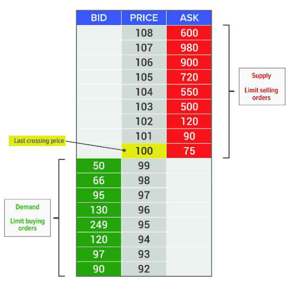

All this is a mere formality and has more to do with theory in
economics than with practice. The key to everything is in the types of orders
that are executed. We must differentiate between market orders (aggressive)
and limit orders (passive).

---

<!-- page_049 -->

Passive orders represent only intention, they have the capacity to stop
a movement; but not the capacity to make the price move. This requires
initiative.

---

<!-- page_050 -->

PRICE SHIFT

INITIATIVE

In order for the price to move upwards, buyers have to buy all available sell
orders at that price level and also continue to buy aggressively to force the
price up one level and find new sellers there to trade with.

Passive buy orders cause the bearish movement to slow down, but on
their own they cannot raise the price. The only orders that have the ability to
move the price up are those purchases to market or those by whose crossing
of orders becomes purchases to market.

Therefore, an upward movement of the price can be given by active
entry of buyers or by executing Stop Loss of short positions.

For the price to move downwards, sellers have to purchase all
available purchase orders (demand) at that price level and continue to push
downward by forcing the price to search for buyers at lower levels.

Passive sell orders cause the bullish movement to slow down, but it
does not have the ability to bring the price down on its own. The only orders
that have the ability to move the price down are sales to market or those by
whose crossing of orders becomes sales to market.

---

<!-- page_051 -->

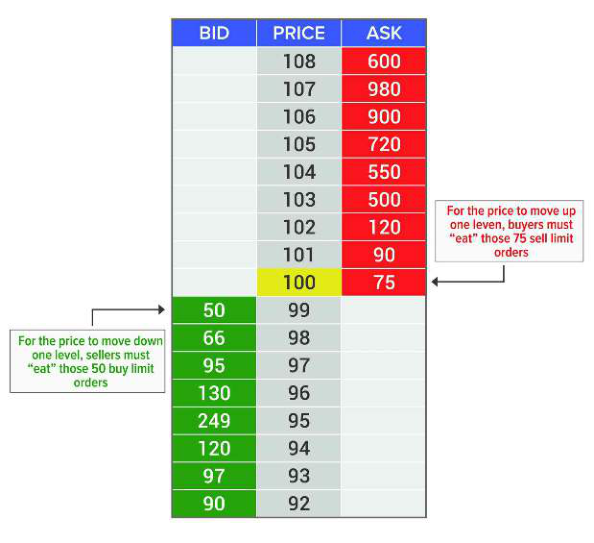

Therefore, a downward movement of the price can be given by active
entry of sellers or by executing Stop Loss of long positions.

LACK OF INTEREST

It is also necessary to understand that the absence of one of the two forces
can facilitate price displacement. An absence of supply can facilitate the rise
in price just as an absence of demand can facilitate its fall.

When the bid is withdrawn, this lack of interest will be represented as
a smaller number of contracts placed in the ASK column and therefore the
price will be able to move more easily upwards with very little buying power.

Conversely, if demand is withdrawn, it will turn out in a reduction in
the contracts that buyers are willing to place with the BID and this will cause

---

<!-- page_052 -->

the price to go down with very little selling initiative.

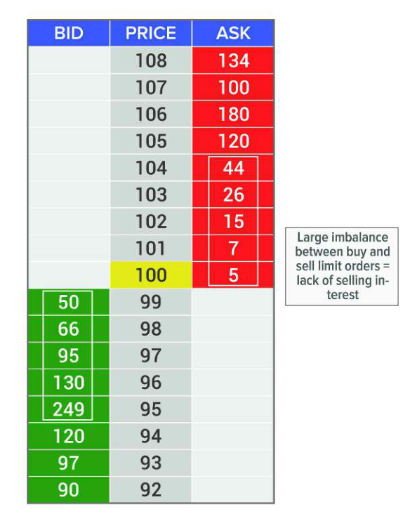

---

<!-- page_053 -->

CONCLUSION

Regardless of the origin of the purchase or sale order (trader retail,
institutional, algorithm and so on.) the result is that liquidity is added to the
market; and this is what is really important when trading.

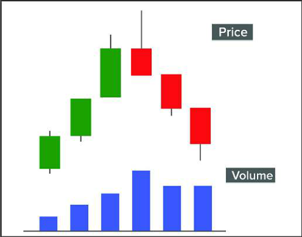

Two of the tools we can use to understand the result of this interaction
between supply and demand are price and volume.

It is necessary to develop the ability to correctly interpret the price
action with respect to its volume if we want to know at all times what is
happening in the market.

This is why I consider the Wyckoff methodology to be a really solid
approach when analyzing what is happening in the graph (accumulation and
distribution processes) and making judicious scenarios.

---

<!-- page_054 -->

CHAPTER 8 - THE LAW OF CAUSE AND
EFFECT

The idea is that something cannot happen out of nowhere; that to see a
change in price, a root cause must first have been built.

Generally, causes are constructed through a major change of hands
between well-informed and uninformed traders.

In the case of individual transactions, the cause for the price to rise is
the buyer's desire to want those shares or the seller's desire to want that
money.

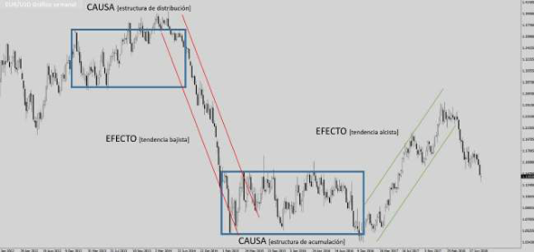

In addition to seeing the cause in terms of an individual trading, the
objective is to see the cause from a broader perspective, in terms of
movements. For this, it is said that the market is constructing a cause during
periods of price lateralization; and that these generate later as an effect a
trend movement to the rise or to the fall.

In these lateralization periods, stock absorption campaigns are carried
out in which the big traders begin to position themselves on the right side of
the market, gradually expelling the rest of the participants until they find the

---

<!-- page_055 -->

path on which the price will be directed free of resistance.

An important aspect of this law is that the effect realized by the cause
will always be in direct proportion to that cause. Consequently, a great cause
will produce a greater effect, and a small cause will result in a lesser effect.

It is logical to think that the longer the period of time the market
spends in a rank condition developing a campaign, the greater the distance
the subsequent trend movement will travel.

The key is to understand that it is during the lateral price Phases that
the accumulation/distribution processes take place.

Depending on its duration and the efforts we see during its formation
(manipulation manoeuvres such as shaking), this cause will provoke a
response movement upwards or downwards (effect).

---

<!-- page_056 -->

ELEMENTS TO BEAR IN MIND

There are certain market conditions, such as climatic events, which can cause
a sharp turn in the price without a great deal of preparation.

The big traders use these climax candles to accumulate/distribute all
the stock they need without developing a more extensive campaign and
starting from there the expected movement.

Another aspect to keep in mind is that not all ranges are accumulation
or distribution processes. This point is very important.

Remember that the methodology tells us that there will be structures
that are simply price fluctuations and do not have a motivating cause.

POINT AND FIGURE GRAPHICS

In principle the projection of the effect will be unknown, but we can propose
it as proportional to the effort that provoked it.

Wyckoff used the point and figure graph to quantify cause and
estimate effect.

By means of the horizontal counting of columns the possible
objectives are estimated. It is about providing a good indication of how far a

---

<!-- page_057 -->

movement can go. Accumulation would produce an upward count while
distribution would project it downward.

Unlike bar charts, which are time-based; point and figure charts are
based on volatility.

In order for the dot and figure chart to advance to the right and
generate a new column, it first requires a price movement in the opposite
direction.

The count on this type of graph is made from right to left and is
delimited between the two levels on which appeared first and lastly the force
that controls the market at that time:

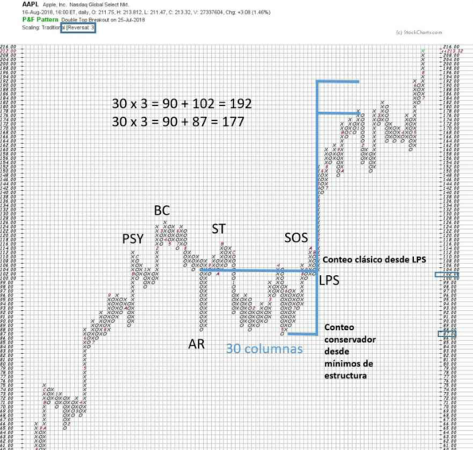

For the projection of a count in an accumulation structure
we measure the number of columns between the Last Point of
Support (last event on which the demand appears) and the
Preliminary Support or Selling Clímax (first events of appearance
of the demand).

---

<!-- page_058 -->

For the projection of a distribution count we measure the
number of columns between the Last Point of Supply and the
Preliminary Supply or Buying Clímax.

For the reaccumulation ranges the count is made from the
Last Point of Support to the Automatic Reaction (as this is the first
event on which the demand appeared).

For the redistribution ranges the count is made from the
Last Point of Support to the Automatic Rally (the first event on
which the offer appeared).

After counting the number of boxes that make up the range, the result
is multiplied by the value of the box.

The classic projection is obtained by adding the resulting figure to the
price on which the LPS/LPSY is produced.

To obtain a moderate projection, the resulting figure is added to the
price of the highest end reached.

In the distribution ranges, the highest high will generally be
that set by the Upthrust (UT) or Buying Climax (BC).

For the accumulation ranges, the lowest low will generally
be the Spring (SP) or Selling Clímax (SC).

Get a more conservative projection by dividing the area into Phases.
Counts from and to where price turns occur. Count the number of boxes that
make up each Phase and multiply it by the value of the box. The resulting
figure is added to the price of the LPS/LPSY or to the price of the highest
extreme reached.

Just because the value has ample preparation does not mean that the
whole area is accumulation or distribution. This is why point and figure
counts do not always reach the objective of greatest scope and therefore it is
suggested to divide the range in order to generate several counts and thus

---

<!-- page_059 -->

establish different objectives.

TECHNICAL ANALYSIS FOR PROJECTION OF
OBJECTIVES

There are traders who consider that the projection of targets by counting the
point and figure graph is not very operative in today's markets.

There is also a problem with the point and figure at the time of its
preparation because there are several ways to do it. This makes it useless
from my point of view since this subjectivity makes me lose confidence in
this tool.

Some of us prefer to simplify it and use tools such as Fibonacci, Elliot
or harmonic patterns (vertical projection of the range) for the projection of
targets.

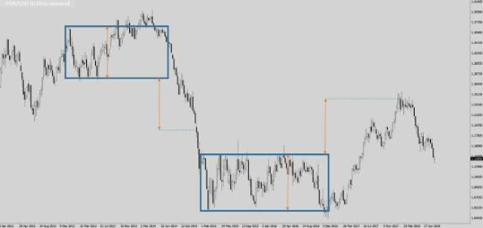

This type of tools are becoming more and more powerful since the
inclusion of software in financial markets, many of the algorithms are
programmed under these simple premises and therefore are aims that are met
with a high probability.

---

<!-- page_060 -->

CONCLUSION

Since the market moves under this law of cause and effect by using the lateral
Phases to generate the subsequent movements, I believe that it can give us an
advantage to try to decipher what is "baking" during the development of these
structures.

And to try to figure out what's going on there, the Wyckoff
methodology gives us excellent tools.

Wyckoff traders know that it is in these lateral conditions from where
the movements are born and that is why we are continuously looking for the
beginning of new structures to begin to analyze the action of price and
volume with the objective of positioning ourselves before the development of
the trend movement.

A trend will end and a cause will begin. A cause will end and a trend
will begin. The Wyckoff method is centered around the interpretation of these
conditions.

---

<!-- page_061 -->

CHAPTER 9 - THE LAW OF EFFORT AND
RESULT

In financial markets, effort is represented by volume while the result is
represented by price.

This means that the price action must reflect the volume action.
Without effort it can't have worked.

The aim is to assess the dominance of buyers or sellers through
convergence and divergence between price and volume.

THE IMPORTANCE OF VOLUME

Price is not the only important factor in financial markets. Perhaps even more
important is the character of the volume.

These two elements (price and volume) are part of the cornerstone of
the Wyckoff methodology.

Volume identifies the amount of stock (stocks, units, contracts) that
has changed hands. When large traders are interested in a security, this will
be reflected in the volume traded.

This is the first key concept: the participation of large traders is
identified by an increase in volume.

---

<!-- page_062 -->

HARMONY AND DIVERGENCE

A significant increase in volume indicates the presence of professional
money with the aim of producing a movement (continuation or spin).

If the effort is in harmony with the result it is a sign of strength of the
movement and suggests its continuation. If the effort is in divergence with the
result it is a sign of weakness of the movement and suggests a reversal.

It should also be noted that the price movement will be in direct
proportion to the amount of effort expended.

If harmony is suggested, a greater effort will cause a movement of
long duration; while a slight effort will be reflected in a movement of shorter
duration.

On the other hand, if divergence is suggested, the result tends to be in
direct proportion to that divergence. A smaller divergence tends to generate a
smaller result and a larger divergence, a larger result.

---

<!-- page_063 -->

ANALYSIS TABLE

The complete table of harmony/divergence at the time of evaluating the
action of the price and the volume is the following one:

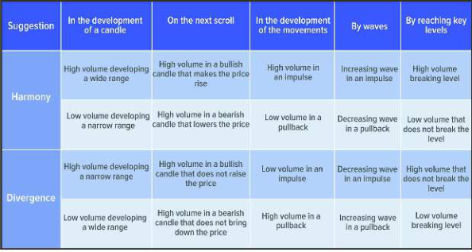

---

<!-- page_064 -->

IN THE DEVELOPMENT OF A CANDLE

It's the simplest evaluation. We try to analyze the price and volume action in
a simple individual candle.

Candles are the final representation of a battle between buyers and
sellers within a certain period of time.

The final result of this interaction between supply and demand sends
us a message.

Our job as traders who analyze the action of price and volume is to
know how to interpret that message correctly. In this case in isolation.

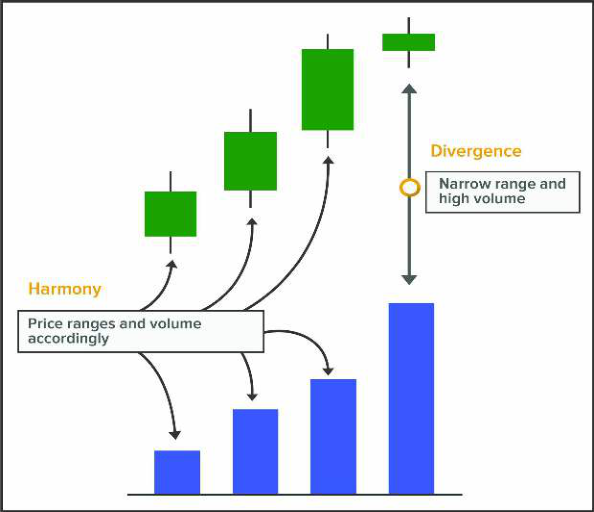

---

<!-- page_065 -->

We are looking for an agreement between the price ranges and the
volume traded. For that message to convey harmony, we want to see wide
ranges in the volume peaks and narrow ranges in the low volumes. The
opposite would mark a divergence.

ON THE NEXT SCROLL

In this section we try to analyze the action of the price and the volume in a
larger portion; in the later displacement of the price.

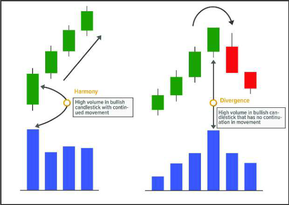

We want to assess whether this volume generates a movement in the
direction of the original candle or whether the price shifts in the opposite
direction after observing this increase in volume.

Therefore, we would obtain a harmony effort/result if that candle +
that volume have continuation; and divergence if a turn is generated in the
market.

---

<!-- page_066 -->

IN THE DEVELOPMENT OF THE MOVEMENTS

We increase the portion of our analysis and on this occasion we analyze the
price action and the volume in term of complete movements.

As a general rule, impulse movements will be accompanied by an
increase in volume as the price moves in the direction of least resistance; and
backward movements will be accompanied by a decrease in volume.

Then, we determine that there is harmony when an impulse comes
with increased volume; and when a retreat comes with decreased volume.

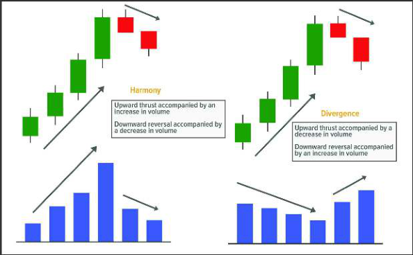

Similarly, we determine divergence when we observe an impulsive
movement (which generates a new high/low) with a decrease in volume and
when we see a retrocession (we would have to evaluate if it is really a
retrocession) with an increase in volume.

BY WAVES

---

<!-- page_067 -->

This tool (originally created by David Weis) measures the volume that has
been operated by each wave (up and down).

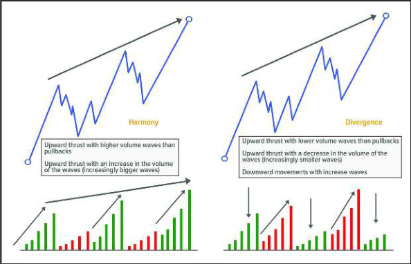

Overall, it allows us to assess market conditions and more accurately
compare upward and downward pressure between moves.

A key fact to keep in mind when analyzing the waves is that not all
the volume traded on a bullish wave will be purchases and that not all the
volume traded on a bearish wave will be sales.

Like any other element, it requires analysis and interpretation. The
analysis of effort and result is exactly the same.

It is a question of comparing the current wave of volume with the
previous ones; as much with the one that points in its direction as with the
one that goes in the opposite direction.

Harmony would be obtained if in an upward movement the upward
impulses are accompanied by upward waves with a greater volume than the
downward setbacks.

We would also determine a harmony if the price reaches new highs
and each bullish impulse does so with an increase in the volume of the waves.

On the other hand, we would have a divergence if the price moves

---

<!-- page_068 -->

upwards but the rising waves are less and less; or if in that moving upwards
the falling waves show greater strength.

BY REACHING KEY LEVELS

It is one more way to evaluate this law of effort and result; this time, in terms
of broken levels.

It is simple: if you approach a level with volume and make an
effective break we will say that there is harmony effort/result in that breakout
movement. That volume was intended to move forward and has absorbed all
the orders that were placed there.

If, on the other hand, you approach a level with volume and make a
false break, we will say that there is divergence. All of that operated volume
has been participating in the opposite direction to the level break.

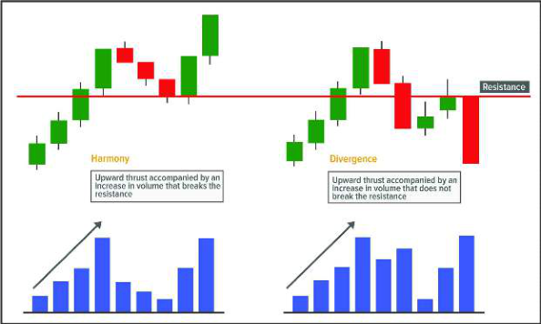

It can be applied to any type of level. Whether horizontal (supports
and resistances), with slope (trend lines, channel lines, inverted lines,
converging, diverging), dynamic levels (moving averages, VWAP, bands); as

---

<!-- page_069 -->

well as any other level that establishes a specific methodology.

EFFORT/RESULT IN TRENDS

In addition to what was previously studied, the evaluation of the effort/result
can be included in other more general market contexts such as trends.

Generally, large relative volumes accompany the termination of a
large movement, especially if accompanied by small price advances.

Therefore, a strong volume after a strong bearish trend indicates that
the fall is almost complete. It may be a sales climax and you're probably
starting an accumulation.

Similarly, a strong volume after a prolonged uptrend indicates that the
end of the uptrend is near and that the distribution Phase may be beginning.

LACK OF INTEREST

Turns do not always take place when there is a considerable volume (effort)
and a comparatively small price movement (result).

We find another way capable of causing a price twist; and that is lack
of interest. Small volumes on market floors (after a considerable decline), or
after a bearish reversal, generally indicate lack of selling pressure.

If there is no interest in continuing to fall, an appearance of buyers

---

<!-- page_070 -->

now would cause a turn upside. Similarly, small volumes on market ceilings
(after a considerable rise) or after a bullish retreat, usually indicate lack of
buying pressure that would lead the price to a bearish turn with the
appearance of sellers.

Remember that sudden relative increases or decreases in volume are
significant and will help you identify when a movement may be ending or
about to end.

---

<!-- page_071 -->

PART 4 - THE PROCESSES OF
ACCUMULATION AND
DISTRIBUTION

---

<!-- page_072 -->

CHAPTER 10 - ACCUMULATION

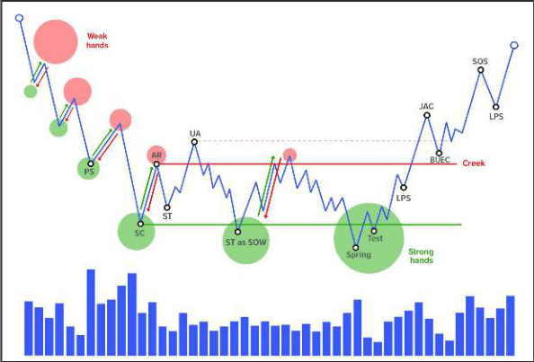

An accumulation range is a lateral movement of the price preceded by a
bearish movement on which an absorption manoeuvre is carried out by the
big traders with the objective of accumulating stock in order to be able to sell
it at higher prices in the future and make a profit from the difference.

STOCK CONTROL

During the development of the bearish movement that precedes it, control of
the stock will be mainly in weak hands. In order to be able to turn a market, it
is necessary for that stock to be controlled by the great professionals, by the
strong hands.

---

<!-- page_073 -->

As the price falls, the stock gradually changes hands; the more it falls,
the greater the stock is in strong positions. It is during the development of the
accumulation structure that the final process of absorption takes place. The
moment at which the price is ready to start the upturn.

THE LAW OF CAUSE AND EFFECT

It is in these range conditions where we see in operation the law of cause and
effect in trading; which tells us that for there to be an effect, there must first
be a cause that originates it; and that the effect will be in direct proportion to
the cause.

In the case of the accumulation range, the purchase of stock (cause)
will have the effect of a subsequent upward trend movement; and the extent
of this movement will be in direct proportion to the time the price has spent
building that cause (absorbing the stock).

The preparation of an important movement takes considerable time. A
large trader cannot buy everything he wants all at once because if he executes
an order with all the quantity he wants, he would get worse prices due to the
displacement his own order would generate.

In order to perform this task, professionals need to plan and execute a
careful plan with which to try to absorb all available stock at the lowest
possible average price.

HANDLING MANEUVERS

---

<!-- page_074 -->

In the accumulation process, large traders create an environment of extreme
weakness. The news at this point is likely to be bad and many will be
influenced to enter the wrong side of the market. By means of various
manoeuvres, they manage to make themselves little by little with all the
available offer.

In the accumulation range we observe a fundamental event that
characterizes this type of context since in many occasions it is the action that
initiates the trend movement. It's the bearish shake, also known as "Spring" It
is a sudden downward movement which breaks the support level of the range
and with which the big traders are used to carry out a triple function: To
reach the stop loss of those traders who were well positioned on the long
side; to induce for sale the ill-informed traders who think in the continuation
of the downward movement; and to profit from such movement.

While it is true that this shaking event is an action that adds strength
to the bullish scenario, it is also true that it will not always happen. You
should be aware that on many occasions the development of the uptrend will
begin without this terminal action. This is a context that is somewhat more
difficult to determine but equally valid.

At the same time, they need to take the "weak hands" out of the
market. These are traders who, if they are positioned to buy, will very soon
close their positions assuming short profits; and this closing of buy positions
are sales orders that the big traders will have to keep absorbing if they want
to keep pushing the price. One action they take to get rid of this type of weak
trader is to generate a flat, boring market context in order to discourage these
traders from finally closing their positions.

COUNTERPARTY, LIQUIDITY

---

<!-- page_075 -->

Both the fact of reaching the stops of the purchase positions, as well as the
entry in sale of some traders, provides liquidity to the professionals that are
accumulating; since both actions execute sales to market; and these sales are
the counterpart that the big traders need to marry their purchases.

In addition to this, when the bullish reversal occurs back into the
range, stops will also be executed for those who entered with selling positions
during the bearish break, adding strength to the bullish movement.

THE PATH OF LEAST RESISTANCE

Professionals with interests above will not initiate the movement until they
have verified that the path of least resistance is on the rise. This is achieved
by carrying out various tests to check the level of commitment of the sellers.

As with Spring, they will initiate downward movements to verify the
tracking it has. An absence of volume at this point would suggest a lack of
interest in reaching lower prices.

This is why sometimes you see more than one Shake within the range;
these are tests that professionals develop to make sure they won't find
resistance at higher prices.

COMMON CHARACTERISTICS OF THE
ACCUMULATION RANGES

---

<!-- page_076 -->

The following are key features of the accumulation ranges:

Decrease in volume and volatility as the range develops. There
will be less and less stock available for sale and therefore price and
volume fluctuations will be gradually reduced.

Tests to the high zone of the range without volume, suggesting
an absence of selling interest; except when the price is prepared to
initiate the movement out of the range.

Springs to previous lows; either over the support area or over
minor lows within the range.

Wider and smoother upward movements and bars than
downward movements. This denotes an influx of good quality
demand and suggests that supply is of poor quality.

Development of rising highs and lows. This sequence should
already be observed in the last stage of the range, just before the
start of the bullish jump. Denotes total control by buyers.

BEGINNING OF THE BULLISH MOVEMENT

When there is no longer any stock to be absorbed, a turning point takes place.
Value control is in the hands of the strong and they will only get rid of their
positions at much higher prices. A slight increase in demand now would
provoke a sudden upward movement in prices, initiating the upward trend.

---

<!-- page_077 -->

CHAPTER 11 - REACCUMULATION

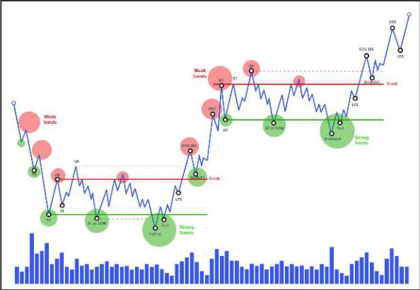

The reaccumulation process is exactly identical to the accumulation process.
The only difference between the two is the way the structure begins to
develop. While the accumulation range begins by stopping a bearish
movement, the reaccumulation range begins after the stop of an upward
movement.

---

<!-- page_078 -->

STOCK ABSORPTION

A reaccumulation is the result of a previous uptrend that needs to be
consolidated. The hands that control the value will change during the course
of the trend.

At the beginning of an uptrend, the value is under the control of very
strong owners (professional traders, strong hands), but as it develops, the
stock will gradually shift to less informed traders, weak hands.

At this point, it is said that the demand is of poor quality and the
market needs to restart a process of stock absorption in which again it is the
big traders who take control.

DURATION OF THE STRUCTURE

A key point to keep in mind is that the duration of this structure will be
influenced by the percentage of strong and weak hands that have control of
the value.

If at the beginning of the reaccumulation the value is still mainly in
strong hands, the duration of the structure will be shorter. If, on the other
hand, it is the weak hands that control most of the stock, a longer period of
time will be necessary to be able to redevelop the purchasing process.

---

<!-- page_079 -->

The aims of the main accumulation will not yet be met and this
structure is developed to add new demand to the market with which to
continue the upward movement towards these aims.

REACCUMULATION OR DISTRIBUTION

A judicious analysis of price and volume action is very important in order not
to make the mistake of confusing a reaccumulation range with a distribution
range.

Both are initiated in the same way, after the stop of an upward
movement. It becomes necessary to automate the characteristics of the
accumulation ranges, as this is one of the most compromising situations that
any Wyckoff trader will encounter.

---

<!-- page_080 -->

CHAPTER 12 - DISTRIBUTION

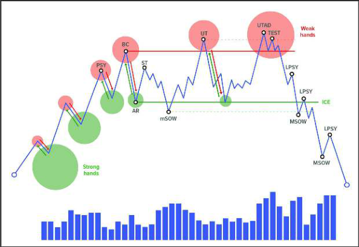

A distribution range is a lateral movement of the price which manages to stop
an upward movement and in which there is a process of selling stock by well-
informed professionals, who have interests at lower prices. They try to store a
great position in order to get rid of it at lower prices and get a return for it.

---

<!-- page_081 -->

THE LAW OF CAUSE AND EFFECT

It is in these range conditions where we see in trading the law of cause and
effect so common in the world of trading; which tells us that for there to be
an effect, there must first be a cause that originates it; and that the effect will
be in direct proportion to the cause.

In the case of the distribution range, the sale of stock (cause) will have
the effect of a subsequent downward trend movement; and the extent of this
movement will be in direct proportion to the time the price has spent building
that cause (absorbing the stock).

The preparation of an important movement takes considerable time. A
large trader cannot build his entire position at once because if he executes his
sell orders with an order containing all the quantity he wants, the very
aggressiveness of the order would shift the price downwards until he finds
the necessary demand with which to match his sell orders and this would lead
to worse prices.

In order to perform this task, professionals need to develop and carry
out a careful plan with which to try to absorb all available market demand at
the highest possible average price.

HANDLING MANEUVERS

---

<!-- page_082 -->

During this distribution process, the large traders, supported by the media
(often at their service) generate an environment of extreme strength. What
they are looking for with this is to attract as many traders as possible since it
will be the purchases of these traders who will give the necessary counterpart
to match their sales orders.

Misinformed traders don't know that strong professionals are building
a great selling position because they have interests below. You'll be entering
the wrong side of the market. By means of various manoeuvres, they are able
to make themselves little by little with all the available demand.

In the distribution range, as in the accumulation range, we will be
presented with the fundamental event of the shock. While it is true that not all
structures will see this action before starting the trend movement, the fact of
its presence adds great strength to the scenario.

In the case of a bullish shock, the Wyckoff methodology calls it
"Upthrust". This is a sudden upward movement which breaks the resistance
level of the range and with which large traders are used to carry out a triple
function: Reach the stops loss of those traders who were well positioned on
the short side; induce in buy to ill-informed traders who think in the
continuation of the bullish movement; and profit from such movement.

At the same time, they need to take the "weak hands" out of the
market. These are traders who, if positioned for sale, will very soon close
their positions assuming short profits; and this closing of sale positions are
buy orders that the big traders will have to keep absorbing if they want to
keep pushing the price. One action they take to get rid of this type of weak
trader is to generate a flat, boring market context in order to discourage these
traders from finally closing their positions.

COUNTERPARTY, LIQUIDITY

---

<!-- page_083 -->

The professionals who are building their position are obliged to carry out this
type of manoeuvre. Due to the magnitude of their positions, it is the only way
they have to be able to trade in the markets. They need liquidity with which
to match their orders and the shake event is a great opportunity to get it.

The stop jumping of sell positions, as well as traders entering long,
are buy orders that must necessarily be crossed with a sell order. And indeed,
it is the well-informed traders who are placing those sales orders and thus
absorbing all the purchases that are executed.

In addition, when the bearish reversal occurs after the shake, the stops
of those who bought will also be executed, adding strength to the bearish
movement.

THE PATH OF LEAST RESISTANCE

Once the development of the range is coming to an end, the great
professionals will not initiate the downward trend movement until they can
verify that effectively the path of least resistance is down.

They do this through tests with which they evaluate the buyer's
interest. They initiate upward movements and depending on the second
participation (this will be observed by the volume traded in that movement)
they will value if demand remains available or if on the contrary the buyers
are exhausted. An absence of volume at this point would suggest a lack of
interest in reaching higher prices.

This is why you sometimes see more than one Shake in the range;
these are tests that professionals develop to make sure they won't find
resistance at lower prices.

---

<!-- page_084 -->

COMMON CHARACTERISTICS OF THE
DISTRIBUTION RANGES

The following are key characteristics of the distribution ranges:

High volume and volatility during range development. Wide
price fluctuations will be observed and the volume will remain
relatively high and constant.

Tests to the lower zone of the range without volume, suggesting
an absence of buyer interest; except when the price is prepared to
initiate the movement out of the range.

Upward Shakes to previous highs; either over the resistance area
or over minor highs within the range.

Wider and more fluid movements and down bars than up
movements and up bars. This denotes entry of quality supply and
suggests that demand is of poor quality.

Development of lower highs and lows. This sequence should
already be observed in the last stage of the range, just before the
start of the bearish jump. What it suggests is that short traders are
becoming more aggressive.

BEGINNING OF THE BEARISH MOVEMENT

When demand is no longer available, a turning point takes place. Value
control is in the hands of the strong and they will only get rid of their
positions at much lower prices. A slight increase in supply now would

---

<!-- page_085 -->

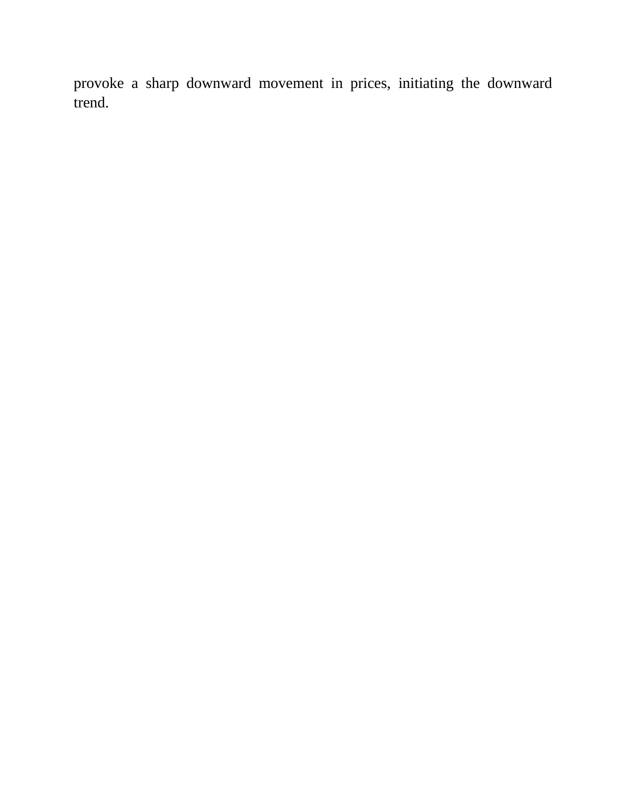

provoke a sharp downward movement in prices, initiating the downward
trend.

---

<!-- page_086 -->

CHAPTER 13 - REDISTRIBUTION

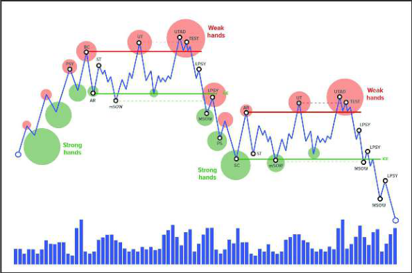

The redistribution Phase is a range that comes from a bearish trend and is
followed by a new bearish trend. Multiple Phases of redistribution can occur
within a large bear market. This is a pause that refreshes the value to develop
another downward movement.

---

<!-- page_087 -->

REDISTRIBUTION OR ACCUMULATION

This type of structure starts the same as the accumulation ranges; therefore a
very judicious analysis is necessary in order not to lead to erroneous
conclusions. This aspect is undoubtedly one of the most difficult tasks for the
Wyckoff trader: to know how to distinguish between a redistribution range
and an accumulation range.

STOCK CONTROL

During the periods of redistribution, the great professional who is already
short returns to sell around the top of the range and potentially cover
(close/buy) some of his positions near the base of the range.

In general, they are increasing the size of their short position during
range development. The reason they close some of their short positions at the
base of the range is to provide price support and not to push it down
prematurely before they can establish a significant short position.

Redistribution remains volatile during and at the end of its
development before continuing the downtrend.

The hands that control the value will change during the course of the
trend. At the beginning of a bearish trend, the value is under the control of

---

<!-- page_088 -->

very strong owners (professional traders, strong hands), but as it develops,
the stock will gradually change towards less informed traders, weak hands.
At this point, it is said that the supply is of poor quality and the market needs
to restart a process of stock absorption in which again it is the big traders who
take control.

DURATION OF THE STRUCTURE

The percentage of strong and weak hands that have control of the value will
influence the duration of the structure. If at the beginning of the redistribution
the value is still mainly in strong hands, the duration of the structure will be
shorter. If, on the other hand, it is the weak hands that control most of the
stock, a longer period of time will be necessary to be able to redevelop the
sales process.

The objectives of the main distribution will not yet be met and this
structure is being developed to add new selling positions to the market with
which to continue the downward movement towards these objectives.

---

<!-- page_089 -->

PART 5 - EVENTS

The Wyckoff methodology attempts to identify logical patterns of price turn
during which market control is defined.

In this section we will present the sequence that follows the price in
the development of these structures. Although there are traders who apply it
differently, from my point of view it is advisable to observe such events from
a practical point of view, subtracting rigidity and providing as much
flexibility as possible to the analysis.

The events are the same for both accumulations and distributions. The
only thing that changes in some cases is the name, but the underlying logic
behind them is the same. We will divide the sections by events and within
them we will explain both the example of upward and downward turns.

---

<!-- page_090 -->

THE LIST OF EVENTS

Although they will be further developed later, we make a brief summary of
the logic of each of the events that will appear:

EVENT #1: PRELIMINARY STOP

The preliminary stop is the first attempt to stop the trend movement
underway, the result of which will always fail. It is an early warning that the
trend may be coming to an end.

EVENT Nº2: CLÍMAX

This is the culmination movement of the preceding trend. After having
covered a great distance, the price will reach an extreme condition that will
provoke the appearance of the great professional.

EVENT Nº3: REACTION

---

<!-- page_091 -->

It is the first great signal that suggests the change of sentiment in the market.
We go from a market in control by either of the two forces to a market in
balance.

EVENT Nº4: TEST

This event has different readings depending on the location where it takes
place. In general terms it tries to evaluate the commitment or absence of it on
the part of the traders in a certain moment and direction.

EVENT Nº5: SHAKING

Key moment for the structure analysis. It is the last deception developed by
the professional before initiating the trend movement in favor of the least
resistance.

EVENT Nº6: BREAKOUT

It is the greatest proof of commitment that the professional has to assume. If
you have done a good previous work of absorption, you will break relatively
easily the structure in order to continue the movement out of it.

---

<!-- page_092 -->

EVENT #7: CONFIRMATION

If the analysis is correct, a rupture test will be developed which will confirm
that the professional is positioned in that direction and supports the
movement.

---

<!-- page_093 -->

CHAPTER 14 - EVENT #1: PRELIMINARY
STOP

This is the first Wyckoff method event that appears to initiate the Phase A
stop of the previous trend.

In the case of accumulation schemes, it is called Preliminary Support
(PS), which together with the Selling Climax (SC), the Automatic Rally (AR)
and the Secondary Test (ST) produces the change in character with which it
makes the price evolve from a downward trend environment to a
lateralisation environment.

In the example of the distribution structures it is called Preliminary
Supply (PSY), which in conjunction with the Buying Climax (BC), the
Automatic Reaction (AR) and the Secondary Test (ST), puts an end to Phase
A, stopping the previous upward trend and initiating Phase B, the
construction of the cause.

As we know, the processes of accumulation and distribution require
time and on rare occasions the price will develop a hypodermic structure
visually leaving a V turn. This accumulation process begins with this first
event, with Preliminary Support and Preliminary Supply.

Before this event takes place, the market will find itself in a clear
trend. At some point, the price will reach a level attractive enough for large
traders that they will begin to participate more aggressively.

---

<!-- page_094 -->

HOW THE PRELIMINARY STOP APPEARS ON THE GRAPHIC

The observation of this event on the graph is generally misinterpreted as it is
not necessarily necessary to observe a bar with increased volume and
expansion in the ranges.

It can also be seen on a set of bars with a relatively narrower range
and a constant high volume during all of them; or even on a single bar with a
high volume and a large wick. These representations in the end denote the
same thing: the first relevant entry of the big traders.

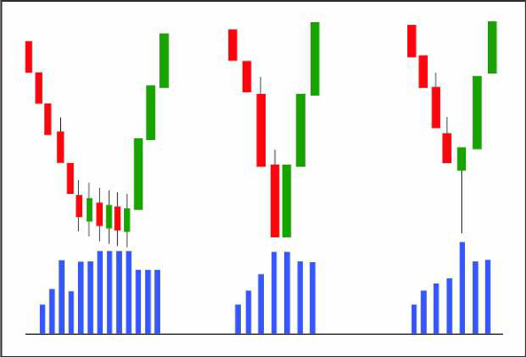

He recalls one of the most important quotes from Tom Williams' book
"Master the Markets" in which he says something like that the market does
not like large trend bars with significant volume increase after a prolonged
move as they usually denote an opposite sentiment.

Observing a large bearish bar with a peak of volume and closing at
the low after a prolonged downward movement is a very clear indication of
professional buying.

It is likely that this stock will reach an oversold condition in relation
to the bearish channel that is respecting the price stock during the bearish
movement.

---

<!-- page_095 -->

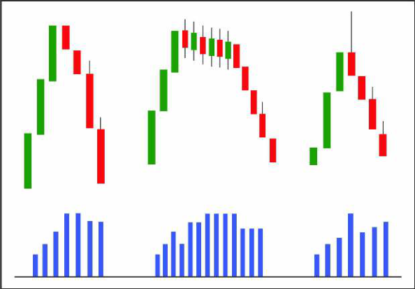

THE PSYCHOLOGY BEHIND THE PRELIMINARY STOP

We are now going to study the crossing of orders that takes place during such
action. Remember, for someone to buy, there must be someone to sell.

Ask yourself what both the misinformed trader or "weak hand" and
the well-informed trader or "strong hand" are doing at that point.

As we have commented, after determining that the market has reached
a value price on which to start a campaign, the one that will be absorbing all
the stock will be the large trader; and it is the ill-informed traders who are
providing them with all the liquidity they need to build their positions.

We found different profiles of ill-informed traders that facilitate this
fact:

The greedy. There will be a group who see price move
abruptly and enter the market to avoid being left out of a potential
move in their favor.

---

<!-- page_096 -->

The fearful. This group has been holding losing positions
for a long period of time and its limit is very close. After seeing the
price move again against them and for fear of further increasing the
loss, they finally decide to abandon their position.

The smart ones. They will have been able to anticipate the
turn and they will already be in the market; but their timing has not
been precise and this movement takes them out making them jump
their protection stops.

---

<!-- page_097 -->

USES OF THE PRELIMINARY STOP

But then, what's the point of identifying this first stop event? As we have
already mentioned, this is the first stop action of the previous trend
movement and therefore we can draw two clear conclusions:

Stop thinking about continuing to trade in favor of the
previous trend at least initially, as the structure has yet to be
confirmed as continuing or turning.

This is an excellent point to take profits.

---

<!-- page_098 -->

PRELIMINARY SUPPORT

As we know that a bearish trend does not stop at once, it is possible to find
numerous attempts to stop the fall before the successful one takes place. It's
the inertia of the trend. It is like a moving vehicle; once the cruising speed is
reached, even releasing the foot of the accelerator, the car will continue in the
direction for a time by its own inertia.

Those entire stop attempts are Preliminary Support. The more there
are, the more likely it is that the last end of the bearish trend will finally take
place without a significant increase in volume.

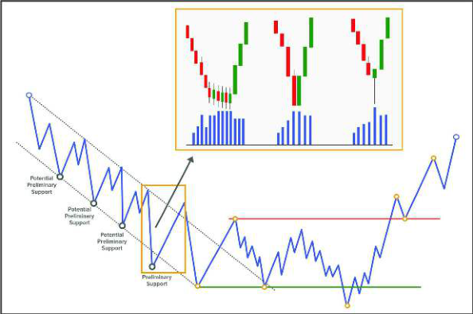

The fact of seeing repeated Preliminary Support suggests that the
professional has been eliminating offer from the market and when the last
low is reached, few will be willing to sell; and this will make that last end
take place without a peak in volume. It will also be a Selling Climax, in this

---

<!-- page_099 -->

case without an ultra-high volume: the movement stops due to exhaustion.
We'll talk about it when we develop this climatic event.

Actually, they are Preliminary Support from a functional point of
view; because for the Wyckoff methodology, the Preliminary Support as such
will be the penultimate attempt to stop the downtrend (the last will be the
Selling Climax). Therefore, it would be best to label them as potential
Preliminary Support.

This potential PS will be confirmed as the genuine PS when the price
develops the four Phase A events that establish the character change.

This first participation of the professional does not imply that the
price should be rotated immediately. As we have already commented; in
certain market conditions the price will develop a V turn accumulating all the
necessary stock during the fall. We repeat that although this type of
hypodermic accumulation is not the most likely, we must be alert to its
possible development.

---

<!-- page_100 -->

PRELIMINARY SUPPLY

Before the real Preliminary Supply takes place, the most logical thing would
be to find ourselves with numerous previous attempts. These attempts should
be labeled as potential Preliminary Supply.

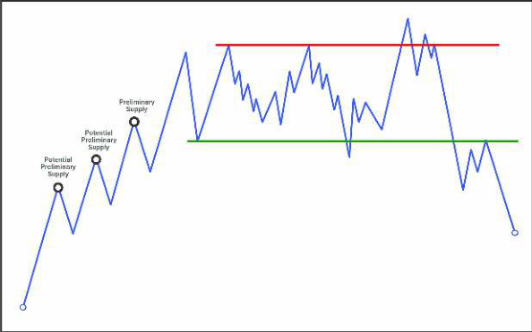

The fact of seeing repeated Preliminary Supply suggests that the
professional has been eliminating demand from the market and when the last
high is reached, there will be few who are willing to buy; and this could
cause that last end to take place without a significant volume.

---

<!-- page_101 -->

CHAPTER 15 - EVENT #2: CLIMAX

It is the second event of the methodology and appears after the stop attempt
in the Preliminary Support/Supply.

In the accumulation examples we will call it Selling Climax (SC)
while for the distributive structures we will label it Buying Climax (BC).

After the appearance of a large volume after a prolonged trend
(potential standstill), we will be attentive to the possible identification of this
climatic event. As we always say, this is one of the greatest benefits of the
Wyckoff methodology: it provides us with a market context. We know what
to look for.

But something important to keep in mind is that Preliminary
Support/Supply events do not always appear within the sequence and their
function can be performed at the same time by the climax event. That is why
we insist time and again on the importance of giving the market some
flexibility. We have a context and a basic sequence but it is necessary to
allow the market to express itself freely, without trying to force it into our
map, because wanting to exercise control over the market would be a
mistake. The key to determine if we are directly before the climax will be
obtained from the price; it will be necessary to see a strong reaction (Event
No. 3) and a test (Event No. 4) that give the end of Phase A stopping the
trend.

KEYS TO CLIMAX

---

<!-- page_102 -->

Two things can happen after the climatic event; a reaction (Automatic
Rally/Reaction) or a lateral movement. If a reaction appears, it will be
followed by a Secondary Test; conversely, if a lateral movement takes place,
the market will most likely continue in the direction of the previous trend.

A very relevant aspect is that this event needs to be tested to verify its
authenticity (with the Secondary Test). A much lower volume in a
subsequent test shows a decrease in selling pressure.

This event is known as "No Supply" and "No Demand" within the
VSA (Volume Spread Analysis) approach.

Something very important to emphasize is that the climax will not
necessarily be the greatest end of the structure. During the development of
the same we could observe several tests (failed attempts to make lower lows
or higher highs) during Phase B as well as the test event in Phase C
(Spring/UTAD) that normally shakes the end of it.

---

<!-- page_103 -->

HOW THE CLIMAX APPEARS ON THE GRAPH

Although the principle does not change; it can manifest itself in different
ways in terms of price and volume representation.

There is a prevailing belief within the world of price and volume
analysis that this event should be viewed as a bar with increasing volume and
expanding ranges. Even if this definition were correct, it would be incomplete
because there are other forms of representation.

On the one hand, it can be seen on a set of bars with a relatively
narrower range and with a high and constant volume during all of them.
Another way would be on a single bar with high volume and a large wick at
the bottom.

All these representations in the end denote the same thing: strong
entry of buyer interest on the part of the large traders.

Regardless of the characteristics of the climatic event, when we look
at the genuine Automatic Rally/Reaction and Secondary Test, we will
automatically label the previous movement as Climax.

THE PSYCHOLOGY BEHIND THE CLIMAX

If we remember, due to the very nature of markets; for someone to be able to

---

<!-- page_104 -->

sell, someone else must have been willing to buy. So, it is a good idea to ask
ourselves now, for example, who will be assuming all the sales that take
place in the Selling Climax or the purchase of the Buying Climax.

Logic leads us to think that who is providing the counterparty is the
large trader because it is he who has the ability to move the market and stop
an abrupt fall or rise in price.

He has probably determined that the price is in an overextended
condition and is happy to start a campaign in this area to absorb stock.

What are the reasons that lead the ill-informed trader to provide the
liquidity that large traders need? We recall the origin of those liquidity
providers already seen in the preliminary stop event:

The greedy. There will be a group who see the climax
movement and enter the market for fear of losing it.

The fearful. Another group, generally with medium- to
long-term positions, will have stockpiled and will have withstood
much of the previous trend movement. They are in losses and
when they see a new movement against them they decide to close
their positions to avoid greater losses.

The smart ones. A last group of traders, believing
themselves to be the smartest in the class, will want to anticipate
the turn and at that point they will probably already find
themselves with open positions. This third type of counterparty
takes place when the protection stop of these positions is skipped.

USES OF CLIMAX

---

<!-- page_105 -->

The identification of this event is very important because it signals the entry
of professionals and therefore it is a supported action and quality.

What advantage can we gain by correctly identifying this event? As it
is a stop action of the previous trend movement and pointing out the
professional participation we can draw two clear conclusions:

We must stop thinking about continuing to trade in favor of
the previous trend. At least until we confirm whether the structure
is about rotation or continuity.

We are facing the last clear opportunity to take profit from
our open positions if we did not do so on the stop event.

It is not recommended to start positions at this point as the assumed
risk would be too high. However, it is true that some of the most experienced
Wyckoff traders take advantage of this type of context to take short distance
trades looking for the rebound to event #3 (Automatic Rally/Reaction).

---

<!-- page_106 -->

SELLING CLIMAX

This Selling Climax event is in the background similar to the Preliminary
Support event. Both the way it can appear on the graph and the psychology
behind the action are exactly the same. Also initially we must treat it as
Selling Climax potential since the confirmation will arrive to us when the two
later events appear that confirm the end of the Phase A (Automatic Rally and
Secondary Test).

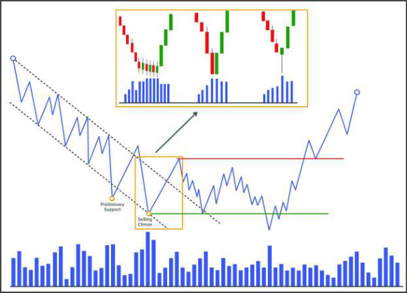

The Selling Climax is a very powerful sign of strength. After a period
of falling prices, you will reach a point where, supported by very negative
news, the market will plummet rapidly. At that point, prices are now
attractive for smart money and will begin to buy or accumulate at those low
levels.

Selling Climax takes place after a significant downward movement.

---

<!-- page_107 -->

This is the second event to appear after the Preliminary Support and takes
place within the Phase A stop of the previous bearish trend.

This climatic movement is generated by three reasons that we will
detail next and that together provoke a snowball effect for which the price
does not stop falling.

Within the Wyckoff methodology it has special relevance since with
its appearance we can begin to define the limits of the range; and it is that its
low establishes the lowest end of the structure (support zone).

THE SELLING CLIMAX OF EXHAUSTION

A downward trend will not always end with a climatic volume. There is
another way to come to an end and it occurs when the sale that is controlling
the condition of the market is gradually disappearing.

Sellers stop being interested in lower prices and close their positions
(take profits). This lack of aggressiveness of the shorts would create a
potential market ground for exhaustion.

Obviously, this disinterest will be represented on the chart with
candles of normal or narrow range and average or even low volume.

The curious thing about this action is that, even if we are not facing a
climatic event that precedes the end of a trend, within the labeling of the
structure we would continue to identify that low as the Selling Climax.

It must be made clear that the methodology originally did not treat
this action as such Selling Climax; and it makes perfect sense because at no
time did we observe this characteristic climax.

---

<!-- page_108 -->

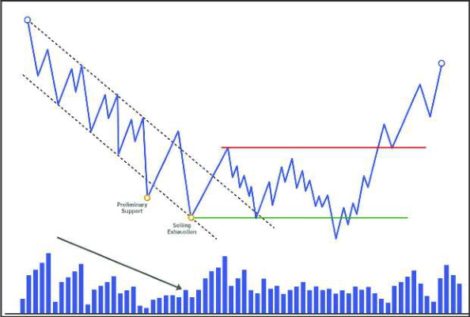

Although we always advocate treating market actions from a
functional point of view, on this occasion we must observe this exhaustion
from an analytical point of view in order to frame it within the structure's
etiquette.

Perhaps we could propose to the whole Wyckoffian community a new
event that would identify this end of the downward trend due to exhaustion.
Something like "Selling Exhaustion" could be representative of the action
you are referring to.

To emphasize of the Selling Exhaustion is that a signal of its possible
appearance we obtain it when the price develops continuous actions of
Preliminary Support every time lower.

Climatic actions will be observed as the downward movement
develops where the overall volume is likely to decrease. This suggests that
there is absorption of sales where professionals have stopped selling
aggressively and begin to take advantage of the bearish continuation to take
profits from their shorts.

This can cause that market floor to develop without seeing above the
last low an expansion in price ranges and volume. We will be before the new
Selling Exhaustion.

---

<!-- page_109 -->

BUYING CLIMAX

Buying Climax is a powerful sign of market weakness. After an uptrend, the
price, guided by favorable news and a buying irrationality on the part of the
participants (ill-informed) will cause a rapid rise.

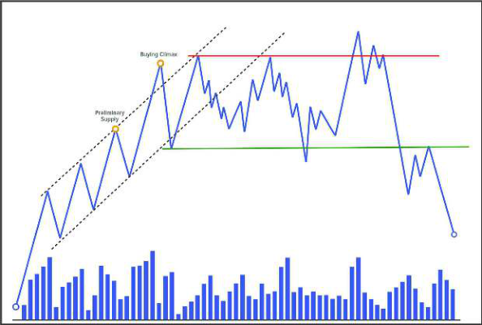

At this point, the market will have reached an uninteresting level to
stay within, and well-informed traders will abandon their buying positions
and even begin to position themselves short expecting lower prices.

The Buying Climax is the second event that appears after the
Preliminary Supply and takes place within the Phase A stop of the previous
bullish trend.

This climatic movement is originated by professional traders capable
of initiating a price shift; and is followed by ill-informed traders who make
their operational decisions generally on the basis of their emotions.

---

<!-- page_110 -->

It's a trap. A deception where it seems that one is buying with a
certain aggressiveness when in reality the intention behind it is totally the
opposite. All purchases are being blocked with sales orders. The price cannot
go up because someone with the ability to do so is absorbing all that stock.

With the appearance of the Buying Climax we begin to define the
limits of the range; and it is that its high establishes the upper end of the
structure (zone of resistance).

The similarities between Preliminary Supply and Buying Climax are
total. Both the way it can appear on the graph and the psychology behind the
action is exactly the same. The only difference between the two events is that
Preliminary Supply fails to stop the previous uptrend, while Buying Climax
does (at least temporarily).

Initially we must treat the Buying Climax as potential, since the
confirmation will come to us when the two subsequent events appear
confirming the end of Phase A (Automatic Reaction and Secondary Test).

THE BUYING CLIMAX OF EXHAUSTION

An upward trend will not always end with a climatic volume. There is
another way to come to an end and it occurs when the purchase that is
controlling the condition of the market is gradually disappearing.

Buyers stop being interested in higher prices and close their positions
(take profits). This lack of aggressiveness of the lengths would create a
potential market ceiling due to exhaustion.

Obviously, this disinterest will be represented on the chart with
candles of normal or narrow range and average or even low volume.

---

<!-- page_111 -->

Although this action does not have the common characteristics of
climatic events, within the methodology it is still labelled in the same way.
That is why it would be interesting to differentiate between a climax stop and
an exhaustion stop.

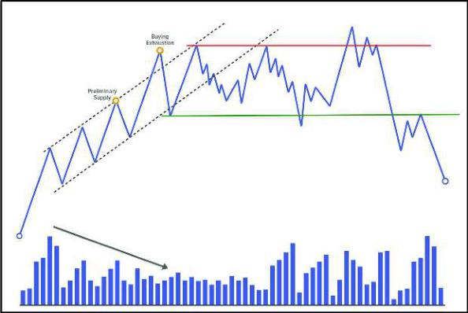

The proposal that is launched to the Wyckoffian community is the
creation of a new event that serves to identify this end of the upward trend
due to exhaustion. In this case, "Buying Exhaustion" seems to us to be the
most suitable label.

One sign that we are possibly going to identify a Buying Exhaustion
is the appearance of continuous higher and higher Preliminary Supply
actions.

Preliminary Supply potentials will be observed where overall volume
is likely to decrease. This suggests that there is a gradual absorption of
purchases where professionals have stopped buying aggressively and begin to
take advantage of the bullish continuation to take profits from their lengths.

This can cause that market ceiling to develop without seeing above
the last high an expansion in price ranges and volume. We'll be looking at the
new Buying Exhaustion.

---

<!-- page_112 -->

CHAPTER 16 - EVENT #3: REACTION

After the appearance of the potential climax, there will be an automatic
reaction that will visually leave a large movement in the opposite direction,
thus confirming the climatic event.

This movement will be the most important since the market began the
previous trend Phase. It suggests an aggressive entry of traders in the
opposite direction and indicates a change of character.

This ChoCh (Change of Character) has great implications and is that
it signals a change in the context of the market; the ChoCh appears to put an
end to the previous trend and start an environment of lateralization in the
price.

This change in behavior must be confirmed with the last event of
Phase A: the Secondary Test. With its appearance, we can confirm the new
environment in which the market will move from that moment on.

---

<!-- page_113 -->

THE IMPLICATIONS OF ITS DEVELOPMENT

The distance travelled by this movement will be one of the elements we will
take into account later on as the structure develops in order to try to
determine what the great professional is doing.

We must bear in mind that a short-distance reaction does not have the
same implications as a significantly (in comparative terms) larger one.

For example, in a market where the latest upward movements have
developed with an average of 50 points; and suddenly you see an Automatic
Rally of 100 points, it suggests a stronger bottom.

It will be one of the elements that we will take into account later on as
the structure develops in order to try to determine what the great professional
is doing.

When we see a movement that is intertwined, does not travel a great
distance and without the appearance of a high volume, denotes that there is
no great intentionality to push prices that way and suggests to us that the
market is not yet in a state of balance. Very possibly the later Secondary Test
will be developed relatively soon and may go beyond the limits of the
structure, denoting this imbalance.

If we observe this behavior in a potential accumulation structure, we
have to doubt that what is really taking place in the market is an accumulation
for a later price increase. With this apparent weakness it will be more sensible
to think of a process of redistribution that leads to lower prices.

The same is true for analyses that denote a greater probability of

---

<!-- page_114 -->

distribution. If we see that the downward movement (AR in distribution) is
intertwined, that it does not travel a great distance, that we have not seen a
volume peak and that in addition the Secondary Test ends above the high
established by the Buying Climax, we suspect that what is happening is a
reaccumulation structure.

THE ANATOMY OF THE REACTION

Generally, the volume at the beginning of the movement will be large, we are
at the end of the climatic event and it is normal that this price shift is made
with a climatic volume (except for the appearance of Selling/Buying
Exhaustion). As the movement progresses, the volume will decrease until it is
relatively low in the end. This drying of the volume suggests a lack of interest
in continuing to rise and will put an end to the Automatic Rally/Reaction.

With price ranges practically the same thing happens. At the
beginning of the movement we will observe wide ranges, good candles/trend
bars that will progressively narrow as they approach the end of the event.

Through continued practice you will develop the judgment necessary
to know when the narrowing of ranges and the decrease in volume have
reached a point at which movement is likely to stop. There are no fixed or
mechanical rules, it's more a matter of judgment.

REACTION USES

---

<!-- page_115 -->

DEFINES THE LIMITS OF THE STRUCTURE

Within the structures of the Wyckoff methodology, it is one of the important
elements since its end serves to identify one of the limits of the structure.

The Automatic Rally establishes the upper limit of the
range, outlining a clear zone of resistance over which new sales are
expected to appear in subsequent visits.

The Automatic Reaction establishes the lower limit of the
range, outlining a clear support area over which new purchases are
expected to appear in subsequent visits.

IDENTIFIES THE CLIMATIC EVENT

The reaction is important as it will sometimes be unclear when the genuine
climax has appeared. Therefore, on many occasions we recognize climax
action after identifying the character change that follows this reaction.

The Automatic Rally will identify the genuine Selling
Climax.

The Automatic Reaction will identify the genuine Buying
Climax.

IT PROVIDES US WITH THE MARKET CONTEXT

---

<!-- page_116 -->

After observing events 2 (Climax) and 3 (Reaction), we identify the change
of character (ChoCh) of the market and we know that the price will test that
climax action to develop the Secondary Test. We already have a market map.
As we always say, this is very important because it provides us with an
operational opportunity.

If you have correctly identified the Selling Climax and now
the Automatic Rally, you can download the timeframe to look for
the development of a minor distribution structure that generates the
end of Automatic Rally and the bearish turn that will look for the
development of the Secondary Test.

If you have identified the genuine Buying Climax and now
the Automatic Reaction, you can download the timeframe to look
for the development of a minor structure of accumulation that
generates the end of Automatic Reaction and the bullish turn that
will look for the development of the Secondary Test.

OPPORTUNITY TO TAKE BENEFITS

If in an exercise of recklessness you operated on the climatic event seeking
precisely that rebound, this position should not be maintained throughout the
development of the range, since in principle we cannot know whether it will
be a structure of rotation or continuity. The most sensible thing would be to
close the position on the Automatic Rally/Reaction obtaining the benefit of a
Scalp.

---

<!-- page_117 -->

AUTOMATIC RALLY

The Automatic Rally is an upward movement of the price that develops after
the end of the Selling Climax and that appears as the first signal of the buyer
interest.

It is an event that is part of the Phase A stop of the previous trend and
takes place after the Preliminary Support and the Selling Climax.

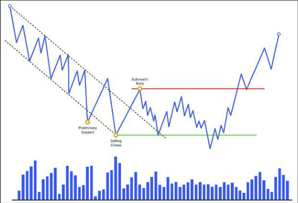

---

<!-- page_118 -->

WHY THE AUTOMATIC RALLY TAKES PLACE

During the downward trend the price will have moved down a considerable
distance and possibly reach a condition of overselling in the development of
the Selling Climax where the following actions take place:

Exhaustion of the offer. Aggressive sellers stop entering
the market

Coverage of shorts. Vendors who would have entered
higher close their positions

Appearance of the lawsuit. New buyers enter by
observing the climatic event

The market has reached uninteresting levels to continue selling, which
will lead to a lack of supply. The withdrawal of sellers, both those who stop
selling aggressively, as well as those who take profit from their shorts;
together with the emergence of new buyers, who may have entered with
reversal strategies to the average, will cause an easy push up prices.

The most normal thing is that buyers who have entered the Selling
Climax do not intend to maintain their positions, since it is probably Scalp
operations (short duration) and take profits during the Automatic Rally,
putting an end to its development.

---

<!-- page_119 -->

AUTOMATIC REACTION

The Automatic Reaction is a significant downward price movement that
appears as the first sign of selling interest. It is part of Phase A of the
previous trend and develops after the Preliminary Supply and Buying Climax.

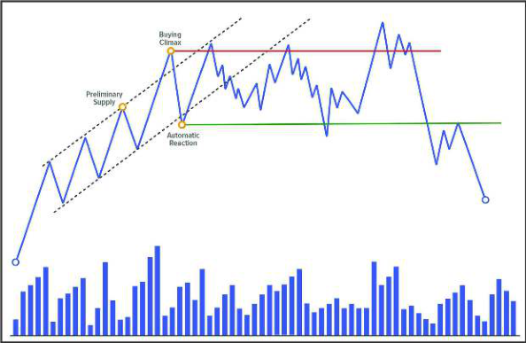

WHY AUTOMATIC REACTION OCCURS

The market will have moved upwards enough to produce a series of events
that together give rise to the development of Automatic Reaction:

Exhaustion of demand. There are no aggressive buyers

---

<!-- page_120 -->

willing to keep buying.

Length coverage. Buyers who would have entered below
close their positions by taking profits.

Appearance of the offer. New vendors enter by observing
the previous climatic event.

The previous market rally may have reached an overbought condition
causing a lack of demand. This withdrawal of buyers, both those who stop
buying aggressively, and those who take profit from their lengths; together
with the emergence of new sellers will cause an easy push down prices.

Sellers who have entered the Buying Climax are surely speculating
looking for a quick downward movement and will take profits during the
Automatic Reaction, putting an end to its development.

---

<!-- page_121 -->

CHAPTER 17 - EVENT #4: TEST

SECONDARY TEST

The Secondary Test is the fourth event within the accumulation schemes of
the Wyckoff methodology. Establishes the end of Phase A, stopping the
previous trend, and gives rise to the beginning of Phase B, construction of the
cause.

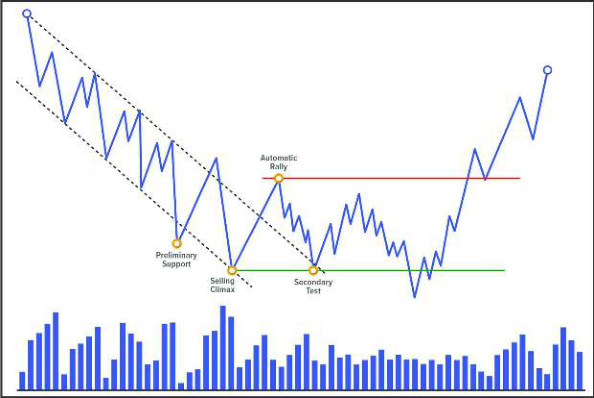

FUNCTIONS OF THE SECONDARY TEST

---

<!-- page_122 -->

As with every event, one of the important points of its identification is that it
identifies us with the context of the market; it gives us an indication of what
to expect from now on. In this case, we went from being in a context of a
downward trend to migrate to a context of lateralization in price.

This is very interesting since, as we know, the price behavior within
Phase B will be a continuous fluctuation up and down between the limits of
the structure.

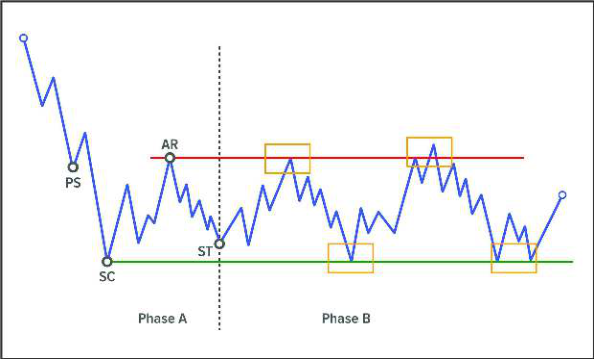

With this background context, the type of trading that we will be able
to develop here is to wait for the price at these extremes and look for a turn to
the opposite side. Either directly from the time frame in which we are
working with some configuration of candles, or reduce the time frame to look
for a smaller structure of rotation there (if we are in the upper zone, we will
look for a smaller structure of distribution, and if we are in the lower zone,
we will look for a smaller structure of accumulation).

In functional terms what the Secondary Test suggests to us is the
confirmation of abandonment by aggressive sellers who have been pushing
the price lower and lower during the development of the downward trend; to
evolve into a balance environment where buyers and sellers are comfortable
negotiating (building the cause for the subsequent effect).

---

<!-- page_123 -->

SECONDARY TEST FEATURES

For the Secondary Test to be successful, the bearish movement must be made
with a narrowing in the price ranges and a smaller volume than that seen in
the Selling Climax.

Although some authors defend the position that it is necessary for the
Secondary Test to be kept above the low established by the Selling Climax,
the truth is that it is a good moment to remember that the market is not a rigid
entity, but that it is in constant change due to its own nature and that therefore
it would be convenient to grant certain flexibility to the price movements.

With this in mind, we can attribute that a Secondary Test would be
seen with a neutral connotation when identifying which side (buyers and
sellers) have more control of the market. So, it would be a good way to
identify a certain imbalance on the part of buyers if the Secondary Test we
see is performed over the upper half of the range; and it would likewise
identify a certain imbalance in favor of sellers if the Secondary Test ends
slightly below the Selling Climax.

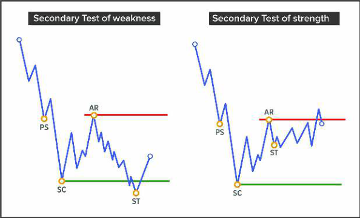

This characteristic, together with the rest of the elements that have
been commented on, as well as those that will follow, is an indication to take
into account when assessing whether we are dealing with accumulation or

---

<!-- page_124 -->

distributive structure. It is a question of putting the greater probability on our
side and therefore, the more of these signs in favor of a direction, the greater
strength our analysis will have.

The really important thing to look at is, in order of importance: the
decrease in volume and the narrowing of the ranges. As we know, volume
reflects activity and therefore, low activity after a climatic event denotes a
lack of interest in that side.

---

<!-- page_125 -->

THE SECONDARY TESTS OF PHASE B

Although the "official" Secondary Test is the one that appears in Phase A, it
is a type of behavior that we will continue to observe in different Phases of
the development of the structure.

Once Phase B has begun, we are going to be awaiting any type of test
on one of the two extremes of the range.

This type of test allows us to evaluate the strength and weakness of
buyers and sellers. Occasionally, tests will even be performed at both the top
and bottom ends of the structure.

Depending on the subsequent effect of the range (whether it is
accumulation or distribution), the tab pages are differentiated for the same
actions. As it is logical, until the price does not leave the range we cannot
know what was the real intention behind the cause that was being constructed
and therefore, in real time any labeling should be valid.

Beyond seeing the market in a conventional way, we will also think in
terms of functionality and differentiate price behaviors from two points of
view: as a concept (action) and as an event (depending on the location).

---

<!-- page_126 -->

SECONDARY TEST ON THE UPPER END

The price passes through the previous high created in the stop action but does
not move too far away before re-entering the range, leaving a slight Shake.

Initially it is a movement that denotes background strength as the
price has been able to penetrate the resistance zone of the range; and this
could not happen if there were no aggressive buyers present.

A subsequent evaluation will confirm whether it is really a strength
test in which stock has been absorbed (bought, accumulated) with the
intention of increasing; or whether it is a share on which it has been
distributed (sold) with the aim of bringing the price down.

This new high can be used to establish a new upper end on which to
look for effective bullish rupture (in Phase D) or bearish shaking of the
structure (in Phase C).

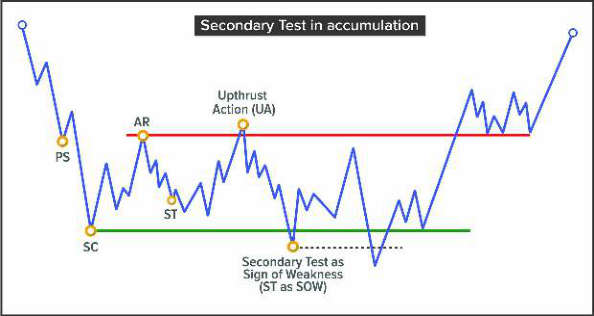

When the range is accumulation/reaccumulation, this event will be
labeled as Upthrust Action (UA); while if it is a distribution or redistribution

---

<!-- page_127 -->

structure we will label it as Upthrust (UT).

This is the only difference between these tags; if we believe with the
clues that we have until now that the probability is in accumulation range we
will label it as Upthrust Action; and if we believe that there is more
probability that it is being distributed we will label it as Upthrust.

When the UA occurs and the price remains above resistance for some
time before falling, this behavior can be labeled as minor Sign Of Strength
(mSOS). It would be a kind of test that denotes greater strength.

SECONDARY TEST ON THE LOWER END

It's a test that produces a lower low. It is due either to the aggressiveness of
the sellers or a lack of interest of the buyers, which suggests that it is likely
new tests to that area in the future.

This type of test denotes a lot of fundamental weakness. Well-
informed traders know that the price is overvalued and they have an urgency
to sell. Hence the extreme weakness.

From this new low we can draw another level of support on which to
wait for the effective bearish break or the final shake before the upward trend
movement.

If we are dealing with an accumulation structure, we will label this
event as Secondary Test as Sign of Weakness (ST as SOW). There is
generally a better chance that this event will occur when the Secondary Test
of Phase A has produced a lower low. There is an extreme weakness in the
market and this area will need to be tested in the future.

When the range is distribution or redistribution we label this event as

---

<!-- page_128 -->

minor Sign Of Weakness (mSOW). One indication that we may be facing a
mSOW is whether the Secondary Test of Phase A is a poor bullish
movement, with very little path (lack of buyer interest).

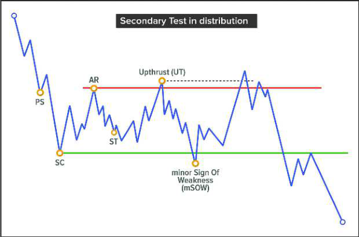

As we say, we can only know which labeling is correct once the range
has been confirmed in one direction or the other. Therefore, in order not to
complicate it more than necessary, a simple solution could be to label such
events as Secondary Test in Phase B (ST in B), a label that you will also
find in some analysis of the methodology.

---

<!-- page_129 -->

THE GENERIC TEST

A test, by definition, is an attempt, evaluation or examination of something.
In the case of Volume Spread Analysis (VSA), it is a test to confirm who has
control of the market.

If professional traders have higher interests, they will want to make
sure that the bid has been eliminated or absorbed before starting the upward
movement. Conversely, if they foresee lower prices, they will do their best to
confirm that there are no buyers willing to complicate their downward
movement.

As the market enters an area where previously there was a high
volume two things can happen:

That the volume is now low, which clearly indicates lack of
interest and suggests that the market is now prepared for a trend
movement in favor of less resistance. Valid test.

That the volume is still high (relatively), which would
indicate that there are still traders willing to keep pushing the price.
Test not valid. The optimum here would be to wait either for
repeated tests to appear until it can be confirmed that there is no
stock left available; or that the market continues in favor of its last
movement.

Due to the above, tests can be a great time to enter the market,
because if the test is valid, we will be "betting" in favor of the force that
presses more and that in theory has greater control of the market.

---

<!-- page_130 -->

WHERE TO LOOK FOR TESTS

Due to its generic nature, it is an action that can be useful to make trading and
investment decisions in different market contexts, being the most
recommendable:

TEST AFTER SHOCK

Known as the Spring test or the Upthrust test, it takes place during Phase C of
the test, prior to the rupture of the structure.

This is the moment in the market when we can have the best
risk/benefit ratio; since if the test is genuine, we will be very close to the end
of the structure (where the Stop Loss order should be placed) and the route to
the Creek could be quite wide (to take as first Take Profit or management).

TEST AFTER BREAKOUT

It takes place during Phase D, where the price has started the trend movement
within the range and this is a critical moment as what is being evaluated is
whether the Creek break will be valid or whether it will be a shake.

The risk/benefit ratio is not as generous as the one we may have in the
test after shock, but even so we may have a great opportunity because if we
are right in the analysis, the price will develop the effect of all the cause that

---

<!-- page_131 -->

has been built during the development of the range.

An example of Stop Loss location in this case could be to place it in
the middle part of the structure, assuming that if the price reaches that level,
more than an effective break we could be before a shake.

At the Take Profit level, you can use technical tools such as Fibonacci
projections, a simple 1:1 projection of the total distance of the structure; or
better yet, place it in some area where there is expected to be liquidity
waiting.

TREND TEST

It should be noted that the price is in Phase E of the structure where the
market begins to move directionally out of range.

If the trend is very fast, it will sometimes take time to stop at least
temporarily to develop a new structure in favor of that trend. For such cases
of speed, we can seek to develop this action, which will give us an
opportunity to join the movement.

If the technical objectives of the structure have already been covered,
I would particularly would postpone the entry. In the case of Stop Loss, I
would expect the development of a Shake + test out of range to place the
order at its end. For the Take Profit, the best thing to do is to keep looking for
areas of liquidity as we know that it is very likely that the price will go in
your search.

---

<!-- page_132 -->

HOW THE TEST APPEARS ON THE GRAPH

In Volume Spread Analysis these types of candles are known as No Demand
and No Supply.

The test is considered valid when the candle has a volume lower than
that of the two previous sails, denoting as we say that lack of interest in that
direction.

When we are faced with an environment of possible background
strength (such as a Spring, a Creek bullish break or an uptrend) we will look
for the test, in addition to showing a smaller volume than that of the previous
two candles, to be produced on a bearish (No Supply) candle. The smaller the
range of the candle, the better.

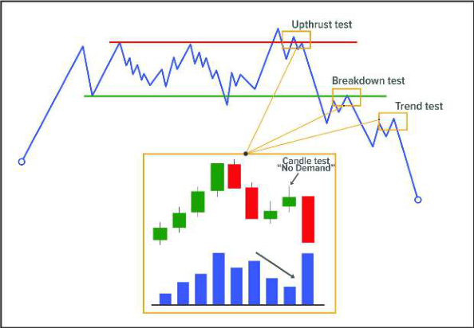

On the contrary, when our analysis tells us that we are possibly facing
a weak market environment (such as an Upthrust, a bearish break in the
Creek or in the middle of a bearish trend), we will look for the test to take
place on a narrow range bull candle (No Demand).

---

<!-- page_133 -->

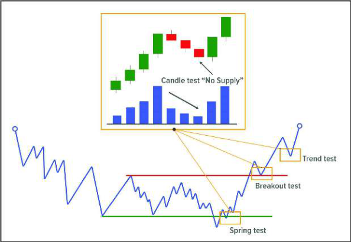

THE DIFFERENCE BETWEEN THE SECONDARY
TEST AND THE GENERIC TEST

Conceptually it is the same action: movement that develops to evaluate the
commitment of traders in one direction and that must necessarily appear with
a decrease in the price ranges and volume to take it as valid.

The only difference is that the Secondary Test is a specific event of
the Wyckoff methodology, with the connotations at a structural level already
commented; and the generic test is a global event, well known in the VSA
methodology (Volume Spread Analysis) that focuses primarily on the action
itself and what its result suggests to us.

---

<!-- page_134 -->

CHAPTER 18 - EVENT #5: SHAKING

Shaking is the key event all Wyckoff traders are waiting for. There is no
other event that adds greater strength to the analysis and this makes it, from
my point of view, the most important event that can occur in the financial
markets.

After a period in which large traders will have built up a large part of
the position they want, they use this behaviour as a turning point when it
comes to creating the trend movement that will take the price out of range.

In order for us to be waiting to see a potential shake, two actions must
have occurred previously:

The stop of the previous trend movement, whether with
climatic volume or not.

The construction of a significant cause. This is the
development of Phase B, in which we deduce that the professional
has been absorbing stock.

---

<!-- page_135 -->

ZERO-SUM GAME

As we know, due to the functioning of the financial markets based on the law
of supply and demand, in order for an order to be executed, it must be paired
with another order whose intention is the opposite. This means that for a sale
(bid) transaction to be executed, it must be matched with a purchase (ask)
transaction and vice versa.

This is very important to know since in the event we are dealing with,
as in the other two cheating events (Preliminary Stop and Climax) all orders
whose origin comes from ill-informed traders or weak hands are being
absorbed by well-informed traders or strong hands.

The critical factor when analyzing this event is to determine the
aggressiveness with which the key zone is being broken and how the market
reacts immediately afterwards to this action.

BEHAVIOR

The action is simple: it is a movement of rupture of a previous liquidity area
(areas where there will be located a large number of pending orders of
execution) that initially denotes intentionality towards the direction of the
rupture but that in reality is a new deception.

---

<!-- page_136 -->

What will happen is a false break where the big traders will assume all
those pending orders in order to start the trend movement they expect.

This is the way financial markets move: by the search for liquidity. If
large traders were not able to find the counterparty they need to match their
orders, the market would be impossible to move. Therefore, they need to
create the feeling that this is a genuine break movement in order to attract
more traders and absorb all those orders.

If we take any graph, independently of the market or temporality, we
will see that for any significant trend movement, a Shake has previously
developed. It's necessary. That crossing of orders is the gasoline they need to
get around.

Understanding this will elevate your trading some levels because you
will begin to be more aware of this possibility and over time you will learn to
profit from its behavior.

---

<!-- page_137 -->

HOW THE SPRING APPEARS ON THE GRAPH

Normally, shaking will come in different forms:

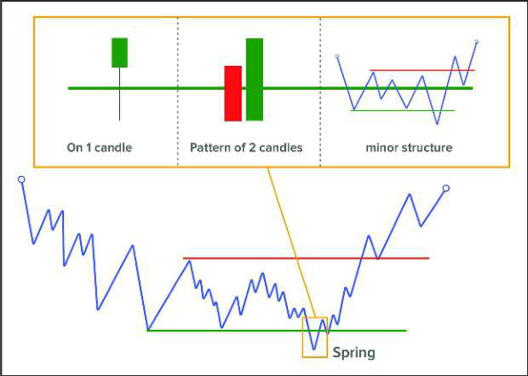

ON 1 CANDLE

This is the commonly known hammer sail. It is a candle that penetrates the
zone of liquidity and that returns practically the totality of the movement
inside that same candle, leaving a significant tail in its end.

These tails what denotes is a rejection of prices to keep moving in that

---

<!-- page_138 -->

direction. Aggressiveness has been found on the part of the traders that were
waiting in the opposite direction to the breakout and these have managed to
capture at least temporarily with the control of the market.

PATTERN OF 2 OR MORE CANDLES

The background of the action is exactly the same as for the example of a
candle. The only difference is that on this possibility the behavior develops
over a greater temporal space.

The fact that the price takes longer before reversing and recovering
the previously established breakout zone is a sign of less strength for the
shock. In other words, the less time the turn takes place, the greater the
strength will denote the shock.

MINOR STRUCTURE

In this possibility the price is kept for a longer period of time in position of
potential shake.

The control of the market is not very defined and that is why a smaller
structure is required which will eventually act as a function of the Shake of
the larger structure. This is a clear example of the importance of context.

In potential Spring position we are looking for a smaller
accumulation structure that will generate the bullish turn.

---

<!-- page_139 -->

In potential position Uptrust After Distribution we are
looking for a smaller distribution structure that will generate the
bearish turn.

SHAKING FUNCTIONS

This movement initiated by the big traders has several functions:

EXPEL RUPTURE TRADERS FROM THE MARKET

Previously we presented them as greedy. They are those traders who see the
price make a new extreme and thinking that it is a break that will have
continuity, enter the market by adding more pressure to prices.

It is important to note that it is not only manual traders who, guided
by their emotions, will enter the market. An innumerable number of
automatic strategies programmed to trade breakout systems will generate
input signals at these levels.

These robots may activate other momentum strategies, which will add
even more pressure to the movement, which is why these types of shocks are
often identified with a considerable increase in volume. It is an important
trading area for many strategies and will therefore lead to the crossing of a
large number of orders.

---

<!-- page_140 -->

EXPELLING THE FEARFUL FROM THE MARKET

This group has been holding losing positions for a long period of time and its
limit is very close. After seeing the price move again against them and for
fear of further increasing the loss, they finally decide to abandon their
position.

KICK THE SMART ONES OUT OF THE MARKET

Generally they tend to have a good market reading and have correctly
anticipated the price turn, but have rushed into entry. They may have already
sold on the climatic event or on some minor Spring within the range.

This new unexpected final shock for them makes them abandon their
position by executing their protection stops.

SUCCEEDING WITH THE MANEUVER

The professionals who unbalance the market and cause the breakout
movement, take advantage of the displacement caused by the rupture trading
and close their positions obtaining a profit with the difference.

---

<!-- page_141 -->

INDICATIONS TO KNOW IF WE ARE FACING A POTENTIAL

SHAKEOUT

The two elements to observe in order to try to determine a greater probability
that we are facing a shock instead of an effective break are the following:

THE TYPE OF ST THAT HAPPENS IN PHASE B

If we have previously identified a Secondary Test in the form of Upthrust
Action (UA), this denotes greater strength to the buyers and therefore in zone
of low breakout of the structure we favor the Spring instead of the bearish
breakout.

If what has left the price is a Secondary Test in the form of Sign of
Weakness (mSOW), denotes strength of the sellers and in the high of the
structure we favor that happens the Upthrust instead of the effective bullish
rupture.

PRICE BEHAVIOR AFTER BREAKOUT

If after the breakout of the lower part of the structure the price fails to stay
below and re-enters the range again, it denotes strong purchase entry and
adds greater probability that the breakout is false and that a Spring is
therefore developing.

---

<!-- page_142 -->

If after the break in resistance the price fails to stay above the level, it
denotes weakness and adds a greater probability that the break is false and
therefore an upthrust will develop.

AVOID LABELING ERRORS

It is important to clarify that the Shake can only be labeled as Spring or
Upthrust After Distribution when it originates the rupture movement of the
structure.

Spring must necessarily cause the range to break up. Anything other
than this should not be labeled as Spring. It will simply be a test.

The same goes for the Upthrust After Distribution. Anything other
than this bullish shake causing the subsequent bearish break of the structure
should not be labeled UTAD. A UTAD is the shaking event of the highs of
the structure but it should also cause the bearish break and the beginning of
the trend movement out of range.

I repeat, to be faithful to the methodology, anything other than that
would be badly labeled.

---

<!-- page_143 -->

SPRING/SHAKEOUT

The term Spring is an abbreviation of the word "Springboard".

This concept was presented by Robert G. Evans, an outstanding
student of Richard D. Wyckoff and is a refinement of the original concept
developed by Wyckoff, which is known as Terminal Shakeout. Wyckoff
referred to this term as a position that reaches the market during the
development of an accumulation range in which the price is in a position to
leave it to initiate an upward movement.

We recall that an accumulation range is a Phase of the market cycle
(which is composed of the accumulation, uptrend, distribution and downtrend
Phases) in which large market traders perceive value in the price (they find it
undervalued) and carry out a buying process with the intention of selling at
higher prices and making a profit from the difference.

The Spring event describes a bearish movement that breaks a previous
support area and whose purpose is to carry out a transfer of shares from the
weak hands (traders potentially manipulable due to their ignorance of the
functioning of the market and because they trade based on their emotions) to
the strong hands (large traders).

---

<!-- page_144 -->

TYPES OF SPRING

At the moment of the breakout of the support, we must remain very attentive
and carefully observe the behavior of the price and volume. If we are already
within a buy position, depending on how the price drops we will decide
whether to stay within the trade or exit immediately. If you see a strong
rebound from the level with a slight increase in volume, it indicates that the
value is developing technical strength.

Three types are differentiated on the basis of the degree of supply
observed at the time of breakout:

SPRING #1 OR TERMINAL SHAKEOUT

---

<!-- page_145 -->

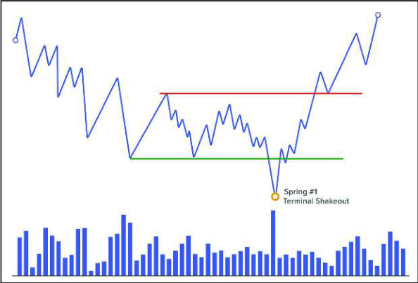

The offer appears strongly (great seller interest). This is evidenced by a
sudden increase in volume and an expansion of price ranges that produce a
large penetration of the support line.

In essence, Spring and Terminal Shakeout are all about the same
action: a bearish move that breaks through a previous support area. But there
are differences between them, and these can be found in the intensity
(volume) and scope of their development; while Spring is used to define
shorter movements with a light or moderate volume; Terminal Shakeout is
used to define movements with a much deeper penetration and with a high
volume.

The offer is in control of the situation. There is extreme weakness and
the price falls. For this type of Spring to be successful, there must be a strong
inflow of demand that drives the price back up with wide price ranges and a
relatively high volume.

A first indication that demand may be entering is if after penetration,
the volume remains high but price ranges begin to decrease.

If demand does not appear, the price will continue to fall and you will
have to build a new accumulation area before a substantial upward movement
can take place.

---

<!-- page_146 -->

SPRING #2

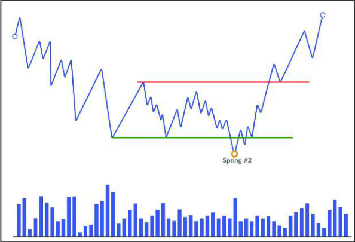

Moderate penetration is observed as the price breaks down with an increase
in both volume and price ranges.

There is a floating offer (traders willing to sell), but it is not as
overwhelming as in Spring #1. That latent offer will have to be absorbed by
the professionals in case they want to make rise to the price, reason why the
most probable thing is that we will see successive tests to this zone.

---

<!-- page_147 -->

SPRING #3

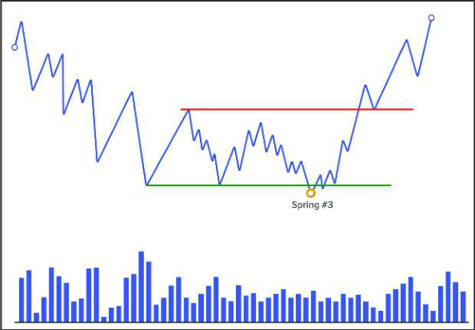

There is an exhaustion of the offer (lack of aggressive sellers). This is
evidenced by a slight reach in the break, with a decrease in volume and a
narrowing of price ranges; suggesting a total lack of interest on the downside.

This is a very powerful Spring on which you can directly take
purchase positions.

We can also find a last variant in which the event takes place within
the limits of the range. This event denotes greater background strength,
although professionals prefer the Shake to occur beyond the range because it
does a better job of cleaning up the remaining supply of weak hands.

Spring action is an important sign of strength since failure to break
provides us with a greater degree of confidence when it comes to taking
action at a later date.

---

<!-- page_148 -->

THE ORDINARY SHAKEOUT

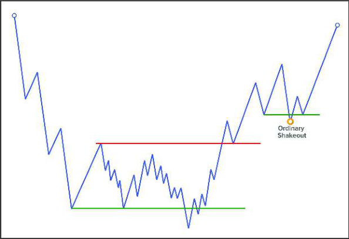

Spring and Terminal Shakeout are two similar events which occur during the
development of an accumulation range. But there is another variant; the
Ordinary Shakeout, which is defined as a strong bearish push without
extensive prior preparation that occurs during the development of an uptrend
(reaccumulation). This is the main difference: the location.

The Ordinary Shakeout is characterized by wide price ranges and an
increase in volume. However, the volume can be high, medium or low.

---

<!-- page_149 -->

THE SPRING TEST

With the exception of Spring #3, in the other variants it is necessary for the
event to be tested since the present offer has been observed and the positive
result is not guaranteed.

Be very cautious if the testing process has not taken place as it may
take place at a future time. For the test to be successful, it should be
developed with a narrowing of the ranges, a decrease in volume and should
be kept above the level of the Spring/Shakeout. All this would indicate an
exhaustion of the offer and suggests that the price is ready to initiate the
bullish movement with relative ease, representing a good buy signal.

If the test does not meet these characteristics, it is considered to be a
poor quality test and suggests further testing at a later date as a Spring with
significant volume needs to be successfully tested before upward movement
can begin.

We must train ourselves to anticipate the possible outcome of the
event and be prepared to take action on our behalf quickly and decisively.

---

<!-- page_150 -->

UPTHRUST AFTER DISTRIBUTION

An Upthrust After Distribution is the bullish shock that occurs as a Phase C
test event within the distribution and redistribution ranges.

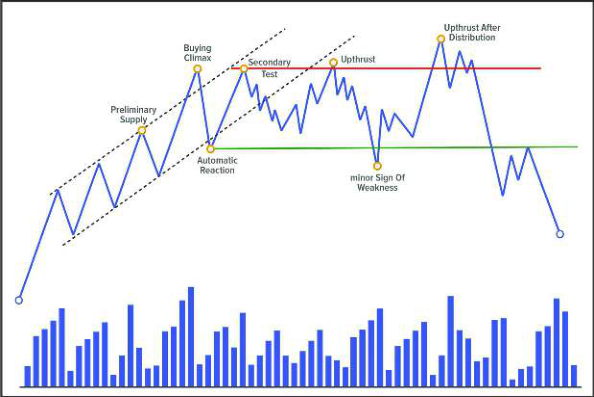

This is an upward movement whose aim is to go test the ability of
buyers to take prices higher to reach a key area, such as the break of previous
highs.

Theoretically it is an Upthrust (UT), but when it happens in Phase C,
it is called UTAD regardless of whether there were previous Upthrusts in
Phase B because a previous distribution process has already taken place.

In this action the volume that will be observed will be moderate or
strong, evidencing the quantity of orders that will be crossing in this key
zone.

---

<!-- page_151 -->

THE MINOR UPTHRUST AFTER DISTRIBUTION

As with the minor Spring, it is a bullish shake that occurs within the
structure.

This Shake will reach some previous highs and although the ideal is to
wait for the trap to occur at the total limits of the structure, in reality this type
of minor Shake denotes greater control on the part of the sellers as they have
not allowed the price to rise further and have appeared aggressively selling
on those previous highs.

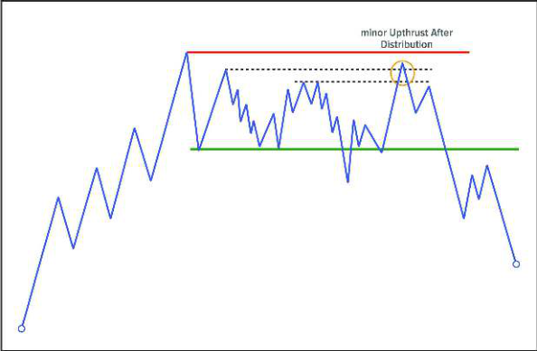

Although it is true that the UTAD is only the shaking event of the
highs of the structure, it is more interesting to think in functional terms and
although this movement has not reached these total highs, it is still a shaking
at local highs. This is why I consider it interesting to label this event as a
minor UTAD as well, although the methodology may simply treat it as a Last
Point of Supply (LPSY).

---

<!-- page_152 -->

THE UPTHRUST AFTER DISTRIBUTION TEST

Although it can happen, a Secondary Test does not always appear after the
UTAD. This is due to the large amount of supply entering the market, which
causes the immediate bearish movement in the form of Sign of Weakness.

As with the Spring, it is generally better for the test to take place. The
fact that the test does not appear may mean the loss of an opportunity, but
waiting for it to happen will help you avoid taking a possible bad short
position on an action that is actually a genuine bullish break (JAC/MSOS).

If there is a test, it should show less enthusiasm than the one seen
about UTAD. This is generally reflected by a halt in movement below the
UTAD level and a reduction in price and volume ranges, which indicates an
exhaustion of buyers and confirms the distribution scenario. On the ceiling of
this rise one can take sales positions.

If the test does not fall below the level that establishes the high of the
UTAD or the volume is higher, you should doubt the shock even if the price
is making lower highs. The most sensible thing is to wait for some additional
signal before selling (new shocks and successive successful tests).

---

<!-- page_153 -->

TERMINAL UPTHRUST

It resembles Terminal Shakeout. It has the same features as a normal
Upthrust but the scope of action is usually more severe. The volume may be
extremely high or the penetration unusually large. Even so, the result is the
same. In a short period of time the price re-enters the range, indicating strong
downward pressure.

ORDINARY UPTHRUST

Like the Ordinary Shakeout, it is a shakeout with little preparation during the
development of the downward trend movement.

It is a very interesting opportunity to go into short since we would be
trading in favor of the last distribution.

---

<!-- page_154 -->

CHAPTER 19 - EVENT #6: BREAKOUT

After the Phase C test event (shock or LPS), the price will develop a trend
movement in the direction of the least resistance.

The great professionals have already absorbed all the stock they need
for their positions and have verified (through the Shake and the test) that they
will not find much resistance in the subsequent advance of the price in their
favor.

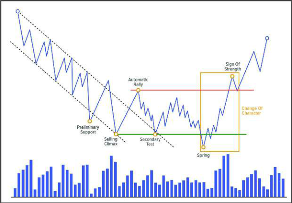

The market is in imbalance and this provokes a strong movement that
breaks the structure initiating the development of the cause that has been
constructed previously.

This breakout movement itself is not an opportunity to trade; it only
alerts us to a possible opportunity in the very near future. This opportunity is
found in the immediate action, in the confirmation test.

---

<!-- page_155 -->

CHANGE OF CHARACTER

This is the second Change of Character (ChoCh) in the structure. We recall
that the first occurs with Reaction Event #2, in which the market moves from
a trend state to a range context.

In this occasion, this new ChoCh changes the context of the market
putting an end to the lateralization of the price and giving beginning to a new
trending Phase.

ChoCh is not only a strong movement; it is composed of two events: a
strong movement and a slight retreat. This set forms the ChoCh. The change
of character is identified from the origin of Phase C until the end of Phase D.

HOW IT APPEARS ON THE GRAPH

We find ourselves in an environment of speed and this causes that movement
to develop by means of candles in which a relative increase is observed in the
ranges of the price as well as an increase in the volume.

This movement will fluidly break previous levels of liquidity denoting
strong momentum. It is the representation of the market imbalance and the
aggressiveness shown by traders.

---

<!-- page_156 -->

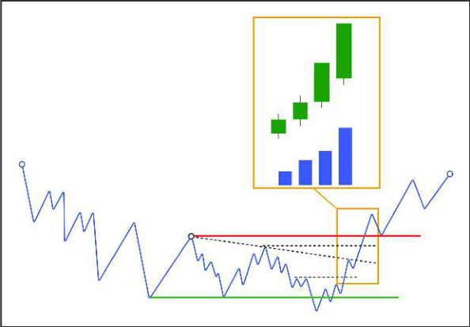

THE BREAKOUT WITHOUT VOLUME

Generally, ruptures should occur with increasing volume, although it is true
that sometimes we could see such stocks without a particularly high volume
increase. This suggests that the stock that remains available is essentially low
and that therefore the traders in control will not need to make any special
effort to easily displace the price.

---

<!-- page_157 -->

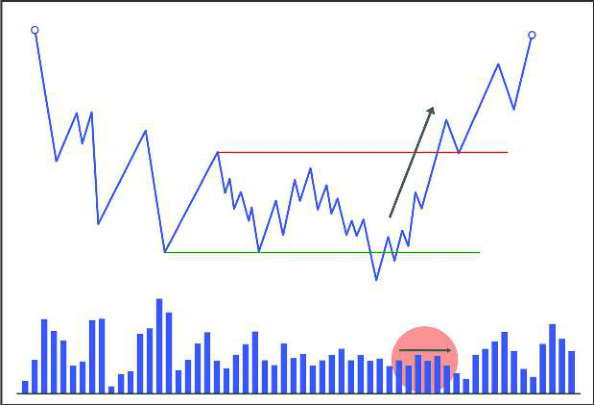

For the example of bullish breakout, if we see that it occurs with
narrow range candles and a volume in the middle, in principle we should be
wary of its intentionality; but what may happen is that there is very little
floating supply, that is, there are very few traders willing to sell. So the
absence of sellers coupled with moderate aggressiveness on the part of buyers
can lead to such an upward rupture without relatively high volume.

KEYS TO THE BREAKOUT EVENT

It is a key moment since we could be facing a potential shaking event, so it is
essential to make a judicious evaluation of the price action and the volume
after the break. To do this, we can help ourselves with some clues:

NOT IMMEDIATELY RE-ENTERING IN THE TRADING RANGE

---

<!-- page_158 -->

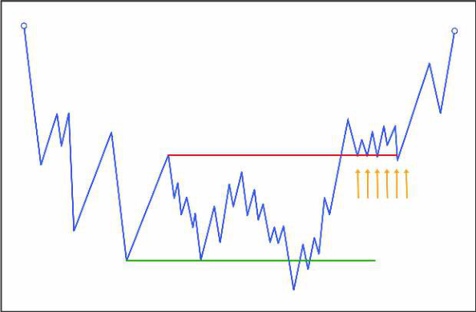

It's the most reliable sign of intentionality. We are going to look for an
effective rupture that manages to stay out of range and fails in its attempts to
re-enter the balance zone.

In addition to observing that the movement is accompanied by an
increase in price and volume ranges; and that it breaks previous control zones
(previous highs and lows and minor Creek), the most powerful indication for
valuing breakout as genuine is that the price manages to stay out of the range.

It denotes that there is no longer interest at lower prices and confirms
that the movement is being supported by the big traders.

REPRESENTATION OF LACK OF INTEREST

---

<!-- page_159 -->

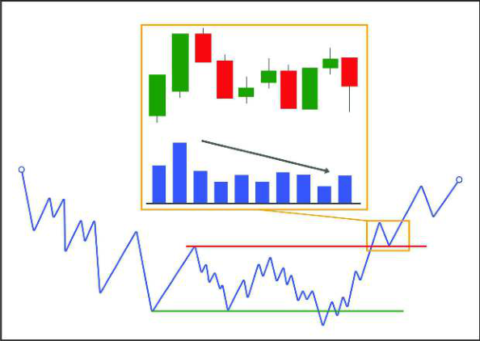

Another indication that would add strength to effective rupture would be to
subsequently observe unintentional candles: narrow range, intertwined and
with a volume smaller than that seen on the rupture movement.

DISTANCE OF THE RUPTURE

On the other hand, the distance covered by the price could be another
indication to consider. Although there is no predefined distance, the distance
should be obvious. In other words, the breakout that manages to move quite a
few points away from the structure gives us greater confidence.

BREAKOUT DOES NOT OFFER AN OPPORTUNITY

---

<!-- page_160 -->

In operational terms, this action does not represent an operational
opportunity. This is mainly because it is in a delicate area where a huge
amount of cross orders will be taking place and it could change the control of
the market.

What at first appears to be an effective break could turn into a Shake.
And this is why it is more convenient to wait for the subsequent test with
which to confirm the action definitively.

Even so, it is obviously not guaranteed that the operation will be
successful. The market is an environment of constant uncertainty and is
totally out of our control. As discretionary traders, all we can do is add signs
that favor control on one side or the other to try to position ourselves. In the
end it is a question of probabilities.

---

<!-- page_161 -->

SIGN OF STRENGTH

The Sign of Strength (SOS) is an upward movement that originates in the low
of Phase C (Spring or LPS) and ends up producing the break of the high part
of the range (Creek).

All this generates the change of character prior to the start of the
upward movement outside the range. It is followed by a retreat to the broken
Creek to generate the BackUp to the Edge of the Creek (BUEC) action. If it
fails to stay above that zone and re-enters the range, the event would be an
Upthrust (UT).

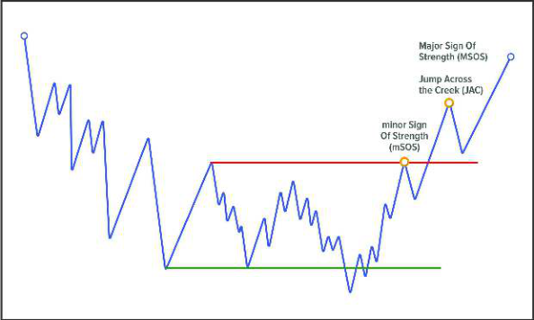

A great show of strength what denotes is an urgency of the institutions
to enter. They are very bullish and buy aggressively.

To appreciate that we can really be before an SOS we want to see that
the bullish movement has ease of movement and that it reaches the midpoint
of the range. In addition, any regression now should remain above the low of

---

<!-- page_162 -->

the Spring to show strength.

MINOR SOS

In the event that the upward movement fails to break the structure, this
movement would be labeled as minor Sign Of Strength (mSOS).

If during Phase B we observe a movement with SOS characteristics,
we could also label this event as minor SOS.

SIGN OF STRENGTH BAR

This is a bullish bar with a wide range, closing at highs and increasing
volume, although it could also be a bullish gap.

It indicates the presence of strong demand for quality. It is the
institutional buying point.

It could be used as an entry trigger. If in the trading area (after a
shake, after a break and in trend) we observe a strength bar (SOS Bar), it is
the definitive sign that the great professionals are supporting the upward
movement and it provides us with a good opportunity to join in long.

---

<!-- page_163 -->

---

<!-- page_164 -->

SIGN OF WEAKNESS

The Major Sign of Weakness (MSOW) is a strong bearish movement whose
origin is in the high of Phase C (UTAD or LPSY) and causes the break of the
lower part of the range (ICE) to start a new bearish trend.

It could be a second, third or fourth attempt to break the ICE and this
is the most successful.

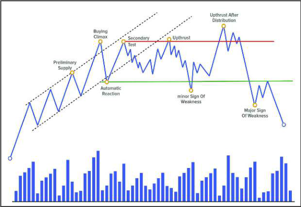

To assess the presence of the SOW we want to see that the bearish
movement moves easily, covering a relatively long distance and that at least
reaches half of the structure. In addition to this, any regression should not
reach the high set by the UTAD.

---

<!-- page_165 -->

MINOR SOW

If after the test event in Phase C this movement of weakness is not able to
break the structure, we would label it as minor Sign of Weakness (mSOW).
This is a sign of minor weakness.

We could also label as such any movement that during the
development of Phase B meets these characteristics in price and volume.

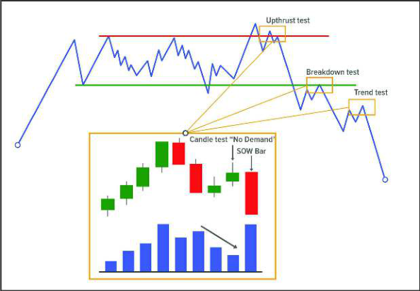

---

<!-- page_166 -->

SIGN OF WEAKNESS BAR

Visually it is seen as a bearish bar with a relative increase in price and
volume ranges and its closing at lows in the candle range, although it could
also be identified by a bearish gap.

It signals the aggressiveness of the sellers and is therefore a
professional point of sale.

The main use we can give it is as an entry trigger for sales operations.
If in the operative zone (after a shake, after a break and in trend) we observe
a bar of weakness (SOW Bar), it is the definitive signal that the great
professionals are supporting the movement downwards and it provides us
with a good opportunity to sell short.

---

<!-- page_167 -->

CHAPTER 20 - EVENT 7: CONFIRMATION

When the breakout event appears, it is only "potential" since the confirmation
comes from your test. As with Shakes, signs of Strength or Sign Of
Weakness need to be tested.

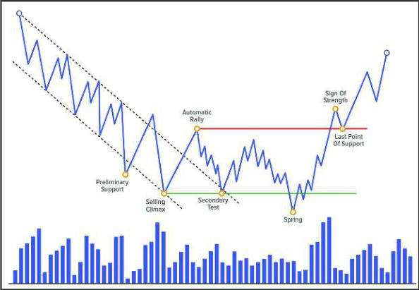

If we have a successful test, we are now in a position to label the
previous move with greater confidence and the latter, your test, is the
confirmation event. In other words, the test will confirm whether or not we
are facing a true intentionality movement.

In terms of methodology, just as the upward rupture movement is
labeled as Sign of Strength (SOS) or Jump Across the Creek (JAC), the
reverse movement confirming the rupture is labeled as Last Point of Support
(LPS) or Back Up to the Edge of the Creek (BUEC).

For the bearish example the break as we know it causes a sign of

---

<!-- page_168 -->

weakness (Sign of Weakness - SOW) and the backward movement that
would confirm it is labeled as Last Point of Supply (LPSY) or Fall Through
the Ice (FTI), although the latter term is less well known. We remember that
the Ice is the support zone in the structures and this term comes from an
analogy similar to the Creek.

But how can we know if we can wait for the confirmation event?
Obviously we can't know. It's about adding clues that make it more likely that
a scenario will occur rather than the opposite one. In this case, to wait for the
confirmation test we first want to see that the price makes an impulsive
movement, evidenced by an expansion in the price ranges and an increase in
the volume traded. At this point our main scenario should be to wait for a
reversal movement to look for a trading opportunity.

HOW THE CONFIRMATION APPEARS ON THE GRAPH

As we have already mentioned, this is the most delicate moment because it is
a question of examining whether we are facing a potential event of rupture or
shaking.

It is recommended to go back to the section of the previous chapter
where the keys of the breakout event are commented. In this action of
confirmation we seek to make exactly what is exposed there happen:

That the market travels a significant distance in the
breakout movement.

Let the test movement be done with narrow range,
interlaced and low volume candles.

That the price does not re-enter the range.

---

<!-- page_169 -->

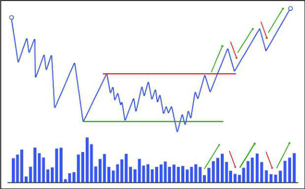

As we have seen, the breakthrough movement will give us greater
confidence if it is accompanied by an increase in price ranges and volume;
likewise, we want to see that the reverse movement that will test the broken
structure is accompanied by a decrease in price ranges and volume in
comparative terms.

This is the natural action for all movements that make up a trend:
impulsive movements that show intentionality and corrective movements that
denote lack of interest.

WARNING SIGNAL AFTER BREAKOUT

If there is a relatively high volume on the confirmation test, it is best to
proceed with caution as this volume indicates that there is latent interest in
that direction.

And as we know, the large trader will not initiate the expected move
until he has made sure that the road is free of resistance. Therefore, we should
wait for successive tests to be developed over the zone.

---

<!-- page_170 -->

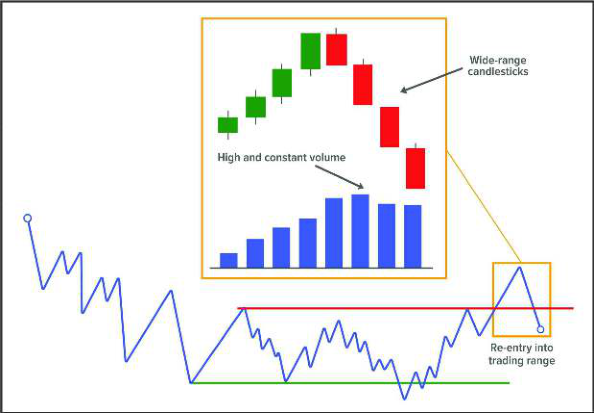

A corrective move with wide price ranges and high volume cancels
out the likelihood that the first move will be a break and most likely at this
point the price will re-enter the range leaving the potential break finally as a
shaking.

OPERATIONAL OPPORTUNITY

This confirmation event appears in an ideal location to enter the market or to
add to an open position.

Originally this was the preferred position for Richard Wyckoff to
enter the market because in our favor we have identified all the price action
on our left where we can see the effort of professionals to carry out an
accumulation or distribution campaign and therefore offers us an opportunity
with a relatively lower risk.

---

<!-- page_171 -->

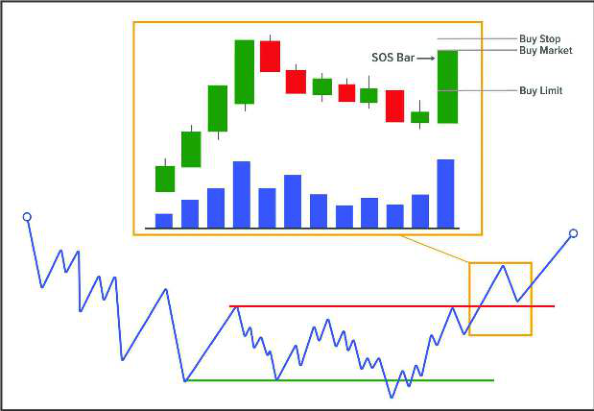

To buy, a good option would be to wait for a fortress candle (SOSbar)
to appear and place a market entry order, or a stop order at the break of the
candle, or even a limited buy order at a certain level waiting for the price to
fall back to it. Place or move the stop loss of the entire position under the
Last Point of Support and the broken Creek.

To sell, wait for a good weakness candle (SOWbar) to appear and
enter the market using the order that best suits your personality as a trader.
Place or move the stop loss over the Last Point of Supply and the broken Ice
line.

QUANTIFY THE ENTRY TRIGGER

Unfortunately, all discretionary approaches by their very nature have a great
disadvantage due to the subjectivity required when carrying out analyses and
presenting scenarios.

This subjectivity is the reason why methods with a real underlying

---

<!-- page_172 -->

logic such as the Wyckoff methodology may not be winners in the hands of
all traders.

As you may have read somewhere else, human participation in a
trading strategy is considered to be the weakest link, and this is obviously due
to the emotional section that governs us.

To mitigate this, many recommend trying to objectify our trading
strategy as much as possible. But this is not a simple task, much less for
Wyckoff traders. There are so many elements to bear in mind when
considering scenarios that it would seem impossible to create a strategy with
100% objective rules that always operates in the same way.

One solution that is in our hands is to try to quantify the trigger that
we will use to enter the market. It is undoubtedly a simple measure that can
help us to incorporate some objectivity into our strategy.

If you are only trading using bars or candles, you may want to
quantify what happens when a certain price pattern appears. For example, to
buy, we could quantify a simple price turn composed of a bearish candlestick
followed by a bullish candlestick. And from there we can complicate it as
much as we want. We can add other variables such as that some moving
average is below, that the second bullish candle is higher than a number of
pips, that a stop purchase order is used at the break of the candle and so on.

If you are also trading using volume based tools, you may want to add
other variables such as the price being above the POC (Point of Control),
VAH (Value Area High), VAL (Value Area Low) or VWAP (Volume
Weighted Average Price); or that the bull candle is also accompanied by a
significant increase in the Delta (Difference between Bid and Ask).

---

<!-- page_173 -->

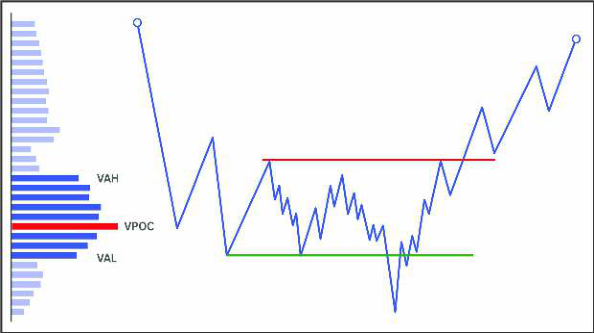

The options are endless, from the simplest to the most complex; the
only limit is our creativity. But this is hard work because if you don't know
how to do it through code (programming a robot), you will have to do it by
hand and this will require a lot of time. In addition, when doing a Backtest
you have to take into account other aspects such as data quality, expenses in
commissions (spreads, commission, swap), latency problems (slippage), as
well as other points concerning the optimization of strategies.

LAST POINT OF SUPPORT

The Last Point of Support (LPS) is the immediate action that precedes a Sign
of Strength (SOS). It is an attempt by sellers to push the price lower but fails
when buyers aggressively appear, giving rise to a new bullish momentum.

---

<!-- page_174 -->

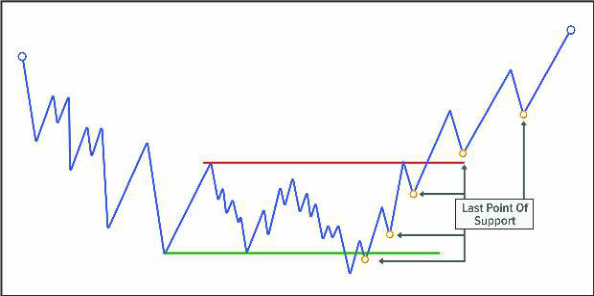

Based on the movement that precedes the Last Point of Support, we
can find different types:

Last Point of Support after shaking. In case the price comes
from developing a Spring/Shakeout, the Last Point of Support
would be the test of those two events.

Last Point of Support within the range. If the price comes
from developing a Sign of Strength, the Last Point of Support will
appear in the bearish reversal.

Last Point of Support out of range. Here we have on the
one hand the test movement after the break (the confirmation
event, the Back Up to the Edge of the Creek); and on the other
hand all the setbacks we found during the uptrend Phase out of
range.

As we know that the market moves by waves; after the bullish
impulse (Sign of Strength) we expect a bearish retrocession (Last Point of
Support). This retracement is the last point of support for demand. It is a
price point where buyers appear to stop the fall, generating a higher low. This
higher low is a previous stop before starting with a new upward impulsive
movement.

Many traders guided by their lack of understanding will be buying
during the development of the strength signal (SOS). But this action is not
correct, it is best to wait for the next reaction (LPS) at that point to start

---

<!-- page_175 -->

looking for a trigger to enter the market.

Sometimes the Last Point of Support will occur at the same price level
on which the Preliminary Support appeared because that's where the big
traders started buying the asset.

---

<!-- page_176 -->

LAST POINT OF SUPPLY

The Last Point of Supply (LPSY) is the immediate action that precedes a
Sign of Weakness (SOW). This is an attempt to raise the price but is blocked
by the big sellers, who are already positioned short and appear again to
protect their positions.

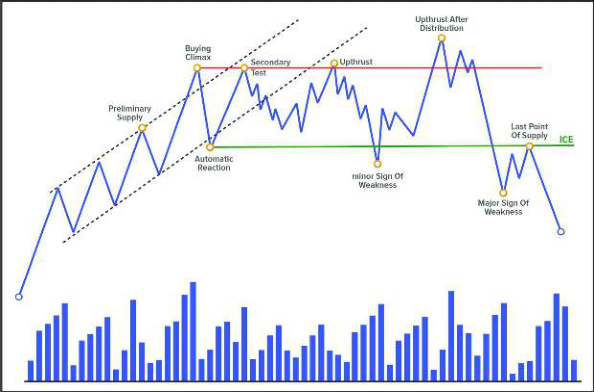

Based on the movement that precedes the Last Point of Supply, we
can find different types:

Last Point of Supply after shock. In case the price comes
from developing an Uptrust After Distribution, the Last Point of
Supply would be its test.

Last Point of Supply within the range. If the price comes
from developing a Sign of Weakness, the Last Point of Supply will
appear in the bullish retreat.

---

<!-- page_177 -->

Last Point of Supply out of range. Here we have on the one
hand the test movement after the break (the confirmation event, the
Fall Through the Ice); and on the other hand all the setbacks we
found during the downtrend Phase out of range.

After breakout the Ice (support) with a sign of weakness (Sign Of
Weakness), we want to see an upward movement with narrow price ranges,
which would denote the difficulty of the market to keep rising. Preferably we
will expect the volume to be low, indicating a lack of interest from buyers;
but we have to be careful because a high volume could signal an increase in
selling interest by shorting the zone.

Last Point of Supply is good places to start or add short positions as
they are the last distribution waves before a new bearish momentum begins.

The price reached in the Last Point of Supply will sometimes coincide
with the level above which the Preliminary Supply appeared. This is so
because if the structure is distributive, it is on the Preliminary Supply where
the distribution initially began.

---

<!-- page_178 -->

PART 6 - PHASES

Phase analysis helps us to structure the processes of accumulation and
distribution, providing us with the general context of the market. Once the
general context is identified, we will be predisposed to wait for one thing to
happen rather than another.

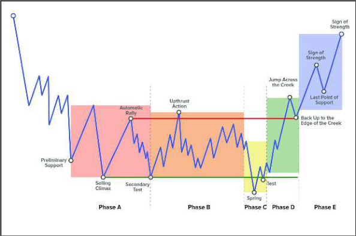

Context is a very important feature of the Wyckoff methodology, and
gives it an important advantage over other technical analysis approaches. For
example, a trader based on traditional technical analysis may see a resistance
and seek to enter short over that area expecting a market turn; and on the
other hand, a Wyckoff trader who has correctly identified the Phases may
have established a greater probability that the price will effectively break that
resistance and may even consider buying while waiting for the start of the
uptrend outside the range.

Within the Wyckoff methodology we have five Phases: from A to E;
and each of them has a unique function:

---

<!-- page_179 -->

Phase A. Stopping the previous trend.

Phase B. Building the cause.

Phase C. Test.

Phase D. Trend within range.

Phase E. Trend out of range.

By analyzing price and volume we will be able to correctly identify
when they start and end. It is very important that the analysis so far is correct
because it will be the only way to take advantage of the message that
underlies its development.

The Phases are based on the fact that all campaigns (accumulations
and distributions) require a certain amount of time until they are completed.
During this time, the price develops the structures we already know. The
power of Phase analysis lies in the fact that these structures generally follow
repetitive patterns in their development. This means that, if we are able to
correctly identify what is happening (accumulating or distributing), we will
be closer to presenting scenarios with a greater probability of success.

---

<!-- page_180 -->

CHAPTER 21 - PHASE A: STOPPING THE
PREVIOUS TREND

The main function of this Phase is to stop the previous trend movement and
return the market to a state of balance between the forces of supply and
demand, or between buyers and sellers. We move from a trend context to a
range context.

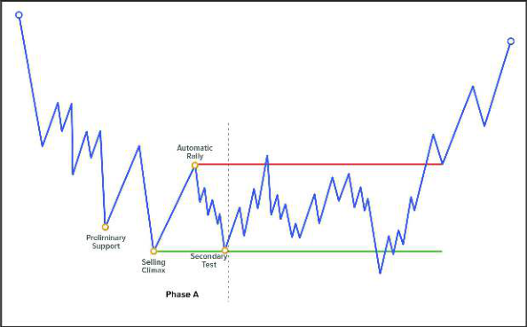

Phase A consists of the first four events:

Preliminary Support and Preliminary Supply

Selling Climax and Buying Climax

Automatic Rally and Automatic Reaction

Secondary Test

Prior to the start of this first Phase, the market is controlled on either
side. As we know, a control of the sellers will be represented as a downtrend;

---

<!-- page_181 -->

and a control of the buyers as an uptrend.

The price may be reaching interesting levels where the large trader
begins to see value. In other words, they see a potential profit with the
difference they have found between the value they give and the current price.
It is time to start developing the stock absorption campaign.

But we will not be able to identify this signal of true interest until the
first events of the methodology appear. The Preliminary Stop with its peak
volume already alerts us to an increase in participation and a possible
massive closure of positions. The most likely thing is that the big traders have
begun to glimpse an overextended condition in the price and begin to take
profits.

The Climax, which as we know can also appear without climatic
volume (Selling Exhaustion and Buying Exhaustion), identifies us one of the
extremes of the structure and its action is very relevant to finish exhausting
those who until then maintained control of the market.

The appearance of the Reaction is one of the most informative events
because it confirms that something is happening. The price came previously
in a prolonged trend and this reaction is the first time that it lets see with
relative significance that there begins to be an interest in the other side.

The Test puts an end to this first Phase by starting the development of
Phase B from there.

---

<!-- page_182 -->

CHAPTER 22 - PHASE B: BUILDING THE
CAUSE

After the Secondary Test the Phase B begins, whose intention is the
construction of the cause with the objective of preparing the subsequent
effect.

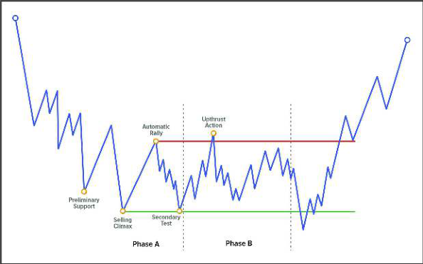

Phase B consists of successive tests (Secondary Test in B) that can be
performed at both the upper and lower ends of the structure:

Upthrust Action and Upthrust

Secondary Test as Sign of Weakness and minor Sign Of
Weakness

During this Phase the market is in balance and this is where the great
professionals take advantage to absorb most of the stock they need before the
end of the season.

---

<!-- page_183 -->

In proportional terms we want this Phase to be greater than Phases A
and C. This is a general guideline because, although there will be occasions
when the Phases will be of equal or even shorter duration (such as in a
hypodermic action or V turn), it is most likely that we will find that this type
of temporal proportionality is met.

If this proportionality is not met, i.e. Phase B has a shorter duration
than Phase A or C, this will denote an urgency on the part of the traders who
are absorbing the stock and adds greater strength to the trend movement that
follows.

---

<!-- page_184 -->

CHAPTER 23 - PHASE C: TEST

Phase C begins with the start of the shake movement and ends after the shake
test.

In this Phase the great professional checks the level of interest that the
rest of the market participants have on certain price levels.

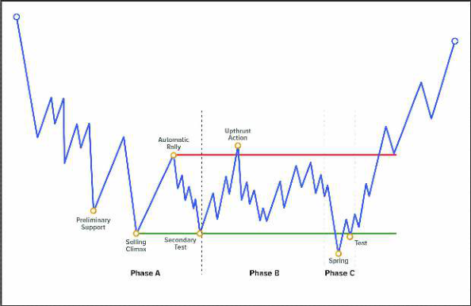

It is made up of the Shaking event:

Spring/Shakeout

UpThrust After Distribution (UTAD)

Before starting the trend movement, it is most likely that they will
develop this Shake action in order to verify that there are virtually no traders
willing to enter the opposite direction and that therefore the path of least
resistance is in their favor.

---

<!-- page_185 -->

If they observe a high participation in that zone, this means that they
have not yet absorbed all the available stock and that therefore the control of
the market is not yet unbalanced towards one of the sides (buyers or sellers).

Under this circumstance, it is most likely that either the large traders
will give up the campaign, continuing the price in this case in the same
direction as the prevailing trend; or Phase B will continue to be extended
until there is complete absorption of all this available stock, producing an
imbalance in favor of professionals. In this case, the price will need to carry
out successive tests in this area until the lack of interest is verified.

A very important aspect to bear in mind that can happen at this stage
is that the shaking event will not necessarily sweep the ends of the structure.
Doing so is ideal because the greater this movement, the more liquidity you
will have been able to capture and therefore the more "gasoline" the
subsequent movement will have.

But it can also be the case that a Shake takes place without reaching
the extremes. We would still be before the Test event in Phase C and we
could label this action as Spring/Upthrust minor, or Spring/Upthrust in
function of Last Point of Support/Supply.

In any case and as I usually repeat, the labels are not important. We
have to think in functional terms and what really interests us is to know what
is happening. It is of little use to us to know how the methodology labels
market actions if we do not know in depth what lies behind them.

---

<!-- page_186 -->

CHAPTER 24 - PHASE D: TREND WITHIN
RANGE

The beginning of this Phase is after the end of the shock test and until the
confirmation event is fully developed.

Without opposition to sight, the path of least resistance is clear. The
market is in imbalance and this is observed in the graph through the
development of the Break event.

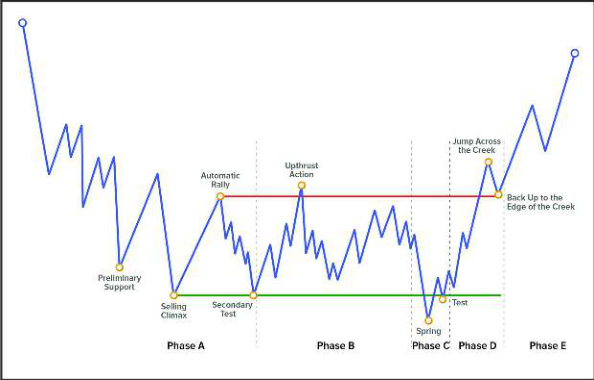

Phase D consists of the Breakout and Confirmation events:

Sign of Strength/Jump Across the Creek and Sign of
Weakness

Last Point of Support/Back Up to the Edge of the Creek
and Last Point of Supply

---

<!-- page_187 -->

If we are correct in the analysis, after the key Shake event, the price
should now develop a clear trend movement within the range with wide
candles and increased volume to cause the effective breakdown of the
structure.

That zone that establishes the Reaction event (Creek or Ice) is the last
barrier that must be overcome to conclude that one side has final control. If
the price reaches that area and there is too much opposition (there are still
many traders willing to trade against this movement), we are left with two
possible scenarios.

On the one hand, the price may fall back again by developing a Last
Point of Support/Supply within the range before attacking that area again (it
would be something like taking a run to jump the river); or on the other hand,
those large traders who have previously built the campaign may decide to pay
the price it will cost them to cross that area and start from there the breakout
movement, absorbing all those orders at a worse price.

We would still have to be alert to a third possible scenario, which
would be that this attempt at rupture fails and develops in it a new shock, a
new Test in Phase C that would cause the effective rupture towards the
opposite side.

If the price has developed structurally as planned, this last possibility
should be the least likely to happen, but we must be aware of it and keep it in
mind. What happens in this case is simply that higher forces have been
absorbing in the opposite direction; developing a much more discreet
absorption campaign.

We must bear in mind that the market is a struggle between great
professionals, between funds and institutions with all kinds of interests. An
important point to make is that not all institutions trading in the financial
markets make money. The truth is that a large number of them are just as
much losers as the vast majority of retail traders. These losing institutions are
the favorite victims of the big traders as they handle significant amounts of
capital.

---

<!-- page_188 -->

If the breakout develops relatively easily, and the signals leaving the
price and volume so indicate, then we will look for the confirmation event to
unfold.

For this one, as we have already commented, it is essential that the
price endures on the other side of the structure and does not generate an
immediate re-entry. Besides this, we will look for that test movement to be
generated with little interest.

---

<!-- page_189 -->

CHAPTER 25 - PHASE E: TREND OUT OF
RANGE

This Phase starts after the confirmation event.

If the test after the break was successful and no traders appeared in the
opposite direction, it can definitely be confirmed that one side has absolute
control of the market and therefore we should only seek to trade in that
direction.

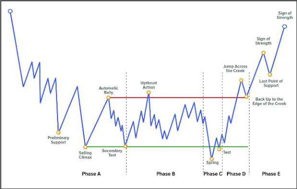

This Phase consists of a succession of impulsive and reactive
movements:

Sign of Strength and Sign of Weakness

Last Point of Support and Last Point of Supply

The price abandons the structure upon which the cause has been built

---

<!-- page_190 -->

previously and begins a trend as an effect of the same. This fact of successful
break + confirmation is the great warning that great professionals are
positioned in that direction.

It is from this point on that we must implement all the tools for
evaluating trends.

---

<!-- page_191 -->

PART 7 - TRADING

Our trading and investment decisions will be based on the three elements that
I believe are most important to consider in the discretionary reading of charts,
in order: the context, the structures and the trading areas.

---

<!-- page_192 -->

1. THE CONTEXT

It has to do mainly with what is on the left of the chart, both in the time frame
you decide to trade and in some higher time frame.

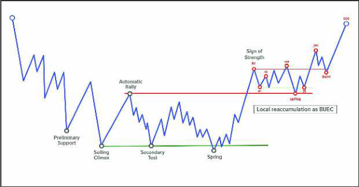

The vital rule regarding context is clear: trade in favor of the larger
structure. This means that, as markets develop multiple structures at the same
time but in different time frames, we must always prioritize the development
of the longer-term structure. This is the most logical way for us to bias the
direction of the market.

For example, if we find ourselves after the upward break in a potential
accumulation structure of a higher time frame, over that area we will favor
the development of a smaller reaccumulation structure that will act according
to BUEC of the larger structure.

In this example we see how our analysis has been biased (favoring the
development of a reaccumulation) based on what the price was doing until it
reached that point (the potential main accumulation structure). This is the
importance of context.

---

<!-- page_193 -->

In addition to providing us with more secure trading opportunities,
identifying the context also helps us not to look for trades on the wrong side
of the market.

In other words, if our structural analysis tells us that the market could
be accumulating, from that moment on we will only try to look for buy
trades; discarding outright the sell trades.

This is very important as eventually we may not be able to find our
way into the current upward movement, but at least we will avoid being
positioned on the wrong side of the market, which in this example would be
the short side. We will not be able to win, but at least we will not lose.

---

<!-- page_194 -->

2. THE STRUCTURES

It is the cornerstone of the Wyckoff methodology. Our task is to try to
understand what is happening within the structures, who is gaining control
between buyers and sellers.

The only objective of internalizing all the theory seen so far is to
arrive at this point in the operation to pose scenarios as robust as possible.

Many are the traders who underestimate the Wyckoff methodology's
approach, alluding to the fact that it was developed under very different
market conditions than the current ones. This is absolutely true since the
technologies available at the end of the 20th century, as well as the structure
of the market itself, have changed considerably with respect to more modern
times.

What has not changed is that in the end it is about the interaction
between supply and demand. Regardless of the source that executes the
orders of the participants, this interaction leaves its mark on the price in the
form of structures that repeat themselves continuously.

The logic of the structures is based on the fact that, in order for the
price to be rotated, it needs to be accumulated or distributed in a protocol that
requires time and is developed systematically. Although markets sometimes
cause aggressive V-turns, this is not the norm and we should therefore focus
on the complete development of the structures.

This protocol roughly follows a series of steps (phases and events of
the methodology) that allow us to know when the price is likely to be turned.

---

<!-- page_195 -->

In summary, these steps are:

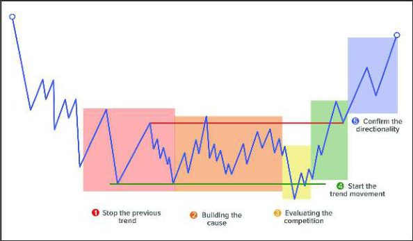

1. Stop the previous trend

1. Building the cause

1. Evaluating the competition

1. Start the trend movement

1. Confirm the directionality

What the Wyckoff methodology has done is put a magnifying glass
on each of these steps and create a discipline whose objective is to evaluate
the footprints left by the interaction of supply and demand on price and
volume to discern where market control is most likely to be imbalanced. This
is the task of the Wyckoff trader.

But back to the beginning, the objective is to pose solid scenarios; and
this will be impossible if we do not know all the elements that make up the
methodology.

---

<!-- page_196 -->

3. TRADING AREAS

The underlying principle is auction theory and the market's need to facilitate
trading. We have discussed this previously. Large traders need to find other
traders with whom they can place orders when opening and closing trades
(counterparty). That is why they take advantage of the Shake movements to
open positions, and keep them until they reach certain levels where they will
again find enough liquidity to close those positions.

The key is that these trading areas act as price magnets because they
generate enough interest to make different traders want to place their pending
orders on them (attracting liquidity). And this liquidity is what makes the
price tend to come to them.

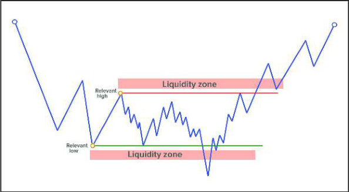

For example, large traders who have bought heavily on a bearish
move (Spring), will need to keep the position open at least until they find
another major liquidity zone that allows them to close those purchases. Since
they now want to take profit (close buy positions = sell), they need volume
buyers; traders willing to buy their sell orders.

---

<!-- page_197 -->

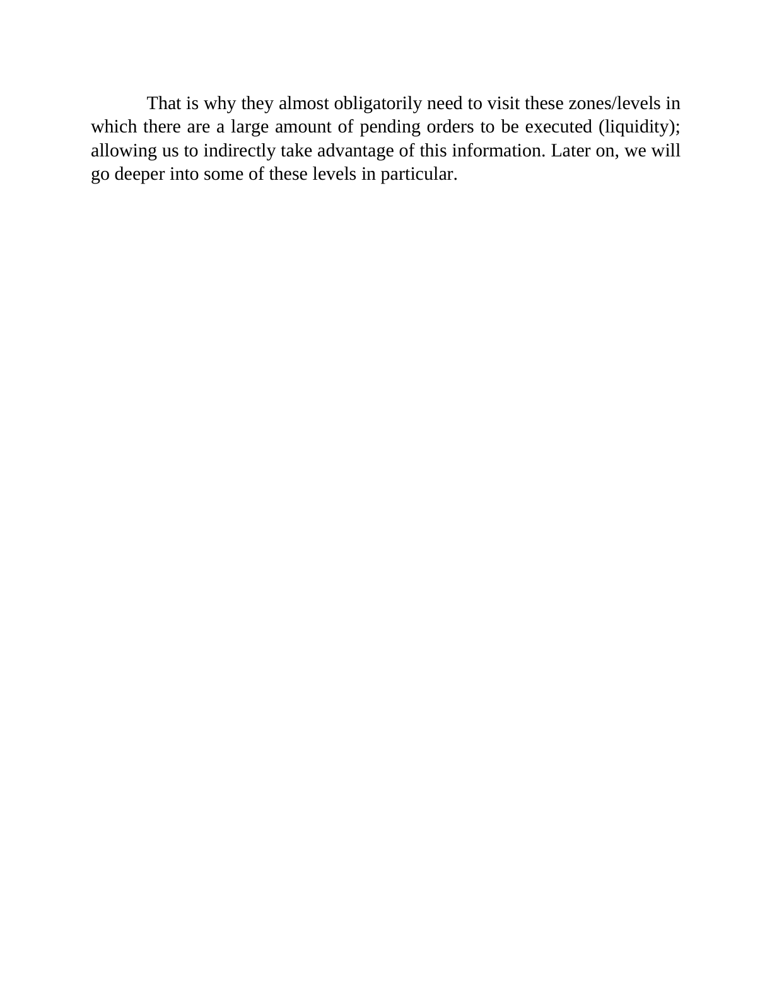

That is why they almost obligatorily need to visit these zones/levels in
which there are a large amount of pending orders to be executed (liquidity);
allowing us to indirectly take advantage of this information. Later on, we will
go deeper into some of these levels in particular.

---

<!-- page_198 -->

CHAPTER 26 - PRIMARY POSITIONS

Within the methodology, the only areas on which a possible operation will be
assessed are very well defined: In Phase C, in the zone of potential shock; in
Phase D, during the development of the trend movement within the range and
in the test after the break; and in Phase E looking for trend tests or minor
structures in favor of the major structure (context).

We are going to detail the different zones on which we will look to
trade, as well as the different events that can occur within them.

When comparing the advantages and disadvantages between the
different trading positions, the key is that the greater the development of the
structure, the greater the confidence we will have in the tradings, but the
lower the potential benefit due to this. It would be the same thing to say that,
the sooner we get the signals, the greater the potential travel and the lower the
reliability.

---

<!-- page_199 -->

IN PHASE C

This is the position that offers us the best Risk:Reward ratio since we are at
one end of the structure and the potential movement is relatively large.

The negative part of entering this location is that they are less precise
entries since until that moment the development of the range has had a
shorter duration in comparison with the other two operative positions.

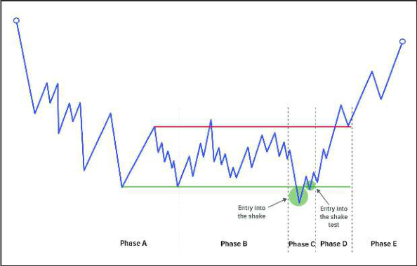

ENTRY INTO THE SHAKE

Only recommended if the shaking is done with a relatively low volume. As
we know, high volumes tend to be tested to verify the commitment of those

---

<!-- page_200 -->

traders, so it is more sensible to wait for a new visit to that area.

With this in mind it would not make much sense to go directly into a
shake that has developed with a lot of volume when they are most likely to
develop such a test. And normally this test will be able to give us an even
better Risk:Reward ratio.

Shakes are easily identifiable as they take place at the ends of the
structure. It would not be necessary to monitor the development of the range
minute by minute, it would be enough to place some alerts when the price
crosses these extremes and we will be in predisposition to trade them.

ENTRY INTO THE SHAKE TEST

It's one of every Wyckoff trader's favorite tickets. After the shock, expect a
new visit over the area with narrowing ranges and decreasing volume (see
Event #4: Test).

One of the important points of this test is that it should be kept and
not make a new end. In other words, for the example of the Spring test, it
should remain above the low established by the Spring. For the example of
the Upthrust test, it should stay below the high set by the Upthrust.

---

<!-- page_201 -->

ENTRY INTO THE LAST POINT OF SUPPORT

This type of entry is much more difficult to see since we only know that it is
the last point of support after the actual breakage of the structure (Basic
accumulation structure #2)

Phase C can be generated either with a Shake or with this last
foothold event (LPS/LPSY). Thanks to the action of the Shake itself
(sweeping of a previous liquidity zone at the end of the structure) we know
when the structure is developing. This is very different with the last support
point, since we cannot know at any time when this event may be developing,
being in many cases inoperable.

IN PHASE D

If the Shake + test are successful, we should now see a sign of intent that will
lead to the price in the opposite direction. This is the context we will work
with.

In order to benefit from this approach, we have different ways to enter
the market.

---

<!-- page_202 -->

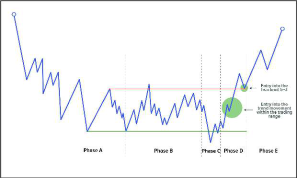

ENTRY INTO THE TREND MOVEMENT WITHIN THE RANGE

During the trip of the price from one end to the other can offer us different
possibilities of entry.

WITH A SIGNIFICANT BAR

One of them would be to wait for the appearance of new intentional sails
(SOS/SOW bar). This is the definitive sign of professional interest. If during
the development of that trend movement within the range we observe good
trend candles, they are still very interesting opportunities to enter the market.

---

<!-- page_203 -->

WITH MINOR STRUCTURE

Another way to incorporate would be to look for some minor structure in
favor of the directionality of the shock. For example, if we have just
identified a Spring + test, we may be able to go down in the middle of the
structure to look for a minor structure of reaccumulation that would give us
the trigger to buy. In the bearish example, if we identify an Upthrust + test,
we could go down in temporality from there and look for minor redistribution
structures to go up in the bearish trend movement.

WITH A MINOR SHAKE

Finally, in this area of the structure we could also look for minor shaking.
They are called minor because they do not occur over the entire ends of the
structure. This is another very good way to enter in case you do not want to
go down in time and look for a minor structure. Actually, the pattern of the
minor shock and the minor structure is the same, although the minor structure
would offer a better Risk:Reward ratio.

Both minor structures and minor shocks should be labeled as the last
support point (LPS/LPSY) since they are turns in favor of the trend
movement that takes place in the structure.

ENTRY INTO THE BREAK TEST (CONFIRMATION EVENT NO. 7)

---

<!-- page_204 -->

As we discussed in the chapter dealing with this event, it was Richard
Wyckoff's favorite trading position because of everything the chart could tell
him up to that point.

The potential for establishing profit taking is less, but instead we have
on the left all the development of the structure, which gives us a greater
probability that we will position ourselves along with the great professionals
and in favor of the least resistance.

IN PHASE E

After the confirmation that we are facing an effective break and imminent
start of the out-of-range trend movement, we must now focus on looking for
operational opportunities in favor of the preceding accumulation/distribution.

This type of operations are the most "secure" since we are positioned
in favor of the last accumulation or distribution. However, the disadvantage is
that the potential path is smaller, although it will depend on the amount of
cause that has been built up during the structure.

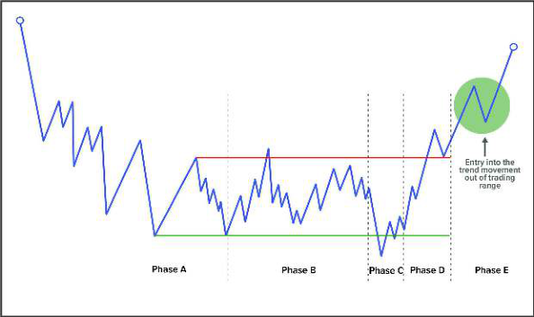

---

<!-- page_205 -->

ENTRY INTO THE OUT-OF-RANGE TREND MOVEMENT

As with the operations in the Phase D trend environment, we can assess
different possibilities for entering the market:

WITH A SIGNIFICANT BAR

Sometimes the market will move in a very volatile environment and this
speed is likely to leave us with no possibility of entering the market if we are
waiting for the perfect entry.

To try to mitigate this, we could enter in favor of movement simply
after the appearance of new intentionality candles (SOS/SOW bar).

There are quite a few signals in favor of such a move, so a new
appearance of this type of candle that indicates professional intervention may
be the perfect excuse to place our orders in the market.

ENTRY WITH MINOR STRUCTURES

---

<!-- page_206 -->

If the main structure that we have previously identified is in a time frame of 4
hours or 1 day, it could be interesting to go down to a time frame of 1 hour or
less to look there for the development of a smaller structure that would allow
us to incorporate in favor of the trend movement.

This means that if we have a macro structure of accumulation
underneath, the most interesting thing to do in order to go up to the upward
movement would be to go down in temporality and look for a minor structure
of reaccumulation.

Similarly, if what the market shows is a main distribution structure
above the current price, the most advisable thing to do would be to go down
in time and look for a minor redistribution structure.

ENTRY WITH A SHAKE

It should be treated exactly the same as the Shake entry in Phase C. It is the
same event with the only difference being the location where it takes place.

The methodology distinguishes these Shake events depending on the
location. When they occur in the middle of the favorable trend movement it is
called Ordinary Shakeout and Ordinary Upthrust.

In addition to the difference in location, these types of shocks may
appear with less preparation of the continuation structure (reaccumulation or
redistribution) because the market is already in motion.

As we have mentioned, the operation in Phase E would be the safest
between quotes because we are positioning ourselves in favor of the last
accumulation or distribution already confirmed. And we know that until at

---

<!-- page_207 -->

least the first events of a Phase A stop of the previous trend are developed,
the most logical thing is to think about a continuity of the current movement.

SUMMARY TABLE OF TRADING OPPORTUNITIES

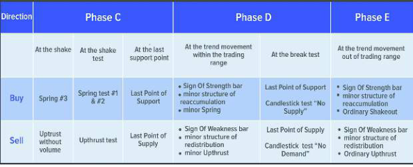

---

<!-- page_208 -->

CHAPTER 27 - DECISION-MAKING

Everything studied so far has had the sole objective of preparing us to arrive
in the best conditions at the critical moment of every trader: the final decision
making.

Once we have identified the areas we are going to wait for the price
and the possible scenarios we want to see before taking action, we are going
to detail in depth some concepts more typical of the trading.

The main goal of internalizing this type of concept is to incorporate a
certain objectivity in the reading of the graphs and, more importantly, in our
tradings.

THE CONCEPT OF THE SIGNIFICANT BAR

It is difficult to determine when the price will make a market turn in the short
term. The easiest way to determine it is through confirmation: confirmation
that a trade has been completed.

It is a matter of identifying the presence of the institutions in the short
term that enter to force that turn in the price. An example of this type of bar is
those previously presented as SOSbar (Sign of Strength Bar) and SOWbar
(Sign of Weakness Bar)

The characteristic of a significant bar is:

---

<!-- page_209 -->

Relatively wider range than the range of previous sails.

A volume operated according to that total range, i.e. higher.

Close in the middle of the total range of the bar in the direction of
the current movement.

For a significant bullish bar close in the upper half of its
range.

For a significant bearish bar close in the lower half of its
range.

Commitment in the direction of the current movement.

For a significant bullish bar the bar's close must be above
some previous resistance level.

For a significant bearish bar the bar's close should be below
a previous support level.

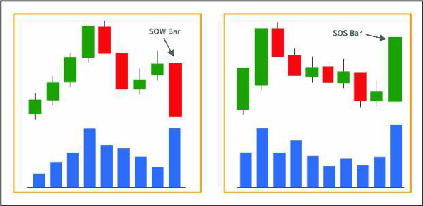

A bar with these characteristics denotes intent and will generally be
associated with institutional presence. Since we assume institutional
presence, we expect the price to continue to move in that direction.

If the price does not clearly develop a significant bar, we can mark
two normal bars and build with them a significant bar using the same
characteristics.

---

<!-- page_210 -->

It is highly recommended to use this concept of significant bar to try
to identify the turns of the market.

THE CONCEPT OF REVERSAL OF MOVEMENT

Determining the end of a longer movement is not easy. The goal is to identify
as early as possible the point at which the beginning of a movement in the
opposite direction is likely to occur.

The first thing to do is to identify the last significant bar of the
movement in which the price currently stands. And let's assume that this
marks the current market control since the probability is that the price will
continue in that direction (in the direction of whoever has control of the
market).

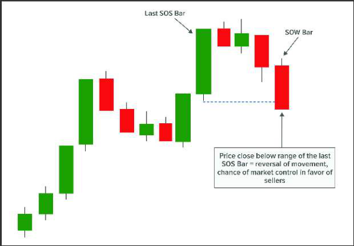

That is, if the price is in the middle of a rising movement and above a
significant rising bar, we will assume that the buyers have control of the
market; and conversely, if the price is in the middle of a falling movement

---

<!-- page_211 -->

and below a significant falling bar, we will say that the sellers have control of
the market.

With the appearance of new significant bars in favor of the
movement, the control of the market will continue to shift, anchoring itself to
those new significant bars.

The key is that we will determine that the control of the market has
been turned around when the price breaks the last significant bar that marks
the control of the market with another significant bar of inverse intentionality
to the current movement.

To do this, we mark the ends of the total range of that last significant
bar and a close in the opposite direction would alert us to a possible reversal
of the movement:

To determine the end of a rising movement and possible
beginning of another falling one we need to see that a falling
reversal bar closes below the low of the rising significant bar that
until then marked the buyers' control.

To determine the end of a downward movement and
possible beginning of a upward one we need to see that a bullish
reversal bar closes above the high of the significant downward bar
that until then marked the control of the sellers.

This concept of movement reversals is very important because when
we observe a change in character, we will probably see those reversal bars.

After the Selling Climax we will probably see that upward reversal
bar. And once the upward movement has started, we will probably see that
downward reversal bar that will alert us to the end of the Automatic Rally.
And so on with all the events in the range.

---

<!-- page_212 -->

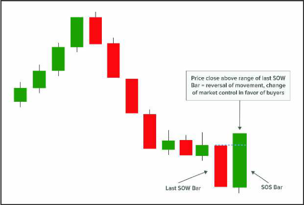

POSITION MANAGEMENT

We will now look at how to get in and out of the market. I strongly
recommend sending all 3 position orders (entry, stop loss and take profit) at
the same time to avoid potential electronic and emotional problems later.

It may be that in case of executing only the entry order and the price
goes against us, we do not have the emotional capacity to place the stop loss
where it would be initially. We could tremble at the point or even convince
ourselves that that first location was too close and that the right thing to do
would be to move it further away. We would simply be looking for a
justification for not facing the reality of assuming a loss. The end result in
most cases will be a higher than expected loss.

We could also suffer in that period of time some kind of electronic
problem like an unexpected disconnection from the broker. That must be a
very uncomfortable situation since you would find yourself with an open
position and without any protection for it.

---

<!-- page_213 -->

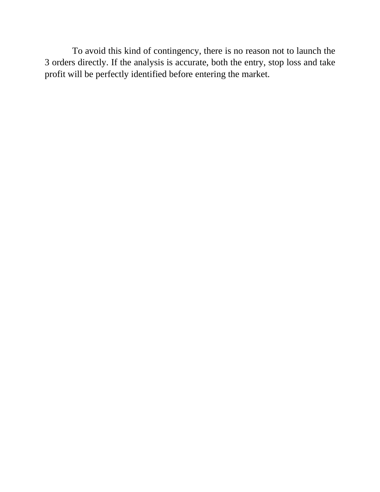

To avoid this kind of contingency, there is no reason not to launch the
3 orders directly. If the analysis is accurate, both the entry, stop loss and take
profit will be perfectly identified before entering the market.

---

<!-- page_214 -->

CALCULATE THE SIZE OF THE POSITION

A very useful way to carry out proper risk management is to calculate the size
of the position based on the distance between the entry level and the stop loss
level.

In particular, I work with fixed position risk based on account size.
This means that for each position a percentage of the total size deposited with
the broker will be risked. It is recommended that this percentage does not
exceed 1%.

To understand this well, the distance between the entry level and the
stop loss level will determine the percentage of risk in the operation (for
example, 1%). From there, the distance at which we locate the take profit will
determine the ratio R:R (Risk:Reward) that will offer us that operation.

A 1% of a 5000$ account is 50$. If our trade offers us a
ratio of 1:3, with this type of management the possible monetary
results would be: gain 150$ or lose 50$.

Depending on the type of trade, it is generally not recommended to
take trades that have a negative R:R ratio; that is, the risk is greater than the
reward.

The issue of position management is very broad and complex. I only
wanted to leave this small point because it will be enough to carry out a more
solid trading. I recommend looking for other readings where this section is
more in-depth, as it is very worthwhile.

---

<!-- page_215 -->

ENTRY

I return to the concepts previously studied because they will be very
important for our trading: If we are after the downward breakage of the
structure and the price is developing the upward movement that will develop
the test after the breakage (potential LPSY), the appearance of a significant
downward wing on the appropriate area (Ice) that closes below the low of the
last significant upward wing could provide us with a good trading
opportunity.

This is exactly what we will be looking for as an entry trigger before
placing orders. In the background it is the appearance in the short term of a
strong volume (interest) that causes the development of a large intentionality
candle (significant bar, SOS/SOW bar). We are at the right time and place.

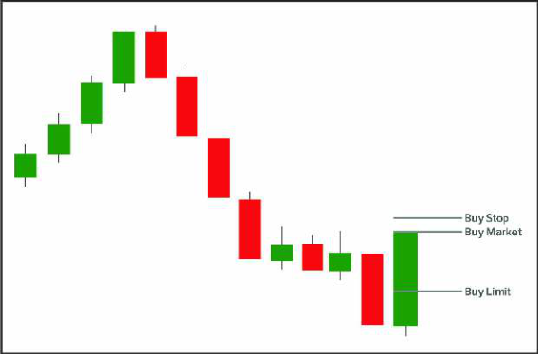

In view of the appearance of this expected event, we have no choice
but to launch our orders to enter the market. Nowadays the platforms offer us
different ways to do it:

Market orders. It allows us to enter the market
aggressively on the last cross price.

Stop orders. It allows us to enter the market in a passive

---

<!-- page_216 -->

way in favor of the movement.

Limit orders. Allows us to passively enter the market
against the movement.

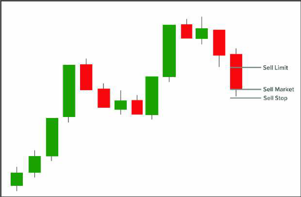

At this point I would like to emphasize again the importance of
quantifying our entry trigger. As we see, there are many ways to enter the
market, and each of them will have a different performance on the strategy.
My recommendation is that you acquire the knowledge to perform a robust
backtesting process in order to obtain the statistics that will provide us with
objective results. This way we can compare the performance of the different
ways we analyze to enter.

STOP LOSS

The idea is to place the Stop Loss at the point where, if reached, the proposed
scenario would be invalidated.

When placing the stop loss, we have to take into account what type of

---

<!-- page_217 -->

entry we are facing. As a general rule, we will place the stop loss on the other
side of the direction in which the significant bar (SOS/SOWbar) has
developed, and on the other side of the whole scenario.

For entries directly into the shake, the stop loss should be located on
the other side of the end:

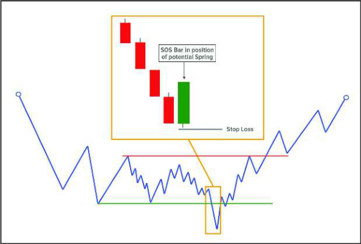

On a Spring, the stop should be below the low.

On an Upthrust, the stop should be above the high.

For entries in the shake test, we have two possible locations. One
would be on the other side of the significant bar and the other would be at the
end of the entire stage:

---

<!-- page_218 -->

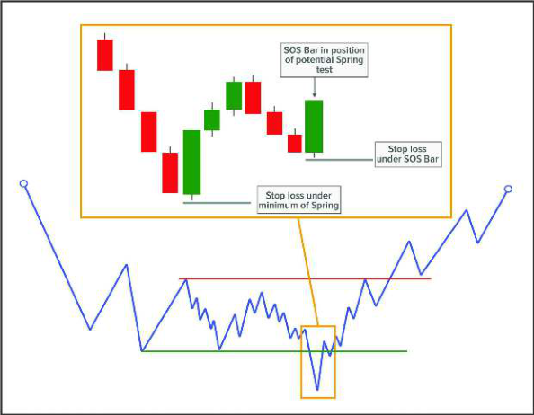

In the Spring test, the stop would be either below the
SOSbar or below the low of the Spring.

In the Upthrust test, the stop could be either above the
SOWbar or above the high of the Upthrust.

For inputs with a smaller structure it is best to place the stop loss at
the end of the whole scenario:

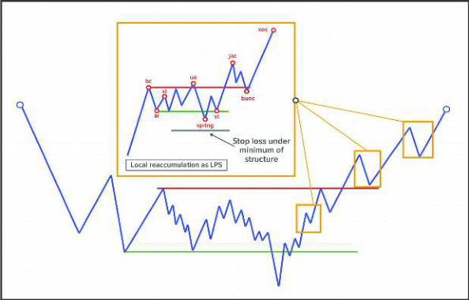

In minor reaccumulation structures, below the low of the
structure.

---

<!-- page_219 -->

In minor redistribution structures, above the high of the
structure.
•

---

<!-- page_220 -->

For entries to the break test, the stop loss would be far from the
broken level and the significant bar in case we have used it as an entry
trigger:

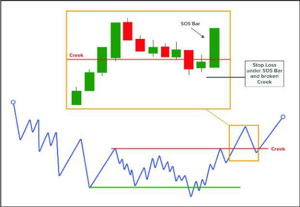

In the breakout test (BUEC/LPS), the stop should be below
the SOSbar and below the broken Creek.

In the breakdown test (FTI/LPSY), the stop should be
above the SOWbar and above the broken Ice.

TRAILING STOP

Another way of managing the position is by using the trailing stop, which is
based on changing the location of the stop loss as the price moves in our
favor.

Although it may be a good idea, I particularly do not use them since

---

<!-- page_221 -->

due to their very nature, they do not leave much room for the price to move
and as a consequence stop losses are easily reached.

In any case it is a matter of testing and quantifying whether or not our
strategy improves performance by incorporating this type of management.

TAKE PROFIT

Originally the Wyckoff methodology used point and figure charts to
determine potential price targets.

We understand that the structure of the market today has changed too
much to continue using that tool and therefore, operationally it seems much
more useful to employ others.

Based on the pure analysis of the Wyckoff methodology, we will list
the possible actions that we can use to take profit:

---

<!-- page_222 -->

FOR EVIDENCE OF CLIMATIC BAR

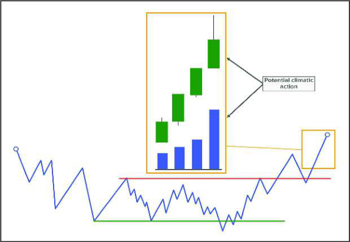

Potential Buying Climax/Selling Climax which will show high range, speed
and volume. It would be an attempt to anticipate the stop of the previous
trend, but it could be a sufficient signal to close the position or at least to
reduce it.

It is a great way to exit the market when there is no price action to the left (at
market extremes).

That lack of reference makes us go a little "blind" producing some
operational inability. It is now more than ever that we must know how to
listen to what the price and volume tell us.

A climatic volume at one end of the market is sufficient reason to abandon
the position.

---

<!-- page_223 -->

AFTER THE DEVELOPMENT OF PHASE A OF STOPPING THE PREVIOUS

TREND

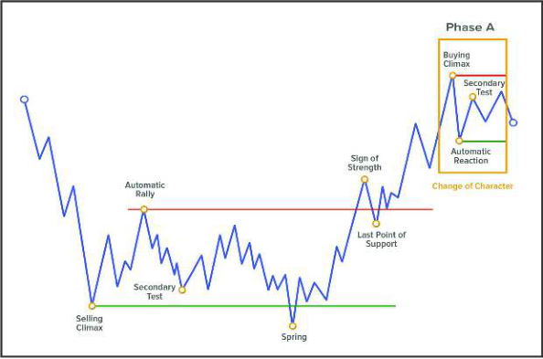

The development of the first four events that delimit the appearance of Phase
A will be sufficient reason to understand that the previous trend has ended
and we must close our position.

Later the trend could resume in the same direction, but we cannot know this
at that moment, so the most sensible thing would be to take profits.

It is important to note that the new structure should be developed within the
time frame in which we have identified the previous structure.

Also, remember to put into practice the concepts of significant bar and
motion reversal to more confidently identify the end of such events.

In addition to these possibilities, as we have previously discussed, we
may want to use volume trading areas to locate our take profit orders. In this
case, we will use

---

<!-- page_224 -->

LIQUIDITY ZONES

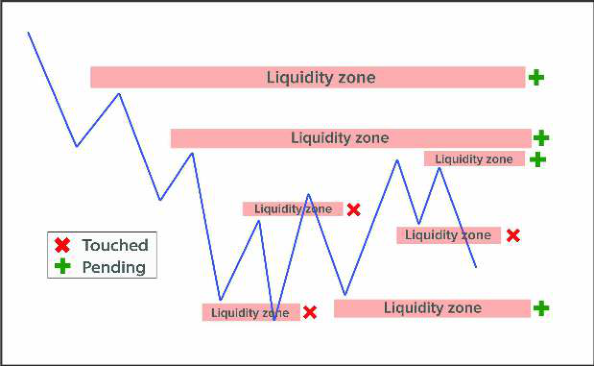

These are price turns; previous highs and lows. We know that in these zones
there are always a lot of orders waiting to be executed and that is why they
are very interesting zones to wait for the price to come in.

Some examples are the zones established by the structures: the lows of the
Selling Climax (in the accumulation structures) and the Automatic Reaction
(in the distributive structures); and the highs of the Buying Climax and the
Automatic Rally.

Another example of liquidity zones to take into account as an objective of our
operations are the previous liquidity zones (which are independent of the
structures), both in our trading time frame and in higher ones.

The best way to take advantage of this reading is to identify the liquidity
zones in the higher time frames and set them as targets. From there, use the
structures developed by the price to enter the market with those price levels
in mind.

We must take into account that the market is constantly changing and will
continue to generate new price turns (new areas of liquidity) so our objectives

---

<!-- page_225 -->

would have to be adapted to this new market information. That is, if we had
originally established the profit taking in a distant liquidity zone, and in the
development of the movement the price generates a new zone of liquidity
closer, this should now also be taken into account.

VOLUME PROFILE LEVELS

The Volume Profile is a discipline based on a sophisticated tool that analyzes
traded volume by price levels and identifies those that have generated the
most and least interest. There are different types of profiles (session, range
and composite) as well as different levels, the most prominent being (much
more about Volume Profile in my second book "Wyckoff 2.0: Structures,
Volume Profile and Order Flow”).

VPOC. Volume Point Of Control. Determines the most traded level
of the profile and therefore identifies the price with greater acceptance by
both buyers and sellers. The logic behind this volume level is that, as it has
previously been a level where both buyers and sellers have been comfortable
crossing their contracts, it is very likely that in the future it will continue to
have the same perception for all participants, causing a certain magnetism
towards it.

Therefore, it will be advisable to have well identified the VPOCs of
the previous sessions, the one of the current session, as well as the Naked
VPOCs (old VPOCs that have not been tested again).

VWAP. Volume Weighted Average Price. Determines the volume-
weighted average price at which a security was traded during the selected
period. Being a reference level for institutional traders means that there is
always a large amount of pending orders on it, and we already know that
these orders act as a price magnet.

---

<!-- page_226 -->

You can select the VWAP of the time period that best suits our
operations. In general, the session VWAP will be more useful for intraday
traders; the highest reference levels being the weekly and monthly VWAP.

Within the Volume Profile there are other levels that could be taken
into account for the analysis, like the volume nodes (High and Low Volume
Node) and the value areas (Value Area High and Low); but the above
mentioned are undoubtedly the most interesting ones for the operative. In any
case, I recommend the in-depth study of this discipline since it is one of the
best tools to enhance discretionary analysis.

It is also important to note that these volume trading areas are not
only recommended to be taken into account for profit taking. As they are so
relevant in the current operative, the most sensible thing is to have them
identified at all times and to be able to take advantage of them also for
entering the market and for the location of the stop loss.

A confluence of levels that would add solidity to the scenario would
be, for example, to go short in a potential LPSY (after the bearish breakout of
the structure) and that on the appropriate zone (context) our trigger candle
(SOWbar) is developed whose range reaches in its superior part some level of
volume (VPOC/VWAP) denoting a rejection to continue rising. You could
enter at the end of the development of that significant downward wing and
place the stop loss above the SOWbar, above the broken Ice and above the
rejected volume level. As a goal we could look for some of the possibilities
proposed above.

---

<!-- page_227 -->

PART 8 - CASE STUDIES

Once the theoretical aspect of the methodology has been addressed, we will
move on to analyze some real examples.

The basic structures studied serve as a reference to know
approximately what to expect from the price; but the market by its very
nature needs to move with a certain freedom. This is another of the strengths
of the methodology with respect to other approaches, and that is that it
combines the rigidity that events and phases provide with the flexibility
required by the continuous interaction between supply and demand.

The point to highlight is that, although in the real market we are going
to see many structures that are practically the same as the theoretical
examples, this interaction between buyers and sellers is going to make each
structure unique. It is practically impossible for two identical structures to be
developed since this would require that the same traders who developed both
structures be in the market at the same time and that they act in the same way.
Mission impossible.

In case there is still any doubt about it, to say that the Wyckoff
methodology is not only about correctly identifying the occurrence of events.
The study of the entire theoretical section is an indispensable condition for
solidifying the bases with the objective of developing judicious analyses and
scenario proposals; but the approach goes much further. In the real operation
we will find examples of structures and unusual movements that we will have
to know how to interpret correctly; and it is that as you advance each time
you will have a smaller necessity of for example labeling all and each one of
the actions since its identification will be instantaneous.

If, for example, we see a graph like the following one, where it seems

---

<!-- page_228 -->

difficult to label the structure correctly, that is not what is relevant; what is
relevant is, if we manage to open this graph at the point I am pointing out, to
have enough capacity to interpret this fluctuation as an accumulation
structure and to be able to look for the incorporation in length.

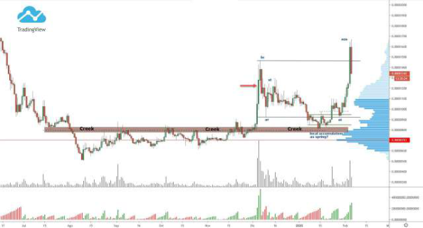

That is where the real advantage of the Wyckoff methodology lies; it
teaches us a way of reading the market from as objective a point of view as
possible. Therefore, it is not a matter of identifying structures, events and
phases to the millimeter as if we were robots.

Below we will see examples in different assets and time frames. It is
important to note that when analyzing the assets we must do it on a
centralized market so that the volume data is as genuine as possible. For the
analyses I have used the TradingView platform.

---

<!-- page_229 -->

S&P500 INDEX ($ES)

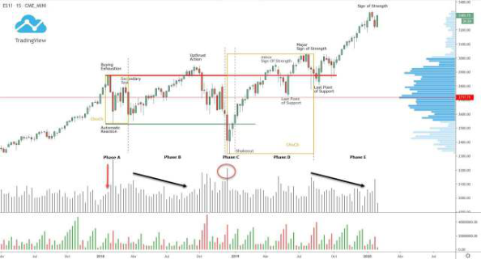

On the weekly chart we see a classic reaccumulation structure with a shock.

This is a very good example to see the visual representation of what a
Buying Exhaustion is. We see how the upward movement comes to an end
without a volume peak that would identify the climatic event. With the
Automatic Reaction and the Secondary Test the Phase A stop would be
completed.

During Phase B we already see certain background strength in
developing this test at highs (Upthrust Action). Action that originates the test
event in Phase C (Shakeout) with a relatively high volume. In this first part of
Phase B we can see how the volume in general decreases, a sign that there is
an absorption of stock by the buyers.

---

<!-- page_230 -->

The upward reaction is unquestionable and leaves a new test at highs
that fails to produce the effective breakage of the structure (minor Sign of
Strength). A small downward movement is necessary (Last Point of Support)
before facing a new attempt to break upwards. On this second occasion they
manage to develop it (Major Sign of Strength) and the subsequent test (Last
Point of Support) confirms that we are indeed facing a reaccumulation.

Very interesting how the price has initiated the trend movement out of
the range in Phase E with a decrease in volume. This could suggest some
kind of anomaly/divergence, but the supply/demand reasoning is clear: due to
the absence of supply (there are few traders willing to sell), with very little
demand buyers are able to push the price up.

---

<!-- page_231 -->

POUND/DOLLAR CROSS ($6B)

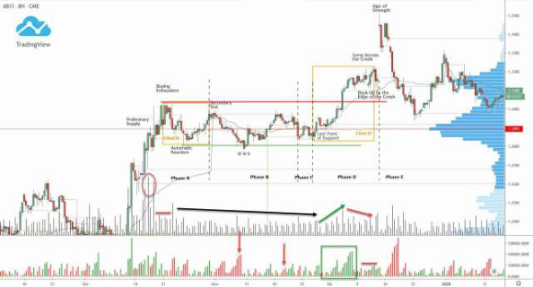

Another bullish cross has formed on the 8-hour chart's Slow Stochastic,
which means there is no sign of a major upward movement. As we mentioned
before, these are difficult to trade as we will almost always be expecting at
least some minor jolt from the inside of the structure.

We see another example of Buying Exhaustion after the appearance of
a strong volume on the Preliminary Supply. This is one of the reasons why
such exhaustion appears; and it is that if previously positions have been
liquidated in an aggressive way, with little volume this turn will take place in
highs.

From the PSY's volume peak we see a decrease in volume until the
beginning of the trend movement within the range after the Last Point of

---

<!-- page_232 -->

Support, suggesting absorption. Very visual also how the volume traded in
the downward waves decreases denoting a loss of selling momentum.

Already in Phase D, we see an increase in volume and again very
visually the rising Weis waves indicating this imbalance in favor of buyers.
We have gone from a predominance of bearish waves to this appearance of
bullish waves.

An important detail is the incorporation of the volume profile of the
structure (horizontal volume that is anchored to the right of the chart) and
how the VPOC of the structure (the most traded volume level) serves as a
support to give rise to the LPS.

After the Jump Across the Creek event, the price develops a minor
reaccumulation structure based on confirmation (Back Up to the Edge of the
Creek) with a clear decrease in volume, suggesting a lack of interest from
sellers.

In this graph we observe another very interesting element and it is that
those big traders that were buying during the development of this structure
took advantage of a fundamental event (in this case the negotiations for the
BREXIT) to develop an enormous bullish gap as an effect of all this cause.
This is not a coincidence and you will be able to see it in more occasions.

---

<!-- page_233 -->

EURO/DOLLAR CROSS ($6E)

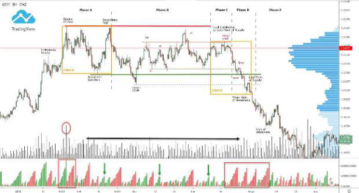

Basic distribution structure without shaking. Here we see a clear example of
the importance of context, in which the smaller structures fit into the larger
ones.

After Phase A which stops the upward trend movement, the price
starts Phase B during which a smaller structure develops inside it. The events
of a distributive structure are clearly identified and how the minor UTAD
(shake to relative highs within the range) gives rise to the downward trend
movement of both the minor and the major structures.

We see how the VPOC of the structure's profile acts as resistance in
the development of that UTAD minor, blocking further rises in the price.

---

<!-- page_234 -->

After the Major Sign of Weakness, a brief upward reversal (Last Point
of Supply) serves as a distribution confirmation test and gives rise to Phase E
where the price quickly develops the downward movement out of range.

During the creation of the structure the overall volume remains
relatively high, trace of the distribution ranges. In addition, Weis waves show
the loss of momentum in the upward movement and an increase in the
downward movement, being very noticeable in the last stages of the structure.

---

<!-- page_235 -->

BITCOIN ($BTCUSDT)

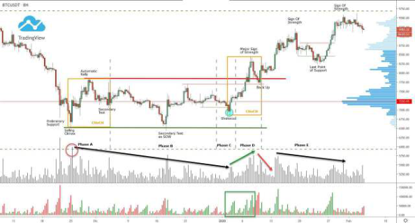

As you know, reading under the Wyckoff methodology approach is universal
and here we see a clear example of the Bitcoin graph.

Again we see a classic accumulation structure this time with a minor
jolt as a test event in Phase C.

After the four stop events, during its development we see a decrease
in the overall volume. First absorption signal and possible control of the
buyers.

Although I have labeled the test at lows in Phase B as a simple test in
terms of sample weakness (ST as SOW), it could also have been seen as the
Phase C Spring. The reasoning that has led me to do it this way is that the

---

<!-- page_236 -->

genuine Spring is automatically followed by the breaking movement, and as
we see in this example, after that potential Spring the price is left lateralizing
in the middle of the structure developing a minor structure. But as I say, these
are minor appreciations. The key will always be in determining where the
final imbalance is occurring.

As I say, after that test in B, the price starts a minor structure right in
the middle of the range, continuously interacting with the VPOC. It is in that
minor structure that I consider Phase C to be occurring with that Shakeout
that shakes off minor low (low within the structure). This is another good
example of the importance of context. A minor structure of re-accumulation
as a function of the Last Point of Support of the major one.

Here we can see how this shakeout does start the breaking movement
almost immediately with that Major Sign of Strength. Later, the Back Up to
the broken Creek confirms the accumulation structure with the appearance of
a good SOSbar and starts the E Phase.

If we make a pure analysis of price and volume, we can see how it
indicates harmony both in the breaking movement (price increase
accompanied by volume increase) and in the retreat movement (price and
volume decrease).

Already in Phase E we evaluate the trend and observe a certain loss of
momentum evidenced by a new price momentum but with a lower volume.
This does not mean that the price will turn around immediately; it is simply a
footprint that suggests that there are fewer buyers willing to continue buying.

We could therefore expect some sort of more far-reaching reversal,
but we have to bear in mind that the general context is that we have a bottom-
up accumulation and that until the price develops a similar distribution
structure we should continue to favor purchases.

---

<!-- page_237 -->

INDITEX ($ITX)

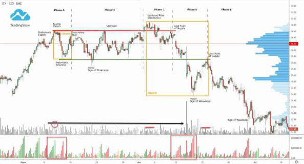

Inditex is a Spanish textile company. In this example we see a classic
distribution structure with a jolt on the 2-hour chart.

After the appearance of the climatic volume on the Buying Climax,
the price develops an Automatic Reaction that is observed very visually by
the Weis Wave indicator producing a very evident change of character
(CHoCH).

Although it is true that there are certain moments of low activity in the
general volume, certain peaks are observed throughout the development,
mainly in the Minor Sign of Weakness and after the Upthrust After
Distribution.

---

<!-- page_238 -->

It is worth noting how the upward movement (UTAD) is carried out
with a relatively low volume, pointing out the absence of interest to be
quoted in those prices. The price produces an aggressive re-entry in the range
that is stopped in the VPOC of the structure profile. A new bullish attempt is
blocked by the sellers just in the high zone that establishes the high of the
BC. This is the Last Point of Supply. A subsequent downward gap announces
the aggressiveness of the sellers. The imbalance in favor of the bearish has
already materialized and the urgency to exit is evident.

In the Major Sign of Weakness movement the new change in
character is observed but this time to announce the imbalance in favor of
sellers. As always, very visual the Weis waves.

The subsequent upward movement with a decrease in volume would
leave the last support point of the offer (LPSY) to start from there the trend
movement out of the range in Phase E.

It seems to be a coincidence that this LPSY is produced in the lower
part of the structure, in the broken Ice that establishes the low of Automatic
Reaction; but it is not a coincidence, the markets generally have very
identifiable trading areas and sometimes they leave us with very genuine
structures as this example is.

---

<!-- page_239 -->

GOOGLE ($GOOGL)

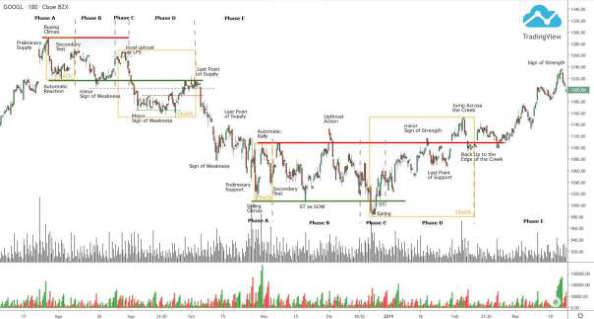

With Google we can study how the complete development of a price cycle
with a distribution phase, downward trend, accumulation phase and upward
trend is represented.

It is a graph that is already more complex to analyze but we can
clearly see how the market moves; how it develops a distribution structure as
a cause of the subsequent downward trend; and how they need to make an
accumulation campaign before starting the upward trend phase.

To be highlighted in the distributive structure is that test in Phase B
that denotes weakness (minor Sign of Weakness), suggesting the possible
imbalance in favor of the sellers, and how the Phase C event is a local shock
at a relative high within the range. The reading is that buyers are so absent

---

<!-- page_240 -->

that they do not even have the capacity to drive the price to the top of the
range. After the effective bearish break (Major Sign of Weakness) we can see
the generation of a new minor redistributive structure whose shock will test
just the zone of the Ice of the major broken structure. Another new example
of the importance of context, where the minor structures fit within the major
ones.

In the lower part of the graph we analyze the accumulation structure
and again it seems to have been taken out of a book because the genuineness
of its movements is fascinating. After the Spring in Phase C, the price fails to
break the high part at first, leaving such a movement labeled as minor Sign of
Strength. It requires a backward movement in which the price "takes a run" to
jump the creek, recalling Evans' analogy with the Boy Scout. After the
effective upward break (Jump Across the Creek), the price retreats to the
zone and is refused to re-enter for up to two times before starting the out-of-
range trend movement. This is a very good example of the importance of not
re-entering the range. Buyers appear right in the critical zone to keep pushing
the price.

---

<!-- page_241 -->

AUSTRALIAN DOLLAR/US DOLLAR
CROSS ($6A)

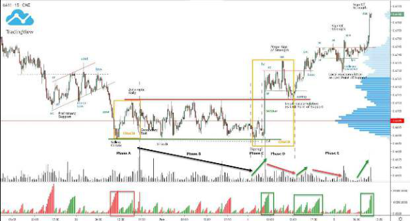

In this last example we are going to analyze a graph in temporality of 15
minutes. As already mentioned, this type of analysis does not know about
time frames. It is a universal approach since it is based on the universal law
of supply and demand. It is a perfect capture to exemplify what we
understand by market fractality, where price develops the same structures
although in different ways over all time frames.

On the left we see that the beginning of the accumulation campaign is
born with a minor structure of redistribution in function of preliminary stop
(Preliminary Support). In this case, this structure is developed with a slight
upward slope. Although they are not easy to see, this type of structure is also

---

<!-- page_242 -->

tradable since, as we see, the events appear in the same way. The only thing
to take into account is that the slope of the structure will indicate if the
market has greater strength or weakness in the background. In this example
we already see how that upward slope suggested certain strength.

After the stop of the downward movement, we see a reduction of the
volume during Phase B and a genuine Spring + test as Phase C. Classic
development of the accumulation schematics.

Once the range is broken, the price manages to stay above it and
creates a minor structure of reaccumulation with a shock that reaches the
broken area, depending on the BUEC of the major structure. Very visual how
the volume suggests a certain harmony at all times, being observed in
increase on the impulsive movements and in decrease on the corrective ones.

Already during Phase E the market generates a new structure of
reaccumulation with a new shakeout that serves to continue the price rise.

Making a correct reading in real time is complicated but we have to
rely on all these signals to try to determine as objectively as possible who is
in control. Context, structures and trading areas.

---

<!-- page_243 -->

BIBLIOGRAPHY

Al Brooks. (2012). Trading Price Action Trends. Canada: John Wiley
& Sons, Inc.

Al Brooks. (2012). Trading Price Action Trading Ranges. Canada:
John Wiley & Sons, Inc.

Al Brooks. (2012). Trading Price Action Reversals. Canada: John
Wiley & Sons, Inc.

Anna Coulling. (2013). A Complete Guide To Volume Price
Analysis: Marinablu International Ltd.

Bruce Fraser. Wyckoff Power Charting. www.stockcharts.com

David H. Weis. (2013). Trades about to happen. Canada: John Wiley
& Sons, Inc.

Enrique Díaz Valdecantos. (2016). El método Wyckoff. Barcelona:
Profit Editorial.

Gavin Holmes. (2011). Trading in the Shadow of the Smart Money.

Hank Pruden. (2007). The Three Skills of Top Trading. Canada: John
Wiley & Sons, Inc.

Hank Pruden. (2000). Trading the Wyckoff way: Buying springs and
selling upthrusts. Active Trader. Páginas 40 a 44.

Hank Pruden. (2011). The Wyckoff Method Applied in 2009: A Case
Study of the US Stock Market. IFTA Journal. Páginas 29 a 34.

---

<!-- page_244 -->

Hank Pruden y Max von Lichtenstein. (2006). Wyckoff Schematics:
Visual templates for market timing decisions. STA Market Technician.
Páginas 6 a 11.

Jack. Hutson. (1991). Charting the Stock Market: The Wyckoff
Method. United States of America: Technical Analysis, Inc.

James E. O´Brien. (2016). Wyckoff Strategies & Techniques. United
States of America: The Jamison Group, Inc.

Jim Forte. (1994). Anatomy of a Trading Range. MTA Journal /
Summer-Fall. Páginas 47 a 58.

Lance Beggs. Your Traing Coach. Price Action Trader.

Readtheticker.com

Rubén Villahermosa. (2018). Wyckoff Basics: "Profundizando en los
Springs". The Ticker, 1. Páginas 14 a 16.

Tom Williams. (2005). Master the Markets. United States of America:
TradeGuider Systems.

Wyckoff Analytics. (2016) Advanced Wyckoff Trading Course:
Wyckoff Associates, LLC. www.wyckoffanalytics.com

Wyckoff Stock Market Institute. (1968). The Richard D. Wyckoff
Course in Stock Market Science and Technique. United States of America

---

<!-- page_245 -->

ACKNOWLEDGEMENTS

I sincerely hope that the study of this book has brought you value and allows
you to reach higher levels in your performance as a trader or investor.

The content is dense and full of nuances. It is very complicated to
acquire all the knowledge with a simple reading, so I recommend you to
make a new study as well as personal notes for a better understanding.

I would love to know your opinion about the book so I invite you to
leave a rating in the Amazon reviews.

As you know, I am continuously doing research and sharing more
information so do not hesitate to write me at info@tradingwyckoff.com so
you can receive new updated content for free.

See you on the networks!

Twitter

Youtube

Instagram

Web

Twitch

---

<!-- page_246 -->

ABOUT THE AUTHOR

Rubén Villahermosa Chaves has been an independent analyst and trader in
the financial markets since 2016.

He has extensive knowledge of technical analysis as well as
developing trading strategies based on quantitative analysis.

His passion for the world of investment has led him to devour a great
deal of training on this subject which he tries to spread from principles of
honesty, transparency and responsibility.

---

<!-- page_247 -->

BOOKS OF THIS AUTOR

Wyckoff 2.0: Structures, Volume Profile and Order Flow

Trading and Investing with Common Sense

Are you a demanding trader? If the answer is yes, this book has been written
for you.

This is the natural evolution of the Wyckoff Methodology, a technical
analysis-based approach to trading the financial markets that has stood the
test of time.

---

<!-- page_248 -->

This book combines two of the most powerful concepts: the best price
analysis with the best volume analysis.

What will you learn?

Sophisticated concepts and complex doubts of the Wyckoff
Methodology.

The B-side of the financial market: the current trading
ecosystem.

The crossing of orders: the real engine of the market.

Advanced tools for volume analysis:

Volume Profile trading principles.

Order Flow basics.

How to build your own trading strategy step by step.
