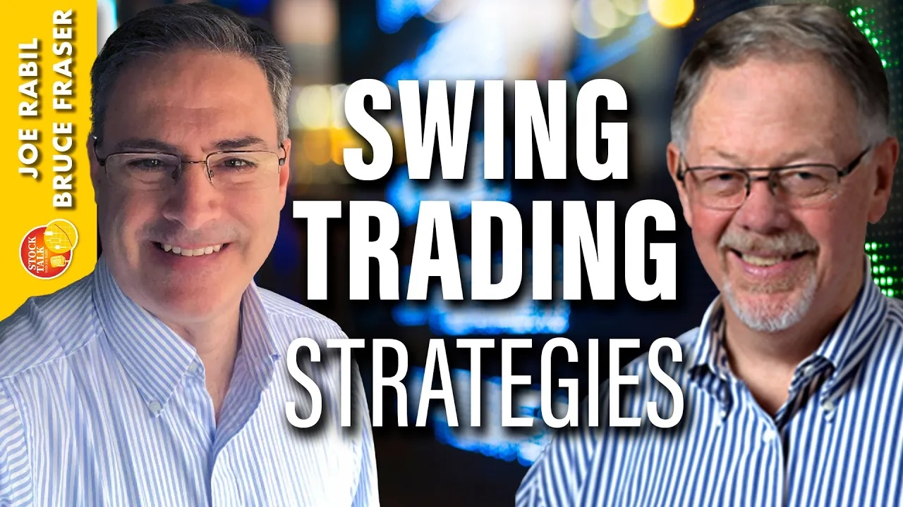

# Swing Trading Strategies, Tips & Trends

URL: https://articles.stockcharts.com/article/articles-stocktalk-2024-02-swing-trading-strategies-tips-487/
Date: February 29, 2024 at 05:44 PM
Author: Bruce Fraser

On this week's edition of Stock Talk with Joe Rabil, Joe features special guest, Bruce Fraser of Power Charting. Joe and Bruce discuss swing trading in detail, first by defining swing trading and how it is different from trend trading, and then spending time going through the SIG chart, describing the details of the trend and momentum that made it worth watching. Finally, they spend time showing the entry and price targets. Joe will be covering stock requests again next week.

This video was originally published on February 29, 2024. Click this link to watch on StockCharts TV.

Archived episodes of the show are available atthis link. Send symbol requests to stocktalk@stockcharts.com; you can also submit a request in the comments section below the video on YouTube. Symbol Requests can be sent in throughout the week prior to the next show.
