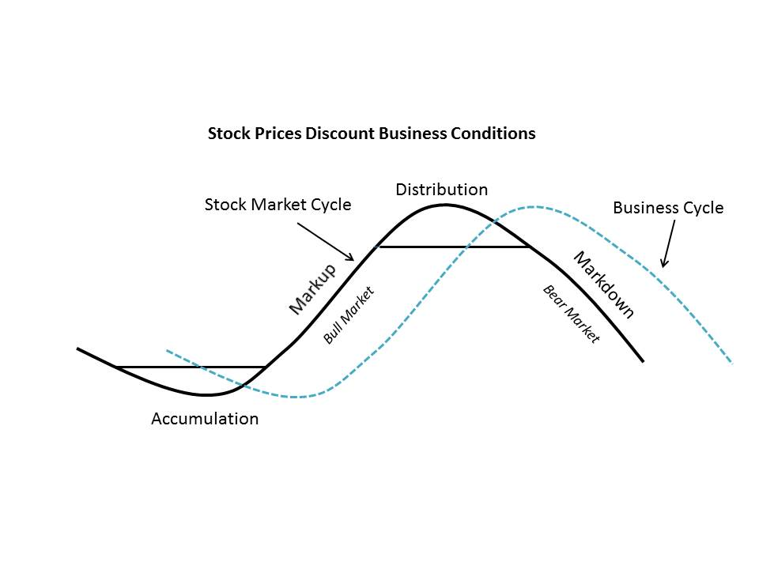

# Getting some Basic Wyckoff Terminology Under our Belts

URL: https://articles.stockcharts.com/article/articles-wyckoff-2015-05-getting-some-basic-wyckoff-terminology-under-our-belts/
Date: May 11, 2015 at 07:08 PM
Author: Bruce Fraser

The stock market is a mystery. Sometimes it makes sense and it seems rational, such as when stock prices rise with expanding earnings growth and general business conditions. And conversely when stock prices typically fall with declining earnings and sales growth. At other times the stock market does not make sense when the news and business conditions are out of whack with the trend of prices.

The business cycle is an endless phenomenon of ebb and flow, typically alternating between recession and expansion every four to six years. This cyclicality of business activity seems to coincide with bull and bear markets and the trend of stock prices. Bull markets track expansionary business conditions and bear markets correlate to general business contractions. When the business cycle is plotted alongside the stock market, they somewhat track each other. But on closer inspection the stock market cycle leads the economic (or business) cycle, typically by six to nine months or more. What this means is that at the beginning of a new bull market in stocks the economy is still contracting. Stock prices stop falling and some stocks even start turning up while earnings, sales and general business conditions continue to worsen. The general mood of the investment community is gloom and doom. For many months prior to the low in stock prices, the news on the economy deteriorates. At the bottom of a bear market pessimism is everywhere. There is an old saying: Wall Street is the only place that gives a half-price sale and nobody shows up.

---

Then all of a sudden the lows are in for the best stocks and some stock indexes. And herein lays the paradox for investors. It will be six to nine months before the final low in the economy is in place. It will take economists another six or more months before they see enough economic data points to proclaim that the recession is over and ‘business conditions are in the recovery phase’. If an investor waits for this announcement, stocks will have been rallying for more than a year and the very best performing stocks will have already climbed to substantially higher prices.

At the end of a long bull market in stocks, this phenomenon works in reverse. Stock prices and indexes begin to sag. They no longer follow good economic and earnings news to higher prices. Meanwhile analysts are singing the high praise of company conditions and economists see endless prosperity for the economy. Larry Livingston said in Reminiscences of a Stock Operator, “I was in such a hurry to try the new key that I did not notice that there was another lock on the door…a time lock!”

The characteristic of the stock market leading economic conditions is often referred to as a “discounting mechanism”. A company’s stock price can trend for a year or more before there is evidence of a turnaround in its business conditions. But Wall Street seems endlessly fascinated with the lagging indicators of business activity; corporate earnings, sales growth, etc. Isn’t it likely that anyone making decisions using this lagging data will be surprised when Mr. Market changes the lock and the bull becomes a bear or the bear a bull?

Richard D. Wyckoff understood that stock price trends precede and discount future business conditions. He also made it his life’s work to understand the reason stock prices go up and go down (which may surprise you and will be the subject of our next blog post). He devised a methodology that depends solely on the action of stock prices. He called this technique “tape reading”. What he did to read the ‘tale of the tape’ was to plot daily price activity on a vertical bar chart with volume for the day plotted below the price. We know these as bar charts. He understood the stock price to be the ultimate leading indicator. The Wyckoffian Analyst strives to correctly anticipate a stock’s future direction by the action of its own price.

Four primary phases make up the classic stock market cycle: The Accumulation Phase, The Markup Phase, The Distribution Phase and The Markdown Phase. Stock prices as observed in ‘vertical charts’ will behave in uniquely characteristic fashion during each of these phases. The Wyckoffian analyst will become skilled at distinguishing between each of these phases and thus determine when and how to conduct speculative activities. In future blog posts we will study, in great detail, examples of each of these phases. Understanding the attributes of these phases is what Power Chart Reading is all about.

Next time we will reveal the driving force behind stock price movement and “The Real Rules of the Game”.

- Bruce
