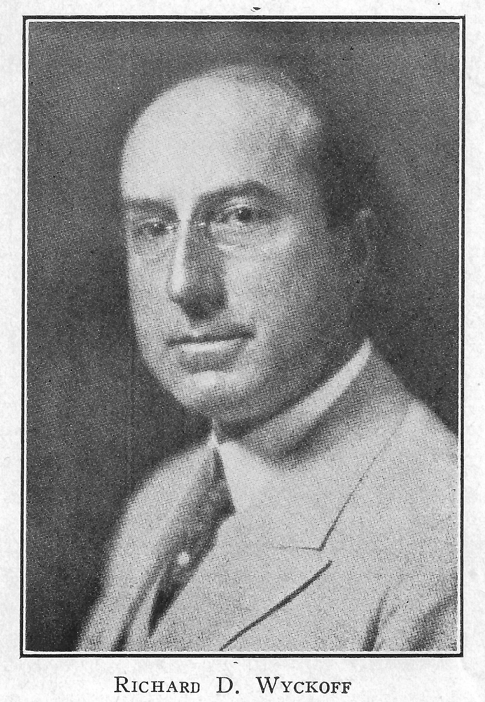
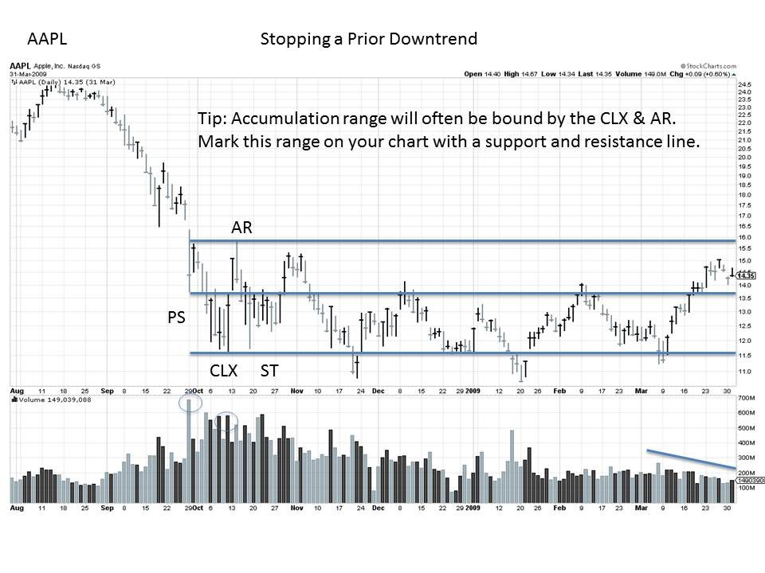

# Richard D. Wyckoff's REAL Rules of the Game

URL: https://articles.stockcharts.com/article/articles-wyckoff-2015-05-richard-d-wyckoffs-real-rules-of-the-game/
Date: May 19, 2015 at 10:39 PM
Author: Bruce Fraser

Stock prices are constantly impacted by large and small forces. These forces propel prices endlessly up and down. If we can make sense of these forces and identify their influence, we can learn to anticipate stock price movements.

Richard D. Wyckoff was determined to know the real reasons behind stock price movements. In his search he discovered a group of better informed, more highly skilled investor / traders. These "super" traders were of such a large scale they had the capacity to influence the trend and direction of prices. These tendencies were revealed by the tape, thus Mr. Wyckoff could see their footprints on the tape (i.e., in his charts). The stock market operations of these traders had common characteristics cycle after cycle. They tended to be in the best stocks in the beginning of the trend and they would stay on the trend longer. Because of the immense scale of their operations, they would arrive very early in the Accumulation Phase for a stock and stealthily buy shares. By working very hard to remain undetected in their buying operations, huge quantities of stock could be acquired at low prices. The goal was always to accumulate shares without driving the price up on themselves. Such operations could take months. Large amounts of capital were skillfully and quietly deployed at bottoms. Wyckoffians call this absorption of the floating supply of stock.

---

Wyckoff concluded that such operations, conducted on a large scale, would result in the chosen stocks rallying dynamically after the accumulation phase. These targeted stocks would move further, faster and longer than other stocks. These were the stocks worth owning.

Avoiding detection was essential to the conduct of such large operations. Super traders are always in competition with other super traders for the available float of the most desirable stocks. Secrecy in the conducting of a campaign is critical. The combined activities of these large competing super traders became the focus of Mr. Wyckoff’s analysis. He learned how to see their operations in the charts. Their actions could have stealth, but their footprints were seen all over the charts. They could not hide from Wyckoffian analysts who could see this evidence in the way price bars behaved and in the volume characteristics. These unknown large traders, in aggregate, became known as the “Composite Operator”.

Composite Operators demonstrate skills and abilities in their campaigns that are not evident in most traders. Mr. Wyckoff was determined to become like them in thought and action, and he did. He was then determined to teach the public about the activities of their operations and how to detect them. Thus the birth of the Wyckoff Method.

The “Real Rules of the Game” were the activities of the Composite Operator. Mr. Wyckoff wanted to raise the investing public’s awareness of these operations. Without this knowledge, the public’s tendency is to enter the markets at the wrong time in the trend, do the wrong things and lose their savings. The natural instincts of the layman are the wrong ones for trading and investing. Mr. Wyckoff taught students how to act in concert with the C.O. and therefore learn to think like the C.O.

The Composite Operator is a heuristic, a useful fiction. The C.O. is the story of the collective activities of a number of professional operations occurring at the same time. In aggregate they reveal themselves in the vertical bar charts. We tell the story of their actions and motives as though they are one giant operator. We do this through the careful study and interpretation of the charts. By repeatedly telling the story of the C.O. on the charts, the Wyckoff student begins to think and act in concert with these professional activities.

Recall from the last post the cycle of Accumulation, Markup, Distribution and Markdown. Each phase has the characteristic footprints of the C.O. revealed in the charts. Accumulation begins with the stopping action of the prior downtrend (markdown phase). We will explore at great length each of these phases. Wyckoff is a mastery process and repetition is the key to mastery. So let’s start with the stopping action of the prior markdown with this 2008-9 look at AAPL. Stopping action involves: Preliminary Support (PS), Selling Climax (CLX), Automatic Rally (AR) and Secondary Test (ST). Study these points on the AAPL chart. Pay attention to the nature of the vertical bars and the volume. Stopping the prior trend is the beginning of the activities of the C.O. to accumulate shares. There is still much chart activity that must occur to demonstrate that the stock is ready for purchase by the Wyckoffian. Between now and our next post, try to find more examples of this stopping action. A hint is to look at the indexes and some stocks during 2008-9.

Until next time, Bruce
