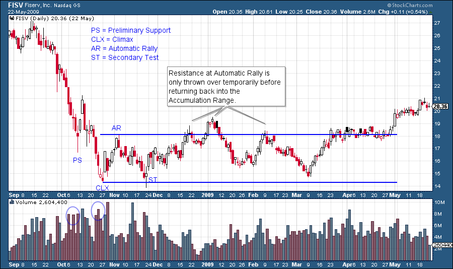
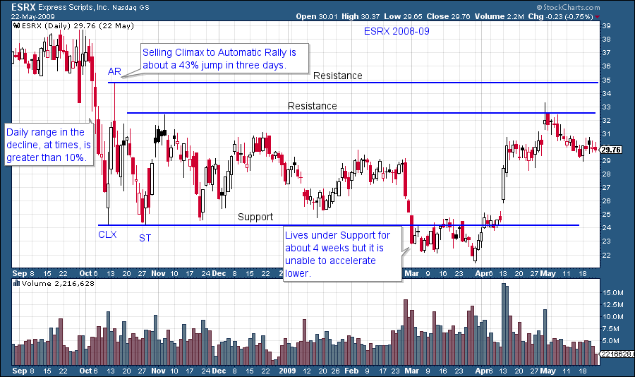
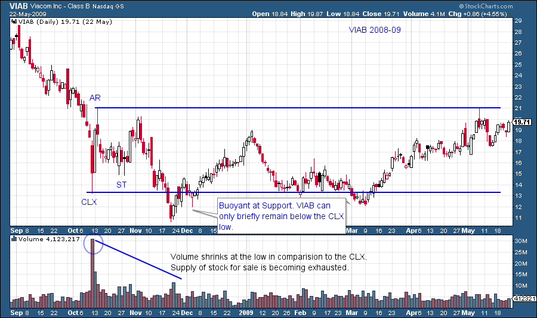
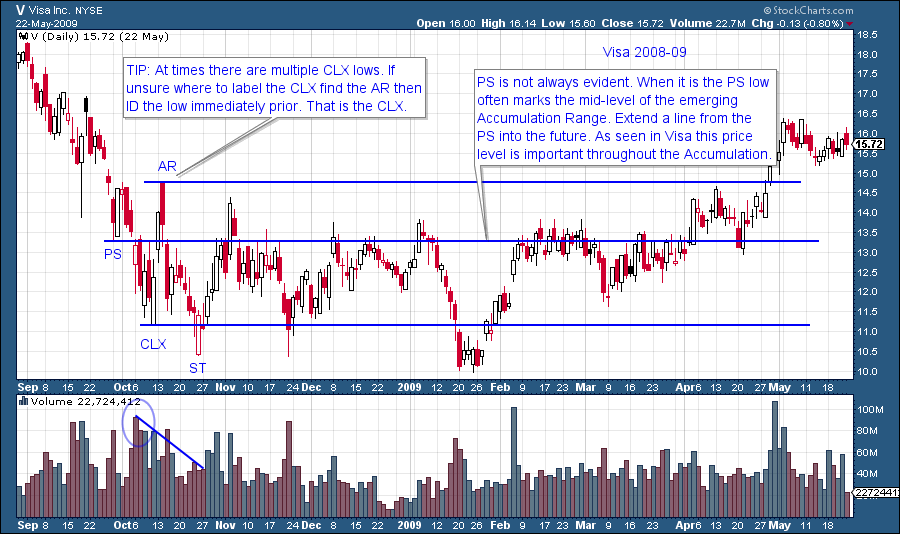
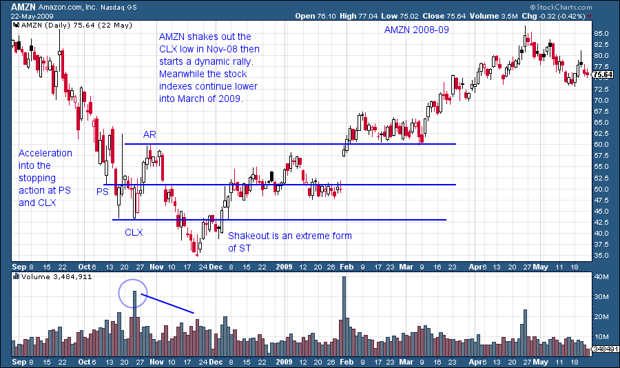
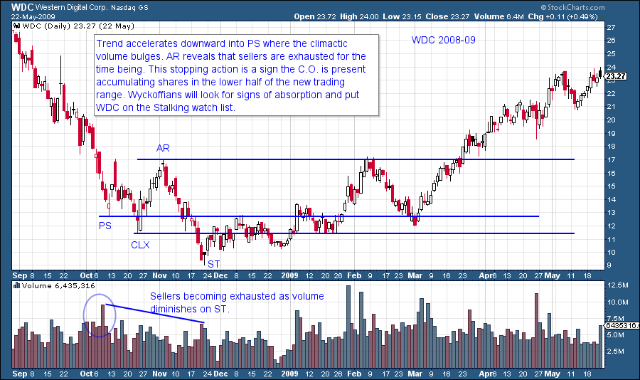

# The Stopping Action of a Downtrend

URL: https://articles.stockcharts.com/article/articles-wyckoff-2015-05-the-stopping-of-a-downtrend/
Date: May 26, 2015 at 08:39 PM
Author: Bruce Fraser

A downtrend occurs when the supply (of shares) is greater than the demand. The float of a stock is the total number of shares owned by investors and traders in the marketplace. With the exception of corporate buybacks and secondary offerings, the float of a stock is relatively constant and owned by individuals, institutions, hedge funds, etc. Why do stocks have long uptrends and downtrends? Wyckoff believed that it is a change in the quality of the ownership of the floating supply of stock. If the ownership quality is high, the stock will rise. If the quality is low, the stock will be vulnerable. Who controls the floating supply of stock? Is it in strong or weak hands? That is the endless question in stock speculation.

Downtrending stock prices reflect a poor quality of ownership. Mr. Wyckoff would say the stock is in weak hands. Under low quality ownership, stock prices can fall for a long time. What is the change in conditions that will stop a downtrend? Eventually after many months of decline, stock prices will become panicky. As volatility rises, the decline of prices accelerates. The daily range of prices can widen to three or more times a normal range and volume will be very high.

---

Acceleration of prices downward is very unnerving to investors. Many are selling shares. This volatility in the stock price may be in conjunction with negative news about the stock or the economy as a whole. This provides multiple reasons to sell. The entire market may be subject to this selling contagion. Selling in one stock leads to selling in other stocks, especially in margined accounts.

Relentless selling can go on for days and weeks. One memorable description is that it is like a ‘fever that won’t break’. Then the climax day arrives. The climax day can have a range of trading that is gigantic when compared to the days and weeks that preceded it. One attribute of this very wide ranging day is that for much of it, prices often will trade wildly around the lows of the day on extreme volume, and then close above the mid-point of the day’s range. This is an important day! We will label this the climax day (CLX) on our charts. Most likely, high quality buying came in on that day. What prices do in the following days and weeks is important to confirming our analysis.

Our chart analysis will attempt to determine if this high quality buying is the Composite Operator returning to the stock to begin absorbing shares at bargain prices. This absorption will take weeks or even months and it is a very good sign. We will watch this stock closely for the moment when the Wyckoffian trader can jump on board with the C.O. as they begin marking up the stock to much higher prices.

(Click to view a live version)

High volume is a sign of the Composite Operator stepping up and buying stock. This is high quality demand meeting panicky selling. Wyckoff analysis looks for four chart points: Preliminary Support (PS), Selling Climax (CLX), Automatic Rally (AR) and Secondary Test (ST). When these four points are identified the conclusion is the Markdown has been stopped. It is too early in the trading range to call this Accumulation. This sequence is often called 'Stopping Action'.

(Click to view a live version)

Immediately upon the identification of the PS, CLX, AR and ST draw support and resistance lines out into the blank space of your chart. Prices will tend to be bound by this support and resistance. This is one of the most useful techniques in technical analysis and is unique to Wyckoff analysis. Note the extreme volatility present during a markdown. This volatility is unnerving to most investors and often leads to panicky selling. Also the AR is a sign of the exhaustion of supply which is brief and dramatic (the percentage jump of the AR is eye popping but temporary). Expect a decline back to or through the CLX after the AR. There is still much overhanging supply. Attempting to trade a Markdown and CLX is not advised for new Wyckoffians because of the extreme volatility (even old Wyckoffians tend to avoid them).

(Click to view a live version)

Note how the support line drawn at the CLX level comes into play later in the Accumulation Phase. Also the Resistance line at the AR goes to work a full seven months later.

(Click to view a live version)

(Click to view a live version)

Preliminary Support (PS) is a brief pause in the drop of the stock price followed by a modest bounce (see two examples above). PS is a sometimes occurrence. The PS is a sign of good demand beginning to buy shares. The PS can be distinguished from a CLX by what price does next. An AR indicates that the prior low was a CLX. We will address the benefits of the PS in future posts.

(Click to view a live version)

In trading ranges demand and supply are in balance. With the Wyckoff Method we learn how to determine if there is something more going on in the trading range and that is Accumulation by the C.O. In this blog we have studied the first phase of Accumulation. Accumulation is a progression that takes time, often many months. Here is some homework. Look at these stocks in the same 2008-09 timeframe: UNH, HD, MAR, KO, TXN, LBTYK, SIAL, CTSH, BRCM.

Until Next Time, Bruce
