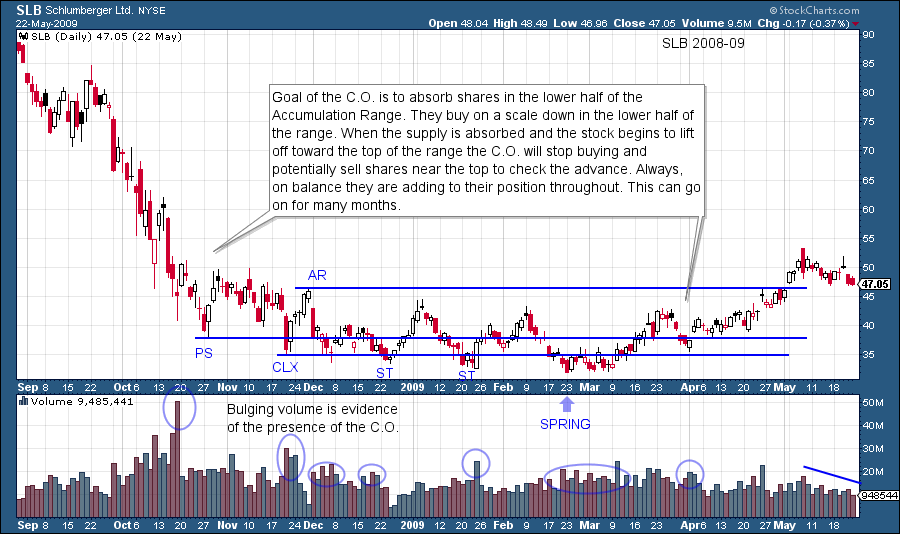
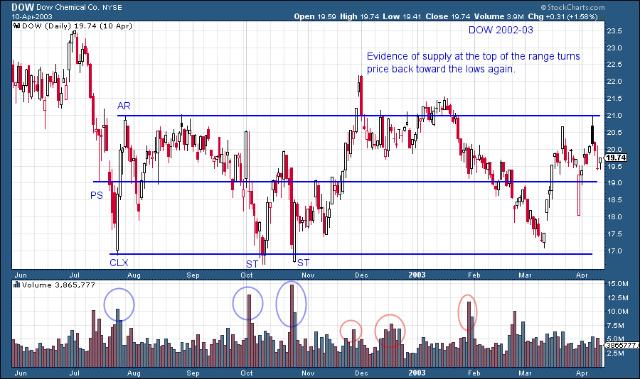
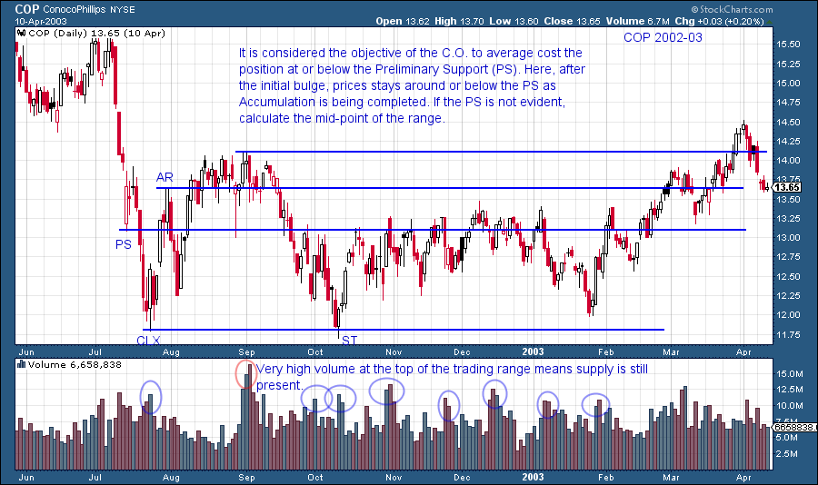
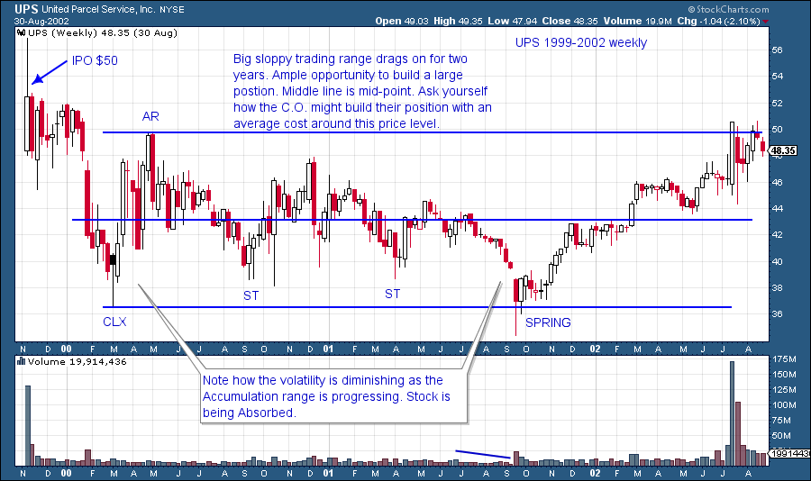

# Accumulation Phase; Absorbing Stock Like a Sponge

URL: https://articles.stockcharts.com/article/articles-wyckoff-2015-06-accumulation-phase-absorbing-stock-like-a-sponge/
Date: June 02, 2015 at 09:35 PM
Author: Bruce Fraser

What are the conditions that need to be in place prior to a long and sustained rally in a stock? That is an important question to ask because it is not a random accident when a stock rises bigger, better and faster compared to most other stocks. When large, informed interests (Composite Operator) determine that the stock of a company will be a substantial holding in their portfolio, a campaign is planned. The purpose is to acquire a large number of shares at a favorable price with the expectation that the company will experience dynamic growth and propel the stock price to a much higher level. The initial phase of the campaign is to absorb the targeted number of shares. Planning is required as it could take many months to accumulate the desired quantity. The goal is to buy these shares quietly without drawing attention to their activities. The C.O. cannot hide their actions forever; eventually they will be discovered by other C.Os. This early large buyer becomes active in the stock during the Selling Climax, or soon thereafter, and has the greatest advantage in accumulating shares quietly. A Selling Climax is accompanied by large quantities of stock for sale. As the Accumulation Phase progresses it gets harder to purchase large numbers of shares and it requires greater trading skill.

---

During the entire Accumulation Phase there is an overhanging supply of stock for sale. With careful planning and execution the C.O. intends to absorb these shares at the lowest average price possible. As this phase evolves, greater numbers of C.O.s will be competing for fewer and fewer available shares for sale. The paradox is the public becomes ever more pessimistic when prices remain low and listless. Here is a key to the C.O. strategy; keep prices low. As the Accumulation Phase develops this becomes ever harder to do. Mr. Wyckoff was intimately familiar with the C.O.’s methods and knew that their footprints on the charts could not be hidden.

Absorption is the key feature (that a Wyckoffian cares about) of the Accumulation Phase. The C.O. absorbs shares, like a sponge, at a good price/value with the intention of holding the shares for a very long time. The only scenario that would cause the C.O. to sell these absorbed shares would be much higher prices. If the Composite Operator community absorbs, buys, locks up most of the available floating supply of stock, what happens to the price of the stock? Once the stock is in ‘strong hands’, available supply will be low and even a slight increase in demand will cause the stock price to jump. The major uptrend begins. This is when the Wyckoffian gets busy buying shares to ride along with the large, informed interests.

Last week hedge fund research firm Preqin made news with a report that 92% of hedge fund assets are controlled by 11% of the 5,122 hedge funds in operation. A total of 570 hedge fund managers control $2.78 trillion of assets. Can there be any doubt these hedge funds are the best of the best and deploy their equity capital with great skill? They are competing with each other for the preeminent ideas and are collectively allocating a massive capital base in to equities and other asset classes. Also, these C.O. types are competing with other extremely skilled institutional investors (mutual funds, pension plans, ETFs). Remember, not all institutional investors are Composite Operators and not all Composite Operators are institutional investors. Equity capital tends to concentrate where it will work the hardest. Consequently, as reported by Prequin, the most skilled managers (the C.O.) control the majority of the capital.

(Click to view a live version)

Stock is bought on weakness as the stock price falls from the top of the Accumulation range to the bottom. Support at the bottom of the range is the result of large C.O. buying activity and this can be seen in the spike of volume activity.

(Click to view a live version)

A trading range is a gridlock of supply and demand. In this example DOW has bulges of volume toward the top of the range. Supply is evident and must be absorbed prior to any meaningful uptrend starting. Volume will diminish as the stock progresses further into the Accumulation range. Many stocks have trading ranges that are not actively being absorbed by strong hands. These stocks will not show the attributes of Accumulation and will continue in a trendless pattern for a long time.

(Click to view a live version)

This week's blog is a discussion of the trendless trading range that follows stopping action (see our prior blog post). For the investor/trader this is an insufferably long time period. Volatility is high and prices are low which leads to capitulation by retail investors as they give up and sell stock. Meanwhile the C.O. is systematically using this environment to buy shares. During all of this back and forth action the Wyckoffian is patiently waiting on the sidelines for that moment when the stock is ready to become active again as the uptrend begins (the subject of upcoming blogs).

(Click to view a live version)

Two years of trading range activity is an excruciatingly long time. Note the final act of this Accumulation is to make a minor new low. This is referred to as a spring. Note the change of character as the price reverses off this Spring action (more on Springs later) and marches up to the top of the range. Compare this rally to the prior rallies in the Accumulation.

Homework: My teaching partner and Wyckoff mentor is the legendary Hank Pruden. Make him your mentor by reading his article "Wyckoff Schematics: Visual Templates for Market Timing Decisions", by Hank Pruden and Max von Lichtenstein. This article and other resources can be found at hankpruden.com. Also checkout Hank's book "The Three Skills of Top Trading". It is a modern day classic.

- Bruce
