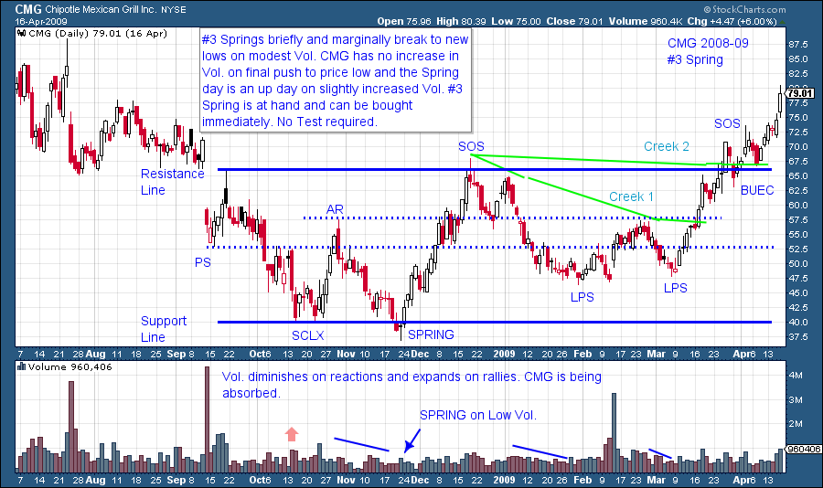
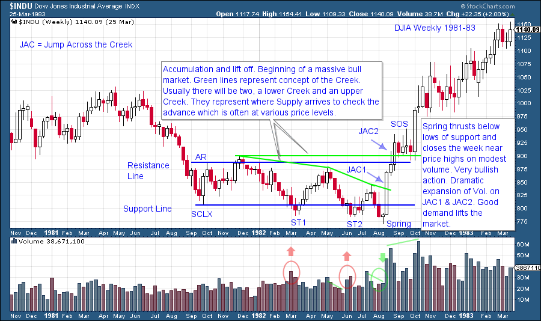
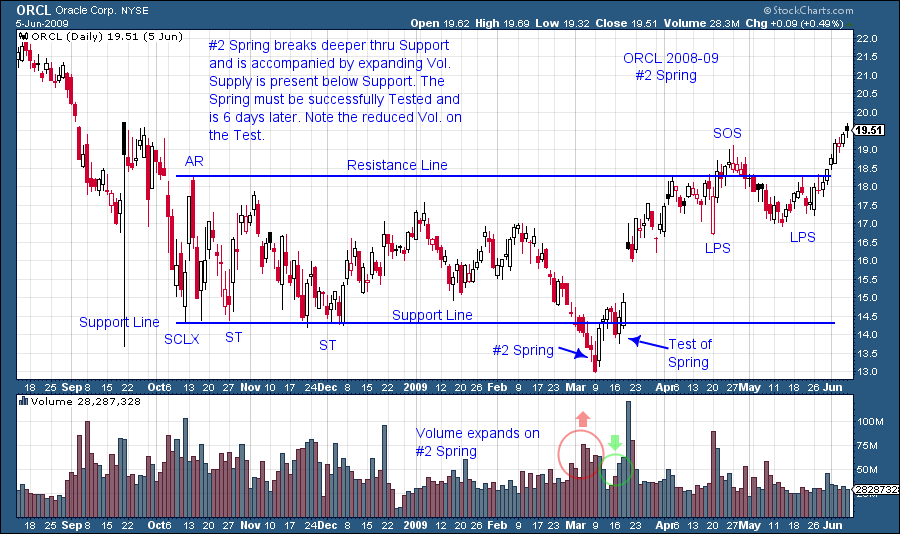
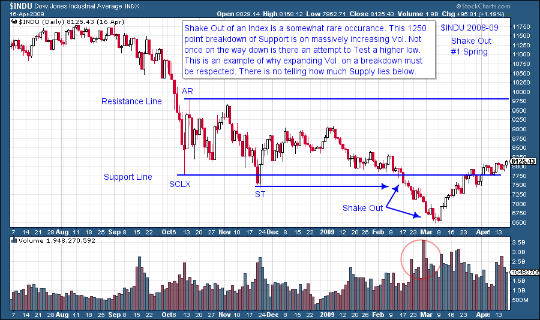

# Francis Bacon Reveals the Nature of Trends

URL: https://articles.stockcharts.com/article/articles-wyckoff-2015-06-francis-bacon-reveals-the-nature-of-trends/
Date: June 13, 2015 at 05:47 PM
Author: Bruce Fraser

Francis Bacon said; “As in nature things move violently to their place and calmly in their place…”. It seems that Mr. Bacon understood the stock market very well. Stocks tend to move calmly, gently, listlessly in their trading ranges and then they move violently into trends. A tipping point between supply and demand is achieved and listlessness morphs into activity. In the gentleness of a quiet and boring market the seeds of change are sown. The genius of speculation is to know when the calm ends. Timing IS everything.

---

Mr. Wyckoff taught that in the process of Accumulation is sown the seeds of change. Accumulation is a Cause that produces a subsequent Effect. In prior posts we have illustrated the activity of Absorption by large interests. A moment arrives when there is no more stock to absorb. The Composite Operator is filled up with stock and the uninitiated public has no more stock to sell. In that moment is the tipping point, where there is no reason for prices to remain listless and boring. All of the shares of stock are in ‘strong hands’. Only much, much higher prices will induce strong handed large interests to supply shares to the market. In effect, there is a shortage of stock to buy. When a shortage of stock is met with a slight bump up in demand, prices can move violently. A trend of major proportions has been launched.

The genius of the Wyckoff Method is to recognize Accumulation disguised as the boringness of listless, trendless prices. Then to wait like a monk for the moment when conditions shift suddenly and take action to align one’s interests with the C.O. The Wyckoffian is trained to see the subtle nuances of absorption in the ups and downs of a seemingly innocuous trading range. Distinctions are seen between the monotonous back and forth of a typical trendless market and the footprints of intelligent activity in Accumulation.

A Spring tests the lower bounds of prices by penetrating the support area and making a new low. This is a ‘Bear Trap’. It encourages bearish traders to short more stock and the public to sell any remaining stock and give up. The Composite Operator (C.O.), will suspend purchases at the level of the prior low to determine if a new supply of stock shows up when prices fall to new lows. For the C.O. a Spring is really a question; How much supply is there below the lows? If there is supply the stock price could skid much lower before the C.O. puts a firm bid under the market. This condition is referred to as a Shakeout. A Shakeout will normally be accompanied by expanding volume. Bulging volume indicates a new supply of stock engulfing the market. Even lower prices typically follow this expansion of supply (volume). A Shakeout (#1 Spring) is a failed Spring.

The volume signature is the final arbiter of the type of Spring developing and this also determines the strategy for entry. In the example below CMG penetrates the low of the Selling Climax and appears to breakdown intraday. But then it closes up on the day. Note the volume; it is about average to its recent past. If there is no active selling below the SCLX (Sell Climax) low; the C.O. concludes from this action that supply is exhausted. The C.O. will add stock to their holdings immediately and on a scale up. Wyckoffians will buy a low volume Spring immediately and place stops below the lowest price. This is often referred to as a #3 Spring.

CMG’s Spring comes earlier in the Accumulation Range than is normal. We would definitively label it a Spring because of the price action that follows. The Sign of Strength (SOS) marches all the way to resistance (and makes a minor new high) on increasing price spread and volume and thus is showing active demand. Typically the Spring action would develop later in the Accumulation formation.

This 1982 Dow Jones Industrial Average September low is the beginning of a historic bull market. It is also a classic formation. Secondary Test 1 (ST1) has the potential to be a Spring on high volume as price meets large supply just below the Support Line. The rally that follows does not reach the Resistance Line and thus does not make a SOS before turning back to the lows. High volume at the lows normally involves a retest as it tells the C.O. that supply is still present. ST2 is another attempt to vacuum up shares at the Support Line and could be a Spring. Volume again is high on the Spring action below Support and another new low. The rally is even less robust than the prior rally staying near the bottom of the Accumulation. Then it turns back to and through the prior lows. Two important things are different here. The two weekly bars of decline are on low volume and the Spring is on low volume (highlighted by the green circle). This is in contrast to the prior two Secondary Tests. The rally that follows is dynamic. In three weeks the DJIA jumps out of the Accumulation range and a new bull market begins.

High volume Springs need to be tested in the following days or weeks. This is because ample supply is present below the support line. If there is a low volume move towards the Support Line (the Test), that indicates the prior supply was absorbed. Low volume Springs do not need to be tested, as this indicates that supply is no longer present. We will devote future blogs to the appropriate trading tactics for these and other entry conditions.

So there are three types of Springs: The Number 3 Spring is a shallow penetration of the prior low on modest volume and can be bought immediately. The Number 2 Spring goes further below the low on expanded volume and then has a brief lift followed by a drop back toward the lows (this is called a test). The test will be on diminished volume and can be bought with stops below the Spring low. The Number 1 Spring is actually a Shakeout that is a complete breakdown. It should not be bought.

In our next post we will continue on the topic of final tests by discussing more on the concept of the Last Point of Support (LPS).

All the Best, Bruce

Homework: SIAL, FAST, PCAR, SLB, BRKB. Study the period of 2008-09 for these stocks. Identify the type of Spring. Bonus points given for attempting to markup the entire Accumulation Phase.
