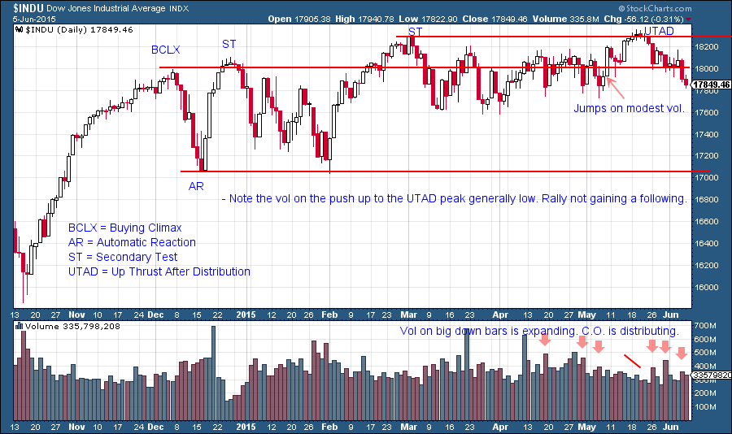
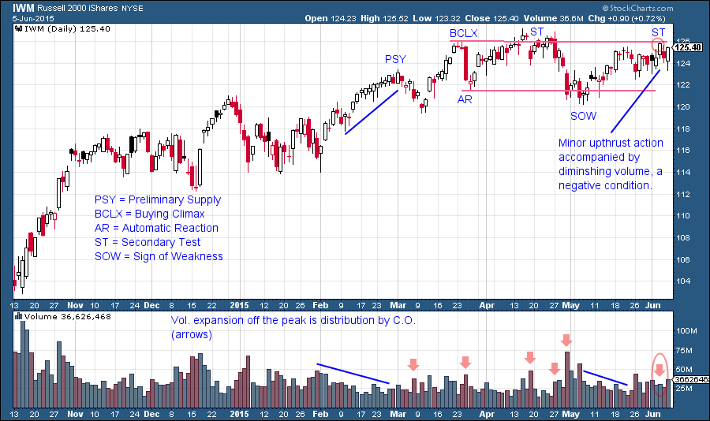

# Fun With Current Charts, Wyckoff Style

URL: https://articles.stockcharts.com/article/articles-wyckoff-2015-06-fun-with-current-charts-wyckoff-style/
Date: June 07, 2015 at 04:10 PM
Author: Bruce Fraser

Accumulation, Markup, Distribution and Markdown are the four basic stages of the Wyckoff Cycle. Prior posts have been focused on the primary phases of Accumulation. There is still more to do, but let’s take a break and explore the current market circumstances, which are very interesting. Consider this an introduction to the principles of Distribution with the promise that we will explore this topic in great detail in the not to distant future.

(Click to view a live version)

---

The $INDU set a trading range with a Buying Climax and an Automatic Reaction. These two points frame the trading range for the foreseeable future. Here we are in June and for the most part that December action is holding true up to today. Also note that on Thursday of last week the $INDU dipped back below the December BCLX peak. We draw horizontal lines from the peak of the BCLX and the low of the AR to establish the outer ranges of the potential Distribution range. Note how price could climb above the BCLX peak but could not stay above nor pull away.

The Up Thrust after Distribution (UTAD) is an interesting development. As a last act in the Distribution area, price will sometimes make a higher high by a marginal amount as it did here. Then it will turn back into the range. In the classic UTAD what follows is a short sharp drop to the bottom of the trading range. These slides tend to be volatile. The chart shows volume expanding on the price declines off each of the recent peaks (red arrows). This is evidence of active selling.

Wyckoffians think in terms of scenarios and tactics. What the bulls need here is a reversal at or above 17,600 and a resumption of the uptrend by charging to a new high. 17,068 is the Automatic Reaction (AR) and is the next target. If price gets to and through this level (even briefly), we would label such a decline a Sign of Weakness (SOW). The subsequent rally would reveal much about whether the entire structure is a large Distribution with further potential for decline, or a Stepping Stone Reaccumulation (we will spend much time on the SSR which is a most important formation). Keep in mind that the character of the classic UTAD is to whoosh down quickly and with volatility.

(Click to view a live version)

The Russell 2000 iShares (IWM) has a different look from the $INDU. The BCLX and the AR arrived in late March. Note how well they contain the subsequent price action. A decline off the Secondary Test (ST) comes on expanding volume and is a sign of active selling and results in a Sign of Weakness (SOW). The May rally does not take the IWM to a new high and we label it a ST. Later the label may change to a Last Point of Supply (LPSY). The primary distinction between the two is that a ST decline to the prior lows of the Distribution Range and the LPSY is the last rally point prior to a larger downtrend. The volatility of the last four bars is somewhat high, and there is no further upward progress. We would conclude this to be churning near the highs. The bulls need a follow through of prices to new highs soon. Otherwise testing the bottom of the trading range or declining further is a real possibility.

Stay tuned as we continue to learn about all things Wyckoff and periodically include current market updates.

All the Best, Bruce
