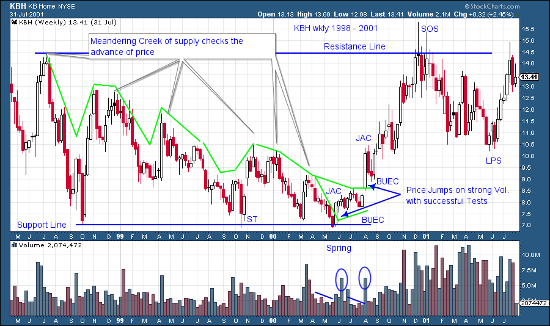
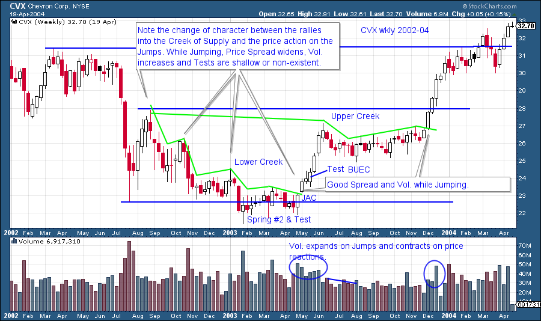
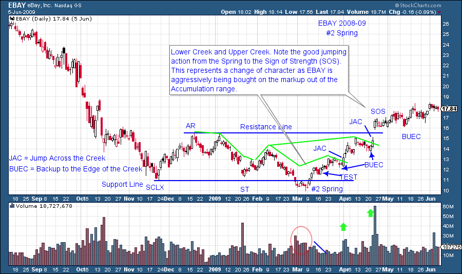
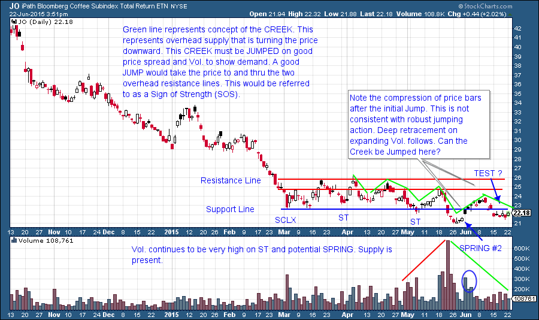

# Jumping the Creek

URL: https://articles.stockcharts.com/article/articles-wyckoff-2015-06-jumping-the-creek/
Date: June 23, 2015 at 10:23 AM
Author: Bruce Fraser

Prices behave differently when a trend begins. Each price bar tells a story during the sideways action of an Accumulation Range and each bar tells a different story when the trend starts. A big, long trend is born inside the inconspicuousness of an Accumulation area. The keen eyed Wyckoffian is able to detect this change in behavior as the trend begins, and initiate a campaign in the stock.

In an Accumulation range the forces of overhanging supply keep the price of a stock suppressed. Supply is not a linear phenomenon. Selling does not always arrive at a constant price of $50 (as an example). Great market operators understand that big supplies of stock will materialize and stop the advance of the stock price and cause a return back to Support levels. Each attempted rally can be met by supply at different price levels inside the Accumulation area.

---

Robert Evans took the helm of Wyckoff Associates (which became the Stock Market Institute) in the early 1950’s. He was a master Wyckoffian and a great teacher. He used memorable analogies and story telling to convey important concepts. The colorful 'creek story' conveys the nature of overhanging supply in the trading range. He tells the story of the Boy Scout hiking in the woods along the banks of the creek. To continue to his destination the scout must find a place to cross to the other side of the creek. But the creek (supply of stock) is too wide and running too fast for a jump to the other side. So he meanders along the creek and at times walks away from the banks and then returns to find a place to cross. Eventually the creek narrows enough that the Boy Scout determines that he can jump across if he gets a good running start. At this narrow place he backs up away from the banks of the creek, gets a mighty running start and leaps across to the other side. The momentum of his run carries him away from the opposite bank. He then decides a rest is needed and returns to the creek, takes his shoes off, and puts his feet in the water. After his rest he resumes his journey away from the creek and onward. The creek no longer represents a barrier (resistance) on the journey to his destination (higher prices).

Of course the creek story is about the overhanging supply of stock for sale that keeps prices from starting their upward trend. A dramatic event is needed to put prices on the other side of the creek. A creek meanders through the forest turning here and there, while becoming wide and then narrow. The supply of stock works in much the same way. A wavy line can be drawn over the price peaks where prices are turned back down by selling pressure. It looks like a creek. There will come a place where the stock will back up (a Spring or Last Point of Support), get a head of steam and then leap to the other side by absorbing the remaining supply. This leap or Jump (as Mr. Evans would call it) has a signature characteristic of widening price bars and a surge in volume (the required energy to overcome the remaining supply). To a Wyckoffian these attributes of price and volume are different than what came before and this indicates that a trend is emerging. The Composite Operator is embarking on a long term campaign in this stock, and the Wyckoffian analyst can see this in the change of price and volume behavior. It is the time for action.

Often a creek will split off into two, a lower creek and an upper creek. Accumulation ranges will often have two supply areas (two creeks) that must be crossed. The Resistance Line is often the price area where another surge of selling will materialize and stop the price advance. Once this resistance area is overcome the stock will have cleared the entire Accumulation area and will be emerging into an uptrend.

Supply is like a meandering Creek that flows and exerts pressure on prices throughout an Accumulation. Sellers of stock are willing to put Supply out at lower and lower prices. This can give the chart a particularly bearish look. Ironically as the C.O. is accumulating shares, the majority of the public is becoming ever more pessimistic toward the stock. The Jump (JAC-Jump Across the Creek) and the Backup (BUEC-Backup to the Edge of the Creek) are ‘bell ringing’ events on the chart. They indicate the readiness of the stock to start moving upward through the Resistance Line and onward.

After a JAC comes the BUEC. A shallow retracement during the BUEC is a good sign and indicative of the change of character of prices as they rise upward. A JAC is synonymous with a SOS (Sign of Strength) and BUEC with a LPS (Last Point of Support). They can be used interchangeably.

The rise from the #2 Spring is not being labeled a JAC as Volume is not expanding. The JAC comes later where a notable surge of Volume lifts the price rapidly. Later the upper Creek is jumped on a Volume surge. This is a major SOS.

Thank you to reader Josh for submitting Coffee futures for analysis. We are analyzing coffee using the iPath Coffee Subindex ETN (symbol JO) as a proxy so the volume and price signatures might vary somewhat from the futures contract. This is a good example for the current topic of JAC’s. A Creek of overhanging supply is blanketing Coffee here. JO had a Spring and volume surged in. But almost immediately the price bars became compressed and volume dried up as it rallied. Now it is back below Support having corrected more than halfway back to the Spring on generally high volume. There is still supply influencing the price action. Your homework is to write up what you would need to see to label the subsequent price and volume action as a JAC and a BUEC. This is a real-time exercise and only for educational purposes. It is not a recommendation to buy or sell.

All the Best, Bruce
