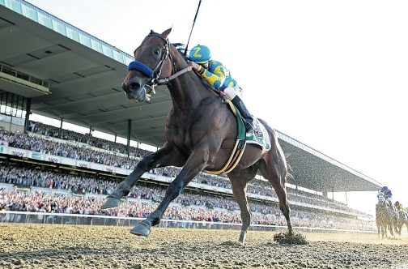
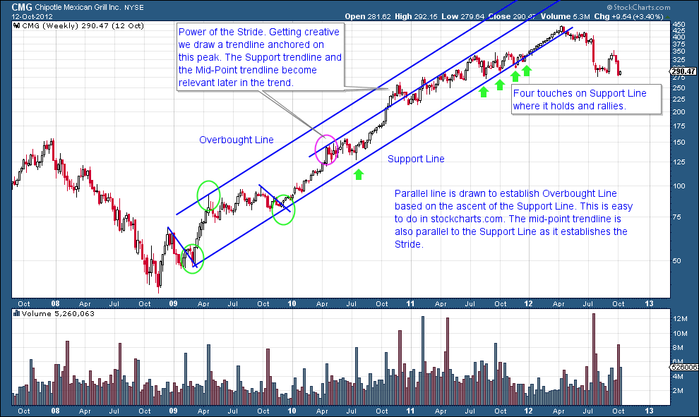
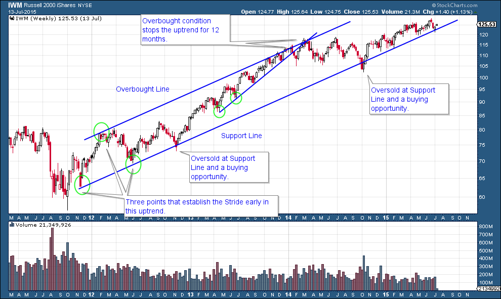
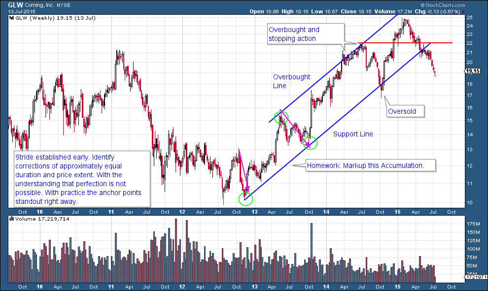
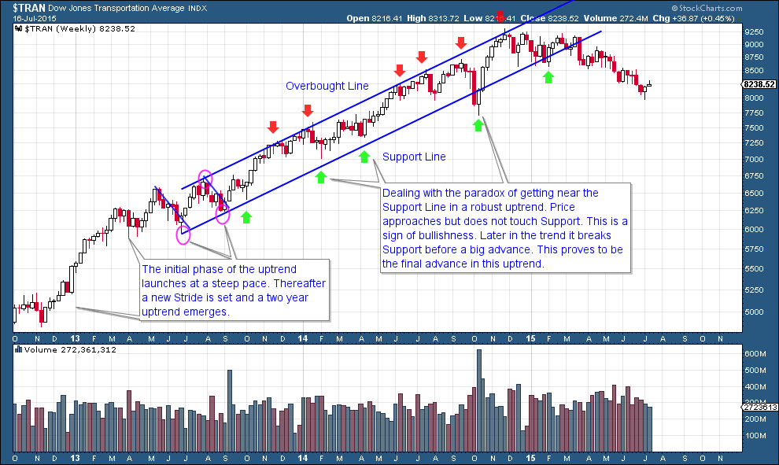
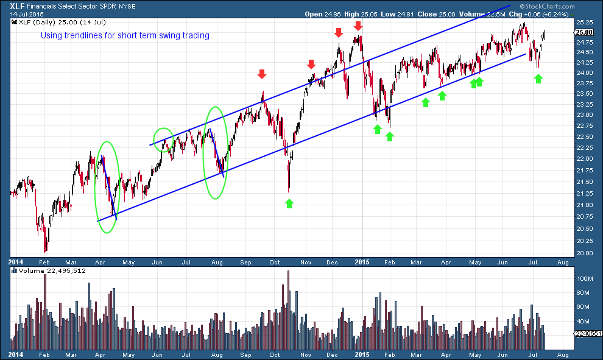

# Being a Chart Whisperer

URL: https://articles.stockcharts.com/article/articles-wyckoff-2015-07-being-a-chart-whisperer/
Date: July 17, 2015 at 12:42 AM
Author: Bruce Fraser

Trend analysis using trendlines (Wyckoff Method) is one of the most valuable skills of a Wyckoffian. The main idea is that a stock will advance at a set Stride, or rate of advance. Often (not always) the Stride can be detected early in the advance and this can help with entry tactics. In this post we will construct trendlines, which can be a very profitable pastime. Please review the prior blog. Our mission this week is to take an additional look at the various ways that trends manifest.

---

The dominant line in an uptrend is the Support Line. The stock price will ebb and flow above the Support Line. When price returns to the Support Line demand materializes and the rally resumes. For construction two adjacent corrections (green circles) are used to strike this new trendline. Corrections should be approximately the same duration of time and extent of decline. The overbought line is drawn parallel to the Support Line using the intervening peak (third green circle). There was a pause of 5 months in 2010 that approached the Support Line. A parallel line is drawn on that peak to see if price respects that trendline (pink circle) and it does. In Wyckoff analysis, the purpose is not to draw the trendline with the most touches, but rather to grasp the accurate rate of advance of prices for the foreseeable future.

Before IWM is out of its’ Reaccumulation, the Stride is set (green circles). This trend has been in force for nearly four years. Look for trendlines inside bigger trends. In 2013 a helpful trendline forms on a smaller scale and price respects that advance for nearly a year. Note how the Overbought line contains the advance. When price decisively breaks below the steeper trend, shows weakness, and then attempts to advance again, the trendline becomes resistance. Two trendlines stop the advance and turn IWM down. The subsequent decline takes IWM back to the major Support Line.

Note how the first higher low in the GLW Accumulation represents the first anchor point for the Stride of the advance. Price hugs the Overbought Line for nine months before returning to the Support Line where it sets up a nice buy point on the breach of the trendline. Price can hug the Overbought Line for extended periods and this is not necessarily a condition for selling. Future posts will address Distribution analysis. GLW has fallen out of the trend channel and lost its stride.

Here is a case study where the two adjacent corrections take place after the first leg up in the advance.

Trendlines can be drawn for any time frame. Here a daily vertical bar chart is analyzed. The adjacent corrections are circled. Note how price can bulge outside the trend channel but always returns into the channel. Daily charts can appear more dramatic in volatility but follow the same principles. There are numerous opportunities to swing trade this trend.

What is more fun than studying charts? Spend some time with these examples and then draw some trendlines on your favorite trading instruments.

All the Best, Bruce
