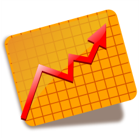
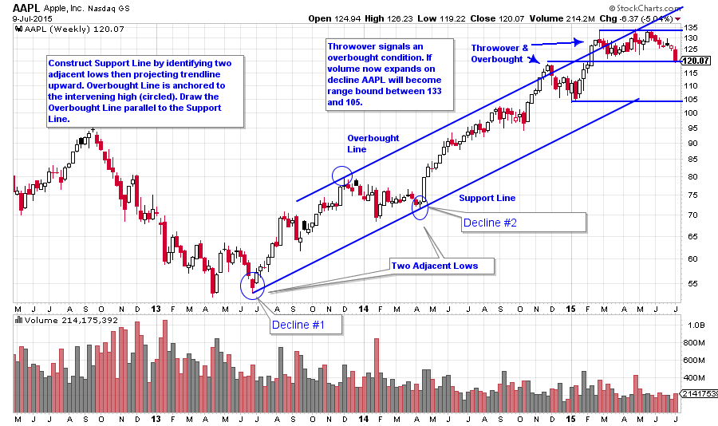
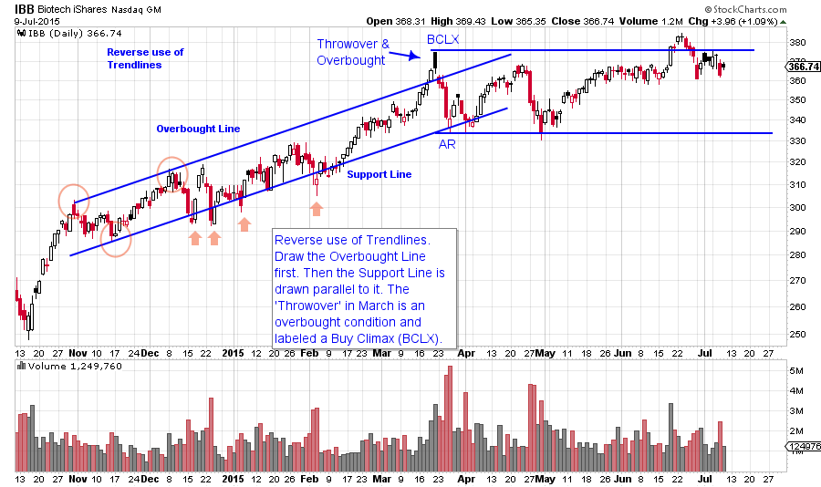
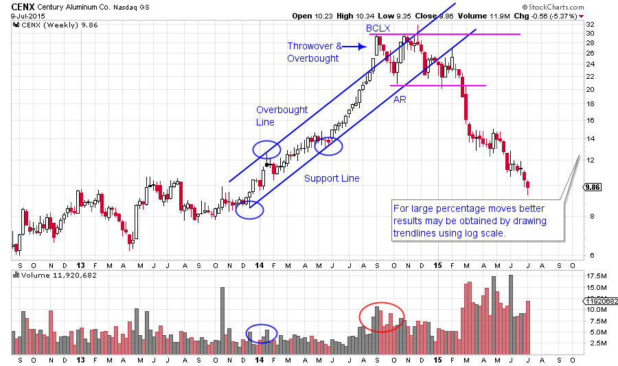
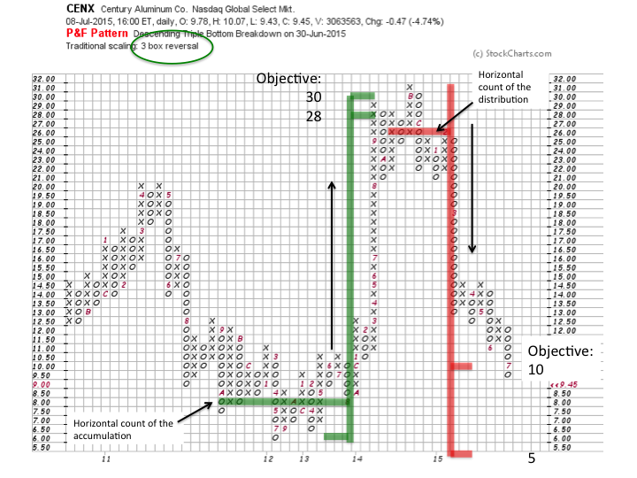

# Making the Trend Your Friend

URL: https://articles.stockcharts.com/article/articles-wyckoff-2015-07-making-the-trend-your-friend/
Date: July 09, 2015 at 08:23 PM
Author: Bruce Fraser

The Wyckoff Method is primarily a trend following system. The orientation and goal is to discover and campaign the best leadership stocks for the biggest and best price moves. The jumping of the stock price out of the Accumulation and into an uptrend is an important event. Mr. Wyckoff developed a very thorough and thoughtful approach to identifying and managing uptrends and downtrends using charting tools.

We have recently been studying the Accumulation Stage. In this post we will review some techniques for evaluating uptrends. Uptrends and downtrends are where investment returns really stack up. As important as Accumulation is in Wyckoff analysis, trend analysis may prove to be the more important skill set. There are many places in an uptrend to jump onboard for the ride and have meaningful success and profit.

---

The ‘Stride’ of an uptrend is often established early in the Markup stage (E Phase). The stock is indicating the rate at which it intends to advance. This is a very valuable piece of information. The trend then tends to follow the Stride, or rate of advance, for the duration of the uptrend. The lows, circled in blue, (see above chart) at the June ’13 low and the April ’14 low set the Stride of the future advance of AAPL. Draw this trendline, which is called the Support Line. The intervening high of December ’13 is the only price point needed to draw the parallel Overbought Line. Notice how price climbs at a rate that is consistent with the drawn trendlines. This rate of advance is referred to as the Stride. A year later AAPL has a Throwover of the Overbought Line and is in an “Overbought” condition. An eight week correction begins the following week. A second Overbought condition occurs in February ’15 and is a stopping action that contained the AAPL advance for 4 months (so far).

The general procedure for drawing a trend channel is to identify two adjacent corrections of approximately equal duration (the time of correction) and extent (magnitude of the decline). Decline number 1 is about 9 points and is 7 weeks. The second decline is about 8 points and is 19 weeks in duration. As an exercise try drawing the Support Line using the February ’14 low which was 8 weeks in duration, you will discover that Support Line also has value. If you see a potential trend channel, draw it!

Reverse use of Trendlines is a useful, but not well known, technique for constructing trendlines. There are times when the traditional Wyckoff Method for trendline construction is not possible. At such times try using this approach. Seek two adjacent price peaks (red circles) and strike a trendline (see above chart). Next find the intervening low price point and draw the parallel trendline. Note how IBB has four oversold conditions (red arrows) that are tactically useful for initiating or adding to a long position. At the conclusion of the advance a Throwover and Overbought condition stands out (BCLX) on the chart as the upper trend channel line is breached. The subsequent correction (labeled AR) is on expanding volume and sets the outer boundaries of the trading range. Time will tell if this will become Distribution or a Stepping Stone Reaccumulation for another advance (subject of a future blog).

Congratulations to Worapak Jitpakdee for winning the head and shoulders contest with his submission of CENX (see the Greg Morris blog of April 30th ‘Shampooing the Market’). I am always interested in what took place prior to the conclusion of a move that contributed to the advance or decline. CENX had a dynamic run up into the head and shoulders top. A classic trend channel formed with an Overbought condition concluding the advance and beginning the top formation. CENX is plotted on a log scale in this example. Convert the scale to arithmetic and try to draw the trend channel. When drawing trend lines try switching between the two price scales to find the one that works best. Long uptrends are usually best evaluated on a log scale, but look at both.

Trends will become overheated and climax, but that does not mean the uptrend is over. Often an extended trading range forms and then is resolved with a new uptrend. A trading range that emerges into a new leg up is referred to as a ‘Stepping Stone Reaccumulation’. In the CENX case a top forms, the trend is concluded, and a downtrend begins. A Wyckoffian will develop the skills to distinguish between a Distribution formation and a Stepping Stone Reaccumulation. We will study both conditions and compare and contrast the distinctions between them.

Also at the risk of getting ahead of myself (apologies in advance) here is a point and figure chart (PnF) of CENX. Mr. Wyckoff employed PnF charts to estimate potential price objectives using a horizontal count methodology. It is beyond the scope of today’s post to explain the technique (more later). CENX is a wonderful case study to blend trendline analysis and PnF price objectives. The purpose of PnF is to establish the price potential of a campaign and then to track the unfolding of the trend. Here CENX has a base count that takes it from the countline at $8 to a potential target price of $28 to $30. At the target price, exhaustion sets in with a Buying Climax and a Throwover of the trend channel (see vertical bar chart). Thereafter a top forms and a PnF down count is established with the potential to drop to a target of between $5 and $10. CENX is below $10 and has met the upper price objective. Point and figure is a very powerful and not a well understood technique. In this example it complements the trendline analysis very well. Many thanks to Worapak for sharing this fine example.

All the best, Bruce
