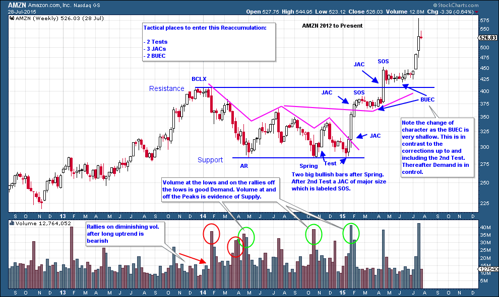
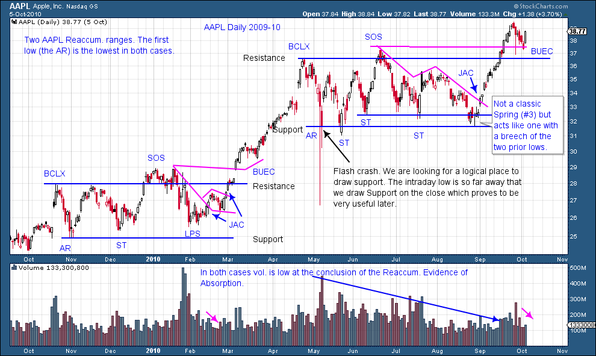
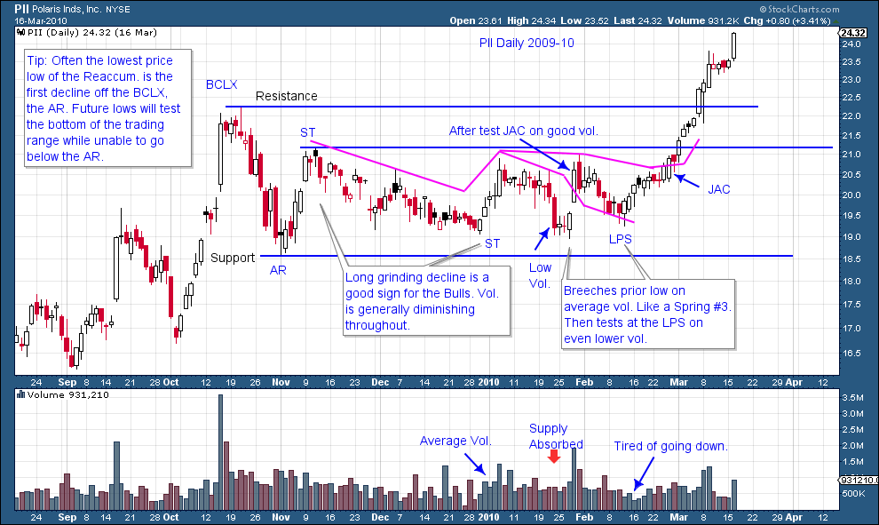
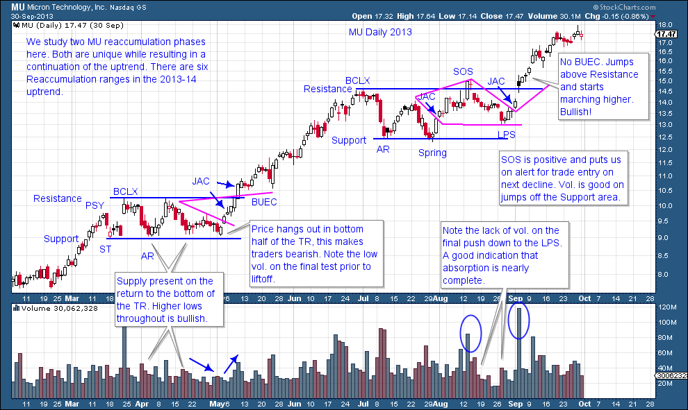
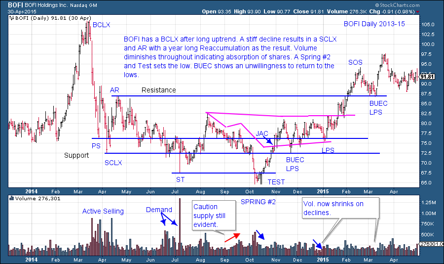

# Reaccumulation Roundup

URL: https://articles.stockcharts.com/article/articles-wyckoff-2015-07-reaccumulation-roundup/
Date: July 31, 2015 at 03:23 PM
Author: Bruce Fraser

During this and the next several posts we will focus our attention on Reaccumulation formations. These are among the most useful and powerful setups that a Wyckoffian can master. Let’s concentrate on charts in this post and become familiar with Reaccumulations in some of their many varied formations. Wyckoffians emphasize the principles behind price action. Because we focus on principles, we can see the footprints of the Composite Operator and the motives behind their activity. Many different price structures can unfold and the Wyckoffian can still identify the C.O.’s activities and their intentions. Accumulation, Reaccumulation, Distribution and Redistribution all have attributes that reveal the motives and the objectives of the large, informed Composite Operator. We must become versed in the language of the tape (chart reading) so that we know when, where and how to climb on board with the C.O.

---

In the above AMZN example, at the BCLX there is sufficient evidence of exhaustion. This is confirmed by the long grinding decline into the Automatic Reaction (AR). At this point there are two major scenarios: Distribution has begun, or an area of Reaccumulation. In either case it will take months to a year or more to develop. The BCLX and the AR become initial Resistance and Support for containing the trading range. The AMZN Reaccumulation takes 15 months to develop. Note how AMZN spends most of the time in the bottom half of the range. Traders become very bearish when prices keep returning to Support and cannot lift to Resistance (the C.O. is very aware of the tendencies of the average trader / investor).

Price has a big character change when the Spring is Tested and a huge vertical Jump follows. The BUEC at about $375 also demonstrates a change of behavior as the price has a very shallow back up or pause prior to Jumping out of the entire Reaccumulation trading range. The second BUEC also gives up ground begrudgingly and will not even return to the prior Resistance area. This is a bullish development.

When volume bulges up as price revisits the Support area we can tentatively conclude this is Demand by the C.O. But it also indicates that there is ample Supply to be Absorbed and the price is likely to return to these Support levels until the C.O. finds it difficult to buy stock (indicated by diminishing volume on the decline to the support area).

As in this Apple example, Reaccumulation can be a brief affair occurring early in strong uptrends and lasting only a few months. During an aggressive uptrend, the first low of the Reaccumulation is often the lowest, as is the case with these two AAPL examples. Traders will often mistake Reaccumulation for a Distributional top. Note how the second AAPL Reaccumulation resembles a head and shoulders formation. Volume will generally diminish in the last half of a Reaccumulation, while volume will generally remain high during the entire Distribution formation. When the uptrend (JAC) resumes, volume will expand on rallies and contract during pauses and back ups (LPS and BUEC).

In this Polaris example, a dramatic Buying Climax (BCLX) is followed by a swift Automatic Reaction (AR). Volume is declining on the AR which is an early clue that a Reaccumulation is beginning. In this example the AR is the lowest low in the trading range. Much time is spent thereafter in the lower half of the range but price is unable to return to the level of the AR. The C.O. uses the ample time spent in the lower part of the range to buy as much stock as possible. A near vertical rise follows with minimal pauses.

When volume expands at Support in Micron Technology, we expect a bounce followed by a return to the Support. Volume at support is evidence of Supply entering the market and the C.O. absorbing that Supply. Subsequent attempts to return to Support should be on diminishing volume which indicates that sellers are becoming exhausted and have liquidated their positions, and thus Absorption by the C.O. is nearly complete. Also we attempt to visualize and draw the overhanging Creek of Supply that is pressing down on prices and keeping them in the trading range. Eventually this Creek will be Jumped which is an important indication of a resumption of the Markup.

BOFI has a dramatic runup followed by a Buying Climax and then a Selling Climax. This is a real head-snapper. Though we call it a Reaccumulation, it has many of the attributes of an Accumulation. It takes nearly a year to complete the Reaccumulation phase, which is likely the result of the two and a half year uptrend that preceded the Buying Climax. The final low was a Spring that occurred two thirds of the way through the Reaccumulation. The Spring sets up a rally to the top of the Reaccumulation and above it, which is labeled a Sign of Strength. On the Back Up (BUEC) the price touches the Resistance line from above. Old Resistance becomes new Support.

Reaccumulations are occuring in the markets all of the time. Uptrends will have multiple pauses on their path higher, all of which offer opportunities to get onboard and ride the trend higher and higher.

All the Best, Bruce
