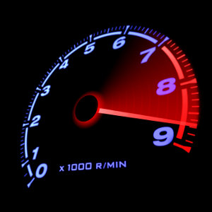
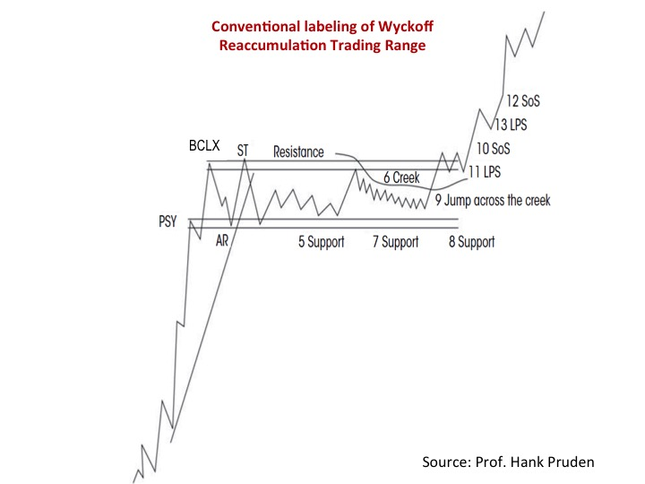
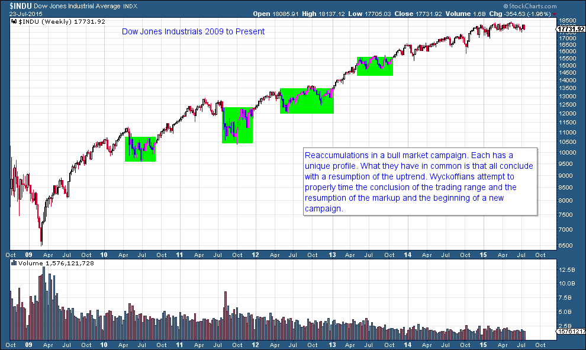
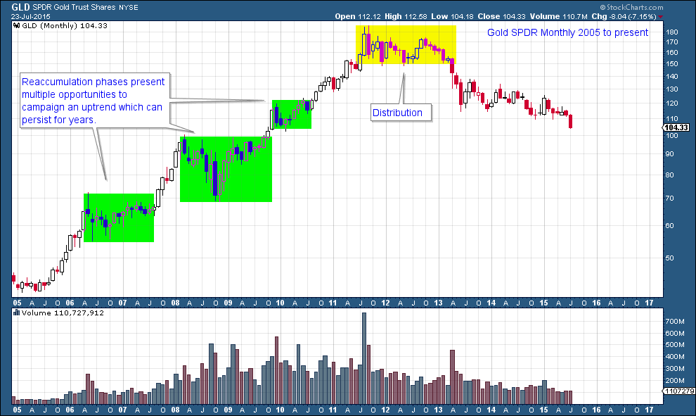

# Rev Up with Reaccumulation Trading Ranges

URL: https://articles.stockcharts.com/article/articles-wyckoff-2015-07-rev-up-with-reaccumulation-trading-ranges/
Date: July 24, 2015 at 10:22 AM
Author: Bruce Fraser

In the course of every long uptrend there are extended pauses. The longer the trend, the more pauses there will be. In terms of duration they can last as little as a few months or as long as a year or more. They are designed to torture long term holders with protracted periods of boredom. As with all aspects of the price cycle, Wyckoffians have discovered the principles governing the dynamics of the trading range (extended pause). In this post we will introduce the concept known as Reaccumulation.

---

Once a trend emerges from an Accumulation it begins to mature and changes internally. At a trend’s beginning, strong holders (the Composite Operator) of the stock are the dominant owners and almost immediately shorter term traders jump on board the uptrend and ride along. These trader types will not hold the stock for the duration of the uptrend, they will repeatedly take quick profits and leave at early signs of trouble. The Composite Operator has the intention of staying on the trend for the entire multi-year move. They expect pauses in the uptrend that occur along the way to the final conclusion of the bull move. The C.O. will use these Reaccumulation phases to add to their holdings. Wyckoffians also use these Reaccumulation phases to initiate a position or add to an existing holding.

As the trend continues to mature, the activity becomes dominated by trading, in contrast to investing. For a period of time, accelerating momentum in an uptrend can be very profitable. Accelerating prices have widening price spreads (daily and weekly) and high volume. Upward and downward volatility are a signature of the late stages of a trend, and a condition of approaching exhaustion. Recall from our recent posts on trends, that a common condition at the conclusion of an advance is the throwover of the top of the trend channel. A throwover is a classic sign of exhaustion and often coincides with a Buying Climax which is a stopping action of price. The uptrend becomes so overheated with speculation that a blowoff price movement ends the advance. The Buying Climax is the beginning of one of two conditions: Distribution or Reaccumulation. This is significant because one condition concludes with a resumption of the uptrend (Reaccumulation). The other is the termination of the uptrend and the first step in the formation of a top, referred to as a Distribution. Mr. Wyckoff can help us to make the all-important distinction between the two scenarios.

The condition of Reaccumulation and Distribution begin with the same action and in the same manner. This is a stopping action of the prior trend. What follows is a large and often long trading range.

After the Buying Climax (BCLX) an Automatic Reaction (AR) follows, which is a big and volatile correction that is far larger than the corrections within the preceding uptrend. This is confirmation of the BCLX, if we were unsure before. We label the BCLX and AR and immediately draw a Resistance line at the peak of the BCLX and a Support line at the low of the AR. If this sounds familiar, it is because we apply the same technique after a Selling Climax and an Automatic Rally establishing the outer boundaries of the Accumulation.

We look for trading to be largely contained by the Support and Resistance for the weeks and months ahead. During that time the Wyckoffian will study price and volume cues as to whether Reaccumulation is occurring or Distribution.

Initially look for a series of Secondary Tests of the BCLX area (Resistance) and the AR (Support). Price activity will be abrupt and volatile with big jumps up to the highs and reactions to the bottom of the trading range. Weak holders of the stock are being shaken out by this extreme volatility. The AR will scare the short term momentum traders out with some wicked losses. It all happens very quickly. But thereafter the careful observer will see that the volatility is receding. Declines to Support will take longer to complete and the volume will generally be lower with each succeeding reaction to the bottom of the trading range.

As the trading range grows longer and longer, trader pessimism is on the increase. The momentum traders are long gone and speculators are fishing in different waters. Sometimes the catalyst for the pause is a bearish news item or a disappointing quarterly earnings report that alarms traders.

The Composite Operator is using this turn of events to begin accumulating stock. Just as in the initial Accumulation, the C.O. will systematically Absorb shares as prices correct toward Support and will cease buying activity as the price rises back to Resistance. It becomes harder for the price to return back to Support and will be reflected in the Vertical bar chart with narrowing price ranges and generally diminishing volume. The principles of Absorption are the same here as we previously discussed in Accumulation.

A common mistake traders make with Reaccumulation is to conclude it is Distribution and they initiate a short selling campaign. We will study this in detail. For now, the key points to be made are that during Distribution volatility and volume increase as the trading range matures and prepares for a bearish downtrend. During Reaccumulation the opposite takes place because of the principals of Absorption.

Reaccumulations have various ‘looks’ and here is one example. Absorption is occurring as the trading range progresses. With the Creek we observe diminished volatility and volume, an indication that the Reaccumulation is nearly concluded. Once Absorption is complete, Jumping action will take the price out of the trading range and into a new markup phase. This is the place where Wyckoffians get busy adding shares to the portfolio.

There is only one Accumulation Phase at the beginning of a long term uptrend while there are numerous Reaccumulations to be campaigned. In the above DJIA example, so far, there are four large Reaccumulation phases in this bull market. Wyckoffians are keenly aware of Reaccumulation phases in the instruments they are trading.

Reaccumulation phases are found in all trading instruments; stocks, commodities, bonds, currencies etc. And they occur in all time frames; intraday, daily, weekly, monthly. Here is the GLD (gold ETF) uptrend (monthly). Reaccumulation phases stand out on this larger time frame.

In future posts we will drill in and study various Reaccumulation patterns. For those of you asking for homework, please study the schematic above and become familiar with it. It is only one of a number of various ‘looks’ a Wyckoffian will encounter. But the essential elements of most Reaccumulation formations are in this schematic. The second assignment is to read the Stocks and Commodities article, “The Composite Man’s Bull Market Campaign” (click here for the article).

All the best, Bruce
