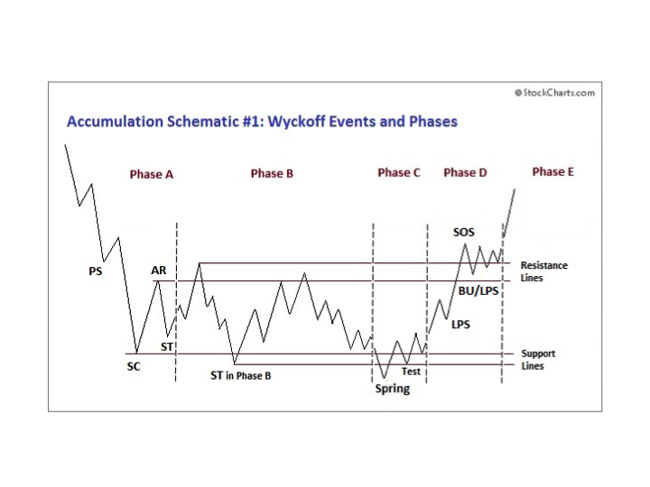
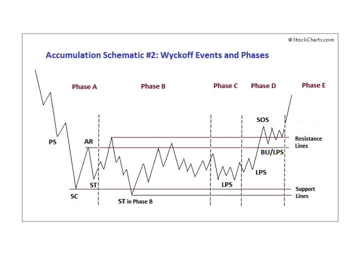
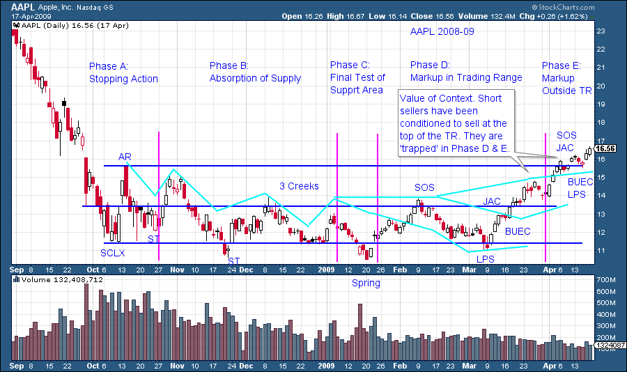

# Wyckoff Power Charting. Let's Review

URL: https://articles.stockcharts.com/article/articles-wyckoff-2015-07-wyckoff-power-charting-lets-review/
Date: July 01, 2015 at 07:06 PM
Author: Bruce Fraser

Previous posts have been devoted to the process of Accumulation. What distinguishes Power Charting with the Wyckoff Method from other chart pattern recognition tools is our focus on tracking the footprints of the Composite Operator. A long term trend requires intelligent Accumulation of very large quantities of shares prior to its launch. This must be done quietly and deliberately. Therefore Accumulation is a logical, sequential and identifiable process. Vertical charts with volume are the chosen tool for tracking the activities of the Composite Operator. Accumulation is the preparation phase for the Markup, and Distribution is the precondition for the Markdown. Accumulation, Markup, Distribution, and Markdown is an ongoing cycle in financial markets. In every cycle, the stories and the names change while the principles of speculation remain unchanged. Follow the Composite Operator’s activities to determine where and when the successful themes will emerge.

---

Accumulation Schematic #1. Wyckoff schematics model the key characteristics of the Accumulation area. Variations will always occur between the idealized and the actual trading range. Identification of these essential conditions is an attribute of Wyckoff mastery. Students will endlessly compare and contrast the theoretical schematics to actual case studies to develop an eye for actual conditions and tactics. We can thank Robert G. Evans for the adaptation of these notations and chart principles to the original Richard Wyckoff teachings and thus significantly enhancing the Methodology. Source: Hank Pruden, The Three Skills of Top Trading, Wiley Publ. 2007 with adaptations and modifications. Graphic by Roman Bogomazov.

Phase A. (Blog post: “The Stopping Action of a Downtrend”) Supply has engulfed the market resulting in a large downtrend. Toward the conclusion of the decline, selling becomes panicky with widening price spread and volume. Preliminary Support (PS) is an early indication of nascent demand. The Selling Climax (SCLX) follows on dramatic price spreads and a massive expansion of volume. Intensity in selling is not sustainable and is followed by a brief and large rally attempt that is short lived. The Automatic Rally (AR) indicates that the SCLX is completed. Phase A is fulfilled with a test of the SCLX and is labeled ST.

Phase B. (Blog post: “Accumulation Phase; Absorbing Stock Like a Sponge”) A Cause is built in Phase B. Characteristic of this Phase is a trading range with extreme volatility early on that diminishes as it matures. Volatility unnerves weak holders of the stock who weathered the prior bear phase but who finally give up and sell/dump shares. The theme of the B Phase is Absorption. Wyckoffians will attempt to determine if quality absorption is taking place during this phase. As long as supply is present Phase B will persist, building an ever bigger Cause (which is measured using point and figure charts). Use Support and Resistance Lines to define the outer bounds of the Phase B trading range. Comparing the duration and extent of rallies and reactions in Phase B will often provide early clues to the degree of bullish absorption.

Phase C. (Blog post: “Francis Bacon Reveals the Nature of Trends”) Absorption is nearly complete. Smart money Composite Operators ‘Test’ the stock to determine if it is poised to begin its Markup Phase. The Test is to determine if the Supply has been exhausted and this is done by removing bids at Support and allowing the stock to breach the lows. A breakdown here is a bear trap catching the last of the retail sellers and short sellers in a false move down. This action, called a Spring, comes in three types. At times the final low prior to the beginning of the Markup is a higher low. Wyckoff analysis deems this a Last Point of Support (LPS) and it is just as important as the Spring (while possibly more elusive). Testing the lower bounds of the Accumulation Range, as a final act before the all important start of the major uptrend, is the lofty purpose of Phase C.

Phase D. (Blog post: “Jumping the Creek”) Successfully testing the lower trading range bounds in Phase C will unleash a condition whereby Demand engulfs remaining Supply. The stock price will move up on widening price spread and expanding volume. The D phase is the final markup out of the Accumulation Range. Phase C and D are tactically important as you will want to make your initial purchases on a rising scale during these phases. Colorful terms “Jump Across the Creek (JAC)” and “Sign of Strength (SOS)” denote leaping price action. Reactions occur on narrowing spread and volume and are labeled “Last Point of Support (LPS)” or “Backup to the Edge of the Creek (BUEC)”. In Phase D, Demand is in control and other professional investors begin to recognize the emergence of a trend in this attractive stock. Their Demand drives the stock price upward as it is clear very little Supply exists and each new buy program pushes the price higher and higher.

Phase E. (Future blog posts) The stock leaves the Accumulation Trading Range and begins a primary uptrend or Markup. Leaving the TR is major advertising to the institutional community that this stock is in-play. The tools for Markup are Trend Channels, Demand Lines, Overbought Lines and Stepping Stone Reaccumulation formations. The study of the Markup is a rich and rewarding Wyckoff subject.

The Accumulation range is a sequence of events that create context. They tell a real time story of speculation. Phase analysis assists in the telling of the story and keeps us on-track with our tactics and timing. Prior blogs have, more or less, followed the sequence of the Accumulation Phases. We will continue with this format, with some breaks along the way. We will then circle back into these subjects and drill down into more nuance and detail. Wyckoff is a mastery practice and the more drills and case studies we do the better.

Context is a very important feature of the Wyckoff Method. Traditional technical analysis chart pattern recognition tools offer no real contextual value. For example traders often get in trouble at the end of Accumulation because they continually sell short the Resistance Line area. During Phase D and E they sell short the same area again, not understanding the context of Phase C, D and E price behavior. Very quickly they can find themselves in big loss traps as a Major Sign of Strength (SOS) jumps the stock price permanently out of the Accumulation Range. They then discover that it is very difficult to buy (cover) their shorts as there is an absence of Supply. Each cover is at higher prices. This is one example of the value of Wyckoff context. As an example Phase D and E in Accumulation Schematic #2 sets up a false short sale scenario for speculators after successful short sale campaigns in Phase B. This strategy ends badly in Phase D and E as the markup has begun. For the Wyckoffian the only conclusion is to reach up and buy this stock. This is an example of the power of context.

Accumulation Schematic #2 illustrates a condition where price makes a final test of the support area by making a higher low rather than a Spring (as shown in Schematic #1). This is referred to as a Last Point of Support (LPS) as it is the price point where buying support stops the decline while staying inside the trading range. This higher low is the final stop prior to beginning a rally out of the TR and into a major Markup. Source: Hank Pruden, The Three Skills of Top Trading, Wiley Publ. 2007 with adaptations and modifications. Graphic by Roman Bogomazov.

Compare AAPL to Accumulation Schematic #1. Note the similarities and the differences between the two. Judgment is an essential attribute of the Wyckoff Method. There are principles at work in each phase and our job is to be intimately familiar with their attributes and thus to make the most tactically sound decisions.

Join me next time as we begin to examine Phase E! Bruce
