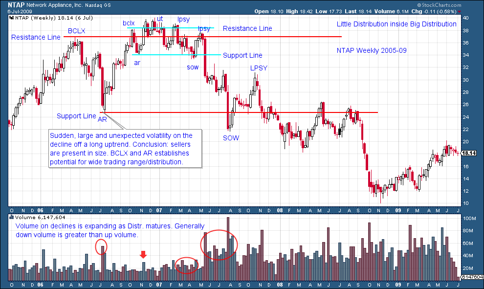
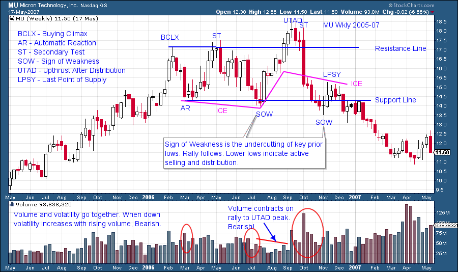
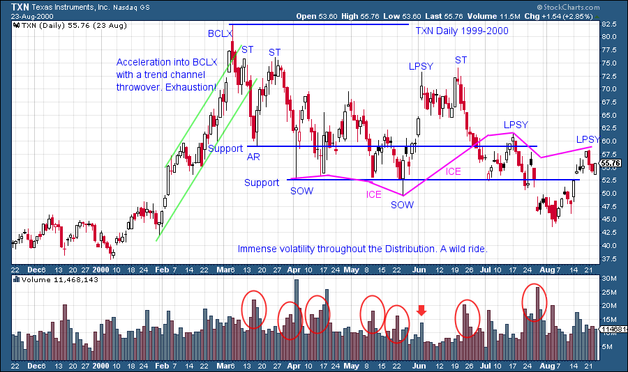

# Follow the Bouncing Ball

URL: https://articles.stockcharts.com/article/articles-wyckoff-2015-08-follow-the-bouncing-ball-/
Date: August 28, 2015 at 04:04 PM
Author: Bruce Fraser

In 1965 Wham-O came out with the Super Ball. About the size of a plum, this hard rubber ball was simply amazing. When dropped on a solid surface it was advertised to bounce back 92%. When slammed down it could be made to bounce over a two story building. For kids it was a dangerous and endless source of fun. The current market activity got me thinking about the Super Ball. And not only for the self-inflicted, plum sized welts all over one’s body (and portfolio). Recent market volatility has a punch and it can hurt. When we throw that ball against the wall we don’t expect it to come back and whack us with a mighty sting. But it happens.

---

Distribution is somewhat like setting your Super Ball on the kitchen table. In a seemingly benign state of rest, that ball, like a stock, is in a potential state of distribution. It needs a protagonist to engineer running the Super Ball to the edge of the table (in this example the Composite Operator is played by a bratty younger sibling). When the table is bumped the ball rolls to the edge. Though the ball appears to be in a state of rest there is potential built into it that will be unleashed if it is rolled over the side. To the delight of the younger sister or brother, one nudge sends the ball off the edge and it accelerates lower at a blistering rate of decline. The drop is sudden and unexpected. Once the ball hits the floor it bounces wildly upward retracing much, but not all, of the decline. Suddenly it turns back down and is bouncing off the floor once again. You get the picture. The Super Ball keeps bouncing, each time to a slightly lower high. Volatility is the greatest at the beginning and diminishes over time (think absorption).

A Super Ball at rest on the kitchen table and a stock in Distribution have much in common. There is pent up energy begging to be unleashed. The seemingly inert state is deceptive as it creates the impression of being benign, when it is not. Inaction becomes activity with a swiftness that is difficult to respond to. In part, this is because the stockholder has been lulled into a state of inattention. Such a mental state makes an appropriate market response difficult when stocks transition from pausing to dropping. I’ve heard of a big market decline being described as like thunder and lightning. When one hears the thunder, the lightning has already done the damage.

Therefore, as Wyckoffians, we learn to become more alert and vigilant as the conditions of Distribution become evident on the tape. What follows Distribution is Markdown where prices fall like a Super Ball dropping off the kitchen table. Once prices are in a free fall, strategy and tactics change. They become more difficult. When a stock is falling it becomes wickedly volatile all the way to the bottom where the final Selling Climax is followed by an Automatic Rally (the first bounce). As Wyckoffians we wait until the volatility is out of the stock (after the Super Ball stops bouncing we pick it up) before we consider buying. We will spend time on the Markdown phase later. For now let us continue to study the conditions and nuances of the Distribution process with chart examples. Let’s see if we can tell when stocks are creeping to the edge of the table.

Distribution is always messy. Volatility occurs at the beginning and usually increases throughout. Recall that the C.O. is competing with others to get the entire position sold. Note how NTAP lives at the BCLX price highs for many months. Prices near the highs is soothing to investors (the public and institutions) while providing time for the C.O. to liquidate and to possibly get short. All of the attributes of Distribution are evident in the smaller top. Meanwhile a mega top is forming around the smaller one. A fellow Wyckoffian likes to call this the ‘Big Top’ because underneath there is a three-ring circus.

Note how the ball rolls to the edge at the second small Last Point of Supply (LPSY). Once it falls off the table all hell breaks loose. It can be very difficult to respond to such sudden downward volatility. This is a major reason for taking potential Distribution so seriously. We then focus on a key prior low, in this case the AR, for some stopping action. The break below the AR results in a major Sign of Weakness (SOW). This sets up a rally to the LPSY of the larger distribution. In future posts we will explore entry locations and tactics.

MU is a classic UTAD. Note the low volume on the rally to the UTAD peak. There is a lack of sponsorship on this rally. The high volume on the bar that tests the BCLX and ST peaks, is selling by large interests. Churning two bars later on the UTAD bar is on the highest volume to date on the chart. Again there is more selling at the final high. Here we introduce the concept of ICE which is not unlike the Creek concept, but in reverse. ICE is a floating current of demand. We will spend more time on this useful idea in the future. Note how the ICE reverses from demand to supply once the price drops below it. The price is vulnerable to a steady decline thereafter. This is true of the Support Line when price goes from residing above Support to below it.

After a long uptrend, TXN accelerates into a classic BCLX and thereafter sets up a wide and volatile distribution. This is a daily vertical chart and thus additional perspective from the weekly vertical could be helpful. Two Support Lines are drawn and both prove useful later on. The volatility is notable during the declines and is accompanied by high volume (circled). Take the time to look at all of these charts on a larger time scale to see the price action leading up to the Distribution and what occurred thereafter. The Last Point of Supply is the highest that price can reach before selling engulfs the stock and turns it down. An LPSY will not be exceeded at a later date, only lower highs lay ahead. Therefore an LPSY is a tactical place to sell and possibly to short stock. There can be multiple LPSY points, each at a lower high.

Distribution is a most interesting subject and we will devote more time to it before moving on.

All the Best, Bruce
