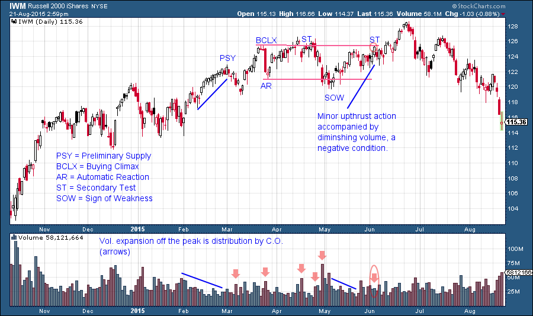
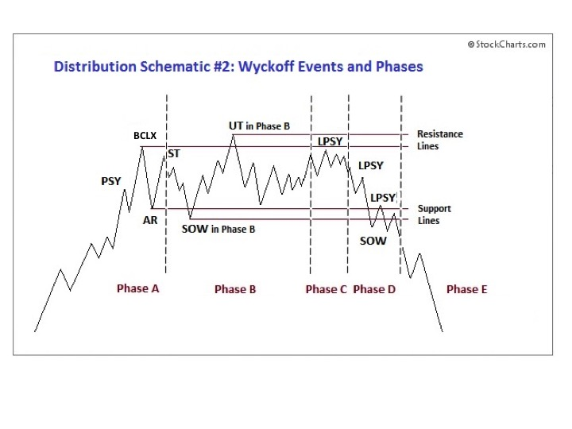
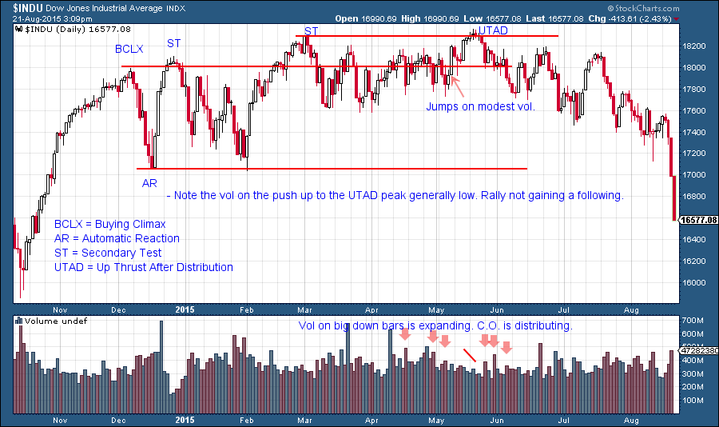

# Take the Fork in the Road

URL: https://articles.stockcharts.com/article/articles-wyckoff-2015-08-take-the-fork-in-the-road/
Date: August 21, 2015 at 04:15 PM
Author: Bruce Fraser

Modern American sage, Yogi Berra, advises that when we come to a fork in the road we should take it. When stopping action stalls the price of a stock (commodity, ETF, etc.) a fork in the road is dead ahead. As Wyckoffians we are confronted with either the conditions of Reaccumulation or Distribution. Stopping action leads to one or the other. Reaccumulation is a pause in an ongoing uptrend, Distribution is the conclusion of that uptrend. Whichever fork we choose, the decision has consequences.

It is somewhat ironic that Distribution begins with the same characteristic footprint as Reaccumulation. It is as though Distribution is the ‘evil twin’ of Reaccumulation. Thankfully, with some practice one can tell the difference between these twins!

---

Stopping action begins with Preliminary Supply (PSY) and culminates with a price surge called a Buying Climax (BCLX). A Buying Climax is a brief and dynamic acceleration of prices on high volume. The price bars are wide and volatile. This price acceleration is often associated with ‘good news’ (but this is not necessary). Surging prices (and news) will bring in public buying and momentum traders. There is a general ‘glow’ of good feelings toward the company and its future prospects. Such news gives investors and traders the courage to buy. This Climactic action is actually a stopping action and will result in a range bound market.

The Buying Climax and the Automatic Reaction (AR) will generally be the outer boundaries (resistance and support) of the trading action for some period of time. During this extended trading range, the condition will set up for either a resumption of the uptrend or a downturn into a bear market. We have studied the activities of Reaccumulation in prior posts. In summary, absorption of shares is the primary activity of a Reaccumulation. During Distribution the opposite is occurring, the disgorgement of shares in anticipation of a large primary downtrend. The Composite Operator is selling ALL shares held.

The distribution of all of the shares held by the Composite Operator is a tricky business. It requires skill and patience. The C.O. is buying wholesale (during Accumulation) and selling retail (during Distribution). They buy when the news is bad and sell when the news is good. This is counter-intuitive but makes sense with some deeper consideration. The C.O. buys when they can and sells when they must. We have studied the dynamics of Accumulation and now let’s consider Distribution.

Who must the C.O. Distribute shares to? Sadly the public is who must buy shares and hold them throughout the next downturn. Some public buying occurs during the uptrend and is intense around the highest prices. When we say that the C.O. is selling retail it means that they must sell shares in small batches to the public. This manifests in the footprint of increased volume. The C.O. has a huge quantity of stock to sell and this takes time. Too much stock hanging over the market would cause prices to sag. Therefore stock must be released carefully and slowly and only in quantities that the public can digest. This requires skill.

Reaccumulation is the art of shaking investors out of their stock holdings with Springs and Shakeouts that drive prices below key levels. Distribution is the high art of keeping prices inside trading boundaries to encourage buying by the unsuspecting public. The C.O. strategy for doing this is to sell shares during the rally phases of the Distribution and off the highs of the trading range. Then as prices slide toward the bottom of the trading range, stop the selling and possibly even do some buying to support the price around the bottom of the range. This goes on repeatedly throughout the Distribution process. The C.O. is always in a race because there are multiple operators with the same intention of selling out. Early on in the Distribution process there are relatively few large sellers, but as time goes on, more and more of these large institutional sellers become aware of the action on the tape. This is when the trouble can begin for the stock price and the bear market downtrend begins.

The Composite Operator is typically an institution, but not all institutions are Composite Operators. So when a room full of large elephants tries to exit at the same time a stampede can occur. This results in a cascading of prices lower and lower.

Over the course of the next few blogs we will dissect various Distribution activities and the proper tactics for acting within them. In the meantime, study the schematic to become familiar with the essential attributes. As we would expect, Distribution comes in various shapes and sizes. What is common among them is the process of selling by large informed interests. Their price and volume signatures will be engrained in our minds and become second nature.

A Dominant characteristic is the Upthrust after Distribution (UTAD). A UTAD is like a Spring in reverse as it is a final and temporary move to a new high which is unsustainable. What follows is a brisk return toward the Support area on widening price spread and volume. Think of a UTAD as being like a question; How much buying power is there at new price highs? A rush of new demand will take the price away from the prior peak (UT) and into a continuation of the uptrend. A failure will cause the C.O. to conclude that buying power is weak and they will sell shares on a scale down toward support. Source: Hank Pruden, The Three Skills of Top Trading, Wiley Publ. 2007 with adaptations and modifications. Graphic by Roman Bogomazov.

(click on chart for active version)

This IWM chart was originally published in the June 7th blog (click here for blog). As a homework assignment update the analysis using the schematic above.

In Schematic #2 the rally fails to make a new high and is labeled a Last Point of Supply (LPSY). The LPSY rally will have narrowing price spread and generally low volume, an indication that demand is lacking. Each rally to a lower high is labeled an LPSY as that peak proves to be as far as the rally can lift as the markdown phase begins. Source: Hank Pruden, The Three Skills of Top Trading, Wiley Publ. 2007 with adaptations and modifications. Graphic by Roman Bogomazov.

(click on chart for active version)

This $INDU chart was originally published on June 7th. For extra credit attempt to complete the labeling of this $INDU chart to bring it up to date.

All the Best, Bruce
