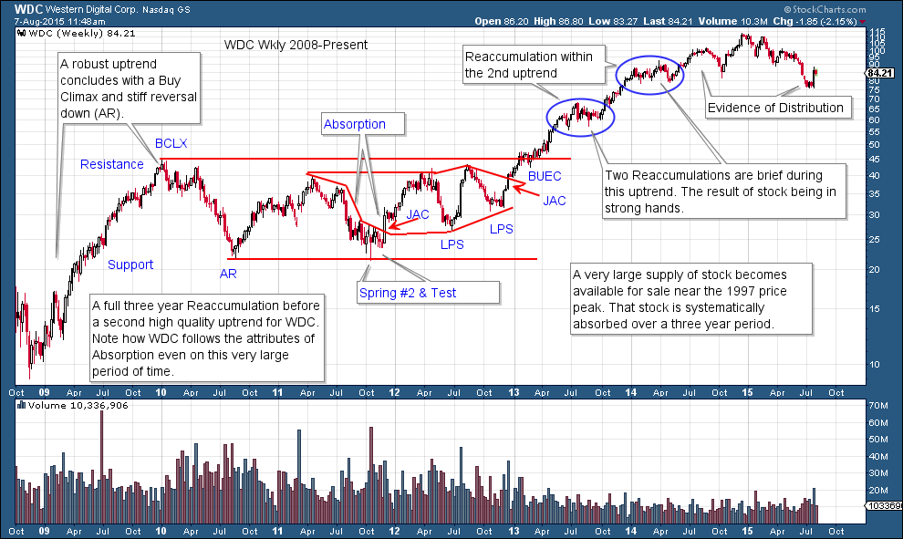
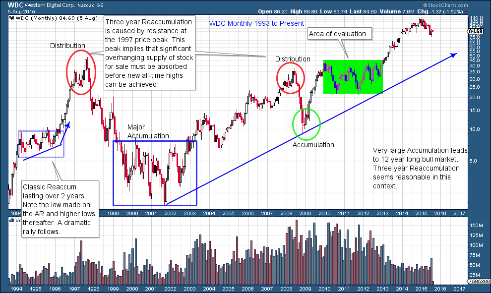
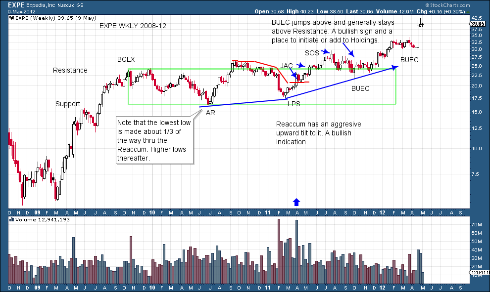
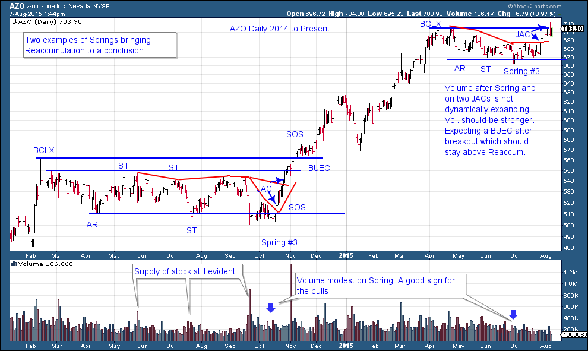
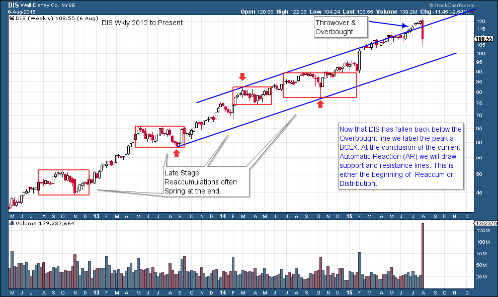
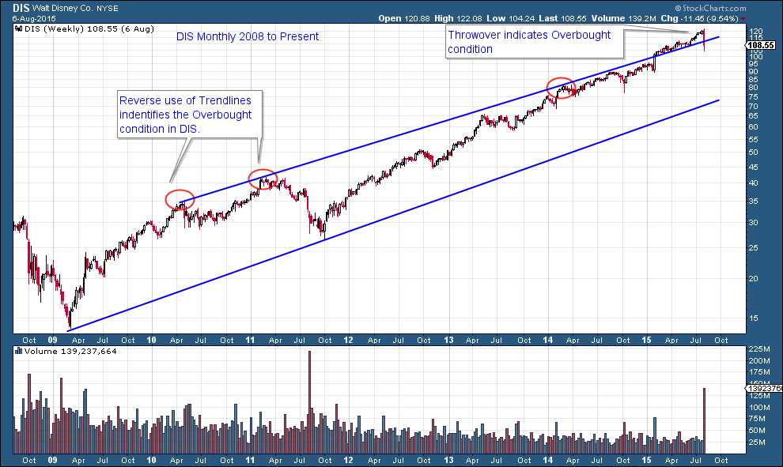

# When Termites Get into Your Trends

URL: https://articles.stockcharts.com/article/articles-wyckoff-2015-08-when-termites-get-into-your-trends/
Date: August 07, 2015 at 01:47 PM
Author: Bruce Fraser

A trend is like a house on a foundation of wood. When the house is new the foundation is strong. Over time termites burrow in and infest the foundation. The house looks structurally sound even though the termites have compromised its underpinnings. Unexpectedly, one day the foundation gives way and the house collapses. A trend starts with a strong foundation of ownership, but with time the trend becomes infested with owners of stock who weaken the trend’s foundation. Eventually the trend reverses with an abrupt failure of prices and the repair process begins. This rebuilding of the ownership foundation is called a Reaccumulation. Wyckoffians are the inspectors of the trend. They carefully study the trend for conditions of impairment and reconstruction. Once the foundation is strong again, it is time to move back in.

---

A Reaccumulation is the result of a prior uptrend that needs to be consolidated. The composition of the ownership of the stock will change during the course of the uptrend. When an uptrend begins, the float is under very strong ownership (the Composite Operator). Invariably we can conclude that strong uptrends are the result of the float being under the control of superior ownership. There comes a point in the uptrend when there are enough traders involved, and longer term holders ready to take profits, that selling activity stops the uptrend. An overbought condition of the trend, such as a Buying Climax, will emerge and stop the upward movement of prices. Because of the changing nature of the quality of ownership, prices can weaken quickly as traders rush to close out positions. This results in a swift downdraft that is labeled an Automatic Reaction (AR). The Reaccumulation phase has begun. The remainder of this post will be devoted to observations about the Reaccumulation phenomena that we have picked up through the years studying and teaching on this subject. Gratitude goes out to fellow teachers and many students for the brilliant contributions made to this and all things Wyckoff.

The tendencies we review here are generalities, conditions that tend to materialize at certain times and under certain conditions. When possible we will attempt to benefit from the knowledge of these tendencies. But the market is capable of doing anything at anytime. An abundance of caution is always warranted.

A strong trend with superior relative strength is an indication of, and the result of, dominant ownership of the float by the Composite Operator. Reaccumulations have the effect of purging the shorter term holders from the trend. The Composite Operator (see earlier blogs) is campaigning and holding for the duration of the multi-year uptrend. Therefore they will use pauses in the uptrend to Accumulate additional shares at good prices. Thus a good uptrend is often a good predictor of a future big uptrend (with multiple Reaccumulation phases along the way). Uptrends begat more uptrends. Understanding this, the Reaccumulation phenomena becomes tactically very valuable to us Wyckoffians. Our goal is to identify the conclusion of the Reaccumulation and the emergence of the next uptrend and to Accumulate, or add on to, a position.

When strong hands still dominate the ownership of the floating shares at the conclusion of an uptrend, the Reaccumulation phase will tend to be shorter in duration. Also the lowest price low will tend to occur in the first half of the Reaccumulation phase (often within the first third of the entire time of the Reaccumulation). Determining this to be the case will be the result of superior tape reading (chart reading) skill. Often the Automatic Reaction or the Secondary Test of the AR will be the lowest price low. Thereafter all of the remaining attempts to push back to the low will be met with buying of good quality which will be demonstrated by higher lows on the charts. We can conclude that the C.O. has dominant control of the supply of stock and that good demand is putting bids just above prior low prices.

Often the Reaccumulation of longer duration (a year or more is not uncommon) indicates that not all of the available float had been absorbed in the Accumulation prior to the uptrend. Time is needed to vacuum up these available shares. Large Reaccumulation phases can be counted with the horizontal Point and Figure methodology to estimate the upside price objective (we will study this technique). Patience is a virtue that Wyckoffians learn to cultivate within themselves when waiting for the final conclusion to large Reaccumulations (as the C.O. does).

If there is an excess of shares overhanging the market (in the hands of short term traders) it can be expected that prices will dive to the bottom, the support area, repeatedly. Such price weakness tends to dislodge the shares and they are absorbed by stronger and more patient holders. If supply continues to materialize (signaled by bulging volume on the drop from Resistance to Support) then expect Spring type activity around the Support area. The Spring is a strategy of the C.O. to shake loose the last remaining shares from traders and other weak holders. The Spring typically comes at the tail end of the Reaccumulation and is followed by a robust Jumping action toward the Resistance area. Recall that a Spring is a breach of the lowest price low of the trading range. As a general rule a Spring is more likely to manifest during a Reaccumulation in an aging bull market trend. This is understandable when considering the ownership makeup of a late stage trend compared to a new trend. The nature of the ownership in an aging trend reveals the Spring as a useful tool for dislodging shares prior to a new markup phase. For a review of the various types of Springs go visit Mr. Francis Bacon (click here to go to the article).

WDC has a three-year Reaccumulation. Even on such a large time scale it has the essential attributes of a Reaccumulation. The Test of the Spring #2 is the first tactical entry point. Thereafter the two JAC and two LPS followed by the BUEC are quality places to enter or add to positions. Take some time to study the smaller Reaccumulation formations circled in blue.

It is always valuable to study the next larger time frame for context. Here is the monthly chart of WDC. It becomes evident the Reaccumulation studied in the prior chart was influenced by the all-time high of 1997. At that price area stiff resistance contained prices for five years before new all-time highs and a robust new uptrend. There are some classic setups highlighted (circled) on this chart that you may wish to zoom in and study.

EXPE is in strong hands. The first low is the lowest and thereafter each low is higher. This means that it is being aggressively bid up within the Reaccumulation. Also each high is higher than the prior. The LPS, two JACs and BUEC are excellent places to enter. The Backup to the Edge of the Creek (BUEC) has a shallow retracement of the rally starting at the LPS to the SOS. A shallow retracement of a price run up and out of the trading range is very positive. Note the Jumps after the BUEC, they are kicking off the uptrend.

AZO is in a mature uptrend. A larger mix of traders increases the likelihood that a Spring type piercing of the Support is needed to conclude the Reaccumulation. Both examples do produce Springs which can be bought immediately as they are of the Number 3 type.

Recent activity in DIS highlights the value of trendline analysis. On the weekly chart a trendline is drawn at the two adjacent lows (red arrows). At the intervening high a parallel overbought line is drawn. Note the throw over and overbought condition. With the recent break back into the trend channel expect either a Reaccumulation or potentially Distribution activity. In either case this is a change of character from trending to trading range activity.

Reverse use of trendlines on the monthly DIS chart tells the same story using a different and longer term method. With reverse use of trendlines the overbought line is drawn first using adjacent peaks (circled in red). In the sixth year of this uptrend it finally throws over and becomes overbought. Monthly charts can be very useful tools.

All the Best, Bruce
