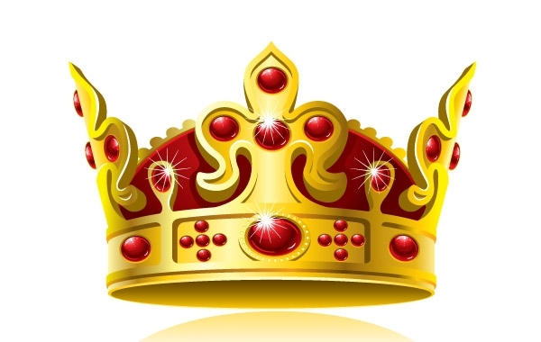

# Context is King

URL: https://articles.stockcharts.com/article/articles-wyckoff-2015-09-context-is-king/
Date: September 11, 2015 at 11:18 AM
Author: Bruce Fraser

Accumulation and Distribution Schematics are like road maps (click here for the Distribution schematics discussed in this article). They point toward where to go and how to get there. They are like road maps without the mileage to the next turn. Just to rev things up, each time a Wyckoffian makes the journey through Accumulation or Distribution the miles (time) to each juncture changes. No two journeys look alike. Though this seems not very useful, it is the best that can be done. And it is valuable. These schematics provide context, which is very important to the seasoned trader. Wyckoff does context better than any other methodology.

---

Let’s pull Distribution together into a structure that will bring more clarity to the whole. We tell the story of the uber trader known as the Composite Operator. The C.O. conducts market operations on such a large scale that the individual trader is like flotsam in the wake of their massive campaigns. When the C.O. conducts a campaign it follows a rational and logical sequence from beginning to end. Schematics are visual metaphors for the unfolding of their trading activities. Schematics provide the context that indicates the progress being made by the C.O. in their campaign to Accumulate or Distribute a position. Wyckoffians learn to conduct their trading in concert with the activities of the C.O. while most speculators unknowingly act in opposition to these big money operations.

Phases depict the structural shift of price behavior as Distribution matures to its conclusion. Each Phase has a subtle and unique quality. By understanding the price and volume attributes during each Phase the Wyckoffian, has a better grasp of when and how Distribution ends and Markdown begins. Phase analysis is context. There are five Phases; A through E and by developing the ability to see their distinctions, Wyckoffians become better at knowing what to do, and when to do it.

The C.O. has a mega position that must be distributed and this takes time and patience. A large and persistent uptrend will be stopped as a result of the selling operations of the C.O. Phase A begins with the stopping of an uptrend.

Phase A: Stopping action begins to check the advance of prices. Demand, in the late stages of an uptrend, is the result of buying by weak hands; speculators, traders, some institutions, and the public. Preliminary Supply (PSY) is a peak from which prices are turned down briefly, but forcefully. Thereafter, the uptrend continues into the Buying Climax (BCLX). The BCLX can end with a bang or a whimper. Price often accelerates with big leaping upward bars that create much excitement. Or the price advance can end with narrowing bars and diminishing volume. The Automatic Reaction (AR) is a large, abrupt and sharp price drop. This indicates that large selling interests have arrived and unloaded large quantities of stock. The AR low is the price level where this heavy selling stops and Support is found. Draw a Support line at the low of the AR and a Resistance line at the peak of the BCLX. A rally back toward the BCLX high is a Secondary Test (ST). If the rally is stopped near the BCLX price level either a Distribution or Stepping Stone Reaccumulation is forming.

Phase B: This is a period of time where price is in a trendless trading range bound by the BCLX and the AR. Phase B is where the mileage metaphor is most apt. This phase can go on and on or be very short. An Upthrust (UT) is likely, but not essential, during this phase. A UT is a minor breakout to new high prices which is brief and fails quickly. Watch volume closely in this phase as it will tend to bulge near the top of the range (near the Resistance Line) and stay high on the break back toward the Support levels. A tip off of Distribution is that volume is high on the declines and with each succeeding decline off the Resistance level, volume and volatility tend to be higher. Repeated Secondary Tests (ST) are common during this Phase. Rallies from near the Support Line toward the Resistance Line are labeled ST in Phase B. The variation in the number of these ST rallies gives each Phase B a unique character. The longer Phase B lasts, the more opportunity the C.O. has to sell stock and this can result in the subsequent Markdown being larger and longer.

Phase C: By the end of Phase B it should be evident to Wyckoffians that Distribution is at hand. The value of Context is evident at this time. Phase B is a period to watch carefully and to sell stock on the ST. Phase C is where the final upward test occurs. This is either a Last Point of Supply (LPSY) or an Upthrust After Distribution (UTAD). Once a peak is in, prices decline persistently and often with alacrity. The final test, which is the focus of Phase C, will conclude in two primary ways (with many variations). The leap into the UTAD is characterized by wide price spreads and high volume. The price surges above the prior high point and the Resistance Line (Distribution Schematic #1) before failing. This is an exhaustion move, but often traps traders who buy believing that it is a continuation of the prior uptrend. The big price leap encourages breakout buying. Prematurely bearish short sellers will often cover shorts on a UTAD breakout. Expect a Test after the UTAD price peak and then a failure back into the trading range. The Test of the UTAD is a strategic place for short sellers to initiate a trade and place the stop above the high price of the UTAD.

The Last Point of Supply (LPSY) is a different type of concluding rally. The LPSY will end at a lower peak, somewhere in the middle of the Distribution range (Distribution Schematic #2). The classic LPSY will rally from around the Support area in a lackluster fashion with narrow, overlapping price bars on diminishing volume. This poor activity will cause the Wyckoffian to conclude that demand is weak and lacks C.O. buying sponsorship.

Phase D: This is the emergence of the Markdown. The character of price changes when it begins its final descent down, through and out of the Distribution range. Price spread tends to become large and volatile and volume is high while declining to and through the support area. Phase D is typically where we see the breaking of the ICE and the Support area. Price then tends to live under the Support area where testing of the ICE and the Support lines (from below those levels) is the final pause before prices fade away into the Markdown.

The Last Point of Supply is the final peak before the continuation of the downtrend. Price will not return to the peak of the LPSY again in this price cycle. There can be multiple LPSY levels on a declining scale throughout Phase D. Short sellers will often use a series of LPSY peaks to average into positions placing stops just above the LPSY as prices resume their decline.

Phase E: Markdown phase is in full force and will be the overarching theme for the foreseeable future.

Context is King. Consider the richness of the principals evident in the behavior of each Phase. Price and volume behaviors are subtly, but significantly, different in each Phase. Mastery of the Wyckoff Method promises the ability to know the best strategy and tactics for each Phase of Accumulation, Markup, Distribution and Markdown.

In summary, Phases A & B are tactically where to sell into the BCLX, ST, and UT price peaks. Phase C & D are the tipping points where Composite Operator selling is largely complete. The C.O. is no longer motivated to support the stock to facilitate their operations, and therefore it is poised for a major markdown. Short sellers are using Phase C, D and E to establish a position for a large and rapid decline.

Distribution is the process of the C.O. shifting from being a large holder of shares to a seller of these shares. It takes skill to sell so many shares stealthily without putting price in a downtrend until all of the stock is sold. There can be no question that the character of price must change as Distribution matures from phase to phase. Grasping this as a tape reader is a skill we should all aspire to in the Wyckoff Nation.

All the Best,

Bruce

Exercise: Using the Distribution Schematics identify each Phase of Distribution on the case studies from the prior three blog posts.
