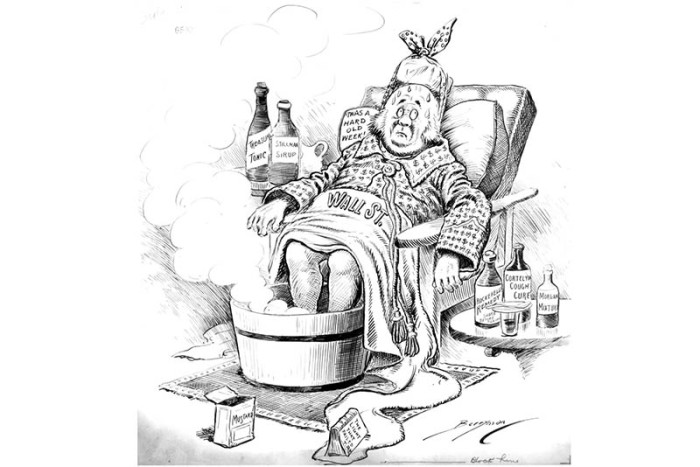

# Distribution Definitions

URL: https://articles.stockcharts.com/article/articles-wyckoff-2015-09-distribution-definitions/
Date: September 24, 2015 at 12:27 PM
Author: Bruce Fraser

In recent weeks we have covered much ground on the concept of Distribution. We now know that Distribution is a process, and that it takes time. Our mission, as Wyckoffians, is to become a keen observer of these Phases and Events within Phases, which are markers along the evolution of the Distribution phenomenon. Based on our observations, to then know what to do (sell or sell short stock) and when to do it. We study the behavior of price and volume to identify these Events. For the Wyckoff analyst, mastery comes from endless hours of chart study to develop an eye for the characteristics that define these Events and Phases.

Combine this discussion with the prior one on Phase analysis as they go hand in glove.

---

PSY—Preliminary Supply. After a long robust uptrend, price becomes climactic with wide up-bars and surging volume. Price then falls back as a normal correction ensues. Wyckoffians will recognize that these wide up-bars and high volume is evidence of selling by large interests, and that the correction was typically deeper than the prior corrections in the uptrend. In addition, the time taken during the correction was longer than prior pauses on the way up. At the conclusion of this correction, price begins another robust advance that exceeds the PSY price peak and continues to new highs. The rate of this new advance may be as fast as, or faster than the run-up into the PSY. The PSY is early evidence of major selling by the C.O. as the uptrend is maturing.

BCLX—Buying Climax. This event typically arrives with wide price bars and exceptional volume increases. Often this price advance is accompanied by bullish news or earnings. Trader, speculator, institutional and public buying is intense on this ‘good news’ breakout to new highs. The C.O. must sell into this advance and therefore the volume will be large. At times the volume on the PSY run-up is higher, but typically it is highest on the BCLX. The advance of price can end with a large, long, upward spike or it can conclude with narrowing bars which demonstrate active selling over the market. In either case the C.O. is actively selling stock. What follows defines and confirms the BCLX event.

AR—Automatic Reaction. A sudden and sharp retracement of price (typically) back to the area of the PSY is large and unexpected. The decline arrives on wide price spread and high volume. This is evidence of Supply now engulfing the market in a way that is more intense than any pause or correction in the prior uptrend. AR is sudden, brief and over quickly. Once the AR is established, we will draw a Support Line under the low price and a Resistance Line above the price peak of the BCLX. This is the outer bounds of the trading range that we expect for the foreseeable future. As Wyckoffians, we are now on the lookout for either a Stepping Stone Reaccumulation or a Distribution formation. Either event usually takes considerable time.

ST—Secondary Test. Price momentum is a result of the run-up into the BCLX. Momentum is a condition that allows the C.O. to sell stock for weeks and months to come. After the AR, there will be a rally back to the resistance area defined by the BCLX. The rally may reach, or (slightly) exceed, the BCLX price peak and this constitutes the Secondary Test. A return to the bottom of the trading range follows. The peak of the ST will generally be marked by high volume and reversal price bars. As price turns back down volume will normally remain high. This is all evidence of the heavy selling by the C.O., which generates the resistance at the top. Multiple ST rallies should be expected.

UT—Upthrust. The UT is an extended form of a Secondary Test. An Upthrust results in a new high above the BCLX peak. Breakouts during distribution bring in the momentum traders which are a source of demand the C.O. can sell shares into. Therefore, a UT will not linger above the Resistance area for long before returning to support.

SOW—Sign of Weakness. After a ST or UT, the drop to Support is marked by wide declining price bars and expanding volume. At the conclusion of the decline, price breaches the Support line (drawn at the AR low) and the prior low(s) set by the ST decline. Often the SOW indicates a subtle change of character, where price weakness is widely evident. Once the SOW is in place, the Wyckoffian will become alert for a final rally that sets up the conclusion of Distribution.

UTAD—Upthrust after Distribution. This last gasp rally from Support occurs occasionally, and will drive the stock price above Resistance and the prior price peaks in the Distribution trading range. Price rallies with conviction and often has big leaping bars and volume. Once at new highs, price can stay above the Resistance area for days to weeks. The conviction of this rally and breakout will attract a following of buyers. After a series of Tests, price begins to sink back below the prior peaks and in short order is heading back to the Support area. After a UTAD, price becomes persistently weak to and through Support and into a confirmed downtrend.

LPSY—Last Point of Supply. A rally forms off the Support area (often a SOW), which is particularly feeble. The Distribution is now mature and demand has largely been exhausted by the blanket of Supply from the Composite Operator. Overlapping price bars and low volume are signatures of the LPSY rally. The LPSY will not have the lift to return back to the Resistance area before turning down. Last Point of Supply means what it says. This is the highest and last price point where C.O. supply will stop the advance (the remaining public demand) in this Distribution Event. Price will not return to this level again in this cycle. Distribution of shares by the C.O. is largely complete. Multiple LPSY points on a scale down can and will occur often.

Please study these idealized schematics of Distribution, but remember, an incalculable number of variations can be revealed during the Distribution Phase. Mastery is seeing the overall principles (Phases) at work and knowing when and where to act while operating inside these endless variations. Practice, practice, practice.

All the Best,

Bruce
