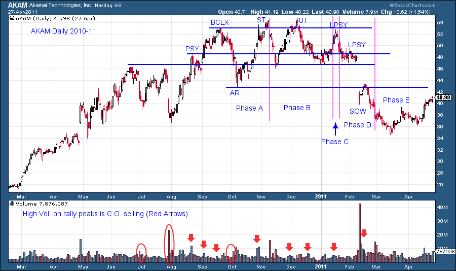
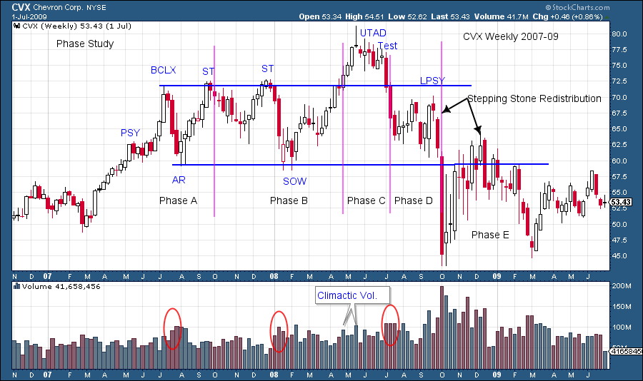
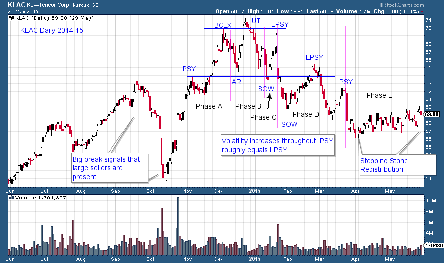
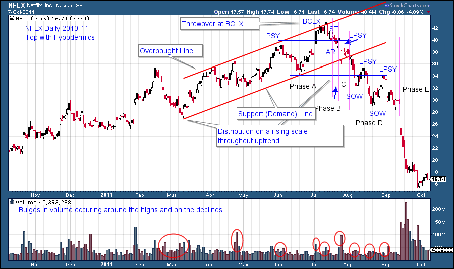
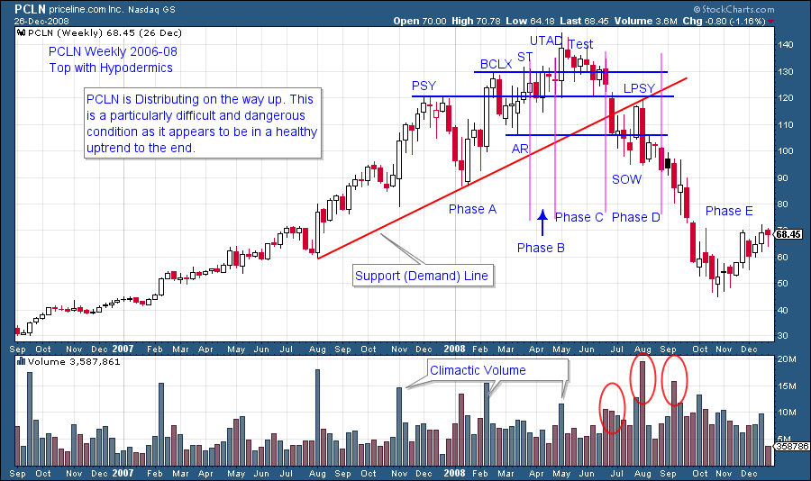
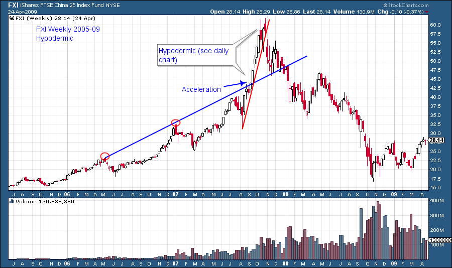
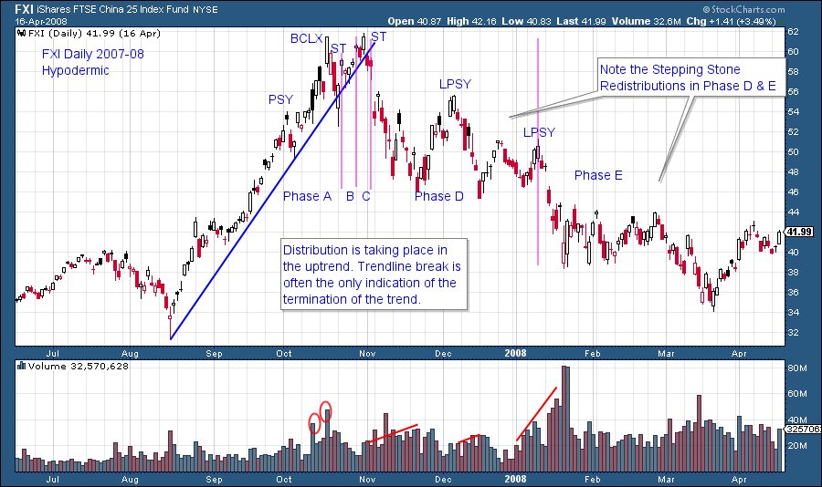

# Just Another Phase

URL: https://articles.stockcharts.com/article/articles-wyckoff-2015-09-just-another-phase/
Date: September 18, 2015 at 04:23 PM
Author: Bruce Fraser

Let’s continue our discussion of Phases from the prior blog post by getting right into chart analysis. Please review ‘Context is King’ (click here for link) for more on Phases.

A classic BCLX is followed by an AR which sets up the Distribution trading range for AKAM. Note how the rallies to the BCLX, ST, UT and LPSY are each less robust than the prior. The time spent dropping from the UT and the LPSY peaks increases. This indicates there is active selling on a scale down off the peaks. Phase A is the stopping of the prior uptrend. The ST ending in the vicinity of the BCLX establishes that the prior trend has been concluded. The B phase is typically a long trendless trading range where stock is being sold in large quantities by the C.O. Continued retesting of the high price area brings comfort to stockholders, at their peril. Phase C is that final and brief test that fails and sets an important lower high, which in this case is a LPSY. A Test of that high is typically made within days of the LPSY peak. A Test of the LPSY is a classic place for Wyckoffian short sellers to enter a trade and place a stop above the LPSY high. Phase D is the continuation of the markdown out of the Distribution range where the downtrend begins (Phase E).

---

The ST of the BCLX stops the uptrend of CVX. A volatile and wide trading range indicates that conditions have changed for the stock. The SOW undercutting the AR is another subtle clue that Distribution is at hand. Phase A stops the trend and Phase B is active selling. Phase C in this case is a UTAD which hovers above the BCLX peak for 9 weeks. Climactic volume in to the UTAD peak is evidence of active sellers. Phase D has a Stepping Stone Redistribution (SSR). Here price pauses in the downtrend for a considerable period and has no capacity to rally back to the top of the Distribution range, a meaningful sign of trouble ahead. CVX breaks very hard out of the Distribution into Phase E. This proves to be the low of the decline and then 5 months later tests that low after another SSR. Note how the UTAD sets up a rapid and weak price formation where selling dominates to the conclusion of Phase D and into the markdown of Phase E.

KLAC has a big selling event in September and October which is not preceded by a typical Distribution. Then it has another near vertical run up into a more characteristic Distribution. PSY forms at the level of the September peak with a shallow pause, followed by a Phase A BCLX and AR. We mark the first minor Test as the completion of Phase A and the AR follows. This is a judgment call as the normal protocol is to look for a ST after the AR low and that is the conclusion of Phase A. In Phase B the UT is followed by a rapid decline into a SOW. This puts us on alert that the Distribution is progressing in a hurry. Even though a quick rally forms into the LPSY, the SOW gives us a heads up that KLAC is inherently weak and that we should be tightening stops if long the stock. The LPSY is not tested as it gaps right to the SOW and then skids out of the brief Distribution, where a second SOW forms. A three week rally of poor quality and low volume raises prices into another LPSY. This LPSY is tested and sets up a short sale just above the Support line. Note that BCLX roughly equals LPSY and PSY roughly equals the second LPSY. When price parity is formed around these levels Wyckoffians stop, look, and listen for reversals. Phase D is long and drawn out and a large SSR forms in Phase E. Take time to look at the aftermath of these examples.

This NFLX case study is a particularly difficult form of Distribution. The final leg of the uptrend is where the C.O. is Distributing stock. Distribution on a rising scale, in an uptrend, is challenging to detect and evaluate. Once the uptrend is complete a virulent markdown begins immediately. Phase analysis is difficult as everything happens so quickly. The big early clues are the long declines in the uptrend which indicate large, active sellers. Also the throwover at the BCLX is a valuable indication. The breaking of the Supporting trendline (Demand Line) is a wakeup call that all is not well. The two LPSYs at the Support line are final touches to conclude the D phase and begin the markdown. There is evidence of hypodermics in the final stages of the NFLX advance (hypodermics are discussed below).

PCLN is Distributing while in a rising pattern. Note how the final leg up is accelerating upward and away from the Support Trendline. Attributes of Distribution are evident throughout (PSY, BCLX, ST, UTAD). What is not evident are signs of price weakness on the way up. Sharply higher lows are being made into the UTAD. This makes the uptrend look sound when, in fact, it is dangerously toppy. The tendency is for traders to focus on the uptrend and not on the signs of Distribution. Wyckoffians are also subject to these mistakes and therefore will use trendlines as a place to set trailing stops and sell stock. After the trendline is broken, a price rally tests it from underneath (PSY=LPSY) and is a tactically sound place for short selling.

Acceleration and exhaustion of price in the final leg up was referred to as a Hypodermic in Richard Wyckoff’s era. FXI is a recent example of this phenomena (NFLX and PLCN above have attributes of Hypodermic behavior in their final advance). Somewhat rare, it is still a form of Distribution that Wyckoffians should be aware of. The daily chart below isolates the final blistering price advance into the peak. Below the chart is a wonderful description of Hypodermics by Dr. Pruden.

“Around the end of a market advance, the market is sustained or revived by a series of periodic hypodermic injections of artificial stimulants that shoot prices and volume up, only to quickly fade away. The hypodermic could keep an almost dead bull on its legs for a while longer. Good news, analysts’ comments, public interest and ballyhoo help create a lethal tonic. As injections wear off quickly, the blow off advance is given up and the market trades erratically, leaching back. The Composite Operator repeats the stimulus several times in an attempt to reinstate the aged bull. His objectives are just about realized. The result is a Teepee or UTAD distributive condition with descending peaks in a fast moving collapse, as repeated hypodermics lose their punch and the bull’s stride is broken.” –Dr. Hank Pruden.

On the daily chart of FXI, after the PSY, price attempts to accelerate upward and away from the supporting trendline. This ‘whooping up’ is short lived and prices fall quickly back to the trendline. Breaking under the trendline, even briefly should be considered a Sign of Weakness and a warning of inherent weakness, and active selling, of the aging trend. Climax type action is evident at the BCLX and the ST. Phases become difficult to define, but some important signposts light the way. This advance is steep and we cannot expect much warning of trend change. The BCLX is a stopping action indicating Phase A. The Secondary Test (ST) could be the final peak and is provisionally labeled Phase B or C. We expect the break of the trendline to kick off the decline to the bottom of the distribution range, which is around the PSY price level. That would be Phase D and thereafter Phase E. So the Phase work gives us a way to think about or script what could happen.

Finally, emphasis on the supporting trendline is valuable and important. As we can see in these examples, once the upward stride is broken the tone and trend of the market can change quickly. Trendlines often prove to be the important last line of defense where stops protect capital and lock in the profits of successful campaigns.

All the Best,

Bruce
