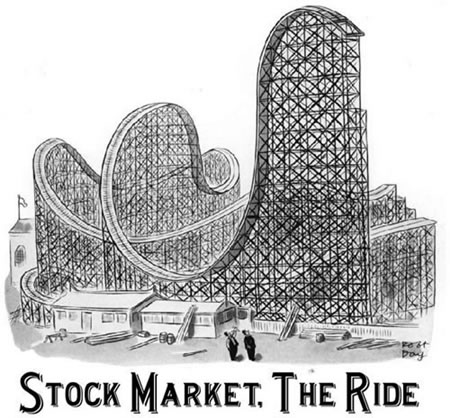
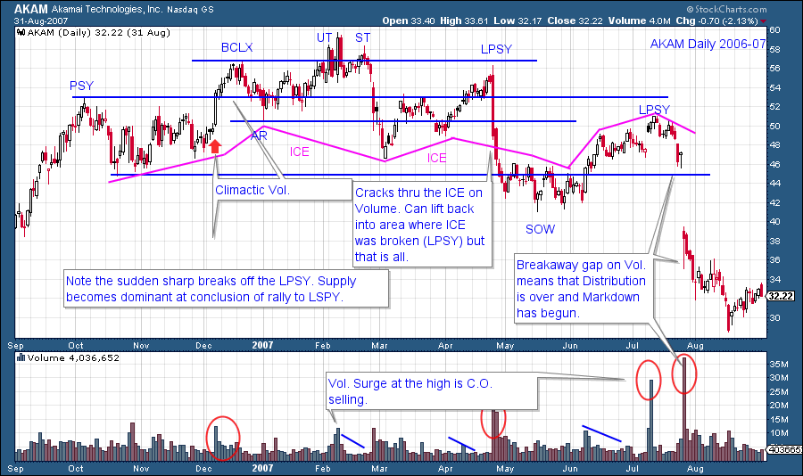
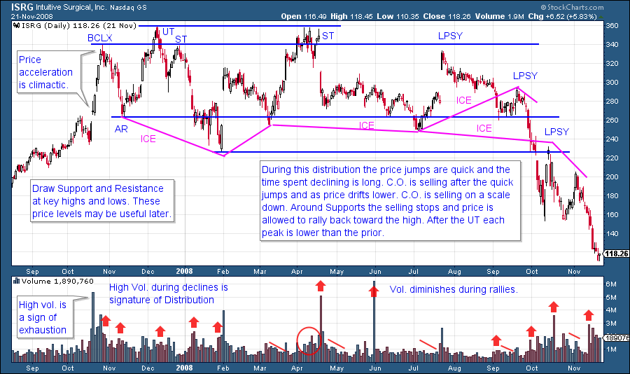
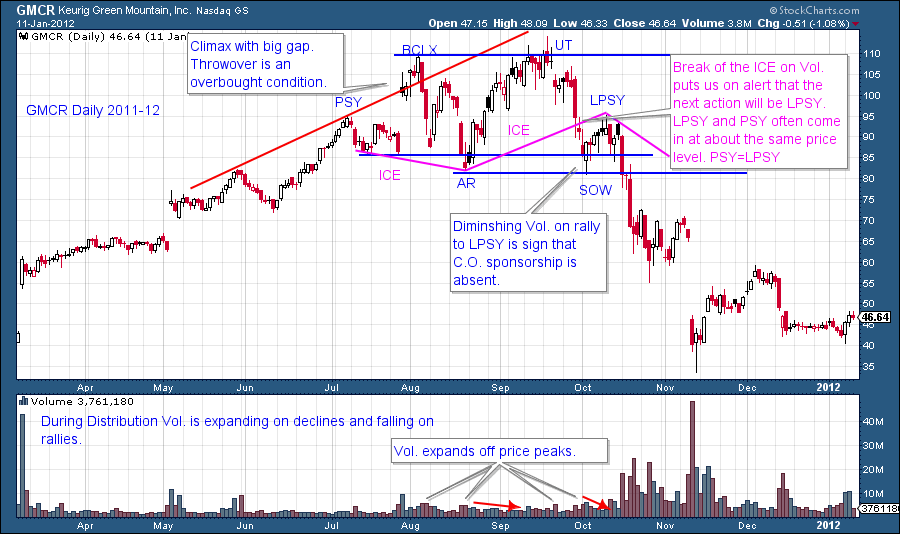
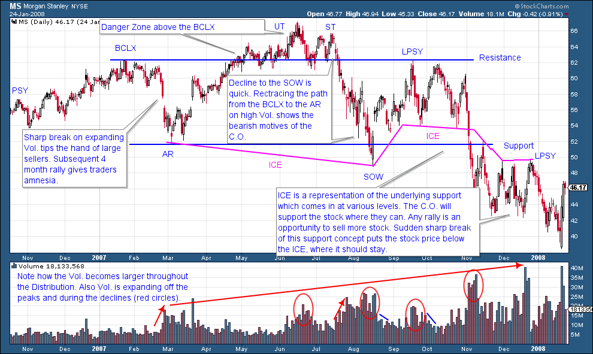

# Just Charts

URL: https://articles.stockcharts.com/article/articles-wyckoff-2015-09-just-charts/
Date: September 04, 2015 at 02:47 PM
Author: Bruce Fraser

A chart is worth a thousand words. So let’s study some charts. We continue our discussion of Distribution and review some additional examples. Our goal is chart reading mastery. The ability to see changing price conditions, in real time, is an important long term goal. This takes time, practice and devotion to accomplish. An attribute of this skill, is the ability to identify and act at the proper junctures on the chart. We have spent much time and attention to becoming familiar with the classic investment cycle (Accumulation, Markup, Distribution, Markdown). Understanding the nature of price behavior during each of these phases has been our emphasis. Future posts will focus additional attention on the best tactical places for the Wyckoffian to enter trades and place stops. Chart reading is an exercise in decision making in the face of uncertainty. We are always operating in the ‘fog’ of markets. As Wyckoffians we are making judgments about the current position and probable future direction of stock prices. Our mission is to maximize the return and reduce the risk in our campaign to make profits from stock price movements. Also, as Wyckoffians, we seek to identify the best stock candidate from a list of potential ideas. The stock poised to move the furthest and the soonest is the one we want to campaign.

---

These mastery skills come to us through countless hours of study and practice. I know of no other way to achieve mastery and to overcome the inevitable pitfalls inherent in stock speculation, than through such efforts. My goal is to accelerate your journey down this mastery path by illustrating the principles of the Wyckoff Method and to provide examples for study. You are heartily encouraged to mark up as many charts as time permits to advance your deeper understanding of the Methodology. Your experiences on the path are of great interest to me and may be valuable to others as well. Feedback is helpful as many others may have similar thoughts and comments. When possible I will include clarifying examples to your questions and remarks. I hope to hear from you. Now on to the charts.

AKAM spends much time drifting up from the Support level to Resistance and quickly falls back. The C.O. is selling stock on a scale up. The overlapping price bars with generally low volume is a telltale sign (see April advance). Rising prices, though lackluster, soothes traders nerves (a call for Wyckoffian vigilance and caution). The C.O. sells what they can, when they can. Their goal is to not depress prices as a result of their selling activities. Thus the drifting upward tilt to prices. Note how quickly prices fall back to Support. This indicates minimal demand and active large sellers. Also, there are large spikes of volume near the high prices of the Resistance area indicating the presence of Supply. The May price break was an eye opener to many large holders. We label this as the breaking of the ICE because of the sheer force of the price decline. It is expected that price will have trouble lifting much as more large holders arrive to sell shares after such a high volume decline. This results in the Last Point of Supply (LPSY) which is another lower high that will not be exceeded again in this price cycle.

ISRG illustrates the point that Distribution can take many forms. A Wyckoffian’s mission is to identify the telling signs of large interests selling their position irrespective of the look of the chart pattern. Wyckoff is about tape reading principles as illustrated in vertical price bars and volume. Even though Distribution can come in many shapes and sizes, the Wyckoffian can still determine the essential nature of the formation and the motives of the Composite Operator. Here we see sharp breaks off of Resistance and then downward drifting price action (see Feb. and May-June and Aug. of ‘08). Long periods of time where stock can be sold. The highest price is made on the Upthrust (UT) and thereafter lower highs are being made. After the UT we label subsequent attempts of price to return to the UT high as Secondary Tests (ST). Volume on down days is generally greater than on up days throughout the Distribution.

GMCR makes a relatively short duration top. A dramatic surge of prices into a BCLX on a gap is exhaustion of the uptrend. In a reverse use of trendlines we can see a throwover, which is an overbought condition. A Buying Climax (BCLX), a test (UT) and then an LPSY constitute the peaks of the Distribution. The sharp break from the UT to the Sign of Weakness (SOW) is wickedly fast. This looks like ICE breaking and puts us on alert. The lackluster rally on diminishing volume to the LPSY is a major clue of Distribution being in an advanced state. The Preliminary Supply (PSY) peak about equals the LPSY peak, which often provides Resistance, and does so here.

We go with the BCLX label because of the dramatic Automatic Reaction (AR) which indicates the arrival of large selling interests (C.O.). The Sign of Weakness is an important attribute of Distribution. Typically lower highs and lower lows are evident within the structure of Distribution. If the low comes early in the trading range structure and then higher lows appear as the trading range is maturing, it is more likely that a Reaccumulation is being formed. Prior blogs have been devoted to this distinction and we will return to it in future postings. With MS note the large expansion of Volume as the Distribution matures. ICE is a concept of Support arriving at various price levels. ICE is typically broken with a jolt, as is the case here. With breaking the ICE we expect that any subsequent rally attempt will be muted and not capable of returning to prior high price levels. The stock price is very vulnerable to further declines when it is below the ICE.

The Buying Climax is a very emotional price point, it is the culmination and exhaustion of the entire preceding uptrend. All future attempts to rise above the BCLX will be met with selling at and around the Resistance line. Even stocks that are ultimately going to higher prices in the future need to Reaccumulate after a BCLX. This is why we draw a Resistance line at the price peak of the BCLX. Note in MS, the Up Thrust and the Secondary Test are classic places for the C.O. to sell stock in quantity. Thereafter, a big grinding decline to a SOW illustrates just how much selling was done at those peaks. There is simply no C.O. demand to hold MS up and it falls to and below the Support Line.

Take some time to study the price action leading up to and after the Distribution Phase on the charts above.

All the Best, Bruce

---

The fall semester of technical analysis classes begins soon at Golden Gate University in San Francisco. Dr. Hank Pruden and I will team teach FI354, the Wyckoff I class, on campus beginning September 5th. In addition there are two other fall class offerings, FI352 and FI360. These classes can be taken individually or as part of a degree program. For more information call Dr. Pruden at 415.442.6583 (click here to link to the GGU website). Classes are available both on-campus and online (cyber campus), see the schedule for additional details.

Dr. Pruden has arranged for individuals interested in the upcoming Wyckoff I class to attend the first session prior to making the decision to enroll. This opportunity is only for candidates who are interested in enrolling in the class for the upcoming semester. As space is strictly limited to the capacity of the classroom reservations are a must. Please call Dr. Pruden at 415.442.6583 to reserve your space.

Also of note: Legendary technician (and stockcharts.com contributor) Martin Pring will be team teaching FI 352: Technical Analysis of Securities over the internet (online) this fall on the GGU Cyber-Campus.
