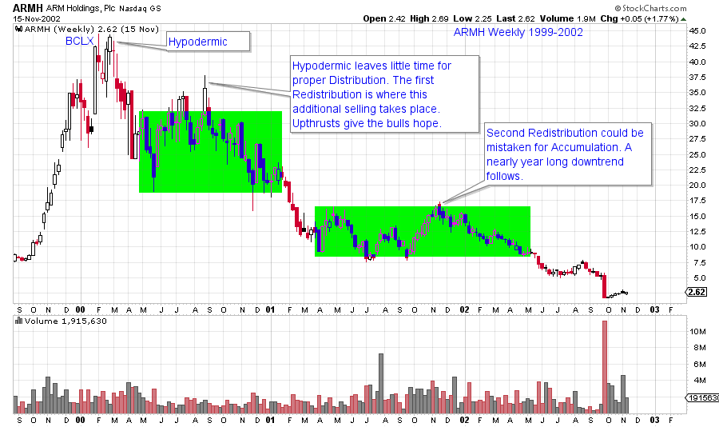
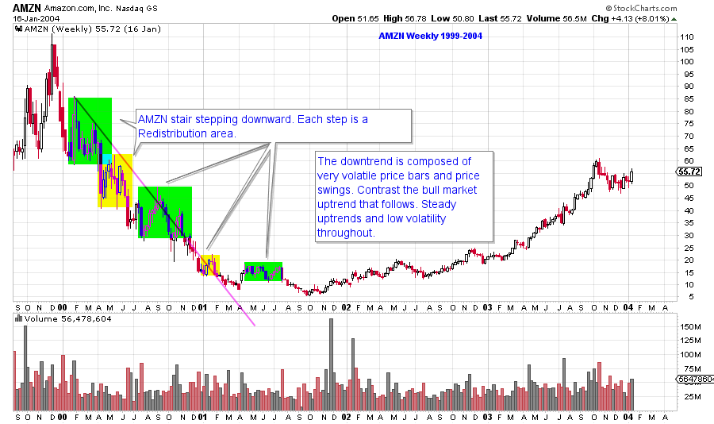
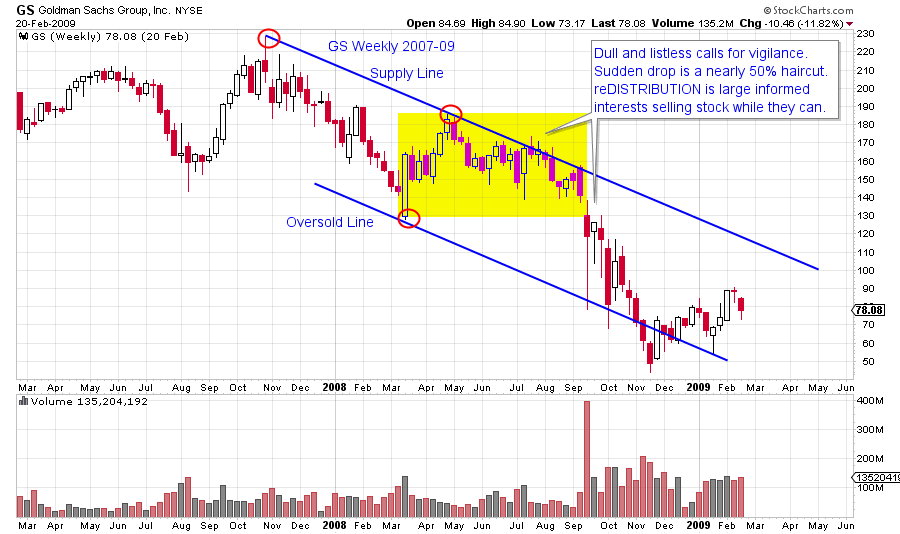
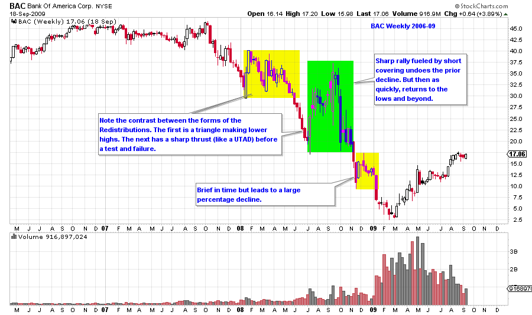
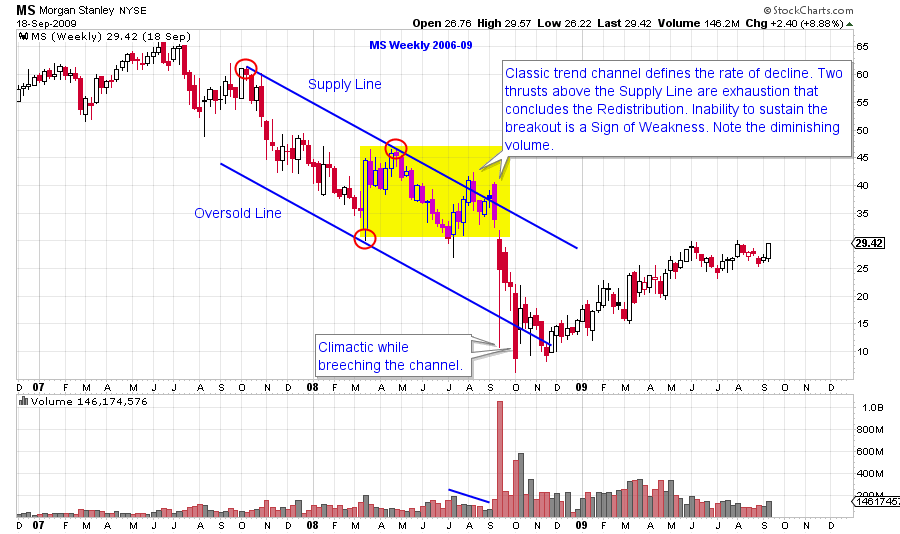

# Redistribution Ruckus

URL: https://articles.stockcharts.com/article/articles-wyckoff-2015-10-redistribution-ruckus--/
Date: October 30, 2015 at 03:50 PM
Author: Bruce Fraser

Bear markets are wild and wooly affairs; quick and painful, slow and tortuous, and every other kind of difficulty imaginable. Bear markets get less attention from market students than the other phases of price action. Amnesia sets in for investors after a bear market. Who among us can remember the bear market of 2007-09, much less the decline beginning in 2000? The truth is, for many, they are no fun to think about. The prior two posts were devoted to the art of drawing trendlines and trend channels during declining markets. The next few posts will be devoted to evaluating the concept of the ‘Redistribution’ Phase. This phase can loosely be described as a trading range that follows a downtrend. A Redistribution is a pause that is preceded by a decline in prices and then is followed by a resumption of falling prices. Multiple Redistribution Phases can occur within an entire decline.

The overarching theme of a bear market is an abundance of stock and a shortage of buying power. Stock is in ‘weak hands’ and strong hands are not buyers. This is a toxic brew for stock values. Markdown Phase is what we call the entirety of the Bear Market structure. But inside the Markdown is a multitude of price behaviors, most of which should be avoided by investors, but some of which are trading opportunities. The Redistribution is a pause that refreshes stocks for another downward run. A common mistake is to evaluate the structure of Redistribution as an Accumulation (a bottom for prices). Therefore an important goal for this discussion is to create skills in distinguishing one condition from the other. The ability to avoid making a premature buying decision is very valuable to portfolio returns and for peace of mind.

---

---

Redistributions come in many varied shapes, sizes and timeframes. They tend to be messy with much volatility and minimal predictability. There are some generalizations that are useful, and we will cover these as we evaluate case studies over the next few posts. There are an infinite number of variations. We will attempt to find the setups that are actionable for short sellers, and emphasize that investors should avoid these downtrend conditions throughout.

(click on chart for active version)

ARMH advance concludes with a dramatic Hypodermic, a sharp break and then a nine month Redistribution. Note the Upthrusts above the green box. These thrusts bring in buyers and keep the short sellers off balance. Meanwhile the C.O. has little time to distribute shares in a Hypodermic and therefore needs the Redistribution to get the bulk of their selling done. The second Redistribution takes a year to unfold with the result being a stock price that goes from $17.50 to $2.00. The big break off of a Hypodermic peak can freeze investors and discourage them from acting. The massive drop is a warning that the bull phase is over for the foreseeable future. The first Redistribution is an important opportunity to sell.

(click on chart for active version)

AMZN has a series of volatile stair steps lower. The trendline drawn off the early adjacent peaks shows the trajectory of the decline for the remainder of the bear phase. The Markup phase that follows is shown to illustrate the dramatic difference in volatility between a bear market and a bull market. Bear market volatility is very difficult to endure for most investors and should be avoided.

(click on chart for active version)

From March 2008 to September 2008, GS is quiet and listless. This calm should not lull investors into non-attention. The decline that follows is sudden and deep. Redistributions typically are resolved with volatile and sharp price drops.

(click on chart for active version)

Note the dramatic BAC advance from $17 to $37 during the second Redistribution, all the while BAC is on a path to $2.50. Some C.O. types are short sellers and they use Redistributions to sell remaining long stock and possibly to establish short positions. All of the ‘tricks of the trade’ employed during Distribution are put to work during Redistribution phases. We will explore these strategies and devices in upcoming posts.

(click on chart for active version)

Trend analysis can be a useful tool during downtrends and Redistributions. A volatile downtrend becomes more volatile as the downtrend grows old. The MS trend channel is breeched repeatedly, but is not violated permanently. The Redistribution flirts with the Supply Line at the conclusion of the sideways action and then turns to a rapid decline.

Redistributions are very common, elusive and difficult to trade. There are characteristics that can be understood, identified and traded successfully. For most of us, avoiding the bear phases is the wisest course of action. As Wyckoffians, we are students of all markets and we are always involved in the study of the current market conditions. Then when the best opportunities present themselves we are rested, engaged and ready to campaign the emerging trends.

All the Best,

Bruce
