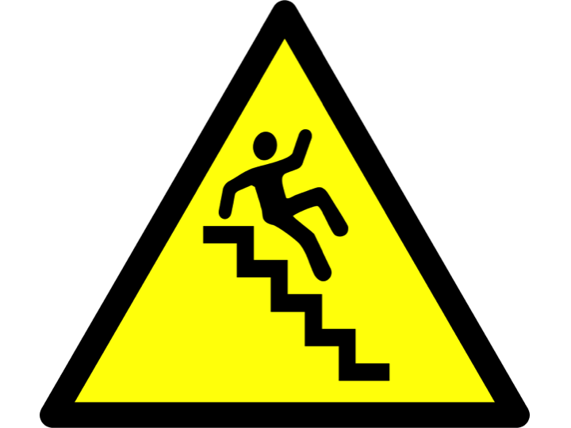
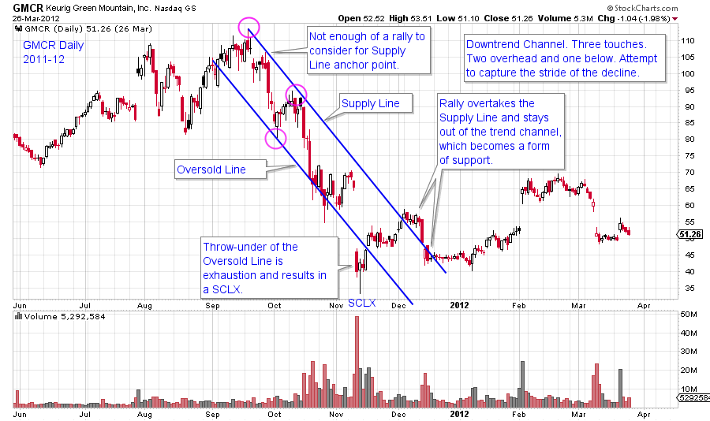
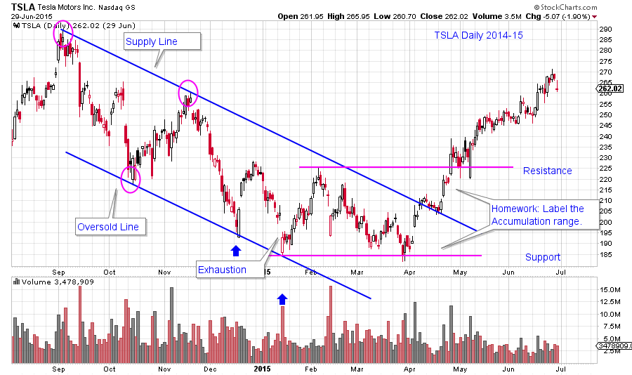
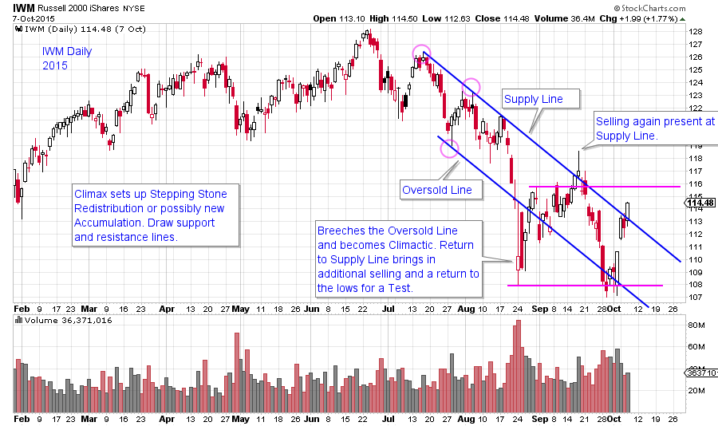

# The Unfriendly Trend

URL: https://articles.stockcharts.com/article/articles-wyckoff-2015-10-the-unfriendly-trend/
Date: October 13, 2015 at 05:01 PM
Author: Bruce Fraser

Once Distribution is complete, the Markdown Phase begins. Declining prices after the completion of Distribution can cause a ruckus. Sponsorship (of a stock, bond, commodity, ETF, etc.) by large and informed interests is necessary to drive prices higher and higher. Eventually large sponsors abandon ship, which they do through the Distribution process, and leave the stock in the hands of weak holders. A stock in weak hands will go down. The price of abandoned stocks will fall quickly. Over the course of the next few blogs we will study the Markdown phase and its attributes.

We are all familiar with “The Trend is Your Friend”. Downtrends are much less friendly than uptrends. They are volatile, abrupt and generally difficult to trade. In a word they are unfriendly.

---

Downtrends can occur in orderly trend channels. Or they can gap down, pause, then gap down again, and again, and again. During bull market uptrends, large sponsors will put a bid under the price which makes countertrend declines more orderly. No such sponsorship exists in a downtrend. Therefore declines are difficult to trade.

Trend channel construction begins with a Supply Line. This is a Trendline drawn over the peaks of the emerging decline. Most investors are still hoping for higher prices and thus the notion of drawing a downtrend line is not even considered. Wyckoffians must be ever vigilant. After the final peak, trouble can start right away.

The “stride” of the decline can be set very early in the downtrend. This is the rate or pace at which the price decline will cascade lower. Two lines compose the trend channel. The overhead Trendline is called the Supply Line. The lower line is the Oversold Line. The Supply Line is the level that price will rally to where it encounters overwhelming selling (or Supply). Each of these succeeding rallies is to a lower peak, thus setting the downtrend. The decline from the Supply Line roughly goes to the Oversold Line. The result is a declining trend channel, or downtrend.

To construct the Supply Line find two adjacent price peaks with the second peak being lower than the first. Draw the downtrend off these two peaks; this is the overhead Supply Line. Find the intervening low between the two price peaks, there draw a parallel line to the Supply Line. This is the Oversold Line. Look for the trend channel to roughly follow this path lower. Think of a downtrend channel as though it is a trading range with a declining tilt to it. Expect prices to bounce around the outer boundaries of the channel with price often bulging beyond it.

After a period of decline the phenomena of the Stepping Stone Redistribution (SSR) can occur. This is a sideways trading range that can last from weeks to many months. The SSR will generally interrupt the downtrend channel. After the completion of an SSR the decline resumes and new trend channels will be drawn, if possible.

(click on chart for active version)

The pace of the decline is established by two adjacent peaks in this excellent GMCR example. The parallel Oversold Line is breached twice on the way down. The final drop below the Oversold Line is on a large gap and is the SCLX. Thereafter, the tone changes and GMCR lifts right back through the channel and out. Once out, the Supply Line acts as support, where before it was resistance. Wyckoff Methodology dictates that three points are required to define a downtrend channel. Click this active chart and look forward a year to see if GMCR is Redistributing for another decline or is beginning Accumulation.

(click on chart for active version)

TSLA had a volatile seven month downtrend. The inability to return to the Oversold Line in March signaled diminishing downward momentum. You are encouraged to label the Accumulation that is forming inside the channel (see support and resistance lines). Jumping the Supply Line and using it as support is major evidence of a price character change.

(click on chart for active version)

A well defined downtrend in the IWM ETF has recently developed. Note how the trend becomes more volatile as it extends. Climactic activity is apparent in the dramatic break below the Oversold Line. This is stopping action and will likely lead to a Stepping Stone Redistribution or an Accumulation. Either condition will take time and Wyckoff analysis should reveal which scenario comes to pass.

These three examples are illustrations of definable downtrend channels. There are situations where trendlines and channels are nearly impossible to construct and this will be the subject of future posts.

All the Best,

Bruce
