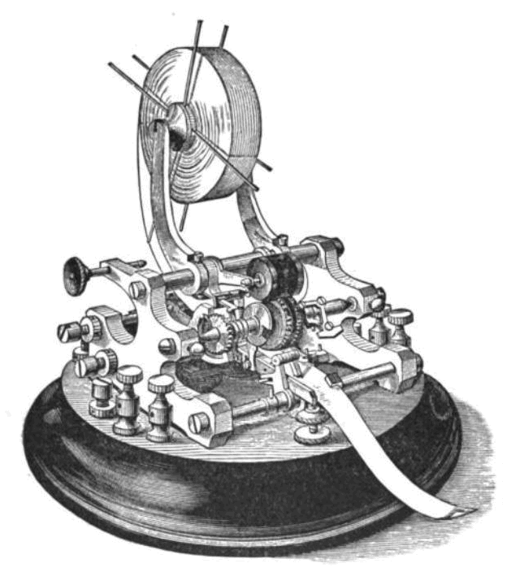
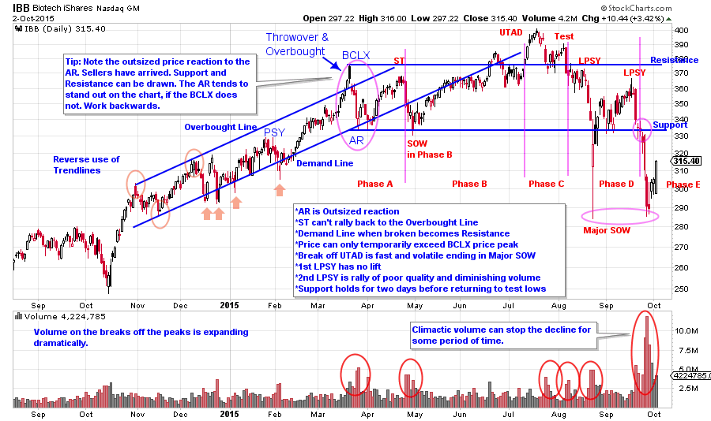

# The Way of Wyckoff

URL: https://articles.stockcharts.com/article/articles-wyckoff-2015-10-the-way-of-wyckoff/
Date: October 02, 2015 at 04:25 PM
Author: Bruce Fraser

I am on the road this week so this will be a brief post. As you know, I continually emphasize the motives and roles of the Composite Operator. We call the C.O. a heuristic, or a useful fiction. There are many large interests at work in the markets simultaneously. Some of these large and skilled interests are at work in the active stocks that the public is trading in. We assume that these C.O. interests are much better informed and skilled in trading these stocks, indexes and exchange traded funds (ETFs). They wield a line of stock that is massive in size.

So what was Richard D. Wyckoff trying to teach us about using the activity of price and volume (the tape) to follow these large informed interests? He wanted us to know that their sizable activities could not be hidden from those who knew what to look for.

---

What does thinking about the motives of the C.O. do for us as Wyckoffians? It helps us in two key ways. First, it puts us in alignment with the thinking of the large interests. Our purpose is to patiently wait for the juncture when the C.O. has completed their campaign of accumulating or distributing stock, and then to ride along with them on the markup or markdown. All of our attention is focused on the juncture where price can move and move now. With enough time and practice this skill is available to us.

Secondly, thinking like the C.O. allows us to role-play at being the "smart money" and if we do that long enough we begin to associate into the role. By continually practicing this C.O. narrative, we gradually leave our 'public' nature behind and develop new and better habits. This comes to us very gradually, but with persistence, one day it arrives.

What is required, is to always ask what the motives of the Composite Operator are (a C.O. journal can help). Always keeping in mind that it is a heuristic.

Students often have trouble seeing the charts correctly for labeling purposes. These skills come with practice, practice, practice. Here is a little secret; find a chart attribute that you recognize and work backwards. One big 'tell' on the charts is the Automatic Reaction (AR) late in an uptrend. Work backward to find the BCLX, and then the PSY etc. The AR will be a price decline that is larger in magnitude than the declines that preceded it during the uptrend. Another example is the breakdown through support and out of the trading range. This is a clue that Phase D or E is at hand. Work backwards to study the volume on the breaks and on the rallies. Soon you will discover the structure revealing itself.

Wyckoffians see what is important and actionable. As time goes on we will dive into the strategy and the mental aspects of trading with the Wyckoff Methodology.

(click on chart for active version)

Here is a chart of IBB that was first published in July (click here for link). With the reverse use of trendlines we see a throw-over condition. The Automatic Reaction (AR) is larger than the price corrections in the uptrend, indicating that selling is intensifying. With the AR identified, we backtrack to the prior peak to determine if it has BCLX qualities. We now suspect that a BCLX occurred, resulting in one of two conditions; a Stepping-Stone Reaccumulation or a Distribution. Patience is required here, as it will take time for either condition to mature into a new trend. Biotech is one of the most loved investment themes of this bull market, therefore we know that it will take time for the C.O. to Distribute all of their biotech holdings. Biotech stocks are heavily owned by institutions this cycle. If and when the institutions fall out of love with this group, they will sell stock rapidly. IBB is a proxy for the activity of the entire group and thus this ETF is ideal for Wyckoff analysis. We can assume that one of the most dominant themes of this bull market to date has sizable C.O. Sponsorship. The push to a new high above the BCLX price peak is a classic place for C.O. selling, so it is very important that prices maintain these new highs. Failure back below the Resistance line could cause a cascade of selling, and it does with expanding price spread and rising volume. UTAD price failures often break quickly to the Support Line. In this case a Major Sign of Weakness (SOW) forms with an extreme break of the Support line prior to bouncing back into the Distribution area. This example illustrates our point that a break below Support indicates that large sellers are present, and that Phase D or Phase E is forming. We don’t need all of the labels to draw this conclusion. The Support Line drawn from the AR low being dramatically broken tells us much. Now we can go back and try to label the prior key points. Also, the rally to the second LPSY provides an opportunity to sell IBB shares.

In future posts we will discuss the Markdown and Stepping Stone Redistribution conditions.

All the Best,

Bruce
