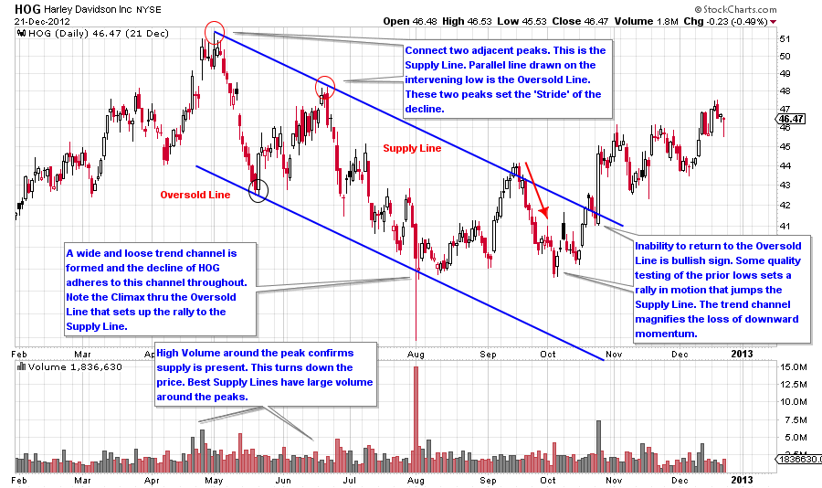
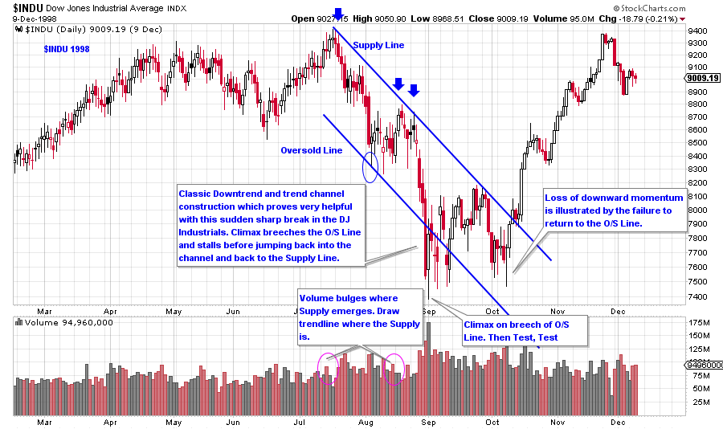
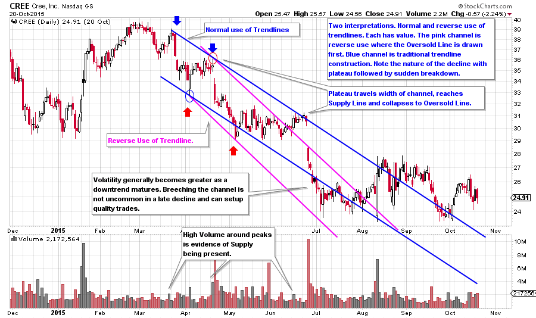
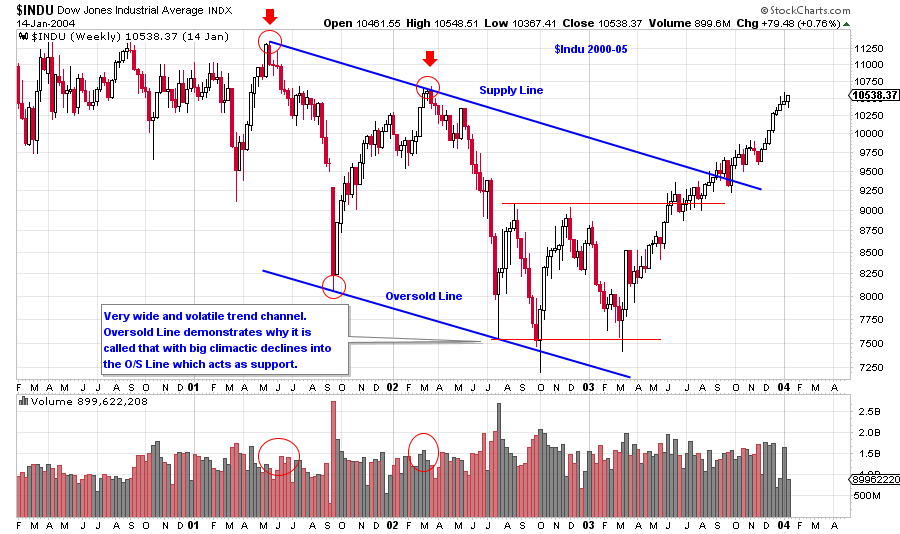
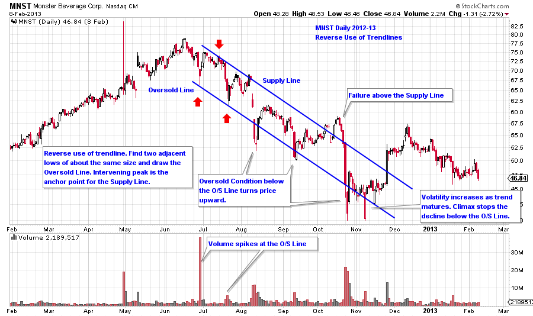

# Trendapalooza

URL: https://articles.stockcharts.com/article/articles-wyckoff-2015-10-trendapalooza/
Date: October 22, 2015 at 03:29 PM
Author: Bruce Fraser

When trendlines are drawn, with the Wyckoff Method, it is like putting on 3D glasses. With proper trend analysis two dimensional charts spring to life and reveal their innermost secrets and true intentions. Demand lines, Supply Lines, Overbought Lines, Oversold Lines, Support Lines and Resistance Lines; they all tell a story about the behavior and direction of prices. When we raise our skills at drawing these trendlines we are putting ourselves onto the path toward Wyckoffian Mastery status.

Well considered, well drawn trendlines, channels and trading ranges bring a stock chart to life. The story of where supply is coming in and stopping the price advance becomes evident and informs trading tactics. A proper trendline will tip off the rate of advance or decline, the stride, at which the price will be moving for the foreseeable future. Trend Channels indicate the nature of the advance or decline. Is it a wide and loose channel which has big upward and downward swings contained within a large persistent trend? Is it a stair stepping move with long sideways plateaus followed by a sudden sharp drop to a new price level? These mini case studies are an introduction to the varied nature of downtrends and how proper trendlines can assist in effective trading tactics. Wyckoff trendline construction reveals secret gems hidden in plain sight. Our Wyckoffian 3D glasses provide the perspective of seeing our charts in a more useful way.

---

Last week began a discussion on downtrends and how to construct trendlines and trend channels. See earlier posts for a discussion of uptrends (Link to these posts here and here). Let’s continue on with additional downtrend case studies.

(click on chart for active version)

The stride of the trend is set early with HOG. The peak and the first lower high both arrive on bulging volume. Volume confirms that supply is present and thus these peaks are ideal for drawing a Supply Trendline. The low that forms between these two peaks is all that is needed for drawing an Oversold Line parallel to the Supply Line, creating a trend channel. The validity of the channel is dramatically revealed with a climactic shakeout of the lower trendline and then closes above it, sets the low and begins a rally. This climax terminates the decline.

(click on chart for active version)

The 1998 decline in the Dow Jones Industrials has a classic downtrend channel. Volume is high in and around the touchpoints of the Supply Line. Notice how poorly the $INDU rallies in August. It is more of a plateau than a rally. This is typical price action when price is below the ICE. The plateau ends with a dramatic decline that concludes with a climactic action below the Oversold Line. The climax and the oversold condition (as determined by the trendline) stops the decline where testing and Accumulation take place. Price rallies to the Supply Line where it reacts back to the lows of the Accumulation area. Once the $INDU is above the Supply Line it is free to markup quickly.

(click on chart for active version)

Two useful trend channels are drawn on this CREE chart. The blue trend channel is constructed with a ‘normal use of trendlines’. The Pink channel is using the ‘reverse use of trendlines’. They illustrate there to be more than one way to draw and interpret trendlines on a chart. Consider unbundling these trendlines and redrawing them separately. Each method offers classic turning (trading) point junctures.

(click on chart for active version)

This is a weekly chart of the Dow Jones Industrials encompassing more than four years of activity. It illustrates that trend channel construction is very effective in large time frames. Note the width of the channel, it is huge. Volume at the 2001 peak and the 2002 lower high are evidence of supply and should immediately cause a Wyckoffian to start drawing lines. The intervening low is very deep and climactic. The width of the channel is a hint of things to come as the decline off the second peak returns all the way back to the Oversold Line where it climaxes almost exactly on the trendline. The climax and the touch of the Oversold Line stops the decline. An Automatic Rally (AR) follows and Accumulation begins. The inability of the price to return back to the Oversold Line is an indication that $INDU is tired of declining.

(click on chart for active version)

Reverse use of trendlines is a technique that is useful with MNST. Two adjacent lows set up a very effective trend channel that can breech the channel on both sides but cannot stay outside of it. It takes climactic action to stop the decline and jump the price out of the downtrend. Note how climactic action comes into play with these examples at the termination of the decline. Another signature of the downtrend that is so well illustrated using trend channels is how the volatility increases as the downtrend matures to its conclusion.

All the Best,

Bruce
