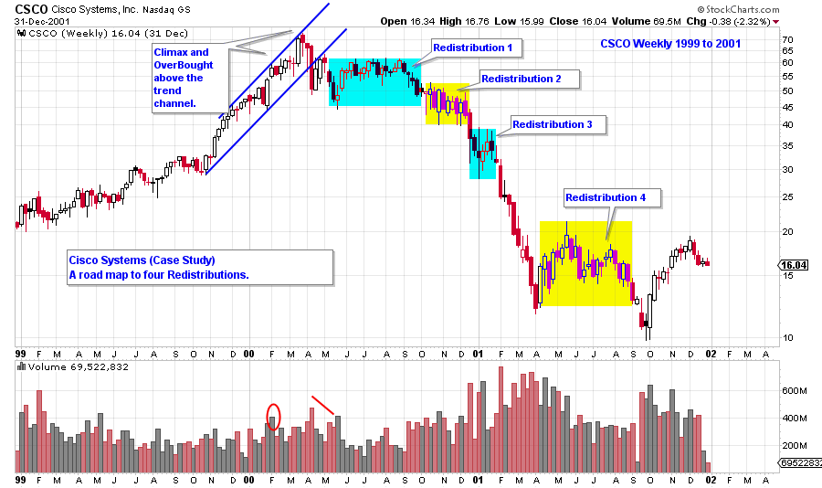
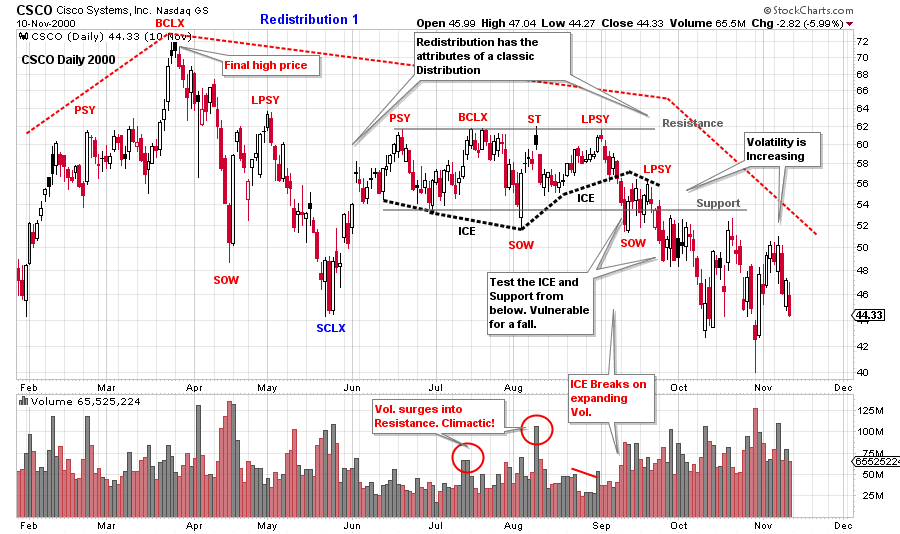
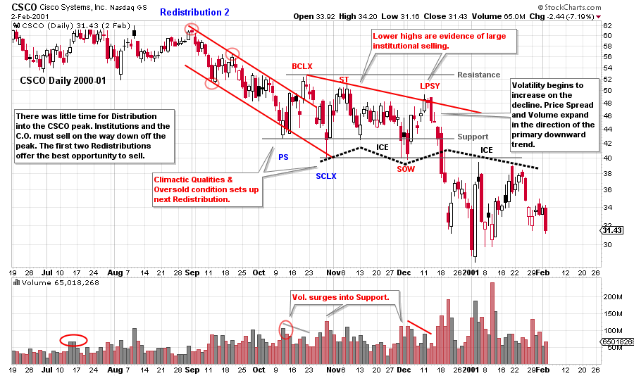
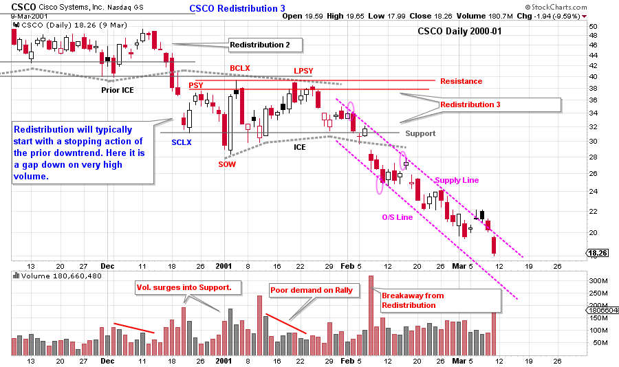
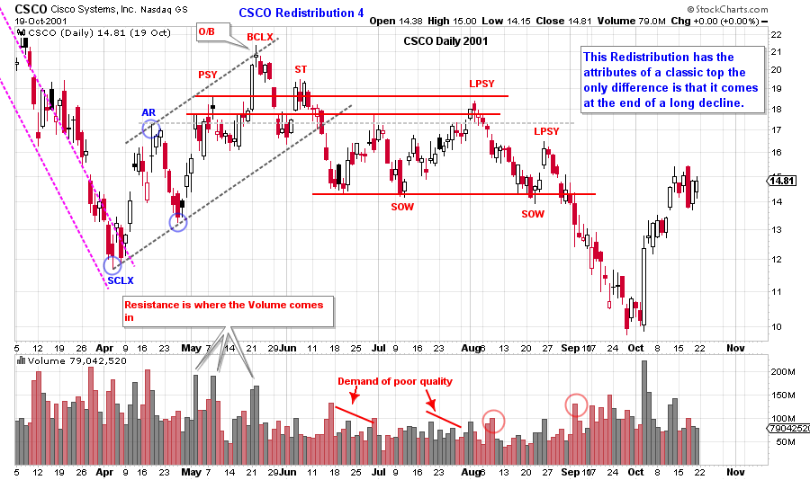
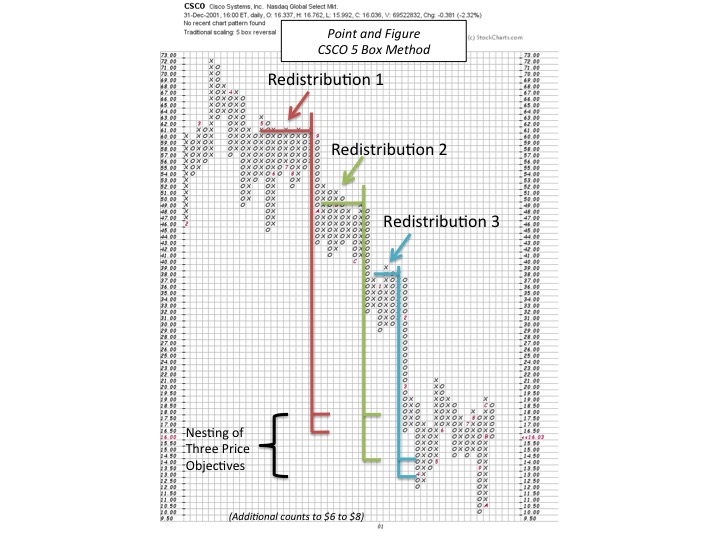

# Redistribution - A Case Study

URL: https://articles.stockcharts.com/article/articles-wyckoff-2015-11-redistribution--a-case-study/
Date: November 14, 2015 at 12:38 PM
Author: Bruce Fraser

The case study method is a preferred teaching tool in the Wyckoff classroom. Past real life market situations can be explored on an accelerated basis. Students are able to gain market experience (in the safety of the classroom) from a myriad of different and illustrative trading environments. Here is a case study in our ongoing discussion of Redistribution.

Cisco Systems was one of the legendary bull campaigns of the 1990’s. CSCO offered stock to the public in February of 1990 and it trended higher for the entire decade. All good things come to an end in the stock market and in March of 2000, CSCO peaked out and began its’ first bear market. In this post we will evaluate the four stepping stone Redistributions of that bear market.

During the 10 year uptrend; the C.O., institutions and the public fully embraced Cisco Systems. This was a ‘must own’ stock in institutional portfolios. When the top arrived it was sudden and mostly unexpected. Very few were able to Distribute stock around the peak. Therefore CSCO was sold, by the C.O. and nimble institutions, on a scale down off the peak prices.

The decade long uptrend meant that tremendous supply would come in to the market after the high was in place. This stock would need to be sold during the Redistributions, and it would benefit the C.O. to have lengthy Redistributions. More stock could be sold during quiet trendless trading ranges. The public considers the early price breaks off the high prices as an opportunity to buy stock at bargain values. This, of course, is a trap.

A variety of Redistribution formations are illustrated during the entirety of the CSCO downtrend. It does not represent all of the possible ways that a bear market can stair step lower. It does show the tricky nature of declining prices.

(Click on chart for active version)

The above chart highlights the Redistribution areas to be studied.

(Click on chart for active version)

Declines typically stop with climactic action which involves high volume and volatile prices (see SCLX on the chart above). This portends a rally of some magnitude is coming and potentially the continuation of the uptrend. The surge of volume on the decline off the $72 peak is evidence of Distribution by large interests (the Composite Operator). The BCLX tests the PSY on high volume and stops the advance. This warns that a lower peak is likely forming at the $62 price level. From June to October this Redistribution develops the attributes of distributional selling. The ICE is broken in September on widening price spreads and rising volume. Thereafter, a pause forms at Support with minimal lift, and the ICE is tested from below. CSCO is vulnerable to price weakness directly ahead. Classic places to sell stock and sell short is at the Secondary Test (ST) and the Last Point of Supply (LPSY). Also the breaking of the ICE and the next LPSY represent the last quality places to sell. Diminishing price spread and volume on the rallies, and expanding price spread and volume on the declines, is a sign that the downtrend will be resuming soon. Breaking key price supports and prior price lows is labeled a Sign of Weakness (SOW) and is evidence of overwhelming supply. Look for prices to pause (followed by rallies of low quality) after a SOW and then to resume declining.

Principles inside of principles are at work. There is a big distribution that began prior to the final peak (as illustrated on this daily chart with a red dashed line). And there is a complete distribution within the Redistribution area (June-October). Notice that volatility is expanding as the stock price reaches the conclusion of the trading range and the start of the markdown. Volatility discourages traders from acting. Wyckoffians see the ramping up of volatility as evidence of a shift to the next phase and will prepare for what is to come.

(Click on chart for active version)

During Redistribution 2 price stabilizes at a new lower level. In this case just below the prior Redistribution. It is likely that the C.O. and institutions lent support to CSCO at $40 to $44 price level with the motive of selling more stock. It is now evident that CSCO is in a bear market and many institutions are just waking up to this new reality.

Redistribution 2 is shorter in duration and has a different structure. Lower lows and lower highs are evident throughout. This means that large sellers are more aggressively selling on strength into the top half of the trading range. After the LPSY price breaks on wide spread and high volume, support levels are easily broken. Also, this is where the ICE is broken. ICE is a support zone that is defined by a wavy line that indicates the tendency for support to come in, not at a price, but in an area. When the ICE is broken, the support is broken, and price will not be able to get back above the old support. Old support becomes new resistance. The rapidity and the force of prices in the drop is what helps the Wyckoffian to determine that support has been breeched. Note how price revisits the ICE from below and does so a few times. The ICE has now become formidable resistance.

(Click on chart for active version)

Redistribution 3 is the briefest so far, lasting about two months. It begins with a minor selling climax (SCLX). Resistance is drawn at the two peaks (PSY and BCLX) with bulging volume (stopping action). Note the volume and price spread on the rally to the LPSY. The volume is low and diminishing, and the price spread is generally narrow. This is a rally of poor quality. The volume after the LPSY is expanding while the price drops quickly back to the support area. There is no price lift off the support, then a gap down and out of the trading range. We define this gap as the breaking of the ICE. This Redistribution is complete.

There have been three Redistributions in succession, each forming just below the prior one. Consider how difficult this is for short sellers. A trend will begin and then immediately stop and Redistribute for weeks and months. If the short seller attempts to sell the breakdown (bottom of the trading range) prices are soon jamming back up into the breakdown zone. Cisco Systems had been such an institutional favorite that buy recommendations were being issued repeatedly on the way down. This creates buying support on the way down and helps to levitate the stock for long periods.

Note that after the third Redistribution, a long protracted downtrend begins. The long term bulls are beginning to give in and sell. A classic trend channel defines the stride of the decline. After Redistribution #3 is completed comes the best opportunity to sell short and stay with the downtrend. Why does the briefest Redistribution result in the best downtrend? Each of the three Redistributions puts progressively more stock into weak hands. The cumulative effect is a long decline as the ownership is of poor quality.

(Click on chart for active version)

A series of climactic declines indicate that stopping action is taking place. The downtrend channel has been extended onto this daily chart. Note what a long-drawn-out decline this has become. This is a markdown of major proportions. Volume and price spread bulge during the final stages of the drop as conditions become climactic. This is a classic opportunity for short sellers to cover and close out their positions. The rally from the SCLX to the BCLX is about a 100% run-up. We must expect that many institutions and individuals are in a loss trap, having bought in the vicinity of the all-time high prices. Therefore, stock prices may retest the SCLX low and potentially go lower as these late buyers finally capitulate and sell stock. The April low is taken out in September.

A buying climax (BCLX) throws over the rising trend channel on high volume. Thereafter the declines are rapid and the rallies are labored (narrow spread and low volume). This Redistribution (#4) has the classic attributes of a normal distribution. The two LPSYs are ‘on the springboard’ and represent good places to sell short. A rapid decline to new lows follows.

Each of these Redistributions is unique. By studying these classic case studies we can accelerate our learning curve. And, most importantly, they can keep us on the right track and out of trouble.

A subject of future blogs is how to take horizontal point and figure counts. Here we take the horizontal count of each of the first three Redistributions. Note how they all have price count objectives that ‘nest’ at approximately the same price level. Cisco climaxed and consolidated in the area of these count objectives. Ultimately Cisco exceeded these counts. There is more to come on point and figure methodology.

All the Best,

Bruce
