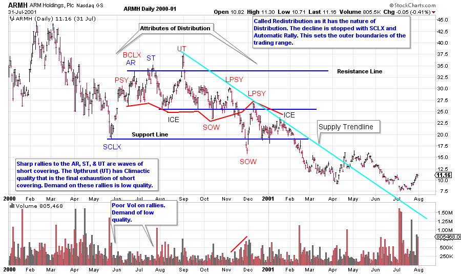

# Redistribution, the Evil Twin

URL: https://articles.stockcharts.com/article/articles-wyckoff-2015-11-redistribution-the-evil-twin/
Date: November 06, 2015 at 02:54 PM
Author: Bruce Fraser

Redistributions are messy. They come in many shapes and sizes and defy categorization. Therefore my job is particularly difficult here. Our mission is to find actionable characteristics in Redistributions that Wyckoffians can benefit from. Here is the problem in a nutshell. Recall that under Reaccumulation (pause in an uptrend) a stock, index, ETF, or commodity is being absorbed or accumulated for a continuation of the uptrend. As we have discussed in prior posts, absorption is the activity of removing stock from the marketplace in anticipation of a major uptrend. This is primarily the activity of the Composite Operator whom has the purchasing power to remove meaningful quantities of stock from active daily trading. Absorbing stock has the effect of reducing the volatility of the stock, as the Reaccumulation period matures to its conclusion, and the next uptrend begins. At the beginning of Reaccumulation, volatility is high as a result of the many speculator and trader types who have latched onto the prior uptrend. The early corrections against the uptrend are quick and volatile as shorter term investors take profits. Then, as the sideways trading range develops, the corrections become more dull and contained. This is because the C.O. and institutions are putting bids in to buy shares on pullbacks. These orders create support for the stock price. Often the last half of the time spent in the Reaccumulation trading range sees the price making a series of higher lows. Recall that a primary objective of the C.O. is to carefully accumulate shares in such a way that they don’t force prices to begin the uptrend before all of their buying is completed.

---

Contrast that with the activity taking place during Redistribution. A stock in a primary bear market downtrend lacks C.O. involvement. A stock requires C.O. ownership and active bullish campaigning to keep the price high and rising. When the C.O. community abandons a stock it becomes vulnerable to bear market behavior. In a downtrend short sellers will see enough profit that they will begin to cover their short positions. Bear market downtrends tend to be volatile. Short covering is a buying activity that will cause the stock price to reverse direction and rally quickly. A short covering rally is the beginning of the Redistribution trading range. A sharply rising stock price will drive nervous short sellers out of their positions. What happens during Redistribution is that a series of rallies and declines will occur with a general tendency for the rallies to be sharp and volatile and the reactions to be less so. These rallies and reactions jam the shorts and repeats until the less resolute among them have relinquished their positions. Only then can the downtrend resume.

Not all C.O. types are short sellers, but the best short sellers are Composite Operators. Their modus operandi during Redistribution periods is to sell short around the top of the trading range and to potentially cover (buy to cover) some of their position near the bottom of the range. On balance they are increasing the size of their short position throughout. The reason for the buying (covering) of some part of their short position at the bottom of the trading range is to provide support and not prematurely push the stock into a new downtrend before a meaningful short position can be established. For the C.O. and institutions it is much harder to short enough stock for a downtrend than it is to buy stock for an uptrend.

Therefore Redistribution is like the evil twin of Reaccumulation. Born from volatility, Redistribution remains volatile throughout and then ends with the emergence of another downtrend. Where Reaccumulation ends with a whimper (typically) and the emergence of a steady uptrend, Redistribution remains volatile and slides into a new downtrend with a bang.

(Click on chart for active version)

Redistribution begins with volatility and ends with volatility. Typically a Selling Climax initiates the Redistribution process. The Redistribution process looks eerily similar to Distribution. A review of the process of Distribution could prove helpful (to study the Distribution process and schematics click here). On the ARMH case study; cover up everything to the left of the Selling Climax (SCLX) and compare to the schematics and prior Distribution examples. Note the family resemblance. The blue labeling of the SCLX, AR and ST are there to illustrate the similarities to the start of Accumulation. This is classic ‘stopping action’. The red labeling illustrates Distribution and Redistribution attributes. Note that once the stopping action is in place (primarily short covering) the footprints of Redistribution become evident.

The attempt to support ARMH takes place at the ICE. Note the series of lower price lows. This is a sign of inherent weakness and is labeled as SOW (Sign of Weakness). Once the ICE is broken there is no longer enough demand left to rally back into the prior trading range. ARMH is very vulnerable to a rapid markdown when below the ICE.

After the Climactic action at the Upthrust (UT) the volatility and price weakness become dominant. The rallies are weak, short in duration, and lack sponsorship from the C.O.

We will spend more time on the tricky business of Redistributions.

All the Best,

Bruce
