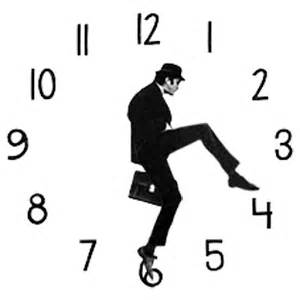

# Wyckoff Walk Around the Clock

URL: https://articles.stockcharts.com/article/articles-wyckoff-2015-11-wyckoff-walk-around-the-clock/
Date: November 20, 2015 at 12:19 PM
Author: Bruce Fraser

We have just completed a walk around the classic market cycle. Let us take some time for review before we move on to other aspects of the Wyckoff Method. If we are all on the same page regarding the structure of prices during each stage of Accumulation, Markup, Distribution and Markdown, then we can speak the same Wyckoffian language as we move onward. There is richness to the Wyckoff Method that allows us to drill deeper and deeper into the nuances of this trading process. Our goal is trading mastery through the understanding of the relationship of price and volume. And how it reveals the motives and the activities of the large market operators (referred to as the Composite Operator). It requires the active sponsorship and campaigning of the large operators to put a stock into an uptrend and keep it rising for long and bullish uptrends.

Let’s review what we have done so far. By doing this we can emphasize that there is a rhyme and reason for everything that happens in the financial markets. We, as Wyckoffians, are able to understand this narrative and benefit from it with profitable trading strategies that involve following these large informed interests.

---

Click on the title to link to the article:

Getting some Basic Wyckoff Terminology Under our Belts. The discounting nature of stock prices is discussed. Stock prices lead or discount business conditions and if we wait for good news on the economy to buy stocks, we will be a year or more behind the uptrend. We must employ a methodology that is based on the most leading indicator, price, and not on economic conditions or the trend of earnings etc. The four broad stages of Accumulation, Markup, Distribution and Markdown are introduced.

Richard D. Wyckoff's REAL Rules of the Game. The concept of the Composite Operator as the primary force behind the long term uptrends and downtrends in stock prices is explored.

The Stopping Action of a Downtrend. Accumulation Phase; Absorbing Stock Like a Sponge. Both address the anatomy of Accumulation. The first is about the stopping of a prior bear market downtrend. The next is a look into how the Composite Operator stealthily accumulates large quantities of shares for a bull market campaign.

Francis Bacon Reveals the Nature of Trends. Jumping the Creek. Both of these address how Accumulation will conclude and the Markup begins. The attributes of Springs, Jumps and Backups are evaluated as they are prime places to build positions and ride along with the C.O.

Wyckoff Power Charting. Let's Review. This post has valuable schematics that illustrate the various ways that Accumulation phases can manifest. This is also a general review of the prior Accumulation blogs.

Making the Trend Your Friend. The art of constructing trendlines and trend channels, Wyckoff style, is introduced. This is also a discussion of the Markup Stage.

Being a Chart Whisperer. Is a continuation of trend analysis with a discussion of some advanced concepts.

Rev Up with Reaccumulation Trading Ranges. Reaccumulation Roundup. When Termites Get into Your Trends. These all deal with the important concept of Reaccumulations within uptrends. A Reaccumulation is a price pause (a trading range) during a bull market.

Take the Fork in the Road. Follow the Bouncing Ball. The Way of Wyckoff. Distribution Definitions. Just Charts. Addresses the stopping action of a mature uptrend and the emergence of the Distribution process. Important schematics of the Distribution process are included. Also, there is a review of the ways that Distributions mature and become a bear market downtrend.

Context is King. Just Another Phase. The principle of Phases is introduced. During Distribution and Accumulation the behavior of price and volume will mature to the pivot point when the new trend is initiated. Learning to identify price behavior in each of these Phases helps the Wyckoffian to know when to act and when to patiently observe.

The Unfriendly Trend. Trendapalooza. These deal with Wyckoffian methods for drawing downtrend lines and channels during bear markets. The latter is a discussion of the structure of the Markdown Stage.

Redistribution Ruckus. Redistribution, the Evil Twin. Redistribution - A Case Study. The nature of a price pause during Markdowns, referred to as a Redistribution, is examined.

Accumulation, Markup, Distribution and Markdown are the four primary conditions of the classic cycle in financial asset prices (as the Wyckoff Method defines it). This cycle is endlessly repeating. In these blog posts this cycle is evaluated using the Wyckoff Methodology. This now provides us with a common language as we move forward and deeper into the discussion of how to trade with the Wyckoff Method.

I am grateful for your interest in this blog and for providing very useful feedback.

All the Best,

Bruce

Ps. We will take a break during the upcoming Thanksgiving Holiday week. Have a wonderful week.
