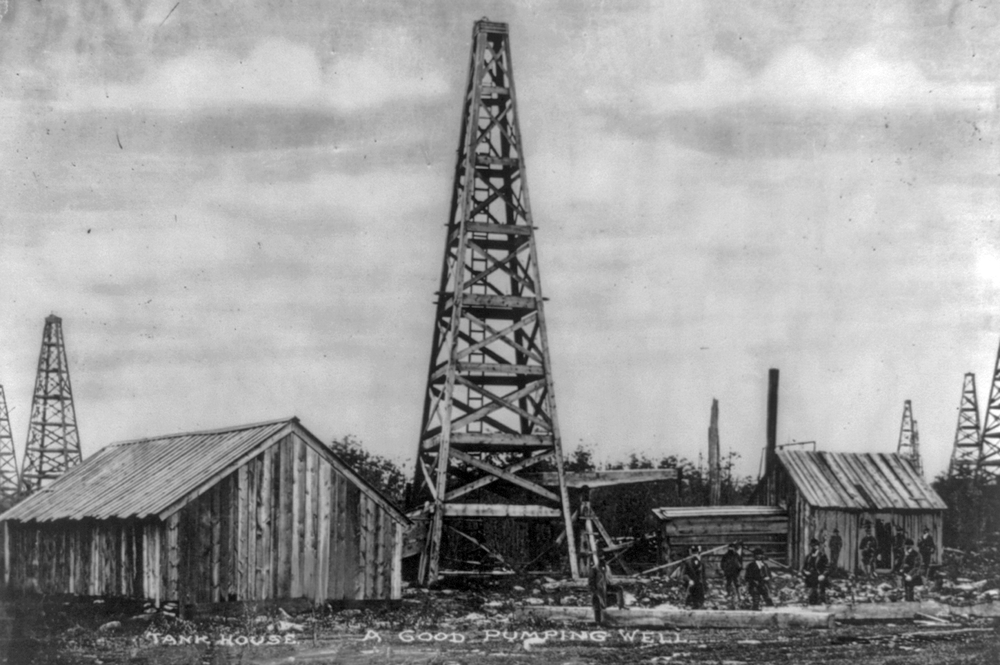
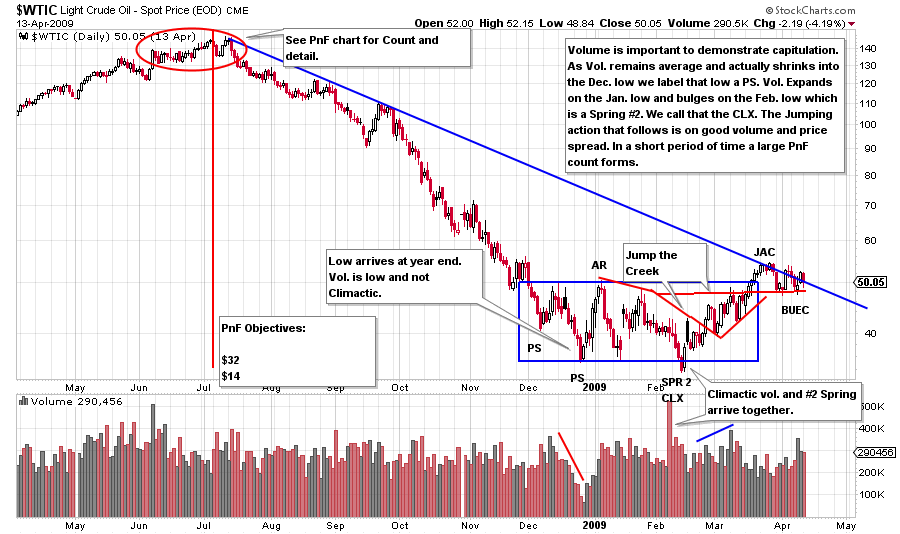
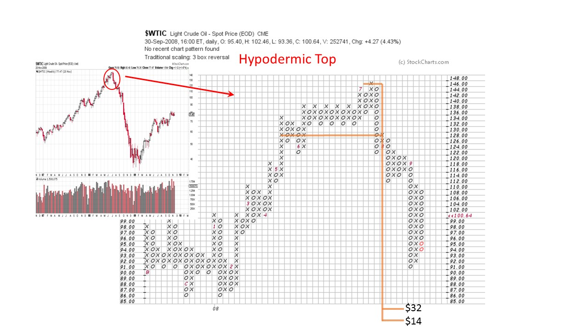
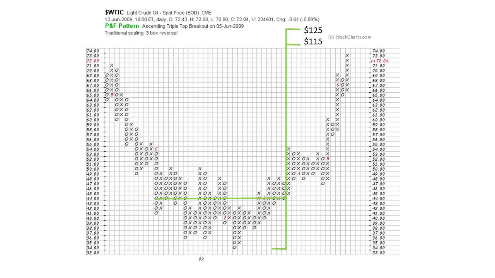
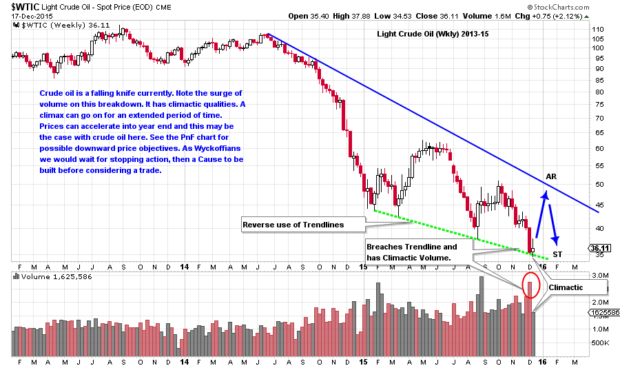
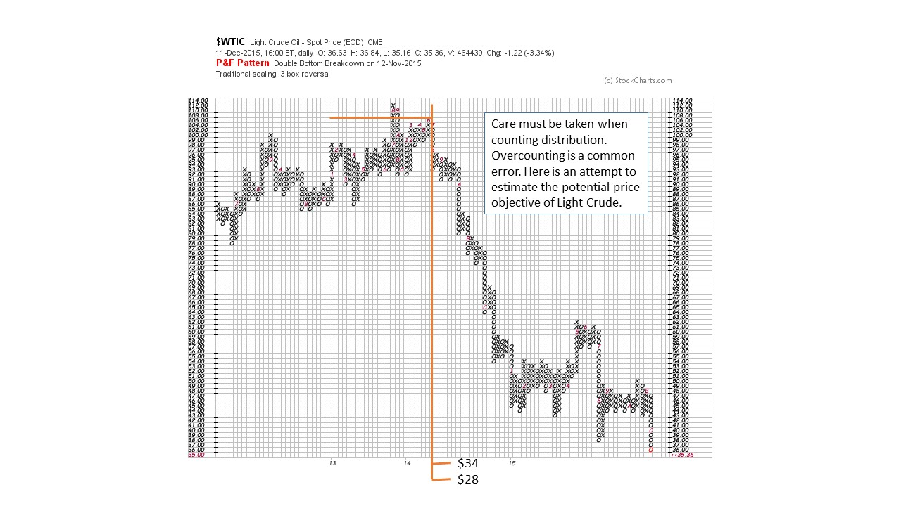

# Crude Oil; How Low Can it Go?

URL: https://articles.stockcharts.com/article/articles-wyckoff-2015-12-crude-oil-how-low-can-it-go/
Date: December 17, 2015 at 11:02 PM
Author: Bruce Fraser

On Monday of this week, the top four stories in the upper left hand column on DrudgeReport.com were about the weakness in oil prices. This may have been a bell ringer of an indicator. Some consider Drudge to have his finger on the pulse of the news, and in this case the oil patch, and that pulse appears to be panicky. Let’s investigate crude oil prices from the perspective of Mr. Wyckoff.

Using Light Crude Oil prices ($WTIC), let’s put together a case study going back to 2008. When we observe our Wyckoffian tools working in a historical market setting, we gain confidence in our analysis of the current situation.

---

(Click on chart for active version)

This 2008 top is a ‘Hypodermic Top’ which arrives and turns down quickly, with a UTAD at the end. Even quick forming tops can make large distributional PnF counts. As can be seen in the chart below, the Distribution count carries to a price objective of $14 to $32. The final low was made on a Spring just below $34. This is within $2 of the upper count objective and a solid hit.

There are always anomalies encountered in Wyckoff. In this case, it is the lack of a Climax on volume into the conclusion of the downtrend at the lows in early and late December 2008. An early December low has climactic qualities as it accelerates to a low and the volume spikes. But the volume is not appreciably higher than the average of the entire decline. The late December low actually comes on diminishing volume and is followed by an AR. We call this low a PS because of the low volume. Next there is a constructive AR which rallies forcefully on expanding volume. We draw the lines of Support on the PS and Resistance on the AR. After the AR, the decline is quick and the volume expands which demonstrates that supply is still overhanging $WTIC. It is not time to buy yet as supply is present. The next decline into the Spring is Climactic with a huge bulge of volume on a whoosh down to a minor new low. This is a Spring #2 and immediately turns back up into the Accumulation area. We judge that the Climax is in. The Spring and the Climax together is unusual. The flushing of the lows on volume is the cathartic event that allows the market to freely run up to the top of the Accumulation area and out with good Jumping action and a Backup to the Edge of the Creek (BUEC). Springs, Jumps and BUEC can all be bought.

$WTIC rises in a Hypodermic to a final peak (inset weekly chart). Distribution counts can build up quickly as $WTIC rises into a narrow peak and turns down. The area of this count is the red circle on the previous chart. Despite the short period of time, a count builds for a potential decline to $32 to $14. The ultimate low is just under $34 and is considered a PnF hit.

A count of the 2008-09 base (see blue box in top chart and PnF above) offers a price objective of $115-125. Waiting for the completion of Accumulation reveals a meaningful count objective and emphasizes the value of patience. Note that the price objective is met at 114.83 in May of 2011 (another good hit from our PnF charts).

(Click on chart for active version)

After that peak, crude oil traded in a range and began breaking down (above chart) in June 2014. This decline is now nearly 18 months old. There is a series of four lows, each lower than the prior. These four lows allow for the reverse use of trendlines. On the most recent drop, notice the large declining bar on very high volume. This has Climactic qualities. Also, there is a minor breach of the trendline into the $34 area which is an oversold condition. This may not be the final low for crude oil but it could stop the decline for some period of time.

Wyckoffian tactics would make the case that a Climax is an appropriate juncture to begin covering shorts, but not yet ideal for buying. A good Climax will be followed by an Automatic Rally (AR) and then a retest of the area of the Climax low (we will watch for this development). A successful test would be an additional place for short sellers to cover remaining positions. As we studied on the 2008-09 charts, time is needed to build a Cause for a meaningful new rally in crude oil. This may be as long as 3 to 6 months into the future (first half of 2016). Studying the above chart, we notice price congestion during most of 2015. It is possible that the trading in this last year may become part of a PnF count for the future. For this to happen a powerful Sign of Strength would be needed to lift prices up toward the April-May 2015 peak in the $60 area followed by an attempt to return back toward the lows. This is ‘a big if’ at this point and for now we will watch with curiosity.

$WTIC touched $34 this week and has thus fulfilled the minimum PnF objective above. A continuation to the $28 area is entirely possible as Climaxes are hard to stop (and there is a viable PnF count to $10 not shown here, that we must keep in the back of our minds). At year end, volatile and panicky trading can exaggerate the trend in force. So year-end could be a good place to expect a low after an extended decline (note the December lows in 2008). That is why tactics are so important. The use of both PnF and Vertical charts together really strengthens our analysis.

In conclusion: Hopefully you enjoyed and found value in this Crude Oil case study. We will return to it at a later date to review our work. For now, remember that a Climax is for covering shorts (for those traders so inclined) and will be followed by a sharp, but brief, rally (AR). To be followed by a Secondary Test that may or may not get to the Climax low. After a meaningful Cause is built (PnF count) we would begin to look for Springs, Jumps, and Backups to buy for a worthwhile trade. If none of this materializes we would be on the lookout for a Stepping Stone Redistribution and another leg down.

All the Best,

Bruce

Ps. We will take a break during the upcoming Christmas Week. Have a wonderful Holiday.
