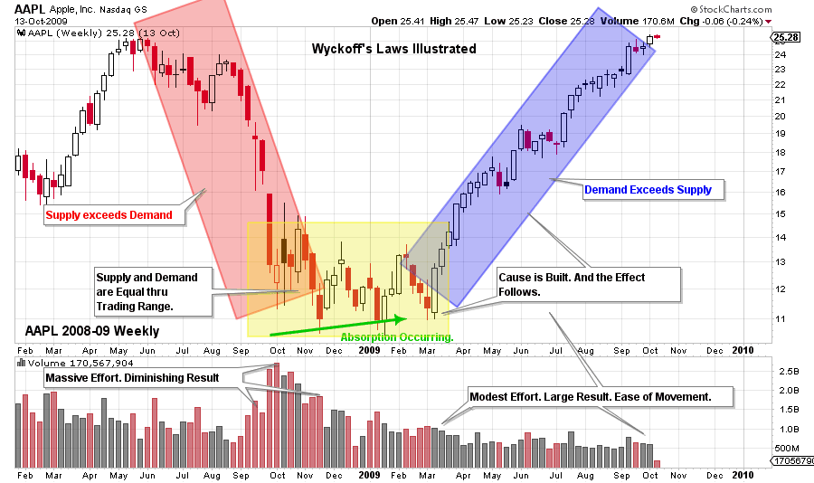
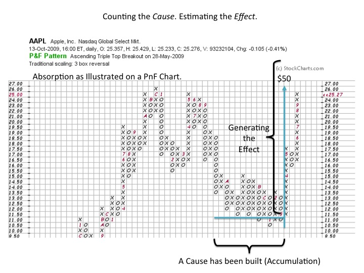

# The Illustrated Wyckoff

URL: https://articles.stockcharts.com/article/articles-wyckoff-2015-12-the-illustrated-wyckoff/
Date: December 11, 2015 at 11:06 AM
Author: Bruce Fraser

In a continuation of our discussion of the overarching principles of the Wyckoff Method, let’s do a visual case study. There are three principle Laws that compose the Wyckoff Method*:

The Law of Supply and Demand

The Law of Cause and Effect

The Law of Effort and Result

We become master Wyckoffians by developing visual knowledge of these principle laws in our chart reading. This becomes the foundation of the skill Mr. Wyckoff called ‘Tape Reading’. Through our innate understanding of these laws we raise our awareness of the reasons stock prices move in the ways that they do. And we become better and better at selecting the best candidates for speculative campaigns. Endless repetition assists us on the mastery path.

---

Here we will illustrate the concepts introduced in the prior post. It will help to have The Laws of Wyckoff at the ready for reference (click here for link).

In the Wyckoff Method every process has a reason for being. Everything included in the Methodology conforms to these three laws. Mastery is the product of becoming ever more skilled at identifying the Laws and their nuances at work. You are encouraged to go back through the prior posts and apply these Laws to the chart work. We will do some of that here, by revisiting a prior AAPL example and illustrating the Laws and the essential principles at work (click here to link to another AAPL chart).

(click on chart for active version)

When Supply exceeds Demand, price falls as the decline in the red box demonstrates. Stock is in weak hands. Supply equals Demand during the sideways trading within the yellow box. Wyckoffians seek to identify the footprints of the Composite Operator (C.O.) during this trendless trading. The C.O. will use this trendless period to Accumulate (as illustrated here) or Distribute a position. Absorption is the activity of building a stock position, and thus removing stock from the marketplace. Accumulation is occurring. When Absorption is effectively complete all that is required to unbalance the Supply / Demand relationship is the slightest increase of new buyers. Supply is low and Demand is on the increase. Even a slight increase in buying can spark a new uptrend as the price action in the blue box illustrates.

Imbalance of Supply and Demand creates the potential for large trends that can go on for multiple years.

Effort and Result has to do with the interplay of volume and price. AAPL is a particularly rich case study. Note volume expanding as price marks down. The volatility of the price bars and the rate of decline is increasing. The Effort of volume and Result of price are harmonious. Note how the highest volume week of decline is only marginally down (and the weekly range narrows from the prior week). This is inharmonious action of price and volume. Effort (volume) without a commensurate Result (price) is another way to say it.

There is a three week dive to a new low in November 2008. Each week is on high volume and note that the spread of each bar is less than into the climax low in October. It can be seen that the November low is below the October low, but price is decelerating. This is inharmonious downward action. Effort in volume is not Resulting in dramatically in lower prices, again this is inharmonious. This is early evidence of stopping action of the large downtrend.

Turning to the uptrend, notice the volume signature, the effort being applied to prices. During the jump out of the Accumulation range, the price bars are wide and closing near the high of the weekly range. The Effort of volume is actually declining with each weeks advance. This seems to defy the market wisdom that price should rise on expanding volume. The Wyckoffian perspective is that most of AAPL stock has been absorbed by strong hands by the end of the Accumulation. Therefore it will not take much demand to put prices up, because there is very little stock for sale. This is a large Result with modest Effort which is considered bullish early in a new bull market. As a contrast, note the volume in May of 2009 as the price rallies into a five week pause. The volume (Effort) is higher each week and the spread of price is compressing, which is evidence of selling. This is an inharmonious action of Effort without a comparable Result. As the uptrend resumes, volume remains steady and does not spike as prices grind higher. Effort and Result is a concept that is applicable to monthly, weekly, daily and intraday charts. It is difficult to master but well worth the effort to learn.

Point and Figure charts provide a tool for estimating the Cause that has been built during an Accumulation (and also for Distribution). By counting the columns in the Accumulation, a calculation can estimate how much of a Cause there is. This Cause, or count, is projected upward to estimate an Effect, or price objective. In the above example AAPL has built a count that projects to $50. Mr. Wyckoff was a big proponent of employing PnF charts for estimating price objectives. PnF charting and counting is an elegant and obscure tool that addresses the law of Cause and Effect.

All the Best,

Bruce

*Source: Hank Pruden, 'The Three Skills of Top Trading', Wiley Publ. 2007 with adaptations and modifications.
