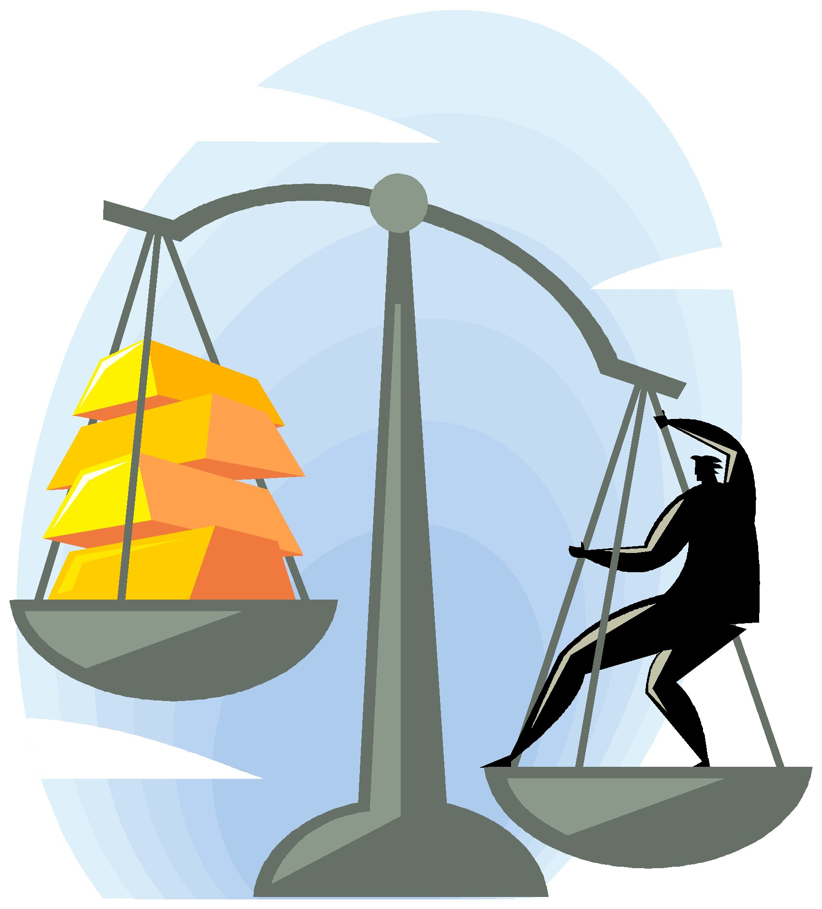

# The Laws of Wyckoff

URL: https://articles.stockcharts.com/article/articles-wyckoff-2015-12-the-laws-of-wyckoff/
Date: December 04, 2015 at 02:48 PM
Author: Bruce Fraser

Three Principles or Laws govern the structure of the Wyckoff Methodology. Procedurally there are a series of Tests that determine buying and selling decisions. There are nine of these Tests, or thresholds, to be passed for making a buying decision, or a selling decision. The Nine Buying Tests and the Nine Selling Tests all adhere to the overarching Wyckoff Laws. The tools Wyckoffians use to evaluate the Three Laws and the Nine Tests are vertical barcharts and point and figure charts. Our studies of Accumulation, Markup, Reaccumulation, Distribution, Markdown and Redistribution are chart analysis skills that prepare us to function within these Laws and Tests for making buying and selling decisions.

Three Principles or Laws are at the heart of the Wyckoff Methodology. Each addresses a characteristic of the nature of price and volume essential to a trader's market knowledge (as seen through the eyes of the Wyckoff Methodology). Here we will discuss the three laws and at a future time we will explore the buying and selling tests.

---

Three Wyckoff Laws*:

Supply and Demand

Cause and Effect

Effort and Result

Supply and Demand. This principle examines the quality of ownership of the stock. When stock is in strong hands it has been Absorbed. Very little stock is available for sale thus the Supply is low. Any incremental increase in Demand for the stock will cause it to move up. When Demand is increasing and Supply is low, expect prices to rise.

In a number of our early posts, we discussed the importance of Composite Operator absorption or ownership of a stock. When the C.O. is actively campaigning a stock, they remove available stock from the marketplace simply because they buy the stock and will not sell it. This can be observed throughout Accumulation when the C.O. stealthily buys up shares during long grinding basing periods.

As Wyckoffians evaluate Accumulation and Distribution phases (through the study of bar charts and PnF charts) the principle of Supply and Demand is being observed. The balance of ownership is shifting during these large trading ranges. This shift in ownership will profoundly change the Supply and Demand equation.

During Distribution the C.O. is selling and thus stock is going into weak hands. This has the effect of releasing a Supply of stock into the marketplace. Since the very large and informed C.O. is supplying the market with stock, a phase of Distribution forms, followed by a period of Markdown.

When Supply and Demand are about equal, the result will be a trading range where prices stay in a trendless state. This will be where the important shifts between Supply and Demand will take place. At the conclusion of the trading range, a new up or down trend will begin which reflects the imbalance of Supply and Demand.

Cause and Effect. This principle relates to the first law, Supply and Demand. A Cause must form before there will be an Effect. And the Effect will be in proportion to the size of the preceding Cause. A large Cause will produce a large Effect, a small Cause results in a small Effect. Accumulation and Distribution phases are periods of Cause building. The Effect is the subsequent Markup or Markdown.

The primary charting tool for estimating the potential Effect are Point and Figure charts (PnF). The Wyckoff Method uses a horizontal PnF counting technique. For example, an Accumulation trading range is plotted with a PnF chart. We then use Mr. Wyckoff's PnF technique for counting across the horizontal range of the Accumulation (or Distribution) and estimating the potential projected movement. PnF provides a powerful tool for ‘counting’ the Cause and estimating the Effect (see earlier posts for examples of PnF charting and counting). Distribution would produce a ‘down count’ and therefore the Effect would be declining prices.

A key to Wyckoff Analysis is to determine when a trading range is under Accumulation or Distribution (see earlier posts on this concept). We can then estimate a price target based on the count.

Effort and Result. Volume provides Effort and the action of Price is the result. It takes Effort, in the form of Volume, to drive Price upward. As an illustration; the Stock Price climbs out of the Accumulation Phase and begins Marking Up. The Price Spread then should be wide and typically the close will be toward the high of the day (or week). Volume expands from the prior days. A Wyckoffian would conclude the Result (price advance) to be large on increasing Effort (higher Volume). This is Bullish for the continued advance of prices.

Toward the end of a trend, the daily price spread begins to narrow in comparison to prior Markup days. Meanwhile, the Effort of Volume is very high and expanding. The analysis of this condition is that large Effort (Volume) is Resulting in a marginal price advance. Large Effort with minimal Result is a form of divergence or inharmonious action between price and volume. This is an indication of a tiring uptrend and a correction of prices is expected. The above example is only an illustration. There is much more to consider in the evaluation of Effort and Result.

Exercise: Keeping these principles in mind go back to some of the early posts on Accumulation and Distribution and attempt to adapt these concepts to the chart studies.

These principles form a structure for understanding the nature of price activity and how best to conduct a speculative campaign. During our prior posts you have been exposed to each of these structural principles of the Wyckoff Methodology. There is much more to come.

All the Best,

Bruce

*Source: Hank Pruden, 'The Three Skills of Top Trading', Wiley Publ. 2007 with adaptations and modifications.
