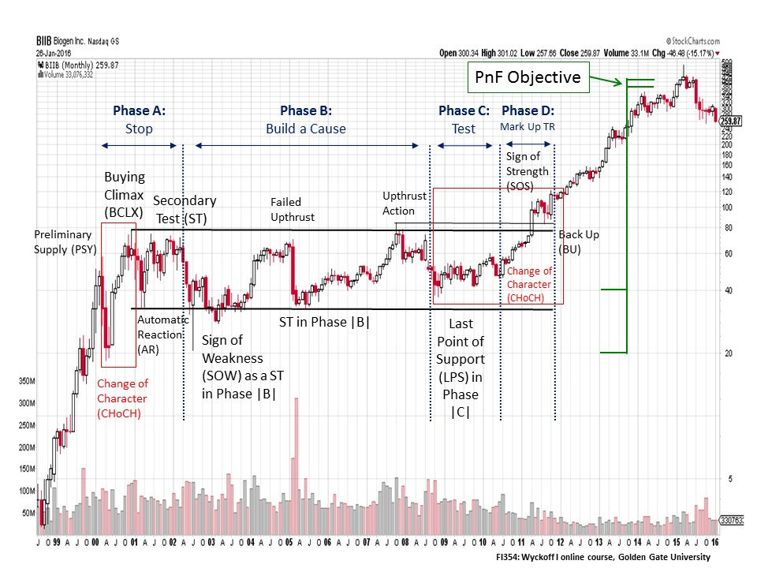
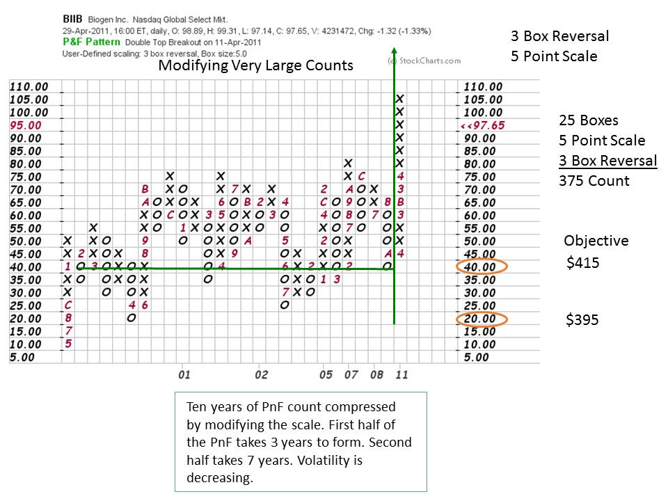
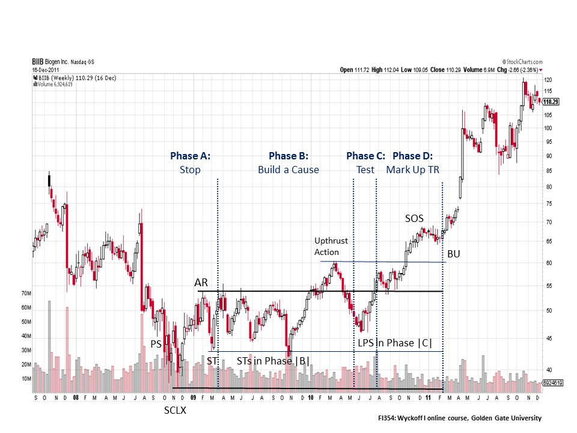
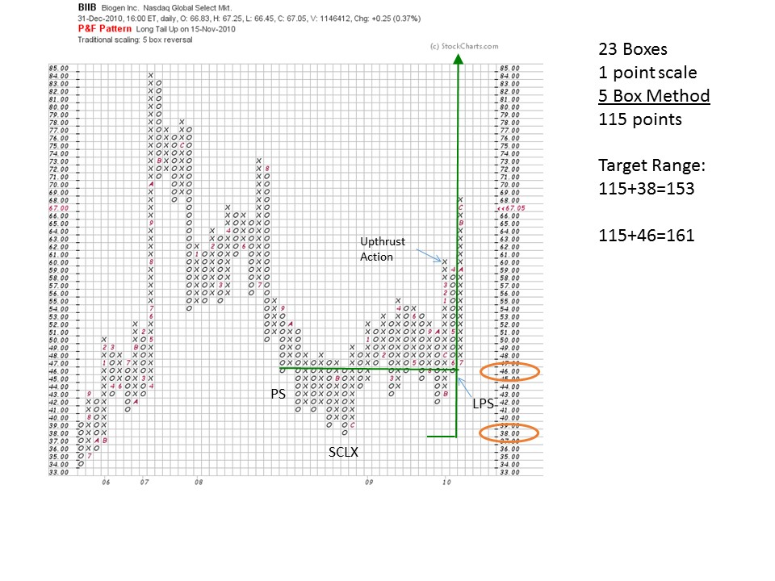

# Counting Monster Point & Figure Charts

URL: https://articles.stockcharts.com/article/articles-wyckoff-2016-01-counting-monster-point--figure-charts/
Date: January 29, 2016 at 11:17 AM
Author: Bruce Fraser

How does a Wyckoffian take a very large horizontal PnF count? A large count that forms over many years? Let’s do a case study on an outsized formation and see if it yields useful PnF count objectives. A big thanks to one of my teaching partners at Golden Gate University, Professor Roman Bogomazov, for crafting these charts for a presentation we recently gave. As the blog is currently deep into the study of Point and Figure charting, let us add PnF charts to this analysis.

Biogen, and the biotech industry, has been leadership in the bull market that began in 2009. Prior to the price run up, BIIB was in a long volatile trading range. A monthly vertical bar chart shows BIIB in an eleven year Stepping Stone Reaccumulation (SSR), and then in 2011 it Jumps out and begins a multi-year uptrend. We, as Wyckoffians, would take this large horizontal PnF count and attempt to determine a price objective.

---

First we would evaluate the entire structure of the SSR (click here for more on SSR trading ranges) to get a feel for the evolution of the Phase work and the proper chart labels. In 1999 and 2000 a robust uptrend is stopped by a PSY, BCLX and AR. This sets up the Resistance and Support areas (go back and review prior posts for a refresher on these concepts). Note how the Support and Resistance establish the outer boundaries of the BIIB trading range for the next decade. The lowest low in the SSR is in 2002, and thereafter each attempt to test the Support area produces a higher low. This is a clue that this structure is Reaccumulation and not Distribution. Further evidence that Absorption of shares by the C.O. is taking place is diminishing volatility. The ‘Upthrust Action’ in 2007 rises above the trading range and the peak of the BCLX. But the Upthrust cannot hold above the Resistance line and turns back into the trading range. Volume on this break in 2008 expands, so supply is still present. But, this expanding volume cannot push BIIB to the Phase B low which produces another higher low. The Last Point of Support is in and a modest uptrend begins. In the red box (Phase C and D) is an Accumulation within a large SSR (see the BIIB weekly vertical bar chart for more detail).

Is it possible to count a decade long Stepping Stone Reaccumulation? Let’s try. Using traditional scaling techniques will produce a large and unwieldy PnF chart. So we will create a ‘modified’ PnF that will compress the chart and make it countable. Modified PnF charts forgo detail for the ability to take bigger counts. To modify the chart we will change the scaling by going to a $5 scale and keep the 3 box reversal. Our chart produces 25 columns of count which we multiply by 3 box reversal and by $5 scale. This produces a $375 count that is added to the count line ($40) and the low ($20). The objective is $395 to $415 which we have marked on the monthly vertical chart. Note that BIIB recently climaxed into that target range and has since turned down. The uptrend that produced this price objective took six years to unfold. Our PnF horizontal counting technique was able to tackle this big job of counting a massively large SSR. As Wyckoffians we would analyze and consider smaller, more reasonable counts first while keeping the mega-counts in the back of our minds. Let us turn to a smaller and more conservative PnF count for BIIB, derived from the Accumulation area identified on the weekly chart.

On this smaller scale we can see an Accumulation within the SSR (see the red box within the monthly chart). A Selling Climax (SCLX) stops the price decline in 2008 and then there is an Automatic Rally (AR). Support and Resistance are now set. In Phase B, stock is being bought (absorbed) by the C.O. and this takes a full year. The Upthrust Action is a sign of demand being present, but is followed by selling back to the mid-point of the Accumulation Range. This is Phase C and is the final Last Point of Support (LPS) before the uptrend is born. The PnF count will begin at this LPS.

This base should be counted for a price objective. To take this count we will identify the LPS and the PS (Preliminary Support), both points are on the $46 line. This is a large count that looks diminished because of the mega-SSR that it is positioned within. Using a 5 box reversal method, a $161 and a $153 price objective are flagged (see the above chart for parameters and calculations). This trade has meaningful potential. What the fuel in this base count does is propel BIIB out of the decade long trading range, clearing out all overhead resistance. Clearing the decade long Resistance (overhead supply) allows BIIB to embark on an impressive multi-year uptrend.

Again, I would like to thank my friend, and fellow Wyckoffian, Professor Roman Bogomazov for producing this outstanding case study. Roman teaches Wyckoff I and II, and Strategy & Implementation on the GGU Cyber-Campus.

All the Best,

Bruce

Answer to Brad’s question from two posts ago: I will paste the PnF chart into PowerPoint and use those markup tools. I then organize PnF charts by theme and category in these files.
