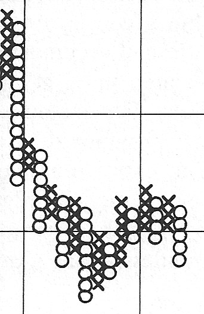
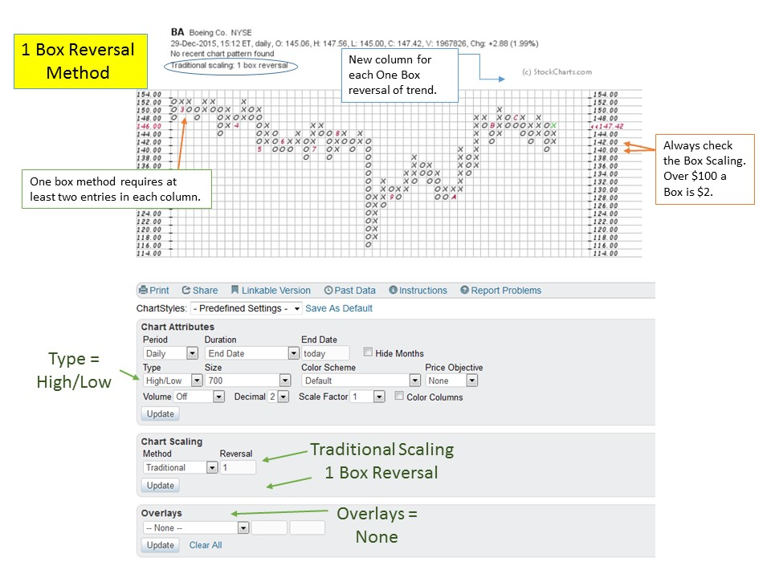
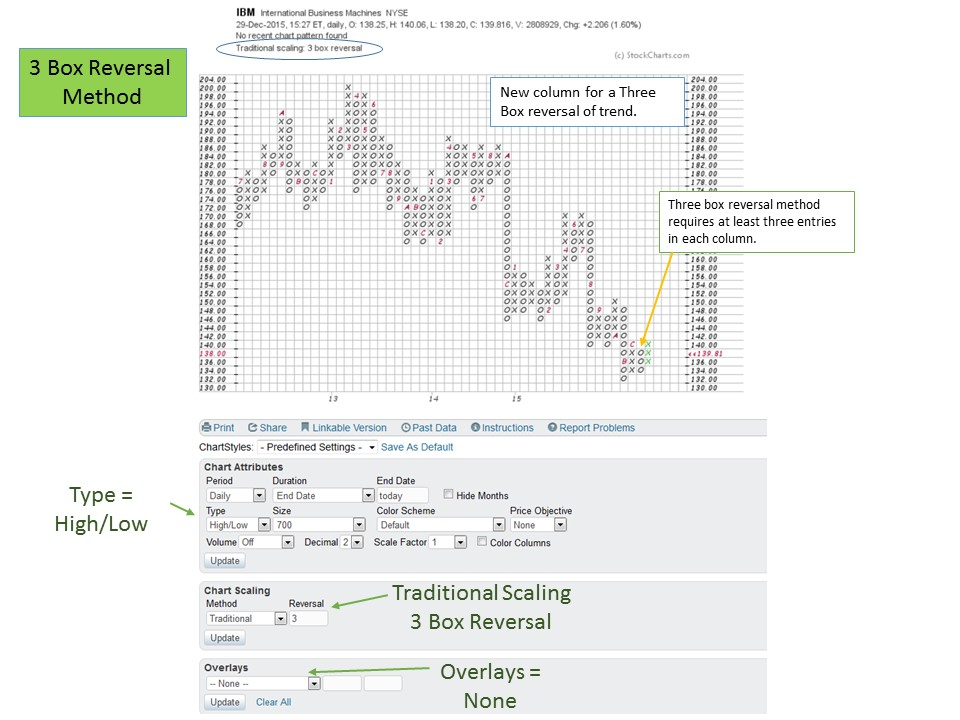

# Intro to Point and Figure Construction

URL: https://articles.stockcharts.com/article/articles-wyckoff-2016-01-intro-to-point-and-figure-construction/
Date: January 01, 2016 at 05:49 PM
Author: Bruce Fraser

As we enter 2016, it seems like a good opportunity to introduce Point and Figure chart construction. In future posts we will spend more and more time on the techniques of PnF counting using the Wyckoff Method. We will create a foundation for the process of creating PnF charts that conform to the Wyckoff Method.

PnF charts are employed in numerous methodologies. The Wyckoff PnF method is a somewhat obscure one that takes a HORIZONTAL count and projects a price objective. The price objectives calculated on charting websites almost universally use a VERTICAL count method. The Wyckoff principal at work here is the Law of Cause and Effect. The horizontal count represents the Cause that has been generated and the price objective is the Effect being projected or estimated.

Wyckoff PnF requires a unique chart construction. The good news is that StockCharts.com has an excellent PnF charting engine. It is ideal for our work with the Wyckoff Method. In this introduction we will review basic construction techniques and in future entries we will study how to take counts.

---

Traditional vertical bar charts have time as the constant variable. Either daily, weekly, monthly or intraday; each bar is a time constant. The next, and each future period, will get a plot (bar) at a price. The PnF chart’s horizontal axis is the result of volatility, not time. A plot in the next column of a PnF chart requires price movement in the opposite direction, either upward or downward by a minimum number of boxes. This is what is meant by ‘3 box reversal’ or ‘1 box reversal’. To move right to the next column there must be a reversal of trend by the required number of boxes. During a basing period much volatility can occur within a trading range. We have described this as Accumulation (or Distribution). Large PnF counts can form during such periods, while the price of the stock is confined to a trading range (click here for examples from the prior blog). Wide swinging trading ranges can create many columns of reversals. Wyckoff has a PnF technique for counting this horizontal trading range and estimating the upward or downward price objective. This estimating technique is very powerful and helps to establish reward to risk parameters for a trading campaign. We will integrate these tactics more and more during future blogs.

Many charting engines that have PnF capabilities do not use the Wyckoff conventions. StockCharts.com has developed a very Wyckoff friendly PnF tool for our use. For those of you who have not yet subscribed to StockCharts.com, now is the time. StockCharts.com is a great value simply for the ability to construct and save Wyckoff PnF charts. Also subscribers have access to intraday PnF charts which are very cool and very powerful. Down the road we will study intraday charts as they are tactically very useful.

Think of one box PnF charts as being on a comparable time frame to a daily vertical bar chart. The one box PnF method requires one box (pay attention to scaling) reversal of trend to move to the next column. At the conclusion of a downward move (column of ‘o’s), a reversal upward of one box will cause a move to the next column to the right and a plot of an ‘x’ (over one column to the right and up one box from the prior plot). Each full box up will result in a plot of another ‘x’ above the prior (in the same column). This occurs until a full box reversal down occurs and requires a move to the next column to the right and down one box. The caveat to the one box method is that a column must have at least two entries before a new column can be started. Many charting engines get this wrong, while StockCharts.com automatically does this plotting correctly. Note in the BA example, there are many columns with two entries and then a plot in a new column. For now just remember that two entries in each column are required to get an accurate horizontal count (see Dr. Pruden’s book, ‘The Three Skills of Top Trading’, pg. 112 for an excellent construction example).

PnF charting uses a scaling rule. Over $100 a unit (box) is two points. From $20 to $100 a box is one point. Under $20 and down to $5 is a half point. For an excellent tutorial on construction, see this Chart School article: (click here for link)

Think of a three box PnF chart as being on a comparable time scale to a weekly vertical bar chart. A reversal requires a three box (for IBM each unit is $2 because it is trading over $100 and so a reversal requires a $6 movement) change of trend to move to the right one column. Wyckoffians will study the vertical bar charts for the nuances of price and volume. PnF charts will be used for volatility analysis and price projection estimates.

I am often asked what the logic is that makes horizontal counting of PnF charts work for projecting price objectives. All I can say is that PnF is among the oldest charting methods. Trial and error going back many decades has established the procedures taught by Mr. Wyckoff. Experience derived from endless practice will convince the Wyckoffian of the value of the method. In the classroom, we found that PnF charting is frequently difficult for students to learn. So we devoted much of the second semester to PnF construction and counting methods. If you find that you are struggling with these concepts, you are not alone. I will do my best to offer tips and tricks that will speed up the learning curve. Confidence will only come through much practice.

Look at some of your favorite stocks and indexes using the settings described above. Compare vertical bar charts to the PnF charts and become familiar with the ebb and flow of prices as they are plotted on each chart type. Pay attention to the congestion areas where the horizontal counts will be made (where Cause forms) and the resulting markup or markdown (where Effect takes place).

Happy New Year and Cheers to a Prosperous 2016,

Bruce

The upcoming semester of technical analysis classes will begin this next week at Golden Gate University in San Francisco. Dr. Hank Pruden and I will team teach FI355, the Wyckoff II class, on campus beginning January 9th. Dr. Pruden has arranged for individuals interested in this class to attend the first session prior to making the decision to enroll. As space is strictly limited to the capacity of the classroom, reservations are a must. Please call Dr. Pruden at 415.442.6583 to reserve your space.

Additional classes are available both on-campus and online (cyber campus). For a complete list, and to see the schedule for additional details (click here for more information). Dr. Pruden is available for any questions you may have regarding any of the classes and the path to earning a Graduate Certificate in Technical Market Analysis (offered exclusively at GGU).

Here is a list of upcoming Technical Analysis courses offered on the GGU Cyber-Campus:

FINANCE 352 - Technical Analysis of Securities (click here for more information)

FINANCE 354 - Wyckoff Method I (click here for more information)

FINANCE 355 - Wyckoff Method II (click here for more information)

FINANCE 358 - Technical Market Analysis Strategies (click here for more information)

FINANCE 360 - Behavioral Finance (click here for more information)
