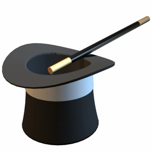

# Point and Figure Magic

URL: https://articles.stockcharts.com/article/articles-wyckoff-2016-01-point-and-figure-magic/
Date: January 22, 2016 at 12:28 PM
Author: Bruce Fraser

It is a little like magic when Point and Figure counts work out. Long term counts, short term counts, big counts and little counts; PnF is a robust and useful tool. Many Wyckoffians in training do not trust the counts. It seems to me this is because it is so difficult to conceptualize why PnF charting (specifically horizontal counting methodology) works. A solution to this is endless practice. PnF practice installs confidence. Do the counts on a thousand charts, and then count a thousand more. Notice when you are doing the counting that ideas, thoughts and inspirations will come to you about why it works and how best to employ the technique for your specific circumstances.

As time goes on we will do more PnF case studies. When a price target is reached there are three general scenarios that could come to pass.

---

The first is that price ignores the target objectives and keeps going (or pulls up short of the objective). Sometimes we get the counts wrong. The area of the horizontal count is misjudged, or the instrument has a mind of its own. When a target is reached, a Wyckoffian will ‘read the tape’ and wait for clues about the culmination of a trend. If the trend continues, this will accrue to the benefit of the Wyckoffian who is a trend trader. We expect a trend to stop with some type of Climactic crescendo. Whether a buying or selling climax, it should be tested after an intervening Automatic Rally (or Reaction). The metaphor of the dropped knife is that one allows the knife to bounce off the floor and then come to a rest before picking it up.

Another common scenario when targets are reached is that a Stepping Stone Redistribution (or Reaccumulation) begins. The trend is interrupted by a pause that can last weeks to months and then continues in the same direction. A trend, is a trend, is a trend and we would expect that Reaccumulations and Redistributions often occur. These are among the very best tactical trading opportunities (for a prior discussion of this topic click here and here and here and here). PnF studies of this phenomenon will get much attention in these pages (for a CSCO case study with PnF click here).

A third scenario is that a price target is achieved and conditions form (a Cause is built) for a price reversal into a fresh new bull or bear market. This normally occurs with an acceleration of the trend at the conclusion (Climactic action) that is both dramatic and alarming for participants. Thereafter, a volatile trading range develops which builds Cause in the form of a PnF count (columns). Even though the emotion of fear (or joy) is extremely high after the Climax, we notice that price has stopped progressing in the direction of the trend. The nuance here is to wait patiently for the pivot point where price is brought to the conclusion of the trading range and a new trend is born. This is where we take the PnF count that will provide the target potential for the emerging new trend. Around the pivot, or hinge, is where the Wyckoffian becomes engaged with (by establishing trades) the emerging trend.

The key is to be a good tape reader and tactician so that when any of the above actions occur we can still profit and moderate risk.

Always be aware of the bigger picture. There could be a much larger count pending in the background that engulfs prices and causes the smaller counts to become irrelevant. Therefore, always scale up to a larger timeframe in your analysis, and determine if there are bigger counts looming above or below. Often, the smaller counts work within the context of the larger counts, creating small trends within big trends. Knowing where the big counts are pointing will help prevent being surprised by a powerful trend that overshadows the smaller picture.

Develop a tendency to under count Distribution. Err toward taking smaller partial counts. There are two overriding reasons. First, Distribution will typically correct only a portion of the prior uptrend before consolidating, building a new cause and starting a new Markup phase. A Distribution formation could lead to a one-half, or less retracement of a robust bull move. Only a portion of the Distribution is active selling by the Composite Operator. Break a PnF Distribution into segments and count part, and then the whole. We will drill on this concept going forward.

Secondly, large PnF Accumulation counts could lead to uptrends that can appreciate 100%, 200%, 300%. An instrument under Distribution is only capable of falling to zero, which is unlikely. It is not uncommon for a large PnF Distribution to count below zero and this does us no good. We must study Distribution (vertical charts) carefully to determine where the C.O. becomes active in their selling operations and only count that portion of the Distribution. Segmenting Distribution takes some practice and it is a very important PnF counting skill.

Accumulation and Distribution generally unfold differently on PnF charts. Recall that volatility is what creates columns of ‘count’. Accumulation begins with a Selling Climax (SCLX) and dramatic volatility. Most of the columns of the Accumulation count will develop early and then as stock is absorbed, volatility will diminish. Late in the Accumulation, volatility becomes dull and fewer columns are generated. Dullness actually causes investors to stop paying attention, which is a mistake. Out of dullness big trends begin. So, even though a Wyckoffian may go days without making a plot on their PnF chart, they become more acutely focused and aware that a ‘change of character’ from trend-less to trending is in the wind and could occur at any moment.

Distribution begins with some type of Buying Climax (BCLX). Generally the dullest, least volatile, part of the PnF Distribution is the early part. As the C.O. unloads stock during the distribution, volatility increases. Columns of count multiply at a faster rate late in the distribution phase. Poorer and poorer quality of ownership is the result of distribution and this produces volatility, the opposite conditions of Accumulation. Very big counts manifest in a short period of time during Distribution, and volatility is the reason why. Wyckoffians are alert, and on their toes, during Distribution because events transpire much more quickly than during Accumulation.

Above are some key concepts I find important to keep in mind. We will illustrate these ideas in future posts. In the meantime keep making and counting PnF charts to become comfortable with this wonderful market tool.

All the Best,

Bruce
