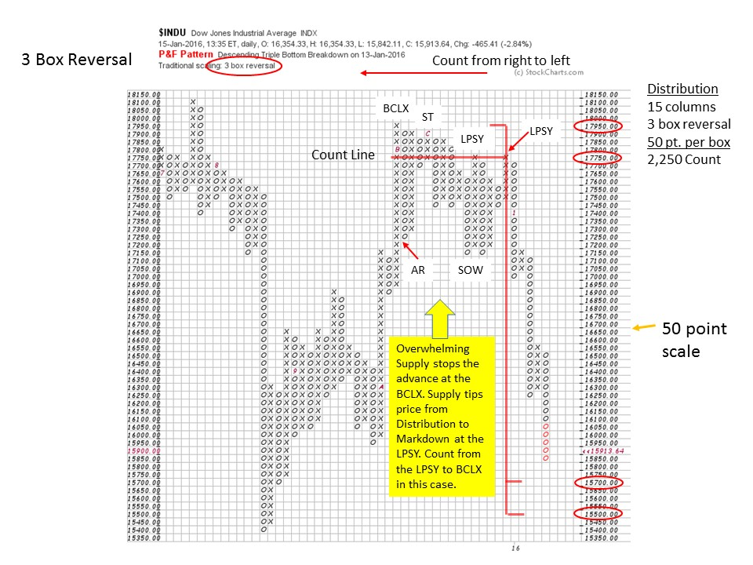

# Secrets of Point and Figure Distribution

URL: https://articles.stockcharts.com/article/articles-wyckoff-2016-01-secrets-of-point-and-figure-distribution/
Date: January 16, 2016 at 03:08 PM
Author: Bruce Fraser

The procedure for the horizontal PnF counting of Distribution follows the same logic as counting Accumulation. A cause is built during Accumulation and Distribution that results in a trend. Point and Figure chart construction allows us to estimate the extent of a trend. This adds a powerful tactical tool to our trading arsenal. Point and Figure provides a method for calculating reward to risk potential. The reward being calculated is the count objective estimated in the horizontal count. The risk is the strategic stop placement (entry price minus the stop). Reward to Risk is the price objective divided by the risk. Using this Point and Figure concept of reward to risk calculation becomes a standard procedure for Wyckoffians. A three to one reward to risk parameter is considered the minimum threshold for a trade. My counsel is to base this three to one minimum on a conservative point and figure objective, and not on the mega-counts that are possible on large Distribution formations.

Another powerful benefit of PnF is the ability to evaluate two comparable investments and gauge the potential of each with the calculation of their respective count objectives. A Wyckoffian might be considering two housing stocks. Housing stock A has a 3 to 1 reward to risk in the count objective, while housing stock B has a 4 to 1 count objective. There is more of a cause built in stock B, and on balance, it has better potential.

---

We plot our price charts from left to right. We count Distribution (like Accumulation) from the right to the left. From the End of Distribution to its’ beginning. Typically, Distribution ends with two events. First a Sign of Weakness (SOW), where the stock price dips below the prior lows of the trading range. Then a rally of poor quality lifts prices back into the Distribution area on low volume and narrow price spread. This rally is labeled a ‘Last Point of Supply’ (LPSY). Demand of poor quality and overhead supply will prevent the LPSY from reaching the highs of the Distribution trading range (the exception being the Up Thrust After Distribution, UTAD). We then locate the Buying Climax (BCLX). A BCLX will be accompanied by a spike in volume, indicating that large sellers are beginning to liquidate holdings. It takes time to liquidate large holdings and thus the formation of a range of Distribution. The volatile up and down swings will produce columns of sideways trading range on a PnF chart. We count the PnF columns from the LPSY to the BCLX to obtain our count objective.

The areas of LPSY, SOW, ST, AR, BCLX and PSY are all determined from vertical bar chart analysis and then transferred to the PnF chart. Note that each of these points are rally peaks within the Distribution (except the AR). Each rally peak is a place where price is overcome by supply which checks the advance. Supply coming in at a price is what creates a trading range of distribution. The Last Point of Supply is where the last of the remaining demand is met by selling from large interests. After the LPSY, the stock price slides through the bottom of the trading range and the markdown begins. The count procedure is to begin counting at the Last Point where Supply (LPSY) is present to the first place where supply is present which is either the Buying Climax (BCLX) or the Preliminary Supply (PSY). Therefore, we always count from an up column of x’s, to an up column x’s when determining the size of the Distribution. These are the counting guidelines.

The final LPSY is the place where overwhelming supply stops the advance and there is no quality demand to prop up prices. Price cascades down and out of the Distribution zone in a Markdown. Support is nonexistent and the price falls freely. In the $INDU case study we use a 3-Box Reversal method PnF chart.

The ‘Count Line’ is drawn from the peak of the LPSY to the BCLX. The count in this case is 15 columns multiplied by the 3-box method, multiplied by 50 point scale, which equals 2,250 points. Subtract this from the highest peak (17,950) and the count line (17,750) to calculate the count objective. In this example, the $INDU is within striking distance of the 15,700 to 15,500 target window. A Wyckoffian will look for the signs of stopping action around the price objective target zone. This helps to confirm that the counts are relevant. Recall that stopping action begins with a Selling Climax, Automatic Rally and Secondary Test. It is prudent not to attempt to catch the falling knife of climactic declines, as they can fall further and longer than expected. Reaching a price objective can result in an extended pause that is followed by a continuation of the trend. Note in the prior blog on Accumulation (click here for a link) how stopping action was followed by base building, which takes time, and also can be counted with the PnF Method.

All the Best,

Bruce
