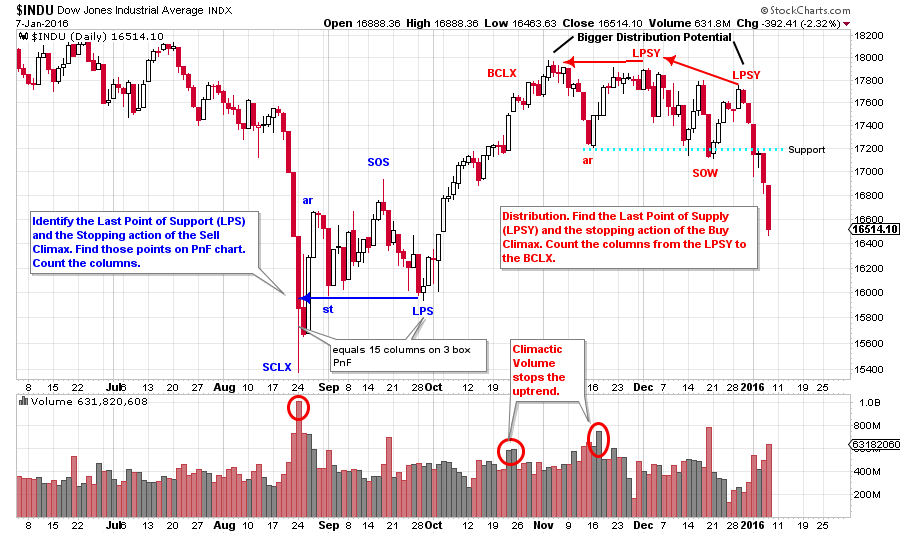
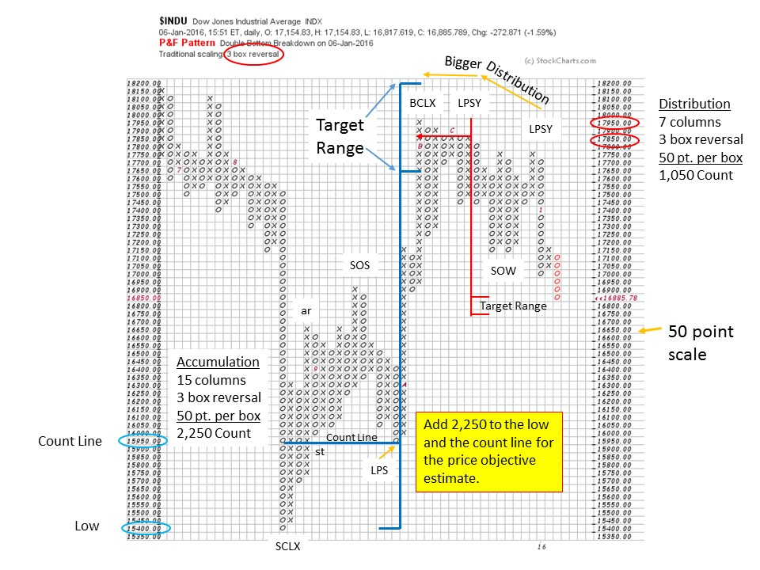

# Unlocking the Mysteries of Point and Figure Charts

URL: https://articles.stockcharts.com/article/articles-wyckoff-2016-01-unlocking-the-mysteries-of-point-and-figure-charts/
Date: January 08, 2016 at 02:19 PM
Author: Bruce Fraser

Point and Figure charts are familiar, but different. They have a relationship to classical bar charts while being unique. Their construction and interpretation requires skills that differ from traditional charting. And because of the mysteries of their construction, they yield information that other chart styles cannot. Namely, in our case, the ability to project price objectives.

Using the Wyckoff counting method to estimate price objectives can produce uncanny results. The proper count method makes it easier for the beginner and the advanced Wyckoffian to look at a PnF chart and derive a count quickly and objectively, keeping confusion to a minimum.

In this post we will introduce how to count Accumulation ranges. The recent August to October Accumulation in the market ($INDU) provides a classic example for reviewing how to make a base count and project a price objective. Next time we will examine how to take a Distribution count. From there we can add analytical nuance that helps to deal with the inevitable variations and complexities that all Wyckoffians encounter. This is a rich subject and is among the most interesting in all of technical analysis (in my humble opinion). Very few market analysts know how, or care to do, this work. I believe this is because it requires time and judgment that cannot be programmed into a computer. Let us see if we can convince ourselves of the value of doing PnF analysis and whether it can give us an edge in our campaigns.

---

(click on chart for active version)

We plot our charts from left to right as a convention, time moves to the right on a horizontal axis. While we also plot PnF volatility from left to right, we will do our analysis and counting from right to left. We do our analytical work from the conclusion of the Accumulation to its’ beginning; from right to left. As we have learned how to do in earlier posts, find the critical junctures: LPS, ST, SOS, SCLX and PS, etc. Label these points on a vertical bar chart. Next find these points and label them on the PnF chart. IF your vertical analysis is on a weekly bar chart, try using a 3 box reversal PnF. If on a daily, then construct a 1 box reversal PnF. On the $INDU chart, I break that rule by using a daily vertical bar chart and a 3 box PnF. So let's call this a guideline. The Accumulation (in this example) is relatively straightforward with a clear Selling Climax, an Automatic Rally, Secondary Test, a Sign of Strength, and a Last Point of Support. Most Accumulations are messier than this, which we will learn how to deal with in future posts.

Using our counting guidelines, we start at the right by identifying the LPS. Normally a good LPS is immediately preceded by a SOS where price jumps out of the Accumulation and then dives back in and attempts to return to the Support level near the bottom. At times the LPS is a ‘Spring’ but more often it is a final, and higher, low around the mid-point of the Accumulation price range. That is the case here. On the PnF chart label the LPS, SOS, ST, AR and the SCLX as determined from the vertical bar chart. Starting at the LPS, count columns on the PnF chart to the SCLX. There are 15 columns. How much fuel is in the tank to drive prices upward? An Accumulation is absorption that puts stock into strong hands. PnF is an estimation technique for determining how full the fuel tank is (cause) and the extent to which prices can move higher. To do this calculation we take the columns counted (15 columns) and multiply by the method (3 box reversal in this case) and then multiply by the chart scale (50 point). This yields a total of 2,250 points which is added to the lowest point in the Accumulation (15,400) and to the Count Line (15,950). This gives us a target range of objectives (17,650 to 18,200), which we flag on the chart. The final high is 17,950 which strikes the mid-point of the objective.

Note that the LPS column is a down column (represented by an 'o'). The 'catapult wall' is the column of x's that jumps the price out of the Accumulation and begins the uptrend. Begin taking the count on a down column (the LPS in this case) and finish the count on the first down column (the SCLX). Never start or end an Accumulation count on an up column (represented by an 'x'). Think last low, to first low.

We will continue to add nuance to (this cause estimating) counting method, but the foundation of horizontal PnF analysis is illustrated in the count guidelines described above. When a Wyckoffian encounters a complex PnF structure, reducing it down to its essential elements will clarify counts and tactics. Thereafter the complexity can be coped with.

Next time we will tackle the Distribution count that this same $INDU chart is currently revealing. Some labeling and counts are on these charts for your study. Distribution follows the same count guidelines only flipped over. A note here is that Distribution counts are trickier, as it is easy to over-count them. For now, please go through some of your favorite stocks and indexes and try lining up your Wyckoff labeling on the vertical bar chart next to a PnF chart and take some counts. Also, take a swing at some Distribution counts if you see them.

All the Best,

Bruce

The upcoming semester of technical analysis classes begin this week at Golden Gate University in San Francisco. Dr. Hank Pruden and I will team teach FI355, the Wyckoff II class, on campus beginning January 9th. Dr. Pruden has arranged for individuals interested in this class to attend the first session prior to making the decision to enroll. As space is strictly limited to the capacity of the classroom, reservations are a must. Please call Dr. Pruden at 415.442.6583 to reserve your space.

Additional classes are available both on-campus and online (cyber campus). For a complete list, and to see the schedule for additional details (click here for more information). Dr. Pruden is available for any questions you may have regarding any of the classes and the path to earning a Graduate Certificate in Technical Market Analysis (offered exclusively at GGU).

Here is a list of upcoming Technical Analysis courses offered on the GGU Cyber-Campus:

FINANCE 352 - Technical Analysis of Securities (click here for more information)

FINANCE 354 - Wyckoff Method I (click here for more information)

FINANCE 355 - Wyckoff Method II (click here for more information)

FINANCE 358 - Technical Market Analysis Strategies (click here for more information) FI358 class provides advanced studies in trading execution. Money management, trading psychology and trading plan development are reviewed.

FINANCE 360 - Behavioral Finance (click here for more information)

There is still time to enroll.
