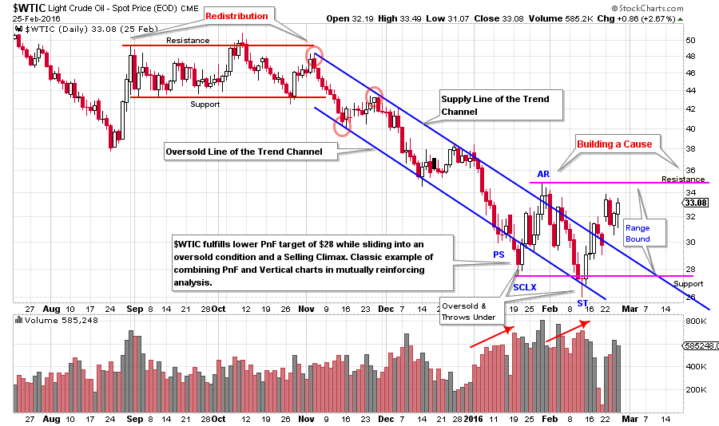
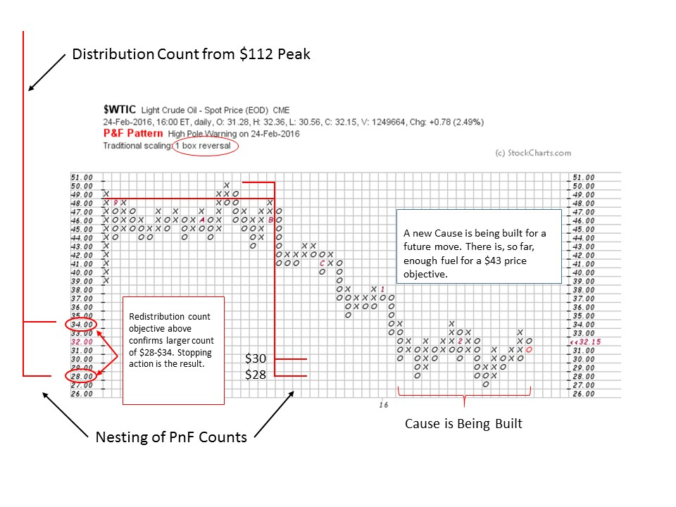

# Crude Oil Update

URL: https://articles.stockcharts.com/article/articles-wyckoff-2016-02-crude-oil-update/
Date: February 26, 2016 at 12:00 PM
Author: Bruce Fraser

In the blog post of December 17th titled ‘Crude Oil; How Low Can it Go?’ (click here for a link), we studied the bear market in crude oil of 2008-09, the bull market of 2009, and then the current bear market. The long term point and figure analysis for each of these periods has been very accurate and useful. The 2013-14 top generated a count that carried from $112 to a target range of $28 to $34 which was hard to believe at the time. $WTIC has since melted all the way down to the $27 (lowest PnF box) level before bouncing to $34 for a near direct hit of the PnF count objectives. Have we seen the low for crude oil? Is it time to buy crude oil? What should we expect next?

What has transpired since the prior post is really interesting and a good review of some essential Wyckoffian principles. Where our prior analysis was employing weekly vertical charts and 3-box reversal PnF, here we will zoom in with shorter term charts for a more detailed view. With crude on a glide path for a potential landing, shorter term data can inform how that landing will occur and if there will be a touchdown or a continuation of the decline.

---

(click on chart for an active version)

In November a trend channel established itself setting the rate of decline. The three red circles are the anchor points. The top two establish the Supply Line and the lower is used for the parallel ‘Oversold Line’. Note how well $WTIC obeys this channel and the stride is set very early in the trend. Keeping the $34 to $28 long term PnF objective in mind, the Wyckoffian will seek evidence of Stopping Action. This arrives in the form of Preliminary Support (PS), Selling Climax (SCLX), Automatic Rally (AR) and Secondary Test (ST). Eleven of twelve days down at the beginning of the year are volatile and are accompanied by persistently high volume. The throw under of the Oversold Line is a classic sign of exhaustion of the trend. And the decline is stopped at $28 (SCLX) and $27 (ST) for a PnF hit. The vertical chart is telling a classic Wyckoffian tale that syncs nicely with the PnF analysis. An AR should follow the SCLX. A brief rally moves crude through the top of the Supply Line where volume bulges (large sellers are present) we label this an AR. Draw a Support Line under the SCLX and a Resistance Line above the AR. This will be our trading range for the near future. Always expect an attempt to return to the Support area after an AR. The decline that follows to the ST is on very high volume which indicates that large Supply is available and must be absorbed in order for Accumulation to be completed. This generally takes time and we have learned from prior PnF studies on crude that big counts can and do form. So for now we expect a range bound market.

Study the trading range from August to November. It is a classic Stepping Stone Redistribution and a PnF count of this area could prove interesting. The persistently high volume on the break of support in November is a classic liquidation. The rally that follows is of poor quality and demonstrates a lack of demand by the C.O.

The Stepping Stone Redistribution (SSR) counts to $28 to $30. This is inside the large count of $28-$34. It confirms the bigger count so we would call this SSR a ‘Stepping Stone Confirming Count’. Such a confirming count gives us a degree of confidence in our PnF work. Note the Cause that is being built has generated $16 (16 columns multiplied by $1 scale) of potential already. The volume signature in the vertical chart is still showing high volume on the declines to Support. We would expect some evidence of the Supply being exhausted before a meaningful rally is possible. Also, the C.O. will not support a rising market until all of the overhanging Supply has been vacuumed up. Further attempts to return to the lows will generate additional columns of PnF count. It pays to be patient and wait for the real trend to begin and not to get chewed up by a volatile trading range. There is always the potential for this pause to be another Stepping Stone Redistribution generating lower counts for another leg down. Careful analysis of the vertical chart should give plenty of advance warning of this possibility.

All the Best,

Bruce
