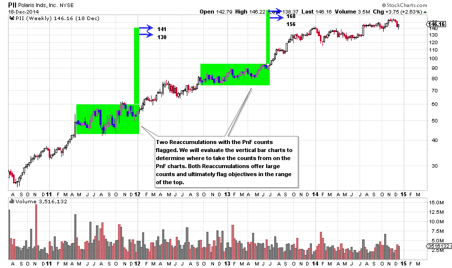
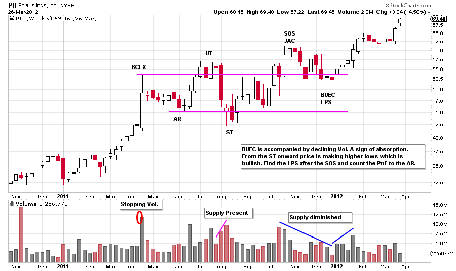
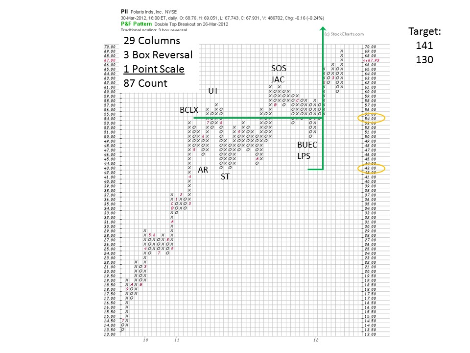
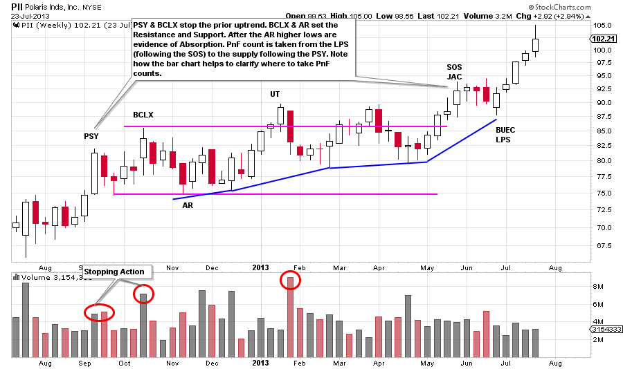
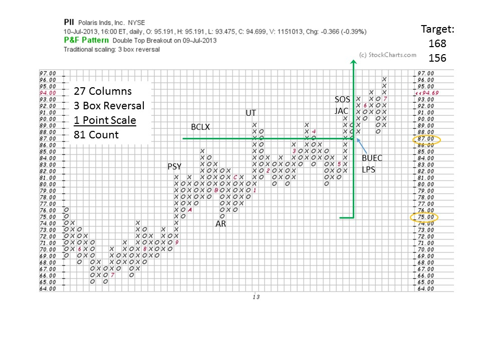
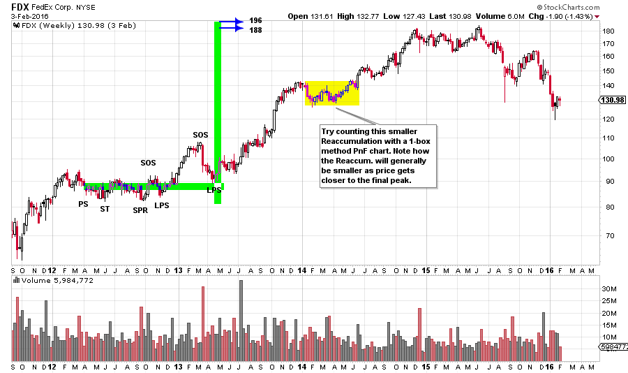
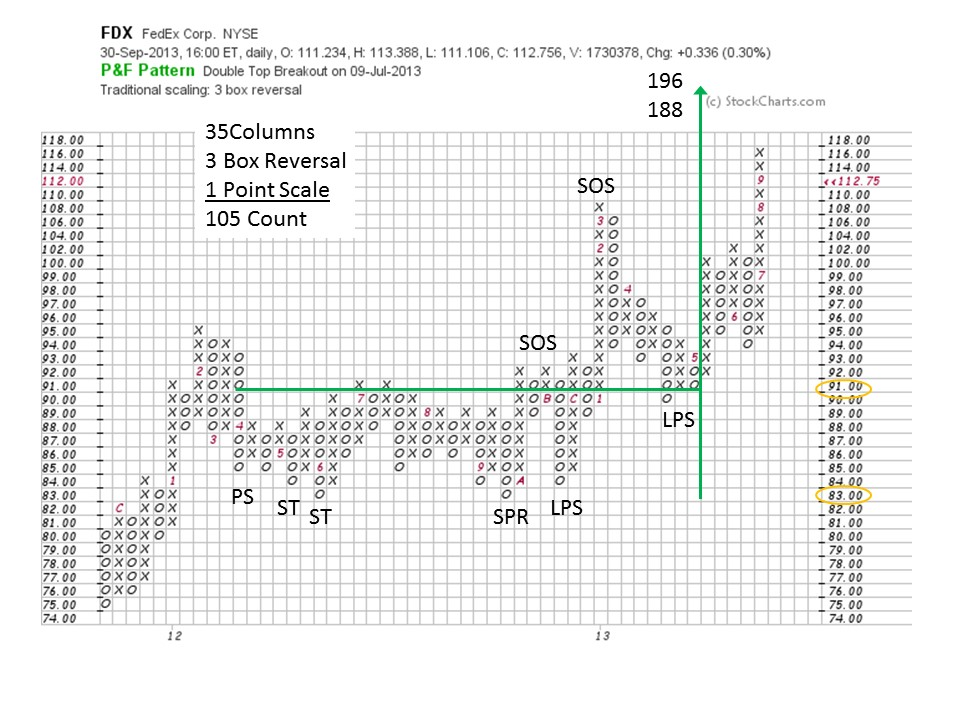

# Point and Figure Pauses that Refresh

URL: https://articles.stockcharts.com/article/articles-wyckoff-2016-02-point-and-figure-pauses-that-refresh/
Date: February 05, 2016 at 02:56 PM
Author: Bruce Fraser

Uptrends occasionally need a rest. We call these price congestion areas Reaccumulation trading ranges. Wyckoffians seek these areas out as an opportunity to get onboard the uptrend. Point and Figure analysis for Reaccumulations follow the conventions outlined in prior posts, with some minor variations. There is great value in becoming familiar with counting Reaccumulations as they are the stair-steps on the way to the conclusion of the uptrend. There are often multiple stops or pauses along the upward path and each is a profitable window for initiating a trade or adding to an existing position.

What could be more fun than chart analysis (Wyckoff style), so let us spend our time in this post exploring charts. In particular, one of the most valuable charts in the Wyckoff Methodology, Reaccumulation Trading Range charts.

Both of the Reaccumulations in the PII uptrend are long pauses and build big count objectives. They are excellent trading opportunities. Each has the lowest low occurring in the first half of the formation. Thereafter higher lows form. This is a classic sign of Absorption as stock is being bid for at ever higher prices.

Reaccumulations are different from Accumulation base formations in the way they start. A prior uptrend will be stopped with a Buying Climax (BCLX) and an Automatic Reaction (AR) which signals large sellers (click here and here for more). Reaccumulation will begin to show Absorption at about the mid-point of the formation. In PII higher lows become evident after the Secondary Test (ST). Also, volatility and volume are generally high in the first half of the formation and diminish thereafter. We take our PnF counts from the analysis labeled on this chart. Recall that our count will start at the Last Point of Support (LPS) which follows the Sign of Strength (SOS) to the AR (click here for a review).

Establishing counts on the bar charts eases confusion and makes for more accurate price objectives. Then on the PnF we find the LPS and the AR and count the columns. Even though there is an upward tilt to the formation we are clear about where the proper count starts and ends. Using a standard 3-box reversal method, 87 points of fuel is available and added to the low at the ST and the count line. This is a substantial trade with 87 points of profit potential being signaled by the PnF chart.

The Preliminary Supply (PSY) is a big bar with a bulge of volume. There is an immediate reaction, on the next down bar, with expanding volume that is evidence of large sellers. This will stop the uptrend for some period of time. We call the next big push to a higher high the BCLX because of the volume spike. The decline to the AR is on generally high volume and is further evidence of the presence of supply. Note how on subsequent pushes the price can exceed the BCLX level only temporarily. There is a supply of stock that must be absorbed. This ten month Reaccumulation builds a substantial count. Again, we locate the LPS that follows the SOS and count to the reaction after the PSY.

This Reaccumulation formation generates a count that is about a double of the price level of the formation. We find the relevant price locations labeled on the bar chart and transfer them to the PnF chart. This count is 81 points and offers a target of 156 to 168. Slightly higher than the target of the prior Reaccumulation. This second pause would be an excellent place to average up a winning trade that was initiated in the first Reaccumulation.

Note how Distribution sets in at the price target zones established on these two examples. When two or more Reaccumulation counts confirm each other, expect resistance at that level to be formidable. PII experiences trend stopping Distribution in this price zone. Take some time and evaluate this PII Distribution formation for additional practice.

Here FDX has a Reaccumulation in 2012-13 that builds a substantial count. Take some time and zoom in on this Reaccumulation and complete the analysis. Also, note the pause in the early part of 2014 that builds a count. Try counting this area with the 1-box reversal method.

We identify the price points and labels from the bar chart and transfer to the PnF chart. There are 35 columns which provides a count of 105 on the 3-box reversal method. The Spring (SPR) and both LPS points are excellent places for trade entry. The SOS points inform us of the inherent strength of the stock price to Absorb overhanging supply.

Reaccumulation trading ranges are among the most important conditions that a Wyckoffian can master. Numerous variations of Reaccumulation pauses can develop within a long term uptrend and each is a meaningful opportunity.

All the Best,

Bruce
