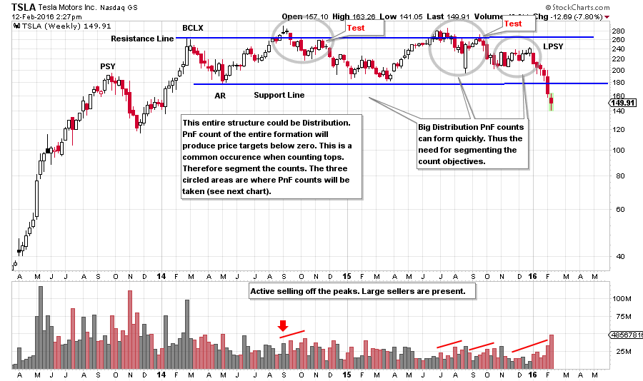
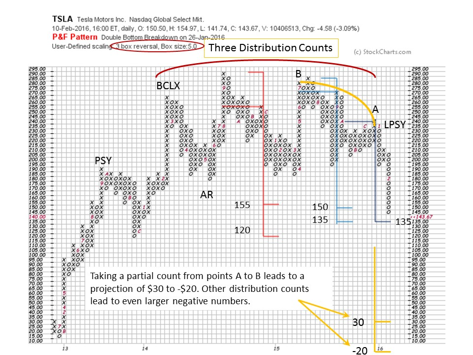

# The Point and Figure Distribution Paradox

URL: https://articles.stockcharts.com/article/articles-wyckoff-2016-02-the-point-and-figure-distribution-paradox/
Date: February 12, 2016 at 02:58 PM
Author: Bruce Fraser

Counting Point and Figure Distributions is a bit of a paradox. Accumulation counts can grow very large and lead to advances that are multiples of their starting point. However, a stock under Distribution is bound by the zero line. Counting conventions for Distribution are therefore different from Accumulation.

Judicious counting of Distribution is essential to successful PnF analysis and trading. A common error Wyckoffians make is to over-count Distribution formations and get counts that are neither practical nor useful. Let us examine this problem here and begin to employ the tactics that will make us Wyckoff PnF Power Chartists.

---

Tesla Motors ran into Preliminary Supply (PSY) in September of 2013 and the advance ended with a Buying Climax (BCLX) in February of 2014. From there, it traced out a pattern of Distribution between the Support and Resistance lines. This Distribution action lasted two and a half years. Establishing a PnF count for this period of time is not practical because of the sheer size of the Distribution. We need a strategy for counting portions of the formation that can provide manageable price objectives.

(Click here for active version)

Three areas have been circled as appropriate for taking a count. In each area volume expands on the decline off the peak, and indicates distributional selling. In the first two cases a rally develops after the initial decline, which is a test (labeled). Count from the test to the prior peak. Each of these circled areas represents a small portion of the entire range of Distribution, but they generate sizable counts.

The three counts coincide with the circled areas on the vertical bar chart. Each counts to a price objective nesting between 120 and 155. These counts are reasonable and tactically useful. If a larger count is attempted it could easily dip below zero. As an example, find points A and B and count the columns. The objectives flagged are -$20 to $30 and this is less than one half of the entire Distribution. The $30 target is possible, but not likely.

The nested count area has just now been reached. When a count objective is being approached, look for the signs of stopping action (AR, SCLX and ST). If price is stopped in the area of the counts, two broad scenarios are likely. Either an Accumulation forms or a Redistribution. Both will develop new PnF counts that could take months to form. An Accumulation would generate an upward count that would initiate a new bull market. Redistribution would generate a new downward price objective that would continue the existing bear trend. Often the new Redistribution count will reconfirm bigger distribution counts formed at higher prices (in this example points A to B). An excellent demonstration is the furthest count to the right, which forms the LPSY. This is technically a Redistribution (see this post for additional examples). Note how it confirms the two prior Distribution counts into the 135 area.

To review, the protocol for selecting and counting these smaller PnF counts within the larger distribution is to find a price peak in the area of the Resistance line and look for expanding volume on the drop off that peak. At some point a rally will develop. This rally will fail to reach the prior price peak. This is a failed test of the prior peak. Count the columns from the test to the peak. The theory here is that distributional selling is active off the peak and represents large interests unloading stock. This PnF count measures the potential downward Cause that the Composite Operator has generated in this segment.

The Stepping Stone Redistribution (SSR) at the LPSY is a slightly different animal. An LPSY is a rally of poor quality (low volume and narrow price spread) that signals that the C.O. is no longer supporting the stock and that demand is of low quality. Count the columns from the final peak of the LPSY to the start of the rally. In this example the SSR count matches the two larger counts and adds confidence that these objectives are valid and useful.

Now that the price objectives have been reached, we would look for evidence of stopping action and Cause building that will lead to a tradable rally or reaction.

There is much more to do on the subject of Distribution counting.

All the Best,

Bruce

Dr. Hank Pruden will be making a presentation to the TSAA-SF this Saturday February 13th at Golden Gate University. The title of Hank’s talk is; “The Double Helix Power of Combining Wyckoff Method and Elliott Wave”. The public is invited (click here for additional information).
