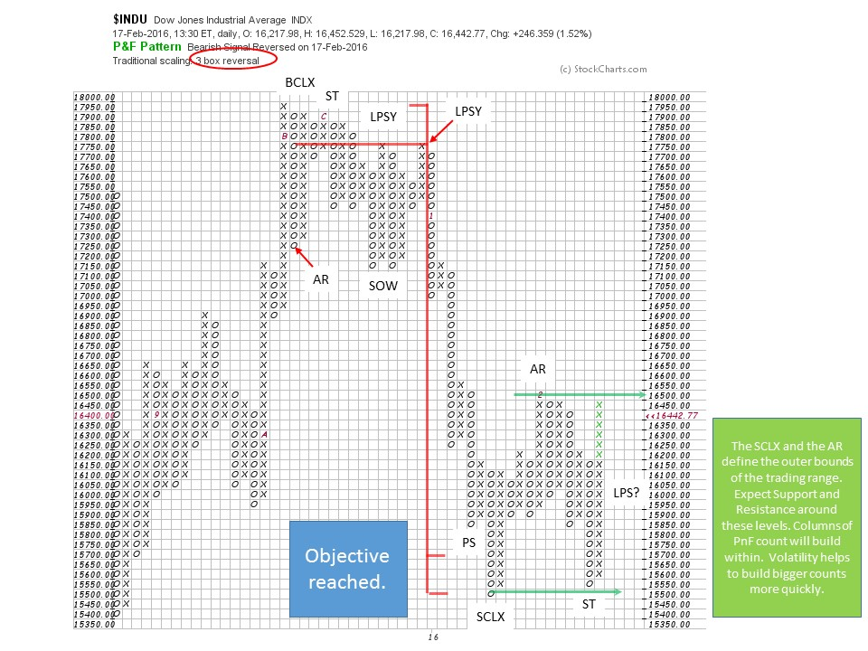
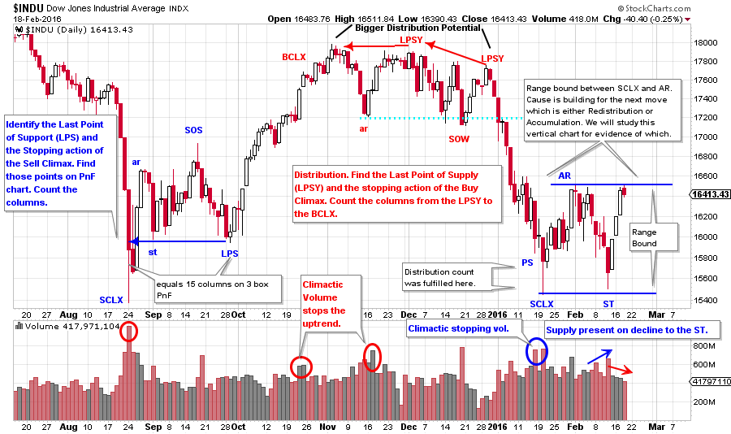

# Wyckoff Time

URL: https://articles.stockcharts.com/article/articles-wyckoff-2016-02-wyckoff-time/
Date: February 19, 2016 at 01:31 PM
Author: Bruce Fraser

In trading and speculation we are all on the clock, the market clock. At times the market clock spins quickly and at other times it crawls. When a trend is unleashed time seems to move effortlessly. Time slows down when the market makes no progress while in a long drawn out trading range. The Wyckoff Methodology can help to tell what time it is in the market. If we know the ‘market time’ we know how to conduct our activities. Is it time to be patient and watch? Is it time to stalk a trade? Is it time get busy and put trades on? Are we holding long (or short) while waiting for the conclusion to the trend? And then are we stalking the market for the time to conclude our trade and take profits? In the cycles of the markets there is a time for all things. Market wisdom is to know what time it is in the markets and act accordingly.

Borrowing from the conversation started in the blog posts (click here and here for a link) of January 8th and 16th, 2016, let’s continue the case study of the Dow Jones Industrials with an emphasis on how Wyckoff would frame the unfolding of these market conditions. We counted a PnF distribution with a price objective of 15,700 to 15,500. In Wyckoff we look for evidence of stopping action in the vertical chart as a price objective is approached. Wide price bars and very high volume took the $INDU almost exactly into the 15,500 price objective. The close on the low day was above the mid-point of the day’s range showing quality demand. We recognize this to be the initiation of stopping action (at least temporarily) and the beginning of a trading range that is either Accumulation or Redistribution. The downtrend is over for the time being. After labeling this low a Selling Climax (SCLX) we expect a short and sharp rally called an Automatic Rally (AR). After drawing a horizontal line at the low of the SCLX and at the peak of the AR, a trading range is defined. A Wyckoffian expects most of the upcoming trade activity to take place within and around the Support and Resistance established by these lines.

---

It is now time to expect a swift downtrend to be turned into a volatile, but trendless, trading range. Wyckoffians will use the PnF price targets and the rapidly declining prices to cover some, or all, of their shorts (if they are inclined to be short). And then to study the unfolding trading range activity to determine the next low risk trading opportunity.

Once a PnF count objective is reached evidence of stopping action in the form of Preliminary Support (PS) and climactic activity (SCLX) is sought. That is what happened here. The SCLX is the beginning of the process of preparing for the next move. Building a Cause is the ebb and flow of prices between Support and Resistance and this builds a PnF count for the next price movement of substance. Volatile price swings build count quickly, as is the case here, and this can go on for a long time. We turn to the vertical chart to help determine when the trading range becomes a new trend.

(click here for active version)

We draw Support lines under the SCLX low and above the AR peak. This is the outer bounds of the trading range. Price will mostly trade within the bounds defined. The character of price is that it will reach one extreme and then, abruptly, return to the other boundary. Note the Secondary Test (ST) low and the rapid reversal to the top with a three day rally. The drop from the AR to the ST was a fast five day decline. The volume expanded on the decline which is evidence of the presence of supply (this high volume leads us to conclude that further attempts to decline to the support line are likely). If this structure is Accumulation we want to see future declines in the trading range occurring on lessening volume. This tells us and the Composite Operator that sellers are exhausted and the supply of stock has largely been absorbed.

For the bulls there are two major scenarios to script here. The first is that the $INDU turns down from the area of the AR and attempts to return to the SCLX low. On these declines volume diminishes on balance and the daily price ranges are generally narrower than on the decline to the SCLX and the decline to the ST. This will be evidence of selling exhaustion. Also, the price may only be able to return to the mid-point of the trading range and make a Last Point of Support (LPS). This would be bullish and a place to initiate trades (often the LPS comes in at about the same level as the PS). Recall that PnF counts are generally taken from the LPS to the PS (and sometimes to the SCLX).

The second bullish scenario is the $INDU jumps the AR level without pulling back into the range. After Jumping it consolidates for a brief period of time and resumes the uptrend. Old Resistance becomes new Support and so we look for a backup into the old resistance (This backup is labeled a BUEC). This is a place to enter a trade.

The bearish scenario is that the current pause is Redistribution. We know from our prior studies that volatility tends to increase as Redistribution advances. Declines from the top of the trading range to the bottom are quick and accompanied by large volume. Supply is present and the C.O. is selling, not buying. At the Resistance level look for brief breakouts (called Upthrusts) that fail quickly back into the trading range. When the Support line is broken and price cannot lift back into the trading range the Redistribution is nearly complete and a new downtrend is imminent.

We are treating this juncture in the $INDU as a real time case study. So for now we are expecting a continuation of the trading range and have the broad scripts above to provide us with action points and steps for the next phase.

All the Best,

Bruce
