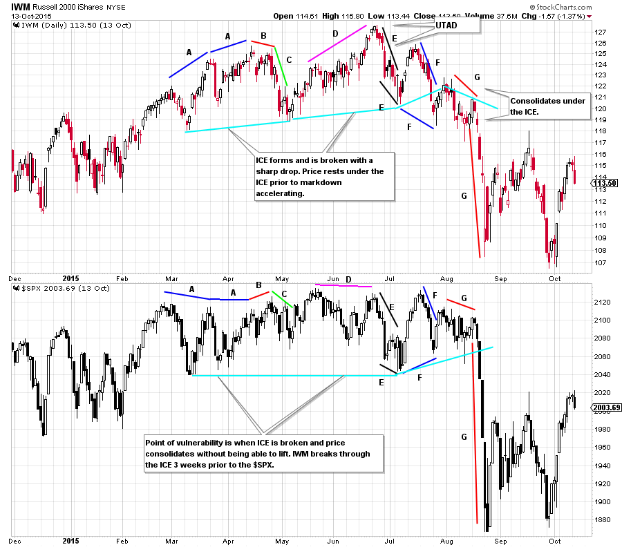
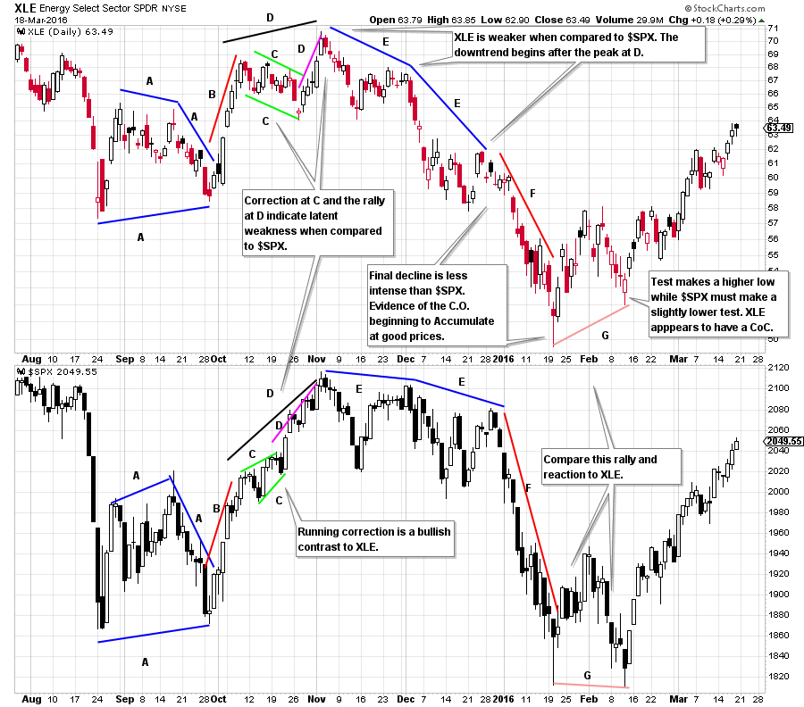

# Distribution Power Waves

URL: https://articles.stockcharts.com/article/articles-wyckoff-2016-03-distribution-power-waves/
Date: March 18, 2016 at 05:00 PM
Author: Bruce Fraser

In the prior post we introduced the study of comparative waves of buying and selling. By judging the relative power of adjacent waves of buying and selling one can discern emerging strength, or weakness in the stock’s structure. The change in the power of rally waves and selling waves is an important tool for the Composite Operator as they judge whether a stock is ready to markup (or markdown).

Wave analysis is the comparative study of the rising and falling movements of the price of a stock. It is also the study of these price waves in comparison to a benchmark index such as the S&P 500.

What we seek with this analysis is evidence of a ‘Change of Character’ (CoC). This can often manifest as a stock resting gently in a trading range and then jumping fiercely into a new trend. Wyckoffians will compare buying waves and selling waves looking for the most subtle clues of CoC. Wave analysis of Distribution works in much the same way as Accumulation. Here are two Distribution case studies to get us started.

---

(click on chart for active version)

Let’s start by only considering and comparing the stock price wave structure. Thereafter we will introduce the S&P 500 to the analysis. During March and April 2015 the Russell 2000 ETF (IWM) was demonstrating leadership by making higher highs and higher lows. Note the robust rally in IWM in February. The March rally was steeper and shorter in duration. The April rally was the poorest of the three as it barely made a new high and had the weakest ascent (note all of the overlap of price from day to day). A lower high test at B is a vulnerable place and is followed by a decline at C that is a major CoC. When compared to the prior declines during the uptrend, C is persistent and creates price damage. The conclusion is that large sellers are present at C. We expect a rally after the first round of active selling at C. The price rise at D is long in duration but labored as it pushes to the highs. This rally takes a long time and does not make much price progress. Comparing D to the rallies in the uptrend, it appears less dynamic with little buying power to propel prices higher. The decline at E retakes almost all of the rally at D in about one quarter of the time. Also, E declines further than C, demonstrating that the selling above 125 is large and a sign the C.O. is distributing. The rally and decline at F is a lower high and a lower low which occurs quickly relative to prior up and down waves. Quick and volatile moves deep into the lower part of a trading range smacks of Distribution. The drop at F appears to be a break of the ICE and that is confirmed to be the case when price has no capacity to lift its head and rally back into the overhead supply. This is a most vulnerable place on the chart as it shows that the C.O. is no longer sponsoring IWM. It is poised to markdown from here. Points F and G are part of the emerging markdown phase.

IWM is the leader compared to $SPX which is now in a trading range at A. The first tell that sellers are present is the decline at C for IWM. $SPX barely moves down at C. The rally at D for IWM does not result in a rally for $SPX. IWM is the leader. At E both indexes get in gear with selling that moves prices to the bottom of the range. This is a major CoC for $SPX. Both indexes are equally weak. At F $SPX is stronger with a rally to the top of the range and a reaction to a higher low. This position is where IWM tips its hand that it is the weaker index. IWM is making new lows and is already effectively marking down.

(click on chart for active version)

The Energy Select Sector ETF (XLE) has a jump and a test at A which leads to a good rally at B. After a correction at C the next advance at D stalls quickly. The decline at E is weaker than C and is followed by drifting. The second decline in the E phase is weaker than the first. The selling is becoming more intense and ultimately puts XLE at the lows of A where it marks time before another drop.

In summary, when comparing rallies to the peak each is diminished. The declines beginning at E have ever greater selling and expanding price damage to the lows at G. The intervening pauses have no lift in them.

XLE compared to $SPX has a moment of hope at the B rally. The pause at C shows that $SPX is stronger in relation to XLE and then into the final peak at D. The decline and rally at E illuminates XLE’s weakness and is a warning. During the decline at F, while both XLE and $SPX are falling there is evidence XLE is declining less when compared to the drop in $SPX. XLE may be finding big buyers in the final stages of the decline to G. At G the test is a higher low for XLE while $SPX needs to return to the low. The subsequent rally in XLE keeps pace with the $SPX and is demonstrating a Change of Character into a leadership role.

All the Best,

Bruce

Ps. We will not publish during the upcoming week. Have a great week.
