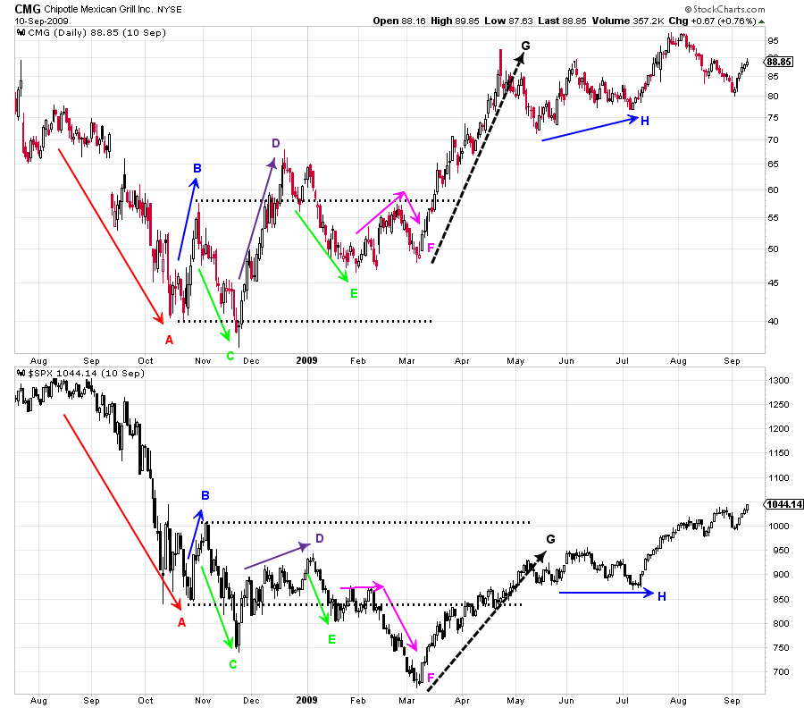
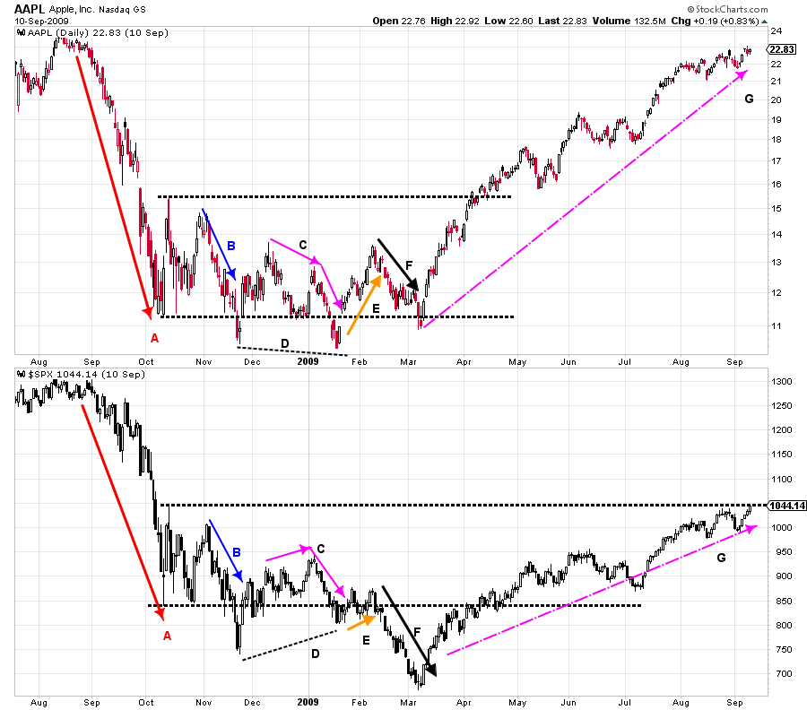
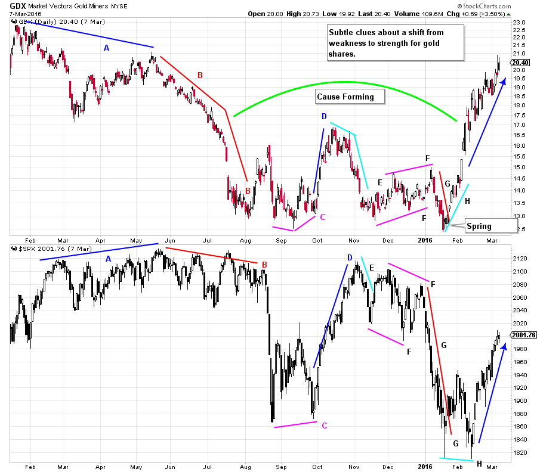

# Judging Power Waves

URL: https://articles.stockcharts.com/article/articles-wyckoff-2016-03-judging-power-waves/
Date: March 11, 2016 at 04:25 PM
Author: Bruce Fraser

Determining the motives of the Composite Operator is the central mission of all Wyckoffians. There are numerous tools for this task. The present position and future trend of the market and the stocks within, are determined through the analysis of price and volume (‘the study of the tape’, Mr. Wyckoff would say). We have covered much ground in these blog posts, through the study of Accumulation, Distribution, Price Spreads, Volume, Support and Resistance, Trend Analysis and much more. It is time to add another powerful tool to our arsenal of market skills; The Comparison of the Waves of price. By learning to judge the relative power of Buying Waves and Selling Waves, the Wyckoffian develops the skills to decide when a stock is poised to move quickly and with leadership. When we see the footprints of the C.O. we are capable of acting in concert with this powerful force.

Power Waves are classically Wyckoff in nature. Devoid of indicators, Power Waves focus on the action of price as a pre-determinant to the beginning of big moves. Power Wave analysis helps with choosing andtiming which stocks are poised to lead the way by outperforming their peers.

---

(click on chart for active version)

Chipotle (CMG) 2008-09 is a good introductory case study. To begin let’s study the waves of buying (demand) and selling (supply) for CMG. Note the large wave of selling at A which culminates in a Selling Climax. Wave B is a short sharp rise that quickly ends. Wave C is a continuation of selling. Compare wave C to wave A. Wave C is much shorter in duration, though the decline is steep. Supply could be exhausted as a result of the shortening thrust at C. Now compare wave D to B. D is dynamic in the speed and rapidity of the rise when compared to B. Wave E corrects slightly more than one half of the rise in D. Wave F is potentially confusing as the rally portion compares poorly to the D wave rise (more on this shortly). The wave at F is an LPS and a test for a jump out of the Accumulation at wave G. The G wave rally is forceful. Compare the waves at B, D and G, each is stronger than the prior wave. Also note how the power of the supply waves at C, E and F are generally diminishing in force.

Now let’s compare CMG’s waves to the S&P 500 as our market proxy. This is a form of relative strength analysis. Take a minute and study the demand waves and the supply waves of each to determine if there is an underlying bullish or bearish trend. By comparing waves we can see that CMG is basically in gear with $SPX during the declining wave at A, the rise at B and the decline at C. CMG begins to ‘tip its’ hand’ at wave D where it is noticeably stronger. CMG climbs up and out of the Accumulation range temporarily, while the $SPX can only rise to the middle of the range. The area at F is most interesting. At the area of Support the $SPX can barely lift up while CMG is rising toward the Resistance area, which is an indication of emerging relative strength. Then the $SPX falls away from Support and into a new downtrend (which turns out to be a Terminal Shakeout). CMG makes another higher low during the $SPX Shakeout. The $SPX rally at G moves strongly and persistently back into the Accumulation range. Note what happens to CMG in the G phase of the rally. It clears all resistance and has established a robust uptrend. Relative wave analysis of CMG to $SPX dramatically illustrates CMG’s emerging leadership. By studying each wave of supply and demand it is readily apparent that leadership was forming in CMG very early on in the Accumulation process. CMG continued this leadership during the subsequent bull market.

(click on chart for active version)

During the same 2008-09 time period Apple is a classic, and more subtle, Power Wave study. Each Supply Wave is less forceful (A, B, C and F). Note at the conclusion of C a Spring forms while $SPX makes a higher low (line D). Carefully study these waves. Apple is making a series of lower highs and lower lows at lines C and D. There are generally signs of diminishing downward force in AAPL but weakness to the market prevails. Then at wave E an important rally forms in AAPL while $SPX drifts. This puts AAPL back into its’ Accumulation range while $SPX teeters at Support. This is a key ‘Change of Character’ (CoC) and the first signs that AAPL wants to be an emerging leader. The minor new low in AAPL is a Spring. Compare the waves of supply at F where $SPX is noticeably weaker than AAPL. At the conclusion of F, $SPX is in a Shakeout while AAPL is staying within the Accumulation area, above Support, and forming an LPS. The rally at G is dynamic for AAPL and proves that it is an important new bull market leader. Often Relative outperformance materializes toward the end of Accumulation therefore Wyckoffians must remain forever diligent in their studies.

(click on chart for active version)

Let’s turn our attention to the current markets and apply some Power Wave analysis to the Gold Miners using GDX as our proxy. At waves A and B, GDX is noticeably weaker than the $SPX. In August when the $SPX becomes very weak, GDX has already experienced much price damage and does not participate in the broad market decline. At D, $SPX rallies further and for longer than GDX. Then during the decline at E, gold shares begin falling first and are generally weaker than the $SPX. Note the channel at F where GDX has a slight upward tilt of higher highs and higher lows while the $SPX does the opposite. This is a constructive clue about a potential change of character. This has our attention. The decline at G is revealing as gold shares resist declining with the very weak stock market. We have drawn line H to illustrate the dramatic next step. Where the $SPX needs a test in February, gold shares do not, and they begin to markup immediately. GDX concludes a large Accumulation with a classic Spring.

Relative Power Wave Analysis is such a useful tool. Once you have become accustomed to doing wave analysis and relative strength analysis in this way, all other methods will pale in comparison. Stockcharts.com is an excellent tool for this analysis as can be seen from the above examples.

All the Best,

Bruce

Ps. This Saturday, March 12, I will be Chip's guest on ChartWatchers LIVE at 1pm Eastern. (to register click here)
