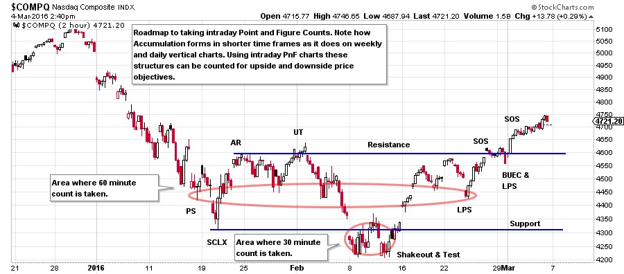
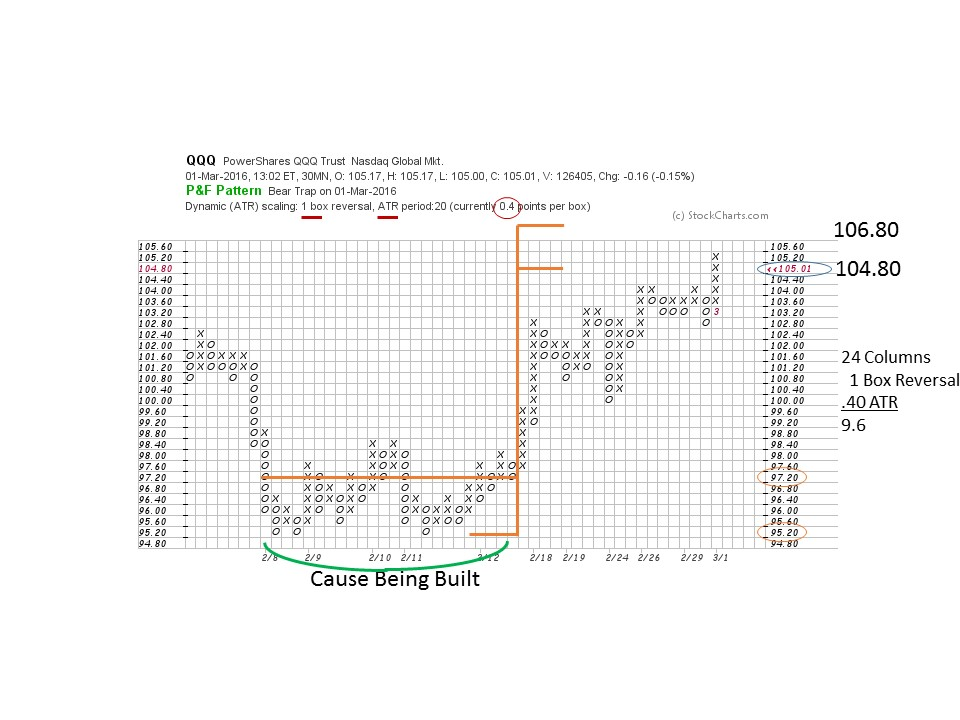
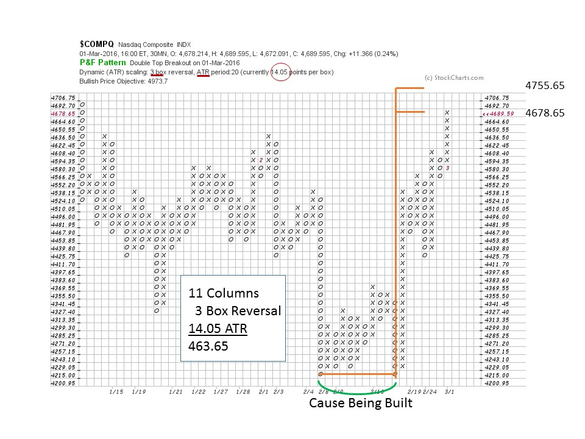
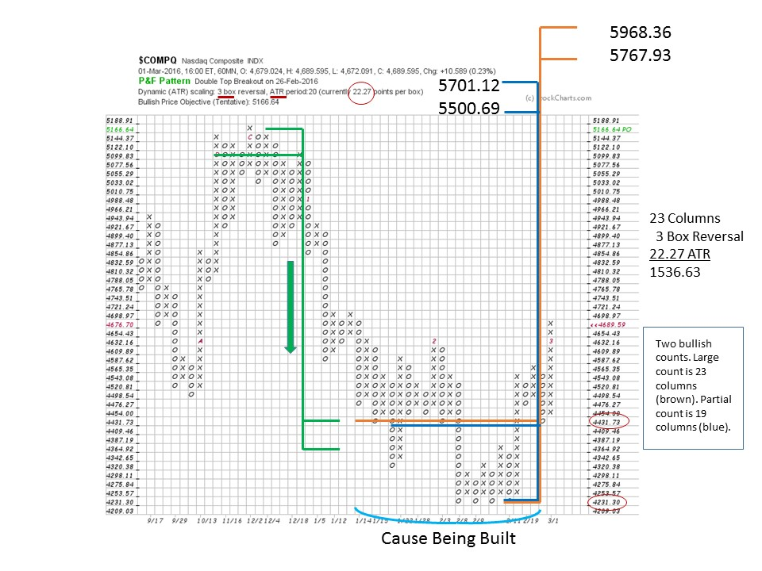

# Point and Figure Analysis with Intraday Charts

URL: https://articles.stockcharts.com/article/articles-wyckoff-2016-03-point-and-figure-analysis-with-intraday-charts/
Date: March 04, 2016 at 03:22 PM
Author: Bruce Fraser

We have worked with Point and Figure charts in multiple time frames using 1 box and 3 box methods. This is akin to constructing daily and weekly bar charts. For many traders intraday analysis and trading is preferred. The good news is that PnF analysis is a powerful technique for evaluating these smaller time periods. PnF scales down handily from 60 minute to 5 minute data.

Only two settings need be changed (StockCharts.com subscription required) to begin generating useful intraday PnF charts in your chosen trading instruments. Under ‘Chart Attributes’ select the period (30 minutes for example). Under ‘Chart Scaling’ select the method; ‘Dynamic (ATR)’. Now you are ready to create intraday PnF charts. The Dynamic (ATR) will use ‘Average True Range’ to calculate the vertical scale that is best for the time frame selected.

---

In Wyckoff we seek to identify a Cause that will lead to an Effect (trend in prices) worthy of a campaign. Causes built within intraday timeframes are often unnoticed, but can be counted, projected and campaigned. The counting techniques are essentially identical to the methods we have already studied. As in all intraday analysis, events happen quickly and require an intense focus on the data.

(click on chart for active version)

This 2-hour vertical chart will be our roadmap for the PnF chart analysis below. Note how well the Wyckoff analysis works on this shorter time frame. We will use these anchor points for taking our counts on the PnF charts.

For the QQQ we have selected a 30 minute timeframe, 1 box reversal method, and the scale calculated by the ATR is.40 on the vertical axis. The count procedure is the same as for any PnF chart. Find the Last Point of Support (LPS) and count to the Preliminary Support (PS) which is 24 boxes. Multiply 24 by the 1 box method, by the.40 scale. From the count line of 97.60 the objective is 106.80 and from the low 104.80. For many intraday traders this is a meaningful campaign objective. The Cause is built over about a four day period. Now that the objective has been reached there are a few options to consider. First would be to stay in the trade and wait for evidence of distribution for an exit, which could come at higher prices. Or a Reaccumulation could form to propel prices higher. Finally, you could take profits and wait for the next Cause to be built.

In this 30 minute PnF of the NASDAQ Composite we have a 3 box reversal method chart. Generally this method is better for generating bigger counts than a 1 box method chart. And thus bigger Causes can be counted for larger moves. At the 4215 count line 11 columns are multiplied by the 3 box method and then by ATR scale of 14.05. The lower objective is 4678.65 and the upper is 4755.65. The count line is at the low of 4215.00 so we estimate the upper boundary by taking the midpoint of the trading range. $COMPQ has reached the target zone. Does it have further to go? The next chart goes out to 60 minutes and provides another perspective.

The prior analysis of the 30 minute chart is taking place within a larger Cause being built. The 60 minute chart brings perspective to this bigger potential. The two prior charts made counts to the top of this large trading range where we would expect resistance. The 60 minute chart suggests a much bigger potential Cause forming. So small Causes form within big Causes. The count is 23 columns multiplied by 3 box method and then by the ATR scale of 22.27. From the low the objective is 5767.93 and from the count line 5968.36 which carries to a new recovery high for the $COMPQ. The Wyckoffian intraday trader would consider the larger trend favors higher prices because of this analysis. Therefore the emphasis would be to trade from the long side as Reaccumulations form and set up future trades. Only the arrival of a Distribution count of meaningful size would alter the trader’s upward bias.

Shorter time period PnF charts, such as 5, 10 and 15 minutes, are very effective tools. The Causes and setups come and go quickly in these shorter time frames, while the principals are the same.

All the Best,

Bruce

Ps. On March 12 I will be Chip's guest on ChartWatchers LIVE at 1pm Eastern. See you then.
