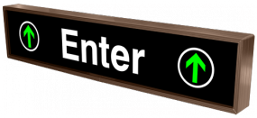
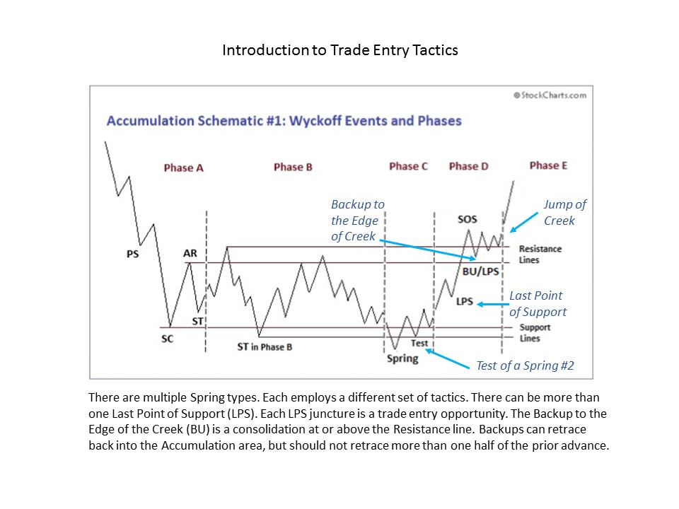
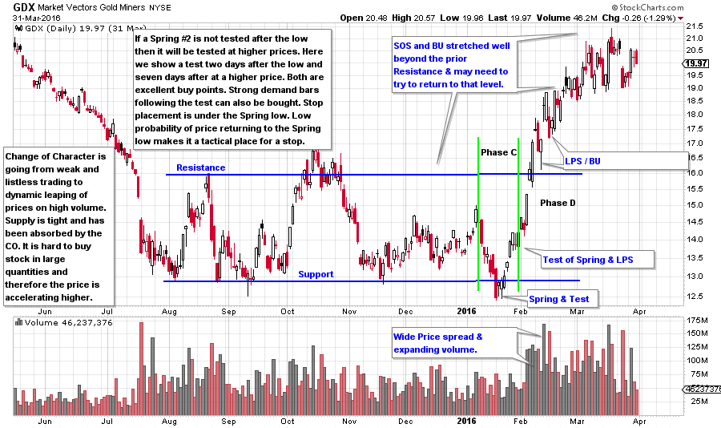

# How to Determine the Best Trade Entry Points

URL: https://articles.stockcharts.com/article/articles-wyckoff-2016-04-how-to-determine-the-best-trade-entry-points/
Date: April 01, 2016 at 03:50 PM
Author: Bruce Fraser

Wyckoff is a complete Methodology which means that rules and processes guide when to enter a trade, how long to hold a position and when to exit the trade. We have explored the principles of stopping action, cause building and jumping into a trend. In Accumulation (as in Distribution) there is that moment, that tipping point, when conditions shift from trendless to trending. We call it a Change of Character (CoC) because prices are at the inflection point. Mr. Wyckoff’s council was to only commit capital when stocks and the market are ready to move, and move quickly, and move now.

In Dr. Pruden’s book, “The Three Skills of Top Trading” there is an important section on the Ten Tasks of Trading. The tasks speak to the proper mental states for each of these essential trading activities. Top traders are very patient. They are willing to wait long periods of time for that right moment when inactivity and patience give way to a flurry of activity because market conditions present the opportunity for positioning a trade. To seamlessly go from inaction to action takes practice.

---

The Wyckoff Method seeks specific conditions for beginning the process of positioning a stock (ETF, commodity, etc.). There are rules for deploying capital, placing stops, and for averaging up to a larger exposure in winning positions.

Once a cause is built and the upward potential for a stock can be estimated (using Point and Figure charts), a Wyckoffian will begin to stalk for the best strategic price level to begin buying. In our study of Phases this would be Phase C (click here and here for a link), the final testing area. During Accumulation the final test is either a Spring or a Last Point of Support. There are three categories of Springs. A Spring is the final low prior to the beginning of the uptrend. But, Phase C does not require a Spring type action and sometimes a Last Point of Support is the final test (higher low) of the Accumulation area prior to the beginning of the uptrend. Whether a Spring or an LPS is the final test, from this moment onward the stock will generate higher highs and higher lows in the emergence of a new uptrend. This act of testing is the conclusion of the Cause building.

Initiating and building a position in a stock using the Wyckoff Method usually occurs in three tranches. Each purchase or tranche of stock must be at a higher price than the prior purchase. This is an important rule: Only average up a winning position. Specific points in Phase C and D are ideal for averaging up to a full position size in the stock.

Wyckoffians become very skilled at identifying these action points in real time to help make it easier to jump from a Stalking state of mind to an Action state. Endless practice and mental rehearsal hone these skills.

The philosophy behind this method is to 1) have the trade work right away, and 2) to place a stop loss order in a zone that has a very low potential for being triggered. This is an excellent system for averaging up winning trades while placing trailing stops at tactical levels that will preserve and protect capital as profits grow and market exposure becomes larger.

Over the course of the next few weeks we will explore the best junctures and tactics for entering a trade. Accumulation Schematic #1 models a period of absorption. As the sponging up of shares nears completion, a period of final testing of the Support area will occur. This is known as Phase C. A Spring is depicted in Schematic #1 (click here for more on Springs). Other forms of testing will be addressed in future posts. Note the price action at the conclusion of the Spring, there is a Change of Character. Price begins marking up from the Spring to the top of the Accumulation Range and out. This is the beginning of the uptrend and the time and place within the Accumulation to be buying this stock.

Four junctures in Phases C and D are ideal for trade entry. 1) Spring and Test of the Spring, 2) Last Point of Support (there are often multiple LPS points), 3) Backup (BU) after the jump up and out of the Accumulation, 4) Breakout above the high of the BU/SOS (Sign of Strength).

(click on chart for active version)

GDX dives to a final low in January and the volume is high into the low. This is a Spring #2 which must be tested, and it is in the two days immediately following the Spring. The test of a Spring #2 can be bought. The next buy point is the Last Point of Support, which is very brief in this example. Note the veracity with which GDX lifts off. This is a dramatic example of the Change of Character (CoC) that comes in Phases C and D. Stop placement can go just below the Spring, LPS, or BU. We will be more specific as we dig deeper into this subject.

It is a good exercise to compare the structure of GDX to Schematic #1. This is the look of Accumulation by the Composite Operator. Note how difficult it is to buy the Phase C rally as the bullish price bars leap day after day. And this is why we must be prepared with our action plan when it is time to get busy. Over the next few posts we will explore strategies for averaging up a winning position in an emerging uptrend.

All the Best,

Bruce
