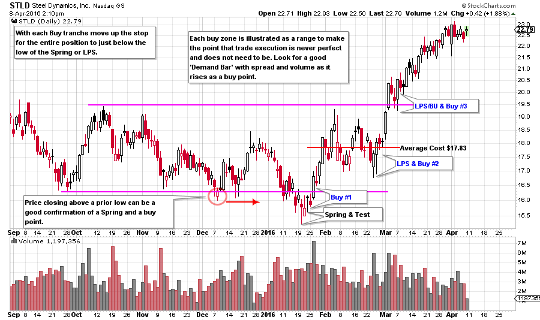
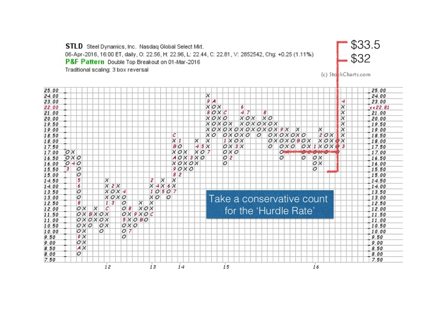

# Stalking the Trade

URL: https://articles.stockcharts.com/article/articles-wyckoff-2016-04-stalking-the-trade/
Date: April 08, 2016 at 02:36 PM
Author: Bruce Fraser

No matter your investment timeframe, consider your trade to be a campaign. A campaign has steps or actions from beginning to end. A campaign has mental state management from beginning to end. Mental states vary from the patience of stalking to the aggressiveness of taking profits to conclude the trade. A campaign is managed.

Once a potential campaign is identified (this is also called a low risk idea) it is stalked for the ideal moment when capital is put at risk. Point and Figure analysis provides us a method for estimating a price objective, or cause. Reward to risk objectives require this ratio to be three to one or greater. If this three to one ratio cannot be met, a Wyckoffian will reject the trade for one that is more suitable. When counting PnF objectives for this analysis we will use conservative counts to determine the reward potential. At times there will be larger PnF counts available on the chart, but we will determine ‘reward risk’ on the smaller, conservative, PnF count.

---

How do we establish the ‘risk’ in this ratio? The risk is the execution price of the trade to the stop level. As an example, our trade entry is $38 and our stop is $36, thus the risk is $2. The reward marked on our PnF chart must be a reward of 3 multiplied by $2 and added to our entry price of $38 or $44. So our conservative PnF count must exceed $44.

When comparing two similar trades where (for the sake of our case) everything else is the same, if one PnF counts to $44 and the other counts to $48 we would tend to favor the trade with the larger potential.

We think of trade entry as a three part process. Determine the amount of capital devoted to a single position and then divide that figure into thirds. Buy your position in thirds. Each subsequent tranche is bought if, and only if, the prior tranche is showing a profit. So a Wyckoffian is always averaging up a winning trade. If the last purchase is not showing a profit then the next addition must not be made, until the previous acquisition is at a profit. The average price of the combined purchases must exceed a three to one reward to risk ratio. Pay close attention to your average cost. After each additional tranche the stop should be raised. The goal is to set your new stop at a place where, if stopped, the prior purchases will show a profit. Only the latest purchase would have a loss. The goal with this strategy is to always be reducing your risk of ownership.

(click on chart for active version)

STLD offers a recent case study of a stock in the ‘Position Building Zone’. The Spring and Test sets up the initial buy zone. Look for a Test of the Spring #2 as the first buy point. Rising above the December low on a strong Demand Bar is the next place to buy if the test is missed. Good Demand Bars will have wide spread and good volume while moving easily in the direction of the new emerging trend. The close for the day should be near the high for the day. More good Demand Bars should follow as price moves easily upward. In this hypothetical trade the first purchase is at $16.25 and stop placement will go below the Spring low of $15.22 at $15. Mr. Wyckoff advised placing stops strategically where they would be unlikely to be executed. Buy point #2 is on the turn off the LPS, execution price of $17.25. Now the average price for two tranches is $16.75 ($16.25+$17.25 divided by two). Stop placement is moved up under the low of the LPS at $16.75 where the first tranche is stopped at a profit and the second tranche at a loss for a breakeven on the average price of both. The third tranche is executed on the test known as a Backup to the Edge of the Creek (BUEC or BU). STLD has jumped out of the base here. Execution price for tranche three is $20 after turning up above the LPS/BU on a good Demand Bar. Average cost is $17.83 ($16.25+$17.25+$20 divided by three). The stop is set below the LPS/BU at $19 which protects the profit on tranches one and two. Take note that the average cost of the campaign is about the mid-point of the Accumulation Range (which, by the way, is the cost objective of the Composite Operator). Now STLD is in a robust markup phase and this Wyckoffian strategy has built a full campaign position.

Establishing a three to one ‘hurdle rate’ with Point and Figure analysis is critical. Note the partial count used. A much larger count may come into play at a later date (and higher price). The first tranche has the greatest risk at $1.25 points of loss potential and the entry price is $16.25. The reward estimated is $32-$16.25=$15.75. $15.75 of reward divided by $1.25 of risk is a ratio of 12.6 which is well above 3/1. It is a good idea to do this calculation on each tranche on the way up to be confident that each commitment of new capital is worthwhile. STLD has an attractive campaign potential for the risk taken.

All the Best,

Bruce
