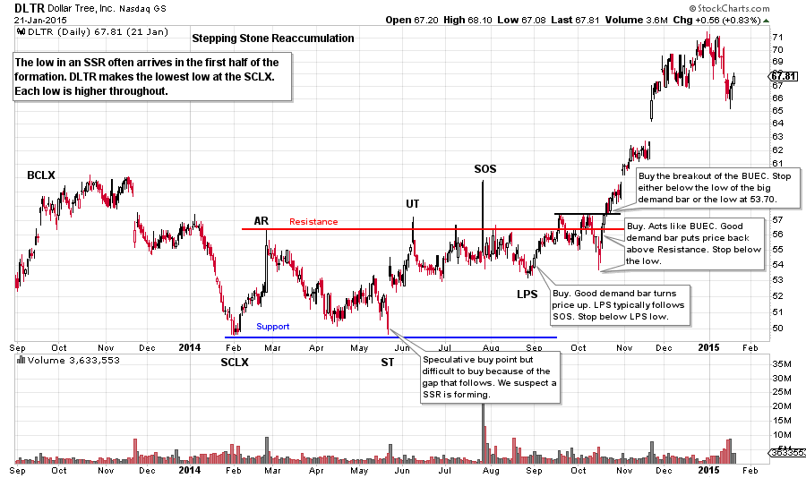
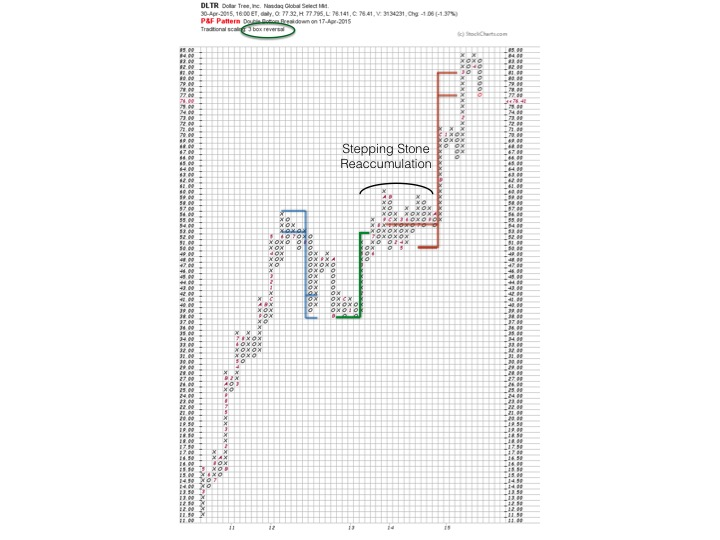
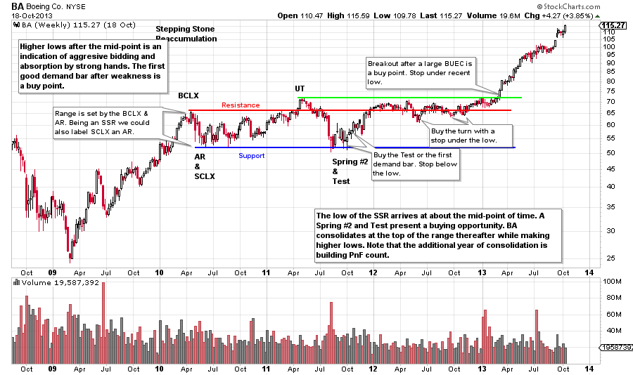
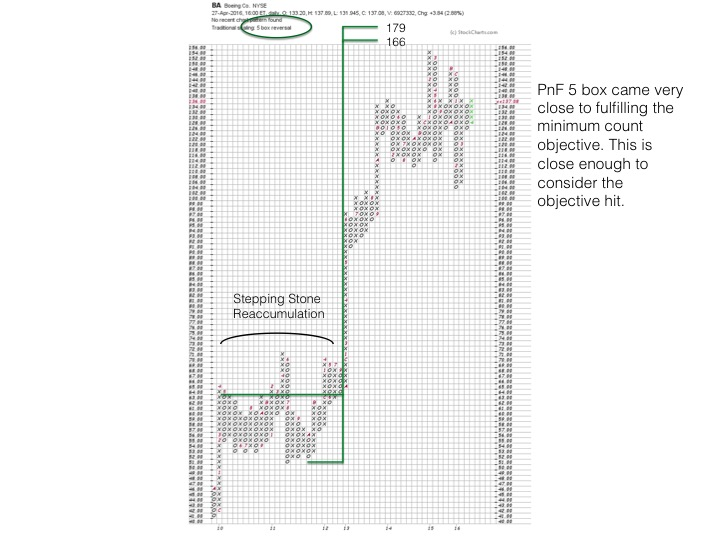

# Trading the Reaccumulation

URL: https://articles.stockcharts.com/article/articles-wyckoff-2016-04-trading-the-reaccumulation/
Date: April 29, 2016 at 04:27 PM
Author: Bruce Fraser

When a stock enters a robust uptrend it can go on for a long period of time, for years in some cases. But eventually even the best uptrend needs a rest. Leading up to this pause, the ownership quality of the float deteriorates. Strong handed Composite Operators lock up much of the float at the beginning of a new uptrend. Then as the trend matures, stock finds its way into weaker and weaker hands. The stock then needs a rest in the form of a Stepping Stone Reaccumulation. The C.O. will take advantage of a SSR and mop up loose shares from the more short term oriented traders.

A strong uptrend attracts more and more interest from a broad spectrum of speculators and the public. This eventually destabilizes the trend and leads to a large and unexpected price correction. The cause of this price weakness is short term oriented traders (weak hands) who are much quicker to sell at the slightest signs of trouble on the tape.

---

The remedy for this change in the stock’s ownership structure is a ‘Stepping Stone Reaccumulation’ (SSR). Reaccumulation is a sideways or a down period in the stock price that can last from a few months to a few years. Almost without exception, any stock in a long term uptrend will experience one or more pauses on the way upward to the bull move’s conclusion. Wyckoffians become masters at the art of evaluating and trading Reaccumulations (click here and here for more on this subject).

What are some of the causes of a Stepping Stone Reaccumulation? Speculators become impatient with a stock in a Reaccumulation period and seek greener pastures. Also, some long term retail stock holders become discouraged and sell their shares. Often stock analysts will conclude that a Reaccumulation is a top and the end of the uptrend. We have two case studies that explore how to trade a certain style of SSR. In future posts we will consider other types of SSR formations.

As a general rule, an uptrend will be stopped by a Buying Climax as can be seen in Dollar Tree (DLTR). A 17.6% four month correction follows and concludes with a Selling Climax (SCLX). Usually the greatest price damage is done at the beginning of an SSR. Such a large price drop means that a period of Reaccumulation must follow as the C.O. is carefully vacuuming up shares. Because there is a core of strong handed C.O.s already involved with the stock (they own a large portion of the shares from the beginning of the uptrend), a typical SSR will spend less time at the bottom of the range near Support. The Wyckoffian will be on the alert for higher lows being made and will be attempting to buy at these junctures. After the Secondary Test (ST) the price of DLTR rises up to the resistance area and hovers there. Four places to buy are highlighted. They are the ST, the Last Point of Support (LPS), the correction at the Back Up to the Edge of Creek (BUEC) and the breakout of the BUEC. Set stops below the low price level of these areas. Study the price turn off these lows for large Demand Bars that demonstrate a bullish ‘Change of Character’. Often an early price upthrust after the turn is the best place to buy. It is confirmation that the price pushing downward is unsustainable.

Point and Figure analysis helps to define the upside potential in the trade. Here we count the SSR just studied. After the ST the price hovers around the Resistance area for a long period of time. All of this additional trading in DLTR prior to jumping out adds columns to the PnF count. This raises the target price objective and makes the campaign even more attractive. Wyckoffians understand that additional time spent Reaccumulating allows for more stock to be absorbed by the C.O and thus for a larger PnF count objective. Eventually the new price uptrend exceeds the upper PnF target by three points.

Boeing spends three years in this Stepping Stone Reaccumulation. BA concludes the preceding uptrend with a BCLX and then drops suddenly into a Selling Climax. This sets the Resistance and the Support areas that bound the trading range during Reaccumulation. At about the half way point of the SSR, the price of BA Springs the low on volume (a Spring #2) and then tests the Spring multiple times. Wyckoffians would attempt to buy this Test of the Spring with the idea that BA will jump to Resistance and then begin the uptrend. The SSR is over one year in age at this point. Instead of jumping into an uptrend, the price hugs the Resistance area for more than a year. Each low after the Spring is a higher low and we must conclude that the C.O. is involved and absorbing shares at Resistance. This is very bullish as the C.O. is aggressively buying BA and preventing the price from returning to the bottom of the trading range. Noted above are the ideal places for trade entry and stop placement.

We count the Stepping Stone Reaccumulation using a 5 box method. Boeing’s price came very close to fulfilling the lower target area of 166. Again, notice the extended time BA spent hovering around the Resistance area building a much bigger PnF count and then fulfilling this extended count. As Wyckoffians we want to see larger PnF counts form during the Stepping Stone Reaccumulation as they generate higher price objectives.

All the Best,

Bruce

Professor Roman Bogomazov and I will discuss the Wyckoff Method in a three part webinar series (6 hours in total) on May 9th, 16th and 23rd. Roman teaches the Wyckoff Method (online course) at Golden Gate University. We will use the “Wyckoff Power Charting” blogs as the framework for our discussions with additional material added. Each session will include ample time for attendees to ask questions. The fee for this series is only $49. Click here to learn more.
