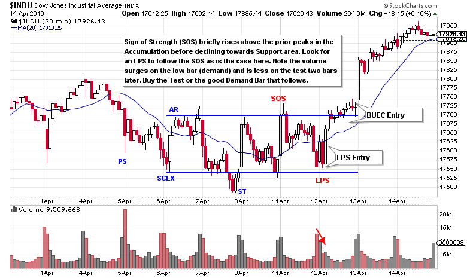
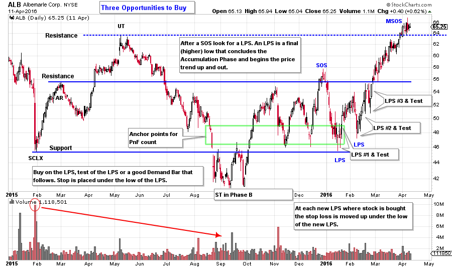
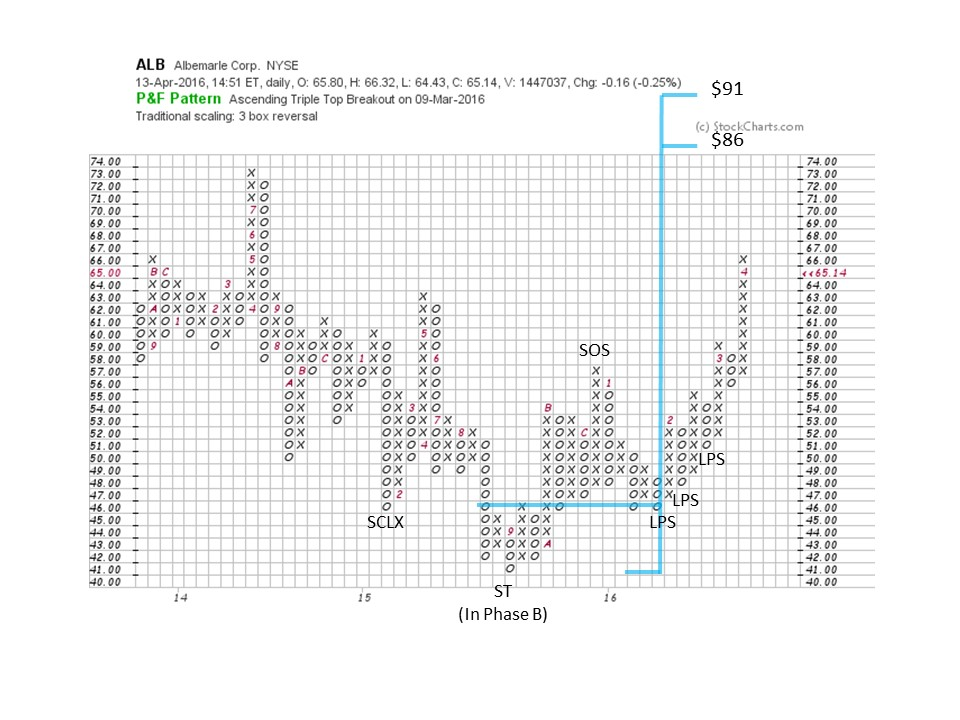

# Wyckoff Buy Strategies

URL: https://articles.stockcharts.com/article/articles-wyckoff-2016-04-wyckoff-buy-strategies/
Date: April 15, 2016 at 11:58 AM
Author: Bruce Fraser

When initiating a campaign our mission is to buy when the stock is ready to emerge into a major uptrend. Uptrends begin when periods of Accumulation are complete and the majority of the available supply of shares has been absorbed. This is the juncture when stock is held by strong hands. A small increase in demand for shares can create an imbalance that tips the stock price trend into a robust bull market.

As Wyckoffians we will develop our skills at identifying this tipping point on the charts and to have an action plan for building our position in the stock. Final testing action of the Accumulation is called Phase C. There are two types of tests; the Spring (or Shakeout) and the Last Point of Support (LPS).

---

The Last Point of Support is the final drive toward the bottom of the Accumulation area before the uptrend begins. In most regards it looks much like the prior drives toward the Support level. The Spring is easier to identify because the Spring makes a minor new price low. An LPS makes a higher low and then turns upward. An LPS is an important juncture to identify and to trade. Either a Spring or a Last Point of Support arrive in Phase C which is the last test of the Support area prior to the markup out of the Accumulation. One or the other will occur (see the last post for a discussion of Springs).

(click on chart for active version)

Wyckoff is an excellent chart skill for intraday analysis and trading. This 30 minute $INDU chart has a classic LPS setup. A Sign of Strength (SOS) is price attempting to breach overhead resistance by temporarily rising above a prior peak. Demand is absorbing supply at the top of the trading range. After the SOS, the price will typically fall back into the Accumulation area and attempt to return to support. It is after the SOS where the Wyckoffian will look for the LPS. After the SOS in $INDU, price moves in two stages downward. Note the very high volume on the low bar, this is absorption and good demand. This is the low bar of the LPS. The attempt to ‘test’ the low bar arrives two bars later and on much lower volume. This bar or the next bar can be bought. It only takes two good demand bars to put $INDU at Resistance where a BUEC (Backup to the Edge of the Creek) forms. After the LPS entry, place a stop under the low of the LPS, or under the prior low of April 8th.

(click on chart for active version)

In the ALB example, the SOS exceeds the two prior peaks and the Resistance line. After the SOS we must be prepared for another round of weakness as is the case here. ALB returns to Support and dips below the prior two lows. The SOS has us on the alert for an LPS. There is an LPS, then a test, then a good demand bar. Buy a tranche here and place a stop below the low of the LPS. The second LPS is a turn off a higher low and gives the Wyckoffian great conviction that an uptrend is forming. On this second LPS, buy any of the early demand bars as the price turns up. If the first LPS was missed, the second LPS is a fine place to initiate the campaign. Note at the third LPS, how large interests are buying more aggressively as ALB can barely rest at the Resistance line.

The decline after the SOS is a nasty shakeout that has many holders of ALB selling their shares in a panic. This is how the C.O. shakes loose the final supply of stock prior to a meaningful markup. This is not an easy business. The first LPS goes almost exactly to the Buying Climax low. It is no surprise that the final low of the Accumulation area, the LPS, is the same price level where the large interests began their buying operations. SCLX=LPS. This is a price level where they want to buy stock and they proved it by stopping the declines at both the SCLX and the LPS. Also note, that as scary as the price decline was into the LPS low, it was well above the September / October low.

To take a count, identify the LPS on the bar chart, then find that point on the PnF chart and count to the left. Take a conservative count. If you deem the reward to risk to be suitable to your objectives, make the trade. From the LPS, ALB has a count estimate to $86. Now that the stock has jumped out, it may need a pause in the form of a BUEC or a Stepping Stone Reaccumulation before the trend can continue.

All the Best,

Bruce
