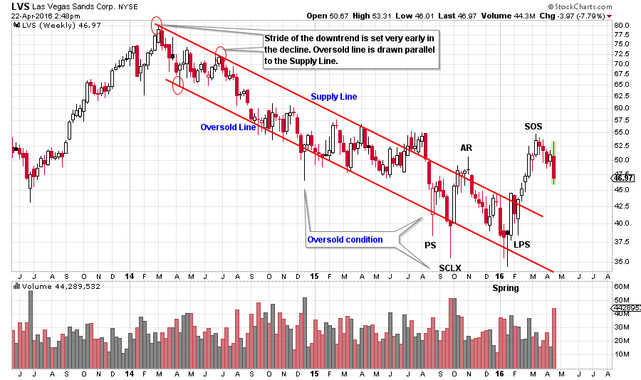
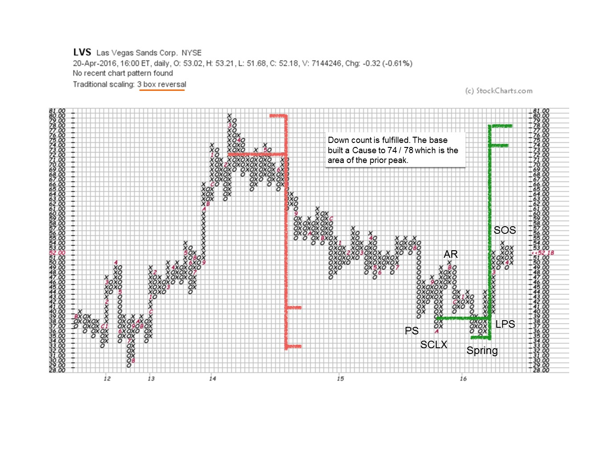
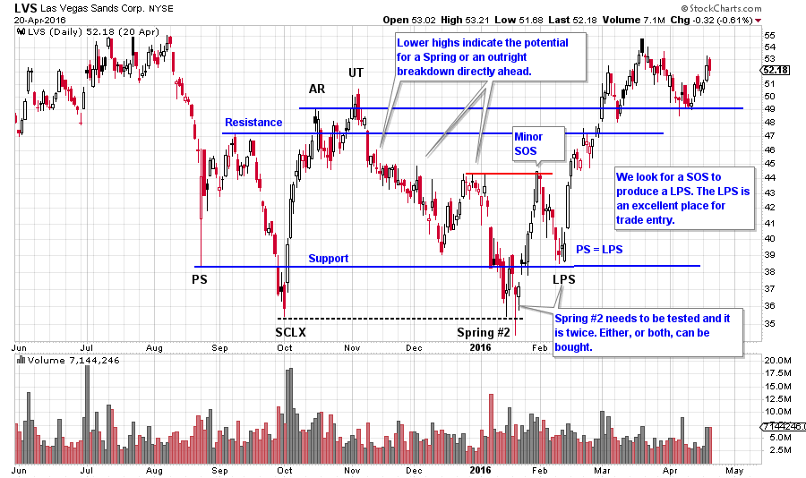
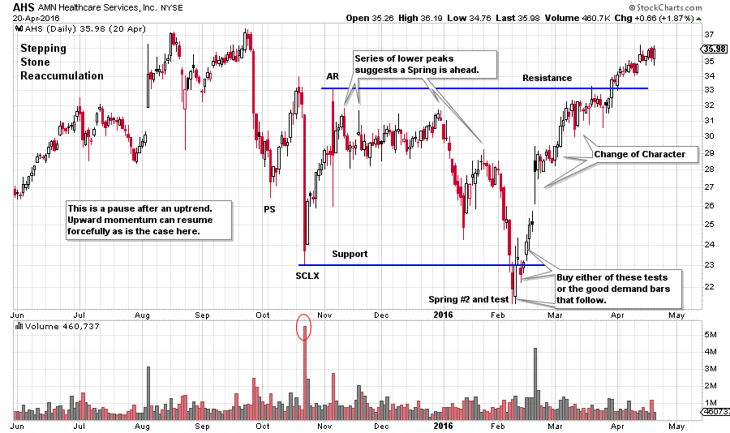
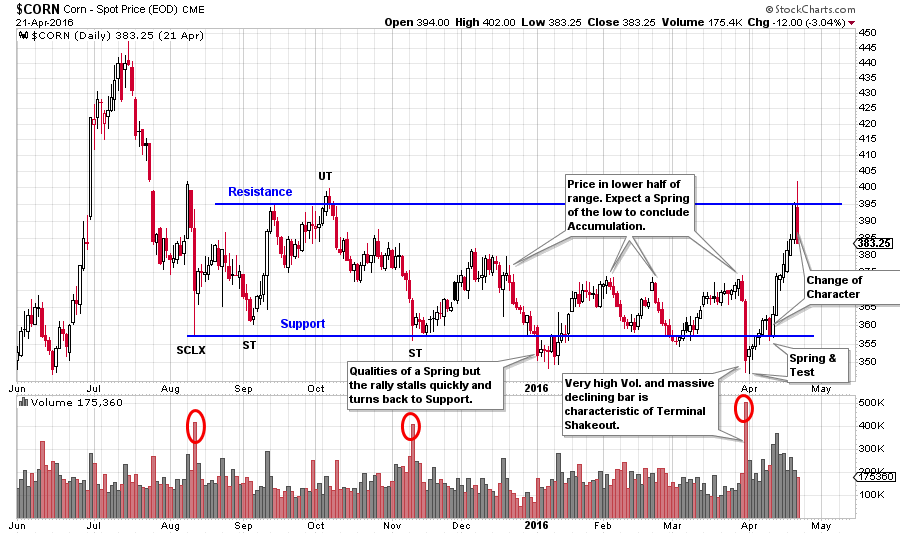

# Wyckoff Skill Building

URL: https://articles.stockcharts.com/article/articles-wyckoff-2016-04-wyckoff-skill-building/
Date: April 22, 2016 at 03:48 PM
Author: Bruce Fraser

There are no absolutes in trading financial markets. The best market operators are exceptional risk managers. The Wyckoff Method seeks conditions where a high likelihood of success is probable. Wyckoffians systematically search for the clues that precede a stock becoming a persistent and long term leader. Some of these characteristics we have already explored. The list includes; breaking above a downtrending channel, fulfilling a Point and Figure down count, building a Cause with an accumulation area, completing the accumulation with the final test of a Spring or LPS, and a persistent mark up and out of the accumulation area. Through honing these observational skills, our mission is to increase the potential of owning the best stocks at the right time.

To be better Wyckoffians in ‘real time’ we do endless chart work with the goal of becoming more discerning in our analysis and more capable in our trading. In light of our mission to build skills, let’s look at more charts, charts, charts. In recent posts the focus has been on identifying best entry points for buying stocks. We will continue that theme here.

---

(click on chart for active version)

LVS has been in a two year downtrend (click here for more on downtrend analysis). The stride of the downtrend has been well defined from the beginning (three red circles define the future path of prices). Note the constant stream of lower highs throughout the decline. Finally the climatic oversold condition of the PS, SCLX and Spring stop the decline. From the LPS to the PS a Cause is building and finally the upper trend line (Supply Line) is breached in a dramatic way.

LVS builds a Distributional Cause in 2014 and then embarks on a downtrend. A Selling Climax arrives in the window of the price target. A new Cause is being built.

(click on chart for active version)

We see that LVS has become oversold on the weekly chart (repeatedly breaking and returning to the trend channel) and has fulfilled the PnF distribution count. Next we look at the refinement of the entry strategy on the daily chart. There is an Upthrust at the Resistance area. There is little Cause built so far, and we expect price to attempt to return to Support, which it does in a long grinding decline. Note the series of lower peaks on the way down. This type of weakness often leads to a new low, which could be a Spring, and it is. A Spring #2 arrives, which can be bought on a test. The test occurs the next day. The immediate LVS price jump above the prior peak is a good sign of a potential ‘Change of Character’ and a minor Sign of Strength. After a SOS, expect a Last Point of Support (LPS), which is another entry area. Note that the LPS returns almost exactly to the Preliminary Support (PS) where the Composite Operator began supporting the stock with large purchases. Purchase LVS on the test of the Spring and place a stop below the low of the Spring. If the LPS is the second tranche, set the stop for both purchases below the low of the LPS.

(click on chart for active version)

AHS is in a Stepping Stone Reaccumulation after a good uptrend. The SCLX and the AR set the Support and Resistance. The stock price thereafter grinds downward with a series of lower high price peaks. We must conclude that an attempt will be made to decline below the SCLX low. A Spring type action ends the decline. A dramatic Change of Character lifts the stock price up and out of the Reaccumulation area. The test of the Spring #2 is the best buy point and then the early demand bars thereafter. Stop the trade below the Spring low. Stocks under Reaccumulation will tend to change their character much more abruptly than stocks basing in a cyclical low such as LVS. Expect Reaccumulation rallies to reignite quickly and unexpectedly.

(click on chart for active version)

Note how the spot price of Corn spends eight months in an Accumulation. The last half of the Accumulation has the corn price hugging the bottom half of the range. This would lead us to expect a Spring to conclude the basing action. Note the attempt to Spring in January. The price stalls and then returns to Support without making a SOS above the prior peaks, thus more work must be done. A very large down bar Springs the low in April with massive volume. Buy the Test. The Change of Character takes $CORN to Resistance quickly indicating that all of the price activity of the prior eight months is potential C.O. Accumulation. To confirm this we would expect $CORN to attempt to stay in the top half of the Accumulation area and then jump out.

All the Best,

Bruce
