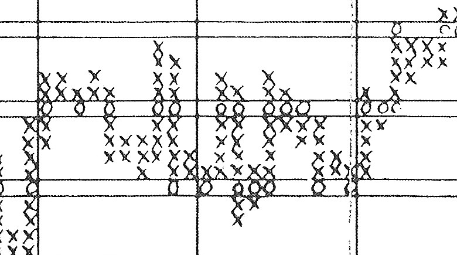
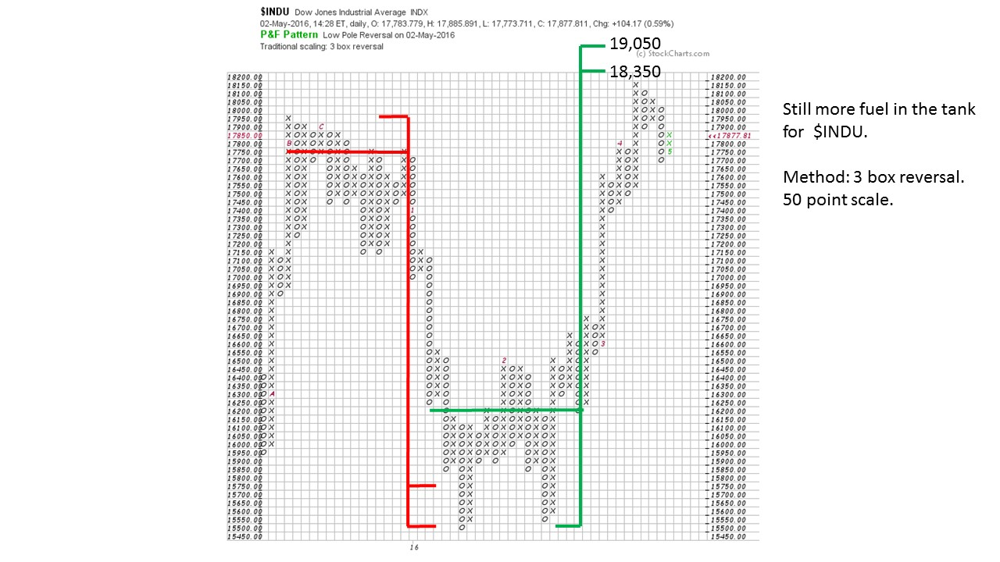
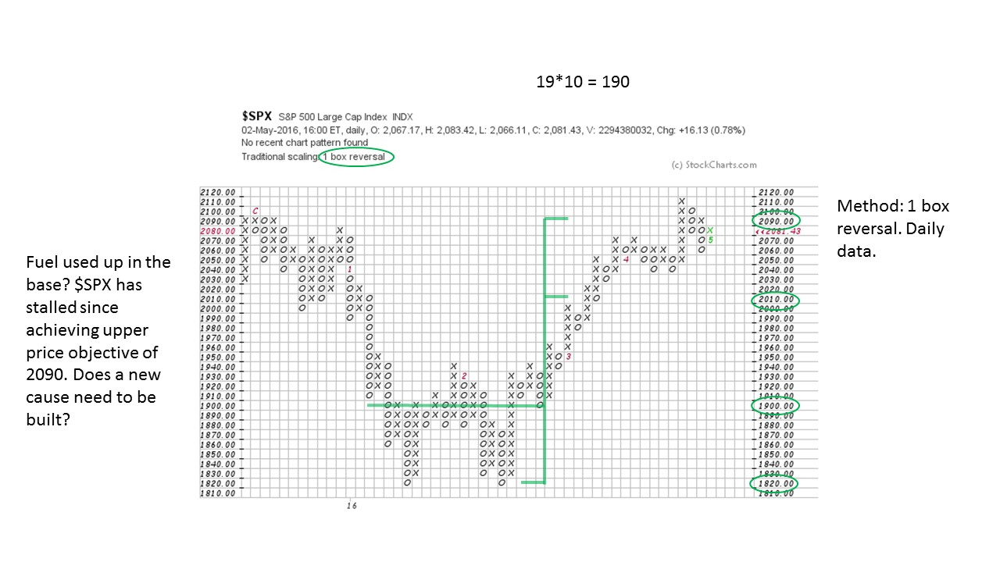
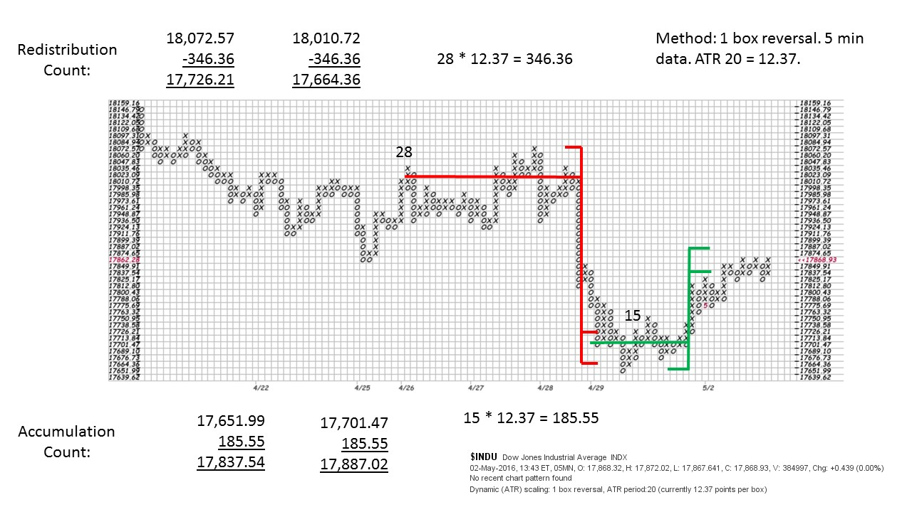

# Current Point and Figure Counts

URL: https://articles.stockcharts.com/article/articles-wyckoff-2016-05-current-point-and-figure-counts/
Date: May 03, 2016 at 04:05 PM
Author: Bruce Fraser

The concept of Cause and Effect is at work in markets constantly. This Wyckoff Law is codified and measured using Point and Figure charts. These charts are robust tools for measuring market potential or cause that has been built and then expended. Let’s take a survey of the current market with PnF charts and look for a theme.

---

The Dow Jones Industrial Average PnF is constructed with daily data and a 3 box reversal method. This is similar in scale to a weekly chart. A large Distribution (Cause) formed in late 2015 and then discharged (Effect) as a swift markdown in January fulfilling the down count exactly. Thereafter, a large Accumulation (Cause) formed and built a count range of 18,350 to 19,050. The $INDU has risen in dramatic fashion (Effect) to a peak of 18,150 where it has paused. Currently it appears that a Stepping Stone Reaccumulation (SSR) is forming. An SSR would build additional Cause on a PnF chart for further upward progress. We can see that there is a little more fuel in the tank off the big point count formed earlier this year. The lower count of 18,350 matches the high price made in May 2015 and 19,050 would be a new high in the $INDU.

The S&P 500 has pushed up against its all-time high. A 1 box reversal PnF chart base count earlier this year produces a range potential of 2,010 to 2,090. Ultimately $SPX exceeds the upper count by two boxes (occurring on a climactic type price spike) and now appears to be in a trading range. The all-time high for $SPX is directly above and so it seems likely that resistance will come into play around here. A Stepping Stone Reaccumulation could build the additional count needed to Jump the indexes to new highs.

To show how robust the technique of horizontal PnF counting is as a tactical tool, here is a 5 minute PnF count construction. Over a 4 day period, a Stepping Stone Redistribution forms and then is followed by a swift decline. The SSR does an excellent job of targeting the low. What follows is a minor Accumulation which has been fulfilled.

Conclusion: Indexes have expended much of the fuel in their Causal bases made earlier in the year. Risks are much higher here in contrast to the beginning of the markup when the Cause was new and just completed. The resistance of prior highs and the exhaustion of the prior Causal base means there are headwinds. The building of Reaccumulation counts would help propel prices over the prior highs. Expect volatile and trendless trading activity that is indicative of a new Cause being built. The question will be; Is the Cause a Reaccumulation with new high prices directly ahead or is it Distribution for a new trend down?

All the Best,

Bruce

Professor Roman Bogomazov and I will discuss the Wyckoff Method in a three part webinar series (6 hours in total) on May 9th, 16th and 23rd. Roman teaches the Wyckoff Method (online course) at Golden Gate University. We will use the “Wyckoff Power Charting” blogs as the framework for our discussions with additional material added. Each session will be recorded and will include ample time for attendees to ask questions. The recordings will be available for your review or if you are unable to attend any of the live sessions. The fee for this series is only $49. Click here to learn more.
