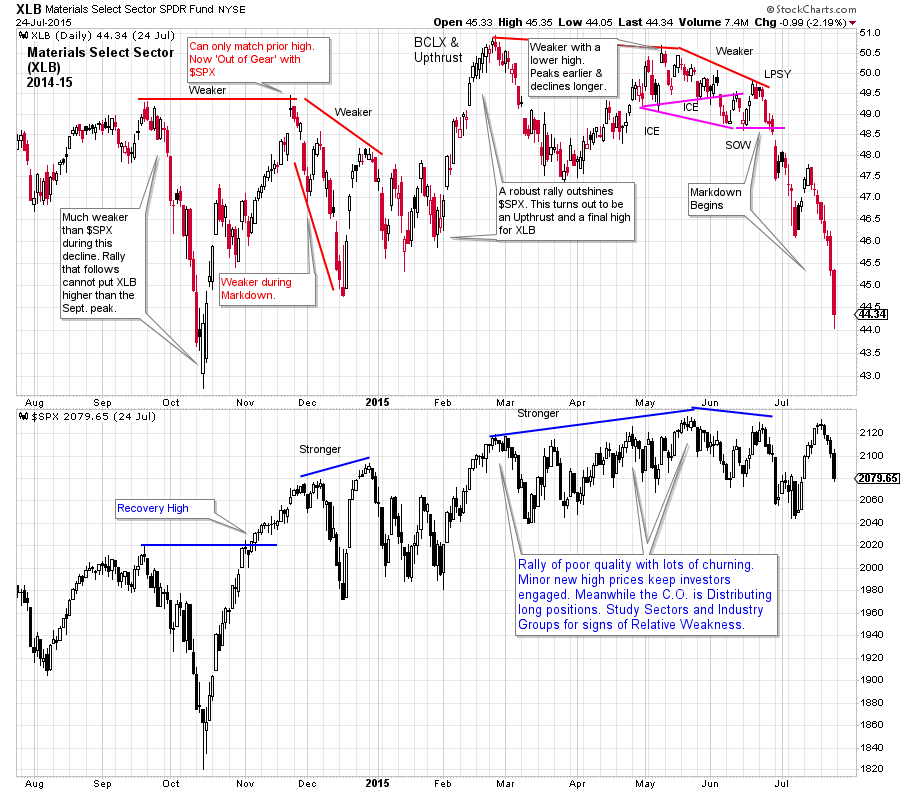
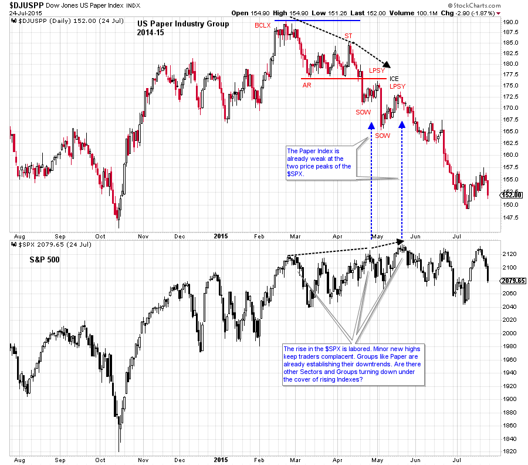
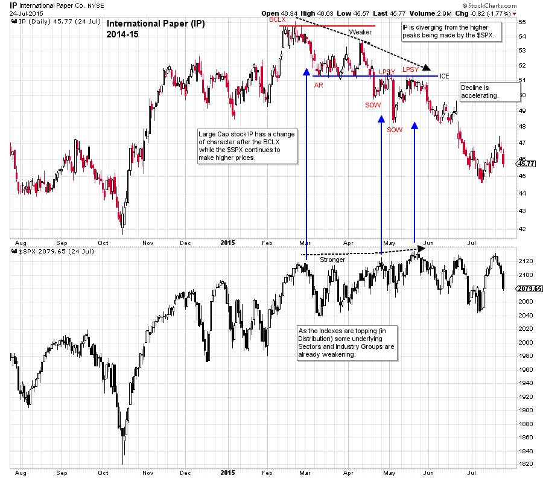

# Group Stink

URL: https://articles.stockcharts.com/article/articles-wyckoff-2016-05-group-stink/
Date: May 27, 2016 at 11:25 AM
Author: Bruce Fraser

Let’s continue our discussion of scanning the market with a top down approach. Recall that we proposed a process of first evaluating the stock market (S&P 500), followed by the Sectors and then the Industry Groups. With a quick scan the best and the worst Sectors and Industry Groups can be identified. This ultimately allows for a focus on the very best ideas.

In the prior post we drilled down into the Materials Sector (XLB) and next into the emerging Specialty Chemical Industry Group. We were seeking emerging strength in the Sectors and Industry Groups, and from this, the best stocks. This week we will learn to spot the warning signs of emerging weakness in the Sectors and Industry Groups.

---

(click on chart for active version)

Let’s study the Materials Sector (XLB) during 2014 and 2015. At the early November recovery high of the $SPX, the Materials Sector is clearly lagging. The XLB eventually rallies to its September peak in late November. The $SPX is stronger and makes new highs. The lagging nature of the XLB is becoming more pronounced. When the $SPX reverses down in December the XLB is already falling and is much weaker. Thereafter, XLB makes a series of lower peaks until a final thrust into a Buying Climax in late February. Noticeable weakness follows for Materials while the $SPX keeps pushing to new high prices from February through May. There are early warnings of trouble for the Materials sector and the lagging behavior results in a total breakdown in June. The $SPX is still hovering near the high prices while XLB is in free-fall. We take a cue from this persistent weakness to drill down into the Industry Groups that compose this Sector to find the culprits that are dragging down the Sector

(click on chart for active version)

The Paper Industry Group is within the Materials Sector. Though it is not the only weak Industry Group, it is an excellent case study. Note the $DJUSPP Buying Climax (BCLX) and the persistent price deterioration thereafter. Not only is Paper weaker than the market it is also weaker than the Materials Sector. At the Secondary Test (ST), Paper forms a large negative divergence in comparison to XLB and $SPX. This combined with the BCLX argues for the stopping of the trend and a reversal into Distribution. A breakdown of key support for Paper while the $SPX is probing new high prices is a big warning to sell the Industry Group. The two Last Point of Supply (LPSY) areas are profoundly weak points on the chart. The markdown that follows is in sharp contrast to the price action in the $SPX.

(click on chart for active version)

International Paper is a large capitalization component of the Paper Industry Group. IP follows the Group closely. Much of what was said about the Group is relevant here. Note the downward stride that is established immediately off the BCLX peak. Try drawing the downtrend channel. After a Sign of Weakness (SOW) expect a Last Point of Supply (here we have two). There is an attempt to rally which has poor lift and stalls at the ICE. This is a particularly dangerous place on the chart which can lead to major weakness, and does so here.

An uptrend in the stock market indexes can mask the emerging weakness of formerly strong Industry Groups and stocks. By always scanning the Sectors and Industry Groups a Wyckoffian can see these shifts as they are emerging and be prepared to trade important investment theme changes.

All the Best,

Bruce
